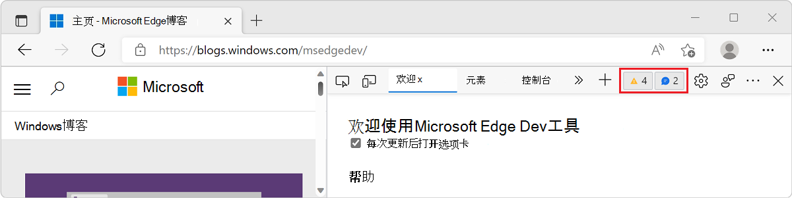

# 使用专注模式简化开发工具

焦点模式是 DevTools 的新用户界面。  焦点模式旨在简化和简化 DevTools UI，而不会影响其功能集。

焦点模式将选项卡的主行替换为 **活动栏**，活动栏是具有独特图标的紧凑工具栏。  **使用活动栏**可以固定、重新排列和打开你喜欢的工具，以便快速访问。  **活动栏**还提供对用户设置、帮助和其他功能的访问权限。

焦点模式还提供 **快速视图** 列表，以便在 **活动栏**中已选定的工具旁边打开第二个工具。

<!-- ====================================================================== -->
## 启用焦点模式

Microsoft Edge团队正在向一部分用户启用焦点模式以收集早期反馈。 默认情况下，某些用户将启用焦点模式，而另一些用户则需要先启用它。

若要检查是否已启用焦点模式，还是启用或禁用焦点模式：

1. 按`F1`下打开**设置**。

1. 单击 **“试验** ”并向下滚动到 **“焦点模式** ”复选框。

   如果选中复选框，则已启用焦点模式。 选择或清除它以启用或禁用焦点模式。

    

1. 关闭**设置**页。 如果更改了焦点模式试验状态，请单击 **“重新加载 DevTools** ”按钮以使更改生效。

<!-- ====================================================================== -->
## 与默认用户界面的主要区别

下面是 DevTools 默认用户界面和焦点模式之间的主要区别。

### 活动栏

**活动栏**是与默认用户界面最明显的区别。 使用它打开工具、帮助功能和设置。

默认情况下， **活动栏** 的位置适应 DevTools 窗口的位置。 如果 DevTools 已取消连接或停靠到浏览器底部， **则活动栏** 将是水平的。 如果 DevTools 停靠到浏览器的一侧， **活动栏** 将是垂直的，并且工具名称将不可见。 当屏幕宽度受限时，这可以更快地访问工具。

焦点模式，在 DevTools 中停靠上对齐 **的活动栏** 。

在 DevTools 中使用上对齐 **活动栏** 的焦点模式弹出窗口。

### 警告和错误指示器

在默认的 DevTools 用户界面中，主工具栏中会显示一个计数器，显示“ **问题** 建议”和“ **控制台** 警告”等消息数。 当生成许多消息时，计数器可能会变大，占用 DevTools 中宝贵的空间。

在焦点模式下，此计数器已被删除。 相反，小型指示器会覆盖 **问题** 和 **控制台** ，以显示相关工具是否已报告消息。

### 快速视图

  **快速视图**列表包含可与活动**栏**中已选择的工具一起显示的所有工具。

  **快速视图** 将替换默认用户界面中的抽屉工具栏。

  

### DevTools 自定义和设置

  多个自定义功能和 DevTools 设置现在分组在“**自定义”和“控制 DevTools**” (的单个菜单下) **...** **** 这些功能和设置显示在默认用户界面的多个位置。

  * **使用停靠位置** 可以更改 DevTools 在浏览器窗口中的位置。
  * **使用活动栏位置** 可以更改 DevTools 中 **活动栏** 的位置。
  * **使用主题** 可以更改颜色主题。
  * **设置**提供对 DevTools 设置的访问权限。
  * **键盘快捷方式** 允许查看和更改键盘快捷方式。

  

### 帮助链接

  “ **帮助** ”菜单包含指向 DevTools 文档和发行说明的链接，以及一个向团队发送反馈的按钮。 这些链接和按钮以前嵌套在默认用户界面的 **“自定义”和“控制 DevToolsHelp** > ”下。****

  

<!-- ====================================================================== -->
## 从活动栏打开工具

默认情况下， **活动栏** 包含以下模式和工具：

*  **检查** 模式 () 切换按钮。

*  **设备仿真** 模式 () 按钮。

*  **欢迎** 工具 () 。

*  **元素** 工具 () 。

*  **控制台** 工具 () 。

*  **源** 工具 () 。

*  **网络** 工具 () 。

*  **问题** 工具 () 。

*  **性能** 工具 () 。

*  **内存** 工具 () 。

*  **应用程序** 工具 () 。

<!-- ====================================================================== -->
## 在活动栏中固定和重新排列工具

可以通过固定或取消固定工具来选择 **活动栏** 中显示的工具。 这允许你自定义首选工作流的 DevTools。

单击 **“更多工具** (**+**) 列出所有可用工具。 选择工具会将其固定到 **活动栏**。 默认情况下，每次打开 DevTools 时都会显示它。

如果 **活动栏** 中没有足够的空间来显示所有固定的工具，某些工具可能会溢出到 **“更多工具** ”菜单中。

若要从 **活动栏** 中取消固定工具，请右键单击该工具，然后 **从活动栏中选择“删除**”。

目前，无法从 **活动栏**中取消固定以下工具：

* **元素** 工具
* **控制台** 工具
* **源** 工具

<!-- ====================================================================== -->
## 从快速视图打开工具

使用 **“快速视图** ”列表打开活动 **栏**中已选择的工具旁边的第二个工具。

1. 从 **活动栏**中选择一个工具。

1. 单击 **“快速视图** ”列表，并从列表中选择其他工具。

以下屏幕截图显示了 **网络** 工具和 **控制台** 工具并排显示。

可以通过单击**折叠快速视图快速视图** / 或按**转义**键来隐藏或展开**快速视图**。**** ) 。

<!-- ====================================================================== -->
## 自定义焦点模式

**活动栏**可以垂直或水平定向，以便在各种 DevTools 窗口位置中最大化可用的屏幕空间。

若要更改 **活动栏** 的位置，请单击 **“自定义”并控制 DevTools**，然后选择 **活动栏位置**，然后选择其中一个位置。

* **适应停靠位置** (默认) ： **活动栏** 将处于水平或垂直方向，具体取决于 DevTools 的停靠位置。

  * 如果 DevTools 停靠在浏览器窗口的左侧或右侧， **活动栏** 将是垂直的。

  * 如果 DevTools 停靠到浏览器窗口的底部，或在自己的窗口中取消连接， **则活动栏** 将是水平的。

* **顶部**： **活动栏** 将始终为水平。

* **左侧**： **活动栏** 始终是垂直的。

当 **活动栏** 处于水平状态时，如果有足够的空间显示工具图标，工具名称将显示在工具图标旁边。

以下屏幕截图显示 DevTools 已在自己的窗口中取消连接，水平 **活动栏** 显示一些带有工具图标和名称的选项卡，有些选项卡仅带有图标。

<!-- ====================================================================== -->
## 另请参阅

* [DevTools：焦点模式 UI](https://github.com/MicrosoftEdge/DevTools/blob/main/explainers/FocusMode/explainer.md) 是此实验性功能的初始解释器，位于 Microsoft Edge DevTools 存储库中。
