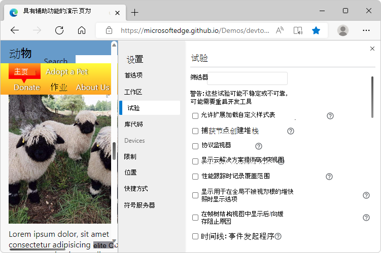
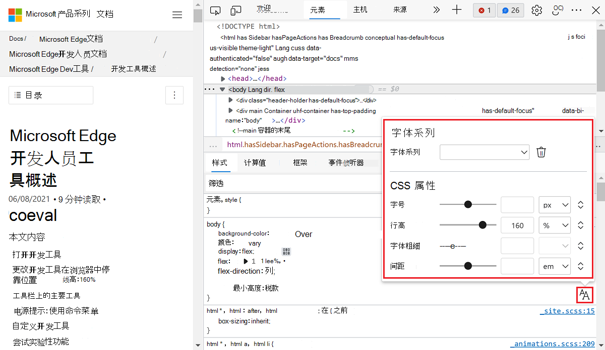
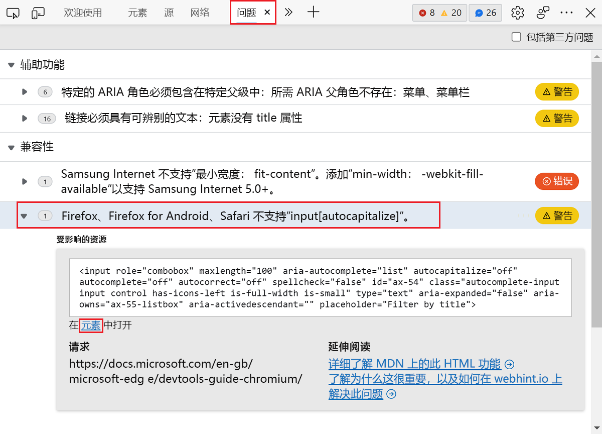
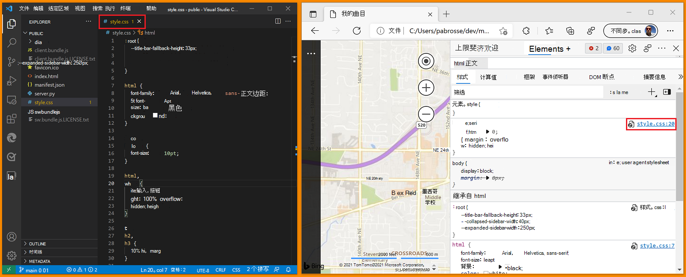

# 试验功能

<!-- 
Policies to keep this page comprehensive and maintainable: 
*  Include a visible h2 section for every checkbox that's in public-facing Microsoft Edge DevTools > Experiments page.  If no info, write a tautology as a starting point.  Add as needed, each month.
*  Keep h2 sections in same order as DevTools > Settings > Experiments.
*  In the heading and UI steps, keep the checkbox label UI string as it appears in the UI; do not revise or "fix" it.
*  Don't change h2 text, that might break a link from UI.
*  When a checkbox is removed from all the channels, delete its section.

Steps to maintain this page monthly: For latest Canary, and for latest Stable:
1. Go to edge://settings/help, update if needed.
1. In DevTools, select Settings > Preferences > Restore Defaults > Reload DevTools.
1. In DevTools, go to Settings > Experiments.
1. In the "Experiments which are turned on by default" section below, update the Edge Canary list & Edge Stable list at top.
   *  In that section, link down to the h2; do not link to a different article.
1. Make sure the article has an h2 for each checkbox.
1. In each h2 section, update the presence or absence of "not", and update the version #:
This checkbox is|is not present in Microsoft Edge Canary v123.
This checkbox is|is not present in Microsoft Edge Stable v123.
-->

Microsoft Edge DevTools 提供对仍在开发中的试验功能的访问权限。  本文列出并介绍了以下任一内容中的实验性功能：
*  Microsoft Edge 的 Canary 预览频道的最新版本。
*  最新版本的 Microsoft Edge 稳定版本。

[Microsoft Edge 的所有频道](/deployedge/microsoft-edge-channels)都有实验性功能。 可以使用[Microsoft Edge Canary 渠道](https://www.microsoftedgeinsider.com/welcome?channel=canary)获取最新的实验性功能。 若要查看 Microsoft Edge 版本中提供的完整列表，请参阅**** DevTools **中的** > “设置试验”页。

<!-- no Warning formatting, because UI already contains red "WARNING" at top -->
这些试验可能不稳定或不可靠，可能需要重启 DevTools。

<!-- ====================================================================== -->
## 默认情况下启用的试验

默认情况下，将启用以下实验性功能。 可以立即使用这些功能，而无需更改任何设置。 可以根据需要关闭这些默认实验功能。

<!-- listed in order of the Settings > Experiments pane -->

**默认情况下在 Microsoft Edge Canary v106 中启用：**
* [源订单查看器](#source-order-viewer)
* [仿真：支持双屏模式](#emulation-support-dual-screen-mode)
* [在应用程序面板中启用“报告 API”面板](#enable-reporting-api-panel-in-the-application-panel)
* [在“更改”选项卡中显示更精确的更改](#display-more-precise-changes-in-the-changes-tab)
* [将 Lighthouse 面板与时间跨度和快照模式配合使用](#use-lighthouse-panel-with-timespan-and-snapshot-modes)
* [样式窗格中 CSS 层的工具](#tooling-for-css-layers-in-the-styles-pane)
* [在浏览器窗口外启用颜色选取](#enable-color-picking-outside-the-browser-window)
* [Enable webhint](#enable-webhint)
* [在元素中显示问题](#show-issues-in-elements)
* [焦点模式](#focus-mode)
* [在 Visual Studio Code 中的打开源文件](#open-source-files-in-visual-studio-code)
* [启用键盘快捷方式编辑器](#enable-keyboard-shortcut-editor)

**默认情况下在 Microsoft Edge Stable v104 中启用：**
* [在应用程序面板中启用“报告 API”面板](#enable-reporting-api-panel-in-the-application-panel)
* [在“更改”选项卡中显示更精确的更改](#display-more-precise-changes-in-the-changes-tab)
* [将 Lighthouse 面板与时间跨度和快照模式配合使用](#use-lighthouse-panel-with-timespan-and-snapshot-modes)
* [样式窗格中 CSS 层的工具](#tooling-for-css-layers-in-the-styles-pane)
* [在浏览器窗口外启用颜色选取](#enable-color-picking-outside-the-browser-window)
* [Enable webhint](#enable-webhint)
* [在元素中显示问题](#show-issues-in-elements)
* [在 Visual Studio Code 中的打开源文件](#open-source-files-in-visual-studio-code)
* [启用键盘快捷方式编辑器](#enable-keyboard-shortcut-editor)

<!-- don't place a comment line between list item lines, above; that would create a gap -->

<!-- ====================================================================== -->
## 打开或关闭试验

实验性功能不断更新，并可能导致性能问题。  这是你可能想要关闭试验的原因之一。

若要在 Microsoft Edge 中打开或关闭试验，

1. 要打开 DevTools，请右击网页，然后选择“**检查**”。  或者，按“`Ctrl`+`Shift`+`I`”(Windows、Linux)或“`Command`+`Option`+`I`”(macOS)。  DevTools 随即打开。

1. 在 DevTools 的主工具栏上，单击 **“设置** () 按钮。  或者，按 。`Shift`+`?`

1. 在 **“设置”** 面板的左侧，选择 **“试验** ”页。

   

1. 在 **“试验** ”页上，选择或清除试验的复选框。 默认情况下，某些试验 (所选) 打开。

1. 单击“ **关闭** ( 右上角) 关闭 DevTools **设置**。

1. 单击 **“重新加载 DevTools** ”按钮。

<!-- ====================================================================== -->
## 还原所选试验的默认值

若要还原为其启用实验功能的默认设置，请执行以下操作：

1. 要打开 DevTools，请右击网页，然后选择“**检查**”。  或者，按“`Ctrl`+`Shift`+`I`”(Windows、Linux)或“`Command`+`Option`+`I`”(macOS)。  DevTools 随即打开。

1. 在 DevTools 的主工具栏上，单击 **“设置** () 按钮。  或者，按 。`Shift`+`?`  **“设置”** 面板随即打开，其中选择了 **“首选项”** 页。

1. 在 **“首选项”** 页底部，单击“ **还原默认值”和“刷新** ”按钮，然后单击“ **关闭** ” () 。

<!-- For more information about customizing settings, see [Settings](../customize/index.md#settings) in _Customize Microsoft Edge DevTools_. -->

<!-- ====================================================================== -->
## 筛选试验

可以按标题中包含的文本筛选实验性功能。

1. 要打开 DevTools，请右击网页，然后选择“**检查**”。  或者，按“`Ctrl`+`Shift`+`I`”(Windows、Linux)或“`Command`+`Option`+`I`”(macOS)。  DevTools 随即打开。

1. 在 DevTools 的主工具栏上，单击 **“设置** () 按钮。  或者，按 。`Shift`+`?`  **“设置”** 面板随即打开，其中选择了 **“首选项”** 页。

1. 在 **“设置”** 面板的左侧，选择 **“试验** ”页。

1. 在 **“筛选器** ”文本框中单击并输入文本，如 **时间线**。  键入时，“ **试验** ”页中仅显示匹配的复选框。

1. 若要结束筛选，请清除 **“筛选器** ”文本框。

<!-- ====================================================================== -->
## 提供有关试验的反馈

我们渴望听到你关于实验性功能的反馈。  若要与我们共享反馈， [请联系 Microsoft Edge DevTools 团队](../contact.md)。

其中一个 UI 试验添加了一种提供反馈的新方法：当 **焦点模式** 试验打开时，在 **活动栏**底部，选择 **“帮助** ” () > **反馈**。

<!-- ====================================================================== -->
## 试验列表

下面列出了 Microsoft Edge Canary 预览频道最新版本中显示的试验复选框。  此外，还注意到了在 Canary 中添加或删除复选框之后的“稳定”版本。

<!-- ============================================================================================================================================ -->
<!-- top of list of checkboxes -->
<!-- ============================================================================================================================================ -->

<!-- ====================================================================== -->
## 允许扩展加载自定义样式表

某些 Microsoft Edge 加载项可以定义 DevTools 的自定义颜色主题。 如果使用主题安装加载项，则需要启用 **允许扩展来加载自定义样式表** 试验以查看加载项主题。

状态：
*  此复选框位于 Microsoft Edge Canary v106 中。
*  此复选框位于 Microsoft Edge Stable v104 中。

<!-- ====================================================================== -->
## 捕获节点创建堆栈

若要在运行时将 DOM 节点添加到 DOM 时捕获 JavaScript 堆栈跟踪，请启用此试验。 捕获的堆栈跟踪显示在 **“元素**”面板的 **“堆栈跟踪**”窗格中。

状态：
*  此复选框位于 Microsoft Edge Canary v106 中。
*  此复选框位于 Microsoft Edge Stable v104 中。

<!-- ====================================================================== -->
## 在“源”面板中自动显示漂亮的打印
<!-- renamed from "Automatically pretty print in the Microsoft Edge Sources Panel" in v106 -->

打开此试验时，当在“源”面板中显示一个缩小的文件时，文件会在“源”面板的单个选项卡中打开，打印得非常漂亮。

关闭此试验时，带有按钮的 UI 提示符会询问是否对文件进行漂亮打印。  该文件在附加选项卡中打开，该选项卡的后缀为 **：formatted**。

*  _已缩小_的文件串联到一条长行中。
*  相比之下， _漂亮的打印_ 以缩进的、更人性化的可读格式呈现文件的内容。

状态：
*  此复选框位于 Microsoft Edge Canary v106 中。
*  Microsoft Edge Stable v104 中不存在此复选框。  请参阅下面 [的 Microsoft Edge 源面板中的自动漂亮打印](#automatically-pretty-print-in-the-microsoft-edge-sources-panel)。

<!-- ====================================================================== -->
## 协议监视器

DevTools 使用 DevTools 协议与检查的页面通信。

若要监视 DevTools 发送和接收的消息以调试检查的页面，

1. 要打开 DevTools，请右击网页，然后选择“**检查**”。  或者，按“`Ctrl`+`Shift`+`I`”(Windows、Linux)或“`Command`+`Option`+`I`”(macOS)。  DevTools 随即打开。

1. 在 DevTools 的主工具栏上，单击 **“设置** () 按钮。  或者，按 。`Shift`+`?`  **“设置”** 面板随即打开，其中选择了 **“首选项”** 页。

1. 在 **“设置”** 面板的左侧，选择 **“试验** ”页。

1. 选中 **协议监视器** 复选框，然后单击“ **关闭** ” () 关闭 **“设置**”。

1. 打开**命令菜单** (`Ctrl`+`P`+`Shift`) ，然后在文本框中键入**协议**。

1. 选择 **“显示协议”监视器**。  消息显示：“一个或多个设置已更改，需要重新加载才能生效。

1. 单击消息旁边显示 **的“重新加载 DevTools** ”按钮。

1. **协议监视**器工具显示在 DevTools 底部的**抽屉**中。

状态：
*  此复选框位于 Microsoft Edge Canary v106 中。
*  此复选框位于 Microsoft Edge Stable v104 中。

<!-- ====================================================================== -->
## 显示 CSP 冲突视图

添加 **CSP 冲突** 工具，该工具显示在检查的网页上检测到的任何内容安全策略 (CSP) 冲突。

状态：
*  此复选框位于 Microsoft Edge Canary v106 中。
*  此复选框位于 Microsoft Edge Stable v104 中。

<!-- ====================================================================== -->
## 性能跟踪时记录覆盖范围

记录性能跟踪时的覆盖范围。
<!-- todo: need text -->

状态：
*  此复选框位于 Microsoft Edge Canary v106 中。
*  此复选框位于 Microsoft Edge Stable v104 中。

<!-- ====================================================================== -->
## 显示用于在堆快照中公开内部的选项

_从 v105 开始的新增功能_

是否显示复选框以在 **内存** 工具的堆快照中公开内部内容。
<!-- todo: need text -->

另请参阅：
* [使用内存工具记录堆快照](../memory-problems/heap-snapshots.md)

状态：
*  此复选框位于 Microsoft Edge Canary v106 中。
*  此复选框位于 Microsoft Edge Stable v104 中。

<!-- ====================================================================== -->
## 源订单查看器

此复选框正在删除。  源订单查看器不再是试验了。  选中或取消选中复选框没有区别;无论哪种方式，源订单查看器功能都显示在 DevTools 中。

另请参阅：
* [使用源订单查看器测试键盘支持](../accessibility/test-tab-key-source-order-viewer.md)

状态：
*  此复选框位于 Microsoft Edge Canary v106 中。
*  此复选框位于 Microsoft Edge Stable v104 中。

<!-- ====================================================================== -->
## 时间线：事件发起程序

是否在时间线中包含事件发起程序。
<!-- todo: need text -->

状态：
*  此复选框位于 Microsoft Edge Canary v106 中。
*  此复选框位于 Microsoft Edge Stable v104 中。

<!-- ====================================================================== -->
## 时间线：基于 WebGL 的火焰图

是否在时间线中使用基于 WebGL 的火焰图。
<!-- todo: need text -->

状态：
*  此复选框位于 Microsoft Edge Canary v106 中。
*  此复选框位于 Microsoft Edge Stable v104 中。

<!-- ====================================================================== -->
## WebAssembly 调试：启用 DWARF 支持

启用对 WebAssembly 调试的 DWARF 支持。  请参阅 _DevTools (Microsoft Edge 80) 中的新增功能中改进的 _[WebAssembly 调试](../whats-new/2019/12/devtools.md#improved-webassembly-debugging)。
<!-- todo: need text -->

状态：
*  此复选框位于 Microsoft Edge Canary v106 中。
*  此复选框位于 Microsoft Edge Stable v104 中。

<!-- ====================================================================== -->
## 控制台：使用源映射解析表达式中的变量名称

在控制台中计算表达式时，使用源映射自动将原始变量名称映射到缩小变量名称。

有关 [调试，请参阅将已处理代码映射到原始源代码](../javascript/source-maps.md)。

状态：
*  此复选框位于 Microsoft Edge Canary v106 中。
*  此复选框位于 Microsoft Edge Stable v104 中。

<!-- ====================================================================== -->
## 仿真：支持双屏模式

_从 v106 开始的新增功能_

是否显示 UI 以模拟设备仿真中的双屏模式。

请参阅 [模拟双屏和可折叠设备](../device-mode/dual-screen-and-foldables.md)。

状态：
*  此复选框位于 Microsoft Edge Canary v106 中。
*  Microsoft Edge Stable v104 中不存在此复选框。

<!-- ====================================================================== -->
## 启用新的高级感知对比度算法 (APCA) 替换以前的对比度和 AA/AAA 准则

[高级感知对比度算法 (APCA)](https://w3c.github.io/silver/guidelines/methods/Method-font-characteristic-contrast.html) 取代了颜色选取器中的 [AA](https://www.w3.org/WAI/WCAG21/quickref#contrast-minimum)/[AAA](https://www.w3.org/WAI/WCAG21/quickref#contrast-enhanced) 准则对比率。  颜色选择器在“**元素**”工具的“**样式**”选项卡中使用。

APCA 是一种计算对比度的新方法。  它基于对颜色感知的新式研究。  与 AA/AAA 准则相比，APCA 更依赖于上下文。  对比度是根据文本、颜色和上下文的以下空间属性计算的。

*  文本的空间属性，包括字体粗细和大小。
*  颜色的空间属性，包括文本和背景之间的感知对比度。
*  上下文的空间属性，包括环境光线、周围环境和预期用途。

另请参阅：
* [新的颜色对比度计算 - 高级感知对比度算法 (APCA) ](../whats-new/2021/01/devtools.md#new-color-contrast-calculation---advanced-perceptual-contrast-algorithm-apca) _在 DevTools (Microsoft Edge 89) 中的新增 _功能。
* 使用 _CSS 功能参考_中的[颜色选择器更改颜色](../css/reference.md#change-colors-with-the-color-picker)。
* [使用颜色选取器测试文本颜色对比度](../accessibility/color-picker.md)

状态：
*  此复选框位于 Microsoft Edge Canary v106 中。
*  此复选框位于 Microsoft Edge Stable v104 中。

<!-- ====================================================================== -->
## 在“元素”面板中启用完全辅助功能树视图

在 **Elements** 工具中添加一个按钮，该按钮可在 DOM 树和辅助功能树之间切换。

状态：
*  此复选框位于 Microsoft Edge Canary v106 中。
*  此复选框位于 Microsoft Edge Stable v104 中。

<!-- ====================================================================== -->
## 在“样式”窗格中启用字体编辑器工具
<!-- keep "Enable the" in heading, though check box label says "Enable new".
omit period, even though checkbox label has period -->

可以使用可视 [字体编辑](../inspect-styles/edit-fonts.md) 器编辑字体。  使用它来定义字体和字体特征。  可视 **字体编辑器** 可帮助你执行以下操作：

*  在不同字体属性的单位之间切换
*  在不同字体属性的关键字之间切换
*  转换单位
*  生成准确的 CSS 代码

若要使用可视 **字体编辑器**，

1. 要打开 DevTools，请右击网页，然后选择“**检查**”。  或者，按“`Ctrl`+`Shift`+`I`”(Windows、Linux)或“`Command`+`Option`+`I`”(macOS)。  DevTools 随即打开。

1. 在 DevTools 的主工具栏上，选择 **“元素”** 选项卡。 如果“ **元素”** 选项卡不可见，请单击“ **更多”选项卡** () 按钮，或者“ **更多工具** () 按钮。

1. 在“ **样式”** 选项卡中，选择 **“字体编辑器** ”图标。

   

有关可视 **字体编辑**器的详细信息，请参阅“ [样式”窗格中的“编辑 CSS 字](../inspect-styles/edit-fonts.md)体样式和设置”。

有关详细信息，请参阅"样式"窗格中[的"编辑 CSS 字体样式和设置"。](../inspect-styles/edit-fonts.md)

状态：
*  此复选框位于 Microsoft Edge Canary v106 中。
*  此复选框位于 Microsoft Edge Stable v104 中。

<!-- ====================================================================== -->
## 通过问题面板启用自动对比度问题报告

在 **“问题** ”工具中启用自动对比度问题报告。
<!-- todo: need text -->

状态：
*  此复选框位于 Microsoft Edge Canary v106 中。
*  此复选框位于 Microsoft Edge Stable v104 中。

<!-- ====================================================================== -->
## 启用实验性 Cookie 功能

启用实验性 Cookie 功能。
<!-- todo: need text -->

状态：
*  此复选框位于 Microsoft Edge Canary v106 中。
*  此复选框位于 Microsoft Edge Stable v104 中。

<!-- ====================================================================== -->
## 在应用程序面板中启用“报告 API”面板

使用报告 API 捕获某些错误，例如安全违规或已弃用的 API 调用。 当用户访问您的站点并发送到服务器终结点时，会发生这些错误。 启用此试验可在**应用程序面板中**添加 **“报告 API**”部分，其中列出发送到终结点的所有报表。

状态：
*  此复选框位于 Microsoft Edge Canary v106 中。
*  此复选框位于 Microsoft Edge Stable v104 中。

<!-- ====================================================================== -->
## 在“更改”选项卡中显示更精确的更改

在 [“更改”选项卡中查看更精确的更改](https://developer.chrome.com/blog/new-in-devtools-98/#changes)。

状态：
*  此复选框位于 Microsoft Edge Canary v106 中。
*  此复选框位于 Microsoft Edge Stable v104 中。

<!-- ====================================================================== -->
## “样式”窗格中的同步 CSS 更改

是否在 **“元素**”工具的“**样式**”选项卡中同步 CSS 更改。
<!-- todo: need text -->

状态：
*  此复选框位于 Microsoft Edge Canary v106 中。
*  此复选框位于 Microsoft Edge Stable v104 中。

<!-- ====================================================================== -->
## 响应标头的本地替代

是否对响应标头使用本地替代。
<!-- todo: need text -->

状态：
*  此复选框位于 Microsoft Edge Canary v106 中。
*  此复选框位于 Microsoft Edge Stable v104 中。

<!-- ====================================================================== -->
## 为非活动规则、已弃用的属性等启用 CSS 创作提示。
<!-- keep "etc." in heading, to match UI label -->

_从 v105 开始的新增功能_

是要在 **“元素**”工具的“**样式**”面板中启用 CSS 创作提示，以显示非活动属性或已弃用属性旁边的信息工具提示。

此功能在“ **样式** ”面板中编写或检查 CSS 时提供帮助。  小型信息图标显示在非活动或已弃用的 CSS 属性旁边。  非活动属性是正确应用于元素但对其没有影响的属性 (例如， `width:100px` 应用于内联元素) 无效。

状态：
*  此复选框位于 Microsoft Edge Canary v106 中。
*  Microsoft Edge Stable v104 中不存在此复选框。

<!-- ====================================================================== -->
## 将 Lighthouse 面板与时间跨度和快照模式配合使用

将选择器添加到 Lighthouse 工具，以便在不同的报告模式之间切换。  目前支持导航和快照模式。

另请参阅：
* [Lighthouse 工具](../lighthouse/lighthouse-tool.md)

状态：
*  此复选框位于 Microsoft Edge Canary v106 中。
*  此复选框位于 Microsoft Edge Stable v104 中。

<!-- ====================================================================== -->
## 样式窗格中 CSS 层的工具

在“**样式**”窗格中添加了对 `@layer` CSS 规则的支持。  **样式**窗格中的 CSS 规则按它们所属的层进行分组。  将显示一个层概述小组件，其中显示了当前检查的元素的层树。

状态：
*  此复选框位于 Microsoft Edge Canary v106 中。
*  此复选框位于 Microsoft Edge Stable v104 中。

<!-- ====================================================================== -->
## 在浏览器窗口外启用颜色选取

允许您在鼠标光标是一个眼滴工具时，在屏幕上的任意位置移动鼠标光标，而不仅仅是在 Microsoft Edge 窗口内。

在 **“元素”** 工具的“ **样式”** 选项卡中，单击任何颜色预览。  “颜色选取器”随即打开。  单击 **“切换颜色选取器** () 按钮。  鼠标光标变为眼滴。  单击监视器上的任意位置以选择颜色。

<!-- https://developer.chrome.com/blog/new-in-devtools-102/#color-picker -->

另请参阅：
* 使用 _CSS 功能参考_中的[颜色选择器更改颜色](../css/reference.md#change-colors-with-the-color-picker)

状态：
*  此复选框位于 Microsoft Edge Canary v106 中。
*  此复选框位于 Microsoft Edge Stable v104 中。

<!-- ====================================================================== -->
## 将源分组到“已创作”和“已部署”树中

_从 v104 开始新增_
<!-- This experiment was shown in the What's New 104 video [Microsoft Edge | What's New in DevTools 104](https://www.youtube.com/watch?v=0_ZprFX8x0I&t=129s) at 2:09. -->

控制是否在“**源**”工具的 **“页面**”选项卡中将资源分组到单独的 **“已创作**”和 **“已部署**”树中。  **“源**”工具中的此功能允许将源文件分组到两个文件夹中，具体取决于这些文件夹是否为：
*  原始源文件 (创作，即具有本地编辑的文件) 。
*  在编译和捆绑源文件) 后，生产文件 (Web 服务器上已部署的文件。

状态：
*  此复选框位于 Microsoft Edge Canary v106 中。
*  此复选框位于 Microsoft Edge Stable v104 中。

<!-- ====================================================================== -->
## 在源树视图中隐藏忽略列出的代码

_从 v106 开始的新增功能_

是在“ **源** ”工具的树视图（如 **“页面** ”选项卡）中隐藏或显示忽略列表中的代码。

状态：
*  此复选框位于 Microsoft Edge Canary v106 中。
*  Microsoft Edge Stable v104 中不存在此复选框。

<!-- ====================================================================== -->
## 将 DevTools 未捕获异常记录到控制台

控制是否在 **控制台** 工具中记录 DevTools 未捕获异常。
<!-- todo: need text -->

状态：
*  此复选框位于 Microsoft Edge Canary v106 中。
*  此复选框位于 Microsoft Edge Stable v104 中。

<!-- ====================================================================== -->
## Enable webhint

[webhint](https://webhint.io) 是一个开源代码工具，可为网站和本地网页提供实时反馈。  [Webhint](https://webhint.io) 提供的反馈类型包括：

*  辅助功能
*  跨浏览器兼容性
*  安全
*  性能
*  渐进式 Web 应用 (PWA)
*  其他常见的 Web 开发问题

[Webhint](https://webhint.io) 试验在“[问题](../issues/index.md)”面板中显示 webhint 反馈。  选择一个问题以显示有关解决方案的文档以及网站上受影响资源的列表。  选择资源链接以打开 DevTools 中的相关 **网络**、 **源**或 **元素** 窗格。

状态：
*  此复选框位于 Microsoft Edge Canary v106 中。
*  此复选框位于 Microsoft Edge Stable v104 中。

<!-- ====================================================================== -->
## 在元素中显示问题

使此实验能够在 **Elements** 工具的 **DOM** 视图中查看 HTML 下的语法错误。 有关详细信息，请参阅 [Wavy 下划线，突出显示“元素”工具中的代码问题和改进](../whats-new/2021/04/devtools.md#wavy-underlines-highlight-code-issues-and-improvements-in-elements-tool)。

状态：
*  此复选框位于 Microsoft Edge Canary v106 中。
*  此复选框位于 Microsoft Edge Stable v104 中。

<!-- ====================================================================== -->
## 焦点模式

焦点模式是 DevTools 的新用户界面。  焦点模式旨在简化和简化 DevTools UI，而不会影响其功能集。

焦点模式将选项卡的主行替换为 **活动栏**，活动栏是具有独特图标的紧凑工具栏。  **使用活动栏**可以固定、重新排列和打开你喜欢的工具，以便快速访问。  **活动栏**还提供对用户设置、帮助和其他功能的访问权限。

焦点模式还提供 **快速视图** 列表，以便在 **活动栏**中已选定的工具旁边打开第二个工具。

请参阅 [使用焦点模式降低 DevTools 的复杂性](focus-mode.md)。

状态：
*  此复选框位于 Microsoft Edge Canary v106 中。
*  此复选框位于 Microsoft Edge Stable v104 中。

<!-- ====================================================================== -->
## 在 Visual Studio Code 中的打开源文件

**Visual Studio Code试验中的开源文件**将源工具的代码编辑器替换为Visual Studio Code，用于编辑本地文件。 启用此试验时，开发人员工具会检测编辑本地文件时，并提示选择要用作工作区的文件夹。

选择要用作工作区的文件夹时，选择 DevTools 中文件的任何链接将在Visual Studio Code中打开该文件。  在早期版本的 Microsoft Edge 中，此操作在 DevTools 中的“源”工具的代码编辑器中打开了该文件。

在 DevTools 中进行的任何编辑现在会更改硬盘上的文件，并使用Visual Studio Code进行实时同步。 可以在打开Visual Studio Code[中的源文件中](../sources/opening-sources-in-vscode.md)了解如何设置工作区。

状态：
*  此复选框位于 Microsoft Edge Canary v106 中。
*  此复选框位于 Microsoft Edge Stable v104 中。

<!-- ====================================================================== -->
## Microsoft Edge 源面板中的自动漂亮打印

<!-- keep section in case linked from Welcome, until checkbox with that label is removed from Stable -->

在 v106 中，此复选框已移到顶部，并重命名为 **“源面板中的自动漂亮打印**”。

*  Microsoft Edge Canary v106 中不存在此复选框。  相反，请参阅上面 [的“源面板”中的自动漂亮打印](#automatically-pretty-print-in-the-sources-panel)。
*  此复选框位于 Microsoft Edge Stable v104 中。

<!-- ============================================================================================================================================ -->
<!-- >> [!WARNING]
> These experiments are particularly unstable. Enable at your own risk. -->

<!-- ====================================================================== -->
## 忽略时间线上 JavaScript 帧的列表

是否在时间线上包含 JavaScript 帧的忽略列表。
<!-- todo: need text -->

状态：
*  此复选框位于 Microsoft Edge Canary v106 中。
*  此复选框位于 Microsoft Edge Stable v104 中。

<!-- ====================================================================== -->
## 时间线上的输入事件概述

控制是否在时间线概述中包含输入事件。
<!-- todo: need text -->

状态：
*  此复选框位于 Microsoft Edge Canary v106 中。
*  此复选框位于 Microsoft Edge Stable v104 中。

<!-- ====================================================================== -->
## 实时堆配置文件

控制是否实时更新堆配置文件。
<!-- todo: need text -->

另请参阅：
* [使用内存工具记录堆快照](../memory-problems/heap-snapshots.md)

状态：
*  此复选框位于 Microsoft Edge Canary v106 中。
*  此复选框位于 Microsoft Edge Stable v104 中。

<!-- ====================================================================== -->
## 采样堆探查器时间线

控制是否显示采样堆探查器时间线。
<!-- todo: need text -->

另请参阅：
* [使用内存工具记录堆快照](../memory-problems/heap-snapshots.md)

状态：
*  此复选框位于 Microsoft Edge Canary v106 中。
*  此复选框位于 Microsoft Edge Stable v104 中。

<!-- ====================================================================== -->
## 启用键盘快捷方式编辑器

是否启用编辑键盘快捷方式。

另请参阅：
* [自定义键盘快捷方式](../customize/shortcuts.md)

状态：
*  此复选框位于 Microsoft Edge Canary v106 中。
*  此复选框位于 Microsoft Edge Stable v104 中。

<!-- ====================================================================== -->
## 时间线：无效跟踪

控制是否在时间线上显示无效跟踪。

状态：
*  此复选框位于 Microsoft Edge Canary v106 中。
*  此复选框位于 Microsoft Edge Stable v104 中。

<!-- ====================================================================== -->
## 时间线：显示所有事件

控制是否在时间线上显示所有事件。

状态：
*  此复选框位于 Microsoft Edge Canary v106 中。
*  此复选框位于 Microsoft Edge Stable v104 中。

<!-- ====================================================================== -->
## 时间线：时间线上的 V8 运行时呼叫统计信息

控制是否在时间线上显示 v8 运行时调用统计信息。

状态：
*  此复选框位于 Microsoft Edge Canary v106 中。
*  此复选框位于 Microsoft Edge Stable v104 中。

<!-- ====================================================================== -->
## 时间线：重播输入事件

控制是否在时间线上重播输入事件。

状态：
*  此复选框位于 Microsoft Edge Canary v106 中。
*  此复选框位于 Microsoft Edge Stable v104 中。

<!-- ====================================================================== -->
## 启用检测断点

是否在测试断点处停止。  此试验使断点更可靠。

另请参阅：
* [在检测断点上启用同步](https://chromium-review.googlesource.com/c/devtools/devtools-frontend/+/3470237)
* [首次加载源文件时，断点可能不会触发](https://bugs.chromium.org/p/chromium/issues/detail?id=1133307&q=%22instrumentation%20breakpoints%22&can=2)

状态：
*  此复选框位于 Microsoft Edge Canary v106 中。
*  此复选框位于 Microsoft Edge Stable v104 中。

<!-- ====================================================================== -->
## 在源面板中启用重新设计的断点边栏窗格
<!-- preserve heading = UI label -->

_从 v106 开始的新增功能_

是否在 **“源**”工具中显示重新设计的**断点边栏**窗格版本。

另请参阅：
* [使用断点暂停代码](../javascript/breakpoints.md)

状态：
*  此复选框位于 Microsoft Edge Canary v106 中。
*  Microsoft Edge Stable v104 中不存在此复选框。
