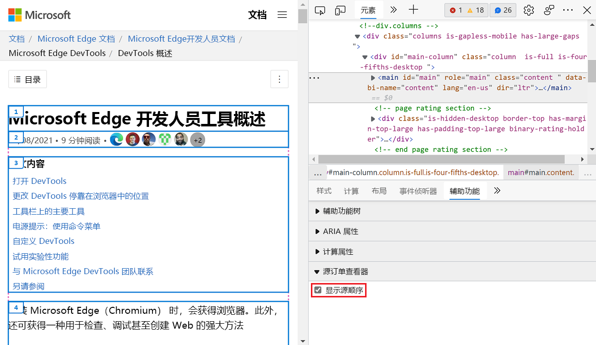
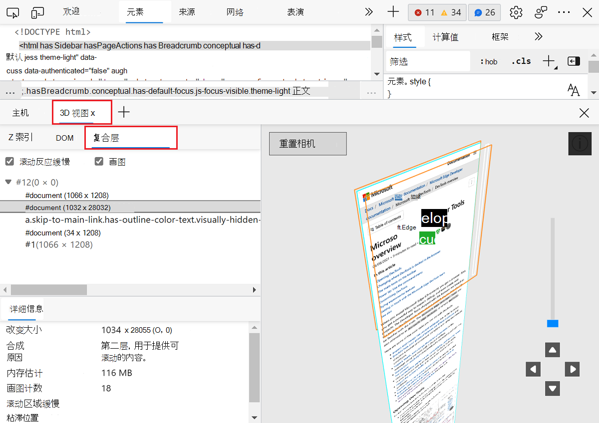
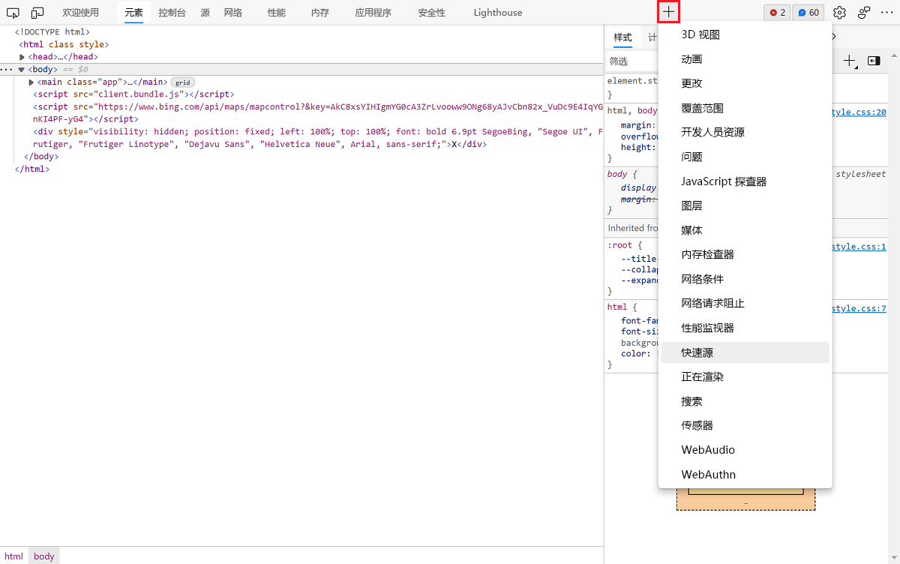
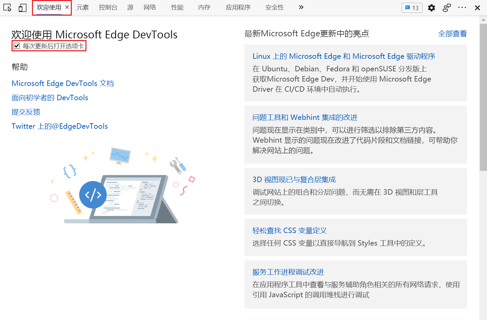
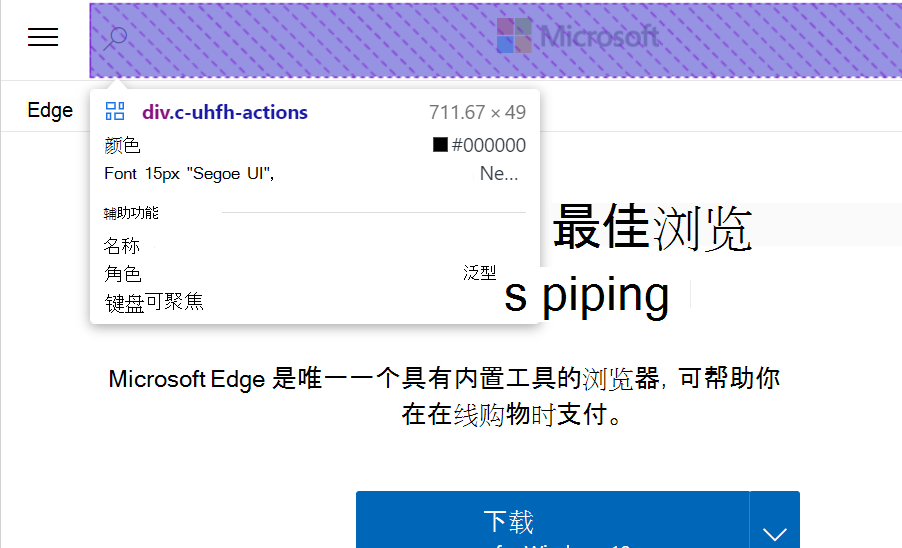
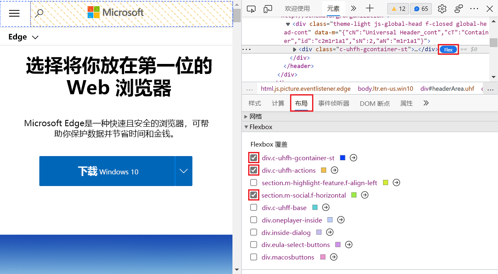
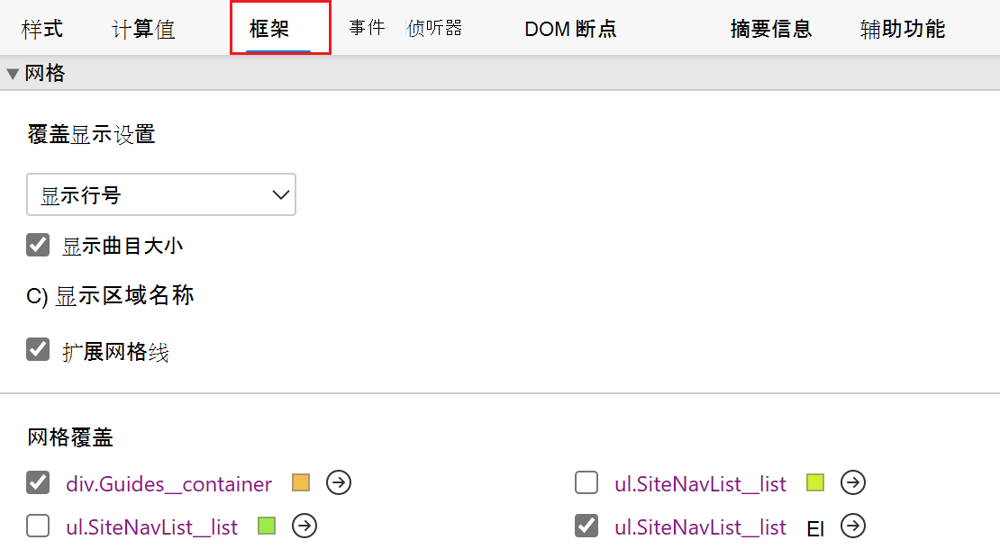

# 试验功能

<!-- 
Policies for maintaining this page:

Cover the latest Canary version and the latest Stable version.  Address both extremes (Stable v[n] and Canary v[n+3]) explicitly, in visible text - this is required, for maintainability of this maximally volatile info.

Keep h2 sections in same order as Microsoft Edge DevTools > Experiments page.
In the heading and UI steps, keep the checkbox label UI string as-is (don't revise or "fix" it).
Include a visible h2 section for every checkbox that's in public-facing Microsoft Edge DevTools > Experiments page.  If no info, write a tautology as a starting point.
When a checkbox is removed from all the preview channels, move its section down to "Previously Experimental features which are now regular features" and comment it out.  Same w/ any "on by default" list item.

Do the following, monthly:

1. Open Edge Stable > Settings > Experiments, go to edge://settings/help, update if needed, make sure the article has an h2 for each checkbox.
2. In each h2 section, write visibly & explicitly:
This checkbox is|is not present in Microsoft Edge Stable v123.
1. Update the Edge Stable list at top, re: On By Default checkboxes. Link down to the h2, do not link to other page, here.

4. Open Edge Canary > Settings > Experiments, go to edge://settings/help, update if needed, make sure the article has an h2 for each checkbox.
5. In each h2 section, write visibly & explicitly:
This checkbox is|is not present in Microsoft Edge Canary v123.
1. Update the Edge Canary list at top, re: On By Default checkboxes. Link down to the h2, do not link to other page, here.
-->

Microsoft Edge DevTools 提供对仍在开发中的试验功能的访问权限。  本文列出并介绍了以下任一项中的实验性功能：
*  最新版 Canary preview channel of Microsoft Edge。
*  最新版本的 Stable Microsoft Edge。

组织[的所有频道Microsoft Edge](/deployedge/microsoft-edge-channels)实验性功能。 可以使用以下方法获取最新的实验[Microsoft Edge Canary 渠道](https://www.microsoftedgeinsider.com/welcome?channel=canary)。 若要查看新版本中提供的完整列表Microsoft Edge，请参阅 DevTools 中的 **设置** > **Experiments** 页面。

<!-- no Warning formatting, because UI already contains red "WARNING" at top -->
这些实验可能不稳定或不可靠，可能需要重启 DevTools。

<!-- ====================================================================== -->
## 默认情况下打开的实验

默认情况下，以下实验性功能为打开状态。 你可以马上使用这些功能，而无需更改任何设置。 如果需要，可以关闭这些默认实验功能。

<!-- listed in order of the Settings > Experiments pane -->

**在 Stable v98 中Microsoft Edge打开：**
* [源订单查看器](#source-order-viewer)
* [Emulation: Support dual screen mode](#emulation-support-dual-screen-mode)
* [Enable webhint](#enable-webhint)
* [在元素中显示问题](#show-issues-in-elements)
* [Enable Composited Layers in 3D View](#enable-composited-layers-in-3d-view)
* [DevTools 工具提示](#devtools-tooltips)
* [分离的元素](#detached-elements)
* [VS Code开发工具的主题](#vs-code-themes-for-the-devtools)<!-- preserve literal UI string, including "VS" & "the" -->
* [在 Visual Studio Code 中的打开源文件](#open-source-files-in-visual-studio-code)
* [启用键盘快捷方式编辑器](#enable-keyboard-shortcut-editor)

**在 Canary v100 中Microsoft Edge打开：**
* [在应用程序面板中启用报告 API 面板](#enable-reporting-api-panel-in-the-application-panel)
* [在"更改"选项卡中显示更精确的更改](#display-more-precise-changes-in-the-changes-tab)
* [Enable webhint](#enable-webhint)
* [在元素中显示问题](#show-issues-in-elements)
* [在 Visual Studio Code 中的打开源文件](#open-source-files-in-visual-studio-code)
* [自动在"源Microsoft Edge中打印](#automatically-pretty-print-in-the-microsoft-edge-sources-panel)

<!-- don't place a comment line between list item lines, above; that would create a gap -->

<!-- ====================================================================== -->
## 打开或关闭实验

实验性功能会不断更新，并且可能会导致性能问题。  这是你可能想要关闭实验的一个原因。

若要打开或关闭实验，请Microsoft Edge：

1. 若要打开 DevTools，请右键单击该网页，然后选择"检查 **"**。  或者，按 `Ctrl`++`Shift``I` (Windows、Linux) 或 (`I` `Command`+`Option`+macOS) 。  将打开 DevTools。

1. 在 DevTools 中的主工具栏上，单击设置** (** 设置。) 按钮。  或者，按 `Shift`+`?`。

1. 在"实验"面板**设置**，选择"实验 **"** 页面。

   

1. 在实验 **页面上** ，选中或清除实验的复选框。 默认情况下，某些实验 (选中) 打开。

1. 单击 **"** 关闭 (右上方的"关闭"图标以关闭 DevTools **设置**。

1. 单击" **重新加载 DevTools"** 按钮。

<!-- ====================================================================== -->
## 还原已选择实验的默认值

若要还原打开实验功能的默认设置，请：

1. 若要打开 DevTools，请右键单击该网页，然后选择"检查 **"**。  或者，按 `Ctrl`++`Shift``I` (Windows、Linux) 或 (`I` `Command`+`Option`+macOS) 。  将打开 DevTools。

1. 在 DevTools 中的主工具栏上，单击设置** (** 设置。) 按钮。  或者，按 `Shift`+`?`。  The **设置** panel opens， with the **Preferences** page selected.

1. 在首选项页面**的底部，单击**还原默认值**和**刷新按钮，然后单击**关闭 (** 。) 。

<!-- For more information about customizing settings, see [Settings](../customize/index.md#settings) in _Customize Microsoft Edge DevTools_. -->

<!-- ====================================================================== -->
## 筛选实验

你可以按标题中包含的文本筛选实验性功能。

1. 若要打开 DevTools，请右键单击该网页，然后选择"检查 **"**。  或者，按 `Ctrl`++`Shift``I` (Windows、Linux) 或 (`I` `Command`+`Option`+macOS) 。  将打开 DevTools。

1. 在 DevTools 中的主工具栏上，单击设置** (** 设置。) 按钮。  或者，按 `Shift`+`?`。  The **设置** panel opens， with the **Preferences** page selected.

1. 在"实验"面板**设置**，选择"实验 **"** 页面。

1. 在"筛选器 **"文本框中** 单击并输入文本，如 **时间线**。  键入时，只有匹配的复选框显示在实验 **页面中** 。

1. 若要结束筛选，请清除 **"筛选器"** 文本框。

<!-- ====================================================================== -->
## 提供有关实验的反馈

我们期待收到有关实验功能的反馈。

* 请通过发布推文 [@EdgeDevTools](https://twitter.com/edgedevtools) 向我们发送反馈。

* [请与开发人员Microsoft Edge联系](../contact.md)。

* 打开焦点**模式**实验后，在活动栏底部，选择"帮助******" (**  焦点模式下的活动栏中的"帮助"图标。) >**反馈**"，以显示"发送反馈 **"窗口。**

<!-- ====================================================================== -->
## 实验列表

下面列出了最新版 Canary 预览频道中显示Microsoft Edge实验。

<!-- ====================================================================== -->
## 允许扩展加载自定义样式表

某些Microsoft Edge加载项可以定义 DevTools 的自定义颜色主题。 如果安装具有主题的加载项，则需要启用"允许扩展加载自定义样式表****"实验来查看加载项主题。

*  Stable v98 Microsoft Edge此复选框。
*  Canary v100 Microsoft Edge此复选框。

<!-- ====================================================================== -->
## 捕获节点创建堆栈

若要在运行时将 DOM 节点添加到 DOM 时捕获 JavaScript 堆栈跟踪，请启用此实验。 捕获的堆栈跟踪显示在"元素"面板的"**堆栈****跟踪"** 窗格中。

*  Stable v98 Microsoft Edge此复选框。
*  Canary v100 Microsoft Edge此复选框。

<!-- ====================================================================== -->
## 协议监视器

DevTools 使用 DevTools 协议与检查的页面通信。

若要监视 DevTools 发送和接收的消息以调试检查的页面：

1. 若要打开 DevTools，请右键单击该网页，然后选择"检查 **"**。  或者，按 `Ctrl`++`Shift``I` (Windows、Linux) 或 (`I` `Command`+`Option`+macOS) 。  将打开 DevTools。

1. 在 DevTools 中的主工具栏上，单击设置** (** 设置。) 按钮。  或者，按 `Shift`+`?`。  The **设置** panel opens， with the **Preferences** page selected.

1. 在"实验"面板**设置**，选择"实验 **"** 页面。

1. 选中"**协议监视器**"**** 复选框工具"> 设置中的"关闭"图标。**) 关闭设置**。

1. 打开命令**菜单** (`Ctrl`+`P`+`Shift`) ，**然后在文本框中**键入协议。

1. 选择 **"显示协议监视器"**。  将出现以下消息："一个或多个设置已更改，要求重新加载生效。"

1. 单击 **显示在邮件旁边的"重新加载 DevTools** "按钮。

1. 协议**监视器**工具显示在 DevTools **** 底部的"箱"中。

*  Stable v98 Microsoft Edge此复选框。
*  Canary v100 Microsoft Edge此复选框。

<!-- ====================================================================== -->
## 显示云解决方案提供商违反视图

显示内容安全策略 (CSP) 违反。
<!-- needs content, 0 hits in fts in this repo - retry "csp" Find. -->

请参阅 [内容安全策略 (CSP) ](../../extensions-chromium/store-policies/csp.md)。

*  Stable v98 Microsoft Edge此复选框。
*  Canary v100 Microsoft Edge此复选框。

<!-- ====================================================================== -->
## 记录性能跟踪时的范围

记录性能跟踪时的范围。
<!-- needs content, 0 hits in fts in this repo -->

*  Stable v98 Microsoft Edge此复选框。
*  Canary v100 Microsoft Edge此复选框。

<!-- ====================================================================== -->
## 显示用于拍摄堆快照的选项，其中全局被视为根

显示获取将全局视为根的堆快照的选项。
<!-- needs content -->

*  Stable v98 Microsoft Edge此复选框。
*  Canary v100 Microsoft Edge此复选框。

<!-- ====================================================================== -->
## 在帧树结构视图中显示后退/向前缓存阻止原因

是否在帧树结构视图中显示后退/向前缓存阻止原因。
<!-- needs content -->

*  Stable v98 中不存在Microsoft Edge复选框。
*  Canary v100 Microsoft Edge此复选框。

<!-- ====================================================================== -->
## 源订单查看器

**Source Order Viewer** 是显示网页源中元素顺序的试验。 屏幕显示顺序可以不同于源的顺序，这会使屏幕阅读器和键盘用户混淆。 使用 **Source Order Viewer** 试验查找屏幕显示顺序和源顺序之间的差异。

若要使用 **Source Order Viewer**：

1. 若要打开 DevTools，请右键单击该网页，然后选择"检查 **"**。  或者，按 `Ctrl`++`Shift``I` (Windows、Linux) 或 (`I` `Command`+`Option`+macOS) 。  将打开 DevTools。

1. 在 DevTools 中，在主工具栏上，选择" **元素"** 选项卡。 If the **Elements** tab isn't visible， click the **More tabs** () button， or else the **More Tools** () button.

1. 在"**样式"选项卡**的右侧，单击 **"辅助功能"** 选项卡。 如果"**辅助功能"** 选项卡不可见，请单击****。) 按钮。

1. 在部分 **Source Order Viewer** 下，选中" **显示源订单"** 复选框。

1. 突出显示任何 HTML 元素以显示网页源中订单的覆盖。

   

有关详细信息， [请参阅使用 Source Order Viewer](../accessibility/test-tab-key-source-order-viewer.md)

*  Stable v98 Microsoft Edge此复选框。
*  Canary v100 中Microsoft Edge复选框。

<!-- ====================================================================== -->
## 时间线：事件发起人

是否在时间线中包括事件发起人。
<!-- needs content -->

*  Stable v98 Microsoft Edge此复选框。
*  Canary v100 Microsoft Edge此复选框。

<!-- ====================================================================== -->
## 时间线：基于 WebGL 的图表

是否在时间线中使用基于 WebGL 的图表。
<!-- needs content -->

*  Stable v98 Microsoft Edge此复选框。
*  Canary v100 Microsoft Edge此复选框。

<!-- ====================================================================== -->
## WebAssembly 调试：启用 DEBUGG 支持

启用对 WebAssembly 调试的 DEBUGG 支持。  请参阅 _What's new in DevTools (Microsoft Edge 80) 中的_改进的 [WebAssembly](../whats-new/2019/12/devtools.md#improved-webassembly-debugging) 调试。
<!-- Needs content. -->

*  Stable v98 Microsoft Edge此复选框。
*  Canary v100 Microsoft Edge此复选框。

<!-- ====================================================================== -->
## Emulation: Support dual screen mode

请参阅 [Emulation: Support dual screen mode](../device-mode/dual-screen-and-foldables.md)。

*  Stable v98 Microsoft Edge此复选框。
*  Canary v100 中Microsoft Edge复选框。

<!-- ====================================================================== -->
## 启用新的高级感知对比度算法 (APCA) 替换以前的对比度和 AA/AAA 指南

在 APCA 中启用新的高级感知对比度 (，) 以前的对比度比率和 AA/AAA 指南。
<!-- Needs content. -->

*  Stable v98 Microsoft Edge此复选框。
*  Canary v100 Microsoft Edge此复选框。

<!-- ====================================================================== -->
## 在"元素"面板中启用完全辅助功能树视图

在"元素"工具中启用完整的辅助功能 **树** 视图。
<!-- Needs content. -->

*  Stable v98 Microsoft Edge此复选框。
*  Canary v100 Microsoft Edge此复选框。

<!-- ====================================================================== -->
## 启用"样式"窗格中的"字体编辑器"工具

可以使用可视字体 [编辑器来](../inspect-styles/edit-fonts.md) 编辑字体。  使用它来定义字体和字体特征。  可视 **字体编辑器** 可帮助您执行以下操作：

*  在不同字体属性的单位之间切换
*  在不同字体属性的关键字之间切换
*  转换单位
*  生成准确的 CSS 代码

若要使用可视 **字体编辑器**：

1. 若要打开 DevTools，请右键单击该网页，然后选择"检查 **"**。  或者，按 `Ctrl`++`Shift``I` (Windows、Linux) 或 (`I` `Command`+`Option`+macOS) 。  将打开 DevTools。

1. 在 DevTools 中，在主工具栏上，选择" **元素"** 选项卡。 If the **Elements** tab isn't visible， click the **More tabs** () button， or else the **More Tools** () button.

1. 在" **样式"** 选项卡中，选择 **"字体编辑器"** 图标。

   

有关可视字体编辑器 **的详细信息，** 请参阅在"样式"窗格中编辑 [CSS 字体样式和设置](../inspect-styles/edit-fonts.md)。

有关详细信息，请参阅"样式"窗格中[的"编辑 CSS 字体样式和设置"。](../inspect-styles/edit-fonts.md)

*  Stable v98 Microsoft Edge此复选框。
*  Canary v100 Microsoft Edge此复选框。

<!-- ====================================================================== -->
## 通过问题面板启用自动对比度问题报告

在问题工具中启用自动对比度 **问题** 报告。
<!-- Needs content. -->

*  Stable v98 Microsoft Edge此复选框。
*  Canary v100 Microsoft Edge此复选框。

<!-- ====================================================================== -->
## 启用实验性 Cookie 功能

启用实验性 Cookie 功能。
<!-- Needs content. -->

*  Stable v98 Microsoft Edge此复选框。
*  Canary v100 Microsoft Edge此复选框。

<!-- ====================================================================== -->
## 在应用程序面板中启用报告 API 面板

使用报告 API 捕获某些错误，如安全违反或已弃用 API 调用。 这些错误在用户访问您的网站并发送到服务器终结点时发生。 启用此实验以在应用程序面板中添加**报告 API** 部分****，其中列出了发送到终结点的所有报告。

*  Stable v98 Microsoft Edge此复选框。
*  Canary v100 Microsoft Edge此复选框。

<!-- ====================================================================== -->
## 在"更改"选项卡中显示更精确的更改

请参阅 ["更改"选项卡中的更精确的更改](https://developer.chrome.com/blog/new-in-devtools-98/#changes)。

*  Stable v98 Microsoft Edge此复选框。
*  Canary v100 Microsoft Edge此复选框。

<!-- ====================================================================== -->
## "样式"窗格中的"同步 CSS 更改"

是否在"元素"工具的 **"样式"** 选项卡中同步 **CSS** 更改。
<!-- Needs content. -->

*  Stable v98 中不存在Microsoft Edge复选框。
*  Canary v100 Microsoft Edge此复选框。

<!-- ====================================================================== -->
## 响应标头的本地替代

是否对响应标头使用本地覆盖。
<!-- Needs content. -->

*  Stable v98 中不存在Microsoft Edge复选框。
*  Canary v100 Microsoft Edge此复选框。

<!-- ====================================================================== -->
## 将 DevTools 未记录异常记录到控制台

控制是否在控制台工具中记录 DevTools **未记录** 异常。
<!-- Needs content. -->

*  Stable v98 Microsoft Edge此复选框。
*  Canary v100 Microsoft Edge此复选框。

<!-- ====================================================================== -->
## Enable webhint

[webhint](https://webhint.io) 是一个开源代码工具，可为网站和本地网页提供实时反馈。  [Webhint 提供的反馈类型](https://webhint.io)包括：

*  辅助功能
*  跨浏览器兼容性
*  安全性
*  性能
*  渐进式 Web 应用 (PWA)
*  其他常见的 Web 开发问题

[Webhint](https://webhint.io) 试验在“[问题](../issues/index.md)”面板中显示 webhint 反馈。  选择一个问题，在网站上显示有关解决方案的文档和受影响资源的列表。  选择资源链接以在 DevTools 中**** 打开相关的"**** 网络、源"或"元素"窗格。****

*  Stable v98 Microsoft Edge此复选框。
*  Canary v100 Microsoft Edge此复选框。

<!-- ====================================================================== -->
## 在元素中显示问题

启用此实验，在"元素"工具的 **"DOM** "视图中查看 HTML 下的 **语法** 错误。 有关详细信息，请参阅 [元素工具中的波浪下划线突出显示代码问题和改进](../whats-new/2021/04/devtools.md#wavy-underlines-highlight-code-issues-and-improvements-in-elements-tool)。

*  Stable v98 Microsoft Edge此复选框。
*  Canary v100 Microsoft Edge此复选框。

<!-- ====================================================================== -->
## Enable Composited Layers in 3D View

您可以将 Layers 与 z 索引和文档对象模型一起可视化 (DOM) 。 为了获得全面的视觉调试体验，现在已将 3D View 和复合层组合到一起。

此功能可帮助你进行调试，而无需频繁切换上下文。 减少上下文切换可解决开发人员的一个主要问题。 此功能可明确您编写的代码对 Web 应用有何影响。

若要使用 **复合层**：

1. 若要打开 DevTools，请右键单击该网页，然后选择"检查 **"**。  或者，按 `Ctrl`++`Shift``I` (Windows、Linux) 或 (`I` `Command`+`Option`+macOS) 。  将打开 DevTools。

1. 按 `Esc` 以显示 **"箱"**。

1. 在 **"箱"** 上，选择 **3D View** 工具。

1. 打开“**复合层**”窗格。

1. 此时将显示应用的所有绘制层。  使用你自己的 Web 应用试用此功能。

   

另请参阅 [使用工具导航 z-index、DOM 和 3D View 图层](../3d-view/index.md)。

*  Stable v98 Microsoft Edge此复选框。
*  Canary v100 中Microsoft Edge复选框。

<!-- ====================================================================== -->
## Enable Network Console

**网络控制台**是试验通过 HTTP 提出综合网络请求的工作主题。  可以使用网络 **控制台实验** 发送 Web API 请求。

若要使用 **网络控制台**：

1. 若要打开 DevTools，请右键单击该网页，然后选择"检查 **"**。  或者，按 `Ctrl`++`Shift``I` (Windows、Linux) 或 (`I` `Command`+`Option`+macOS) 。  将打开 DevTools。

1. 在 DevTools 中，在主工具栏上，选择"网络 **"** 选项卡。 如果该选项卡不可见，请单击"更多选项卡" (**** 更多选项卡"图标](../media/more-tabs-icon-light-theme.png)。****) 按钮 

请参阅 [使用网络控制台工具撰写和发送 Web API 请求](../network-console/network-console-tool.md)。

*  Stable v98 Microsoft Edge此复选框。
*  Canary v100 中Microsoft Edge复选框。

<!-- ====================================================================== -->
## 焦点模式

焦点模式实验提供了一 **个活动栏**，它是一个在较小窗口中运行良好的紧凑水平或垂直工具栏。  活动栏包含小图标，而不是带文本标签的选项卡，它将替换主工具栏。

*  活动 **栏** 是主工具栏的精简替换。
*  快速 **视图** 列表是"箱"工具栏上选项卡的替换。

若要将工具添加到活动栏，请打开该工具。

若要从活动栏中删除工具，请执行以下操作：

*  右键单击其图标，然后选择" **从活动栏中删除"**。

活动栏上始终存在 **以下工具，** 并且无法删除：

*  检查 **工具和** 设备仿真。
*  **元素、****控制台**和**源**工具。

若要切换到焦点模式以显示活动栏而不是主工具栏：

1. 在 DevTools 中，**设置** (设置。) >**实验"**。

1. 选中焦点 **模式** 复选框。

1. 单击 **右上角 (** **X**) "按钮，然后单击" **重新加载 DevTools"** 按钮。

   活动栏显示在左侧。  主工具栏消失。

   The Drawer toolbar is replaced by a **Quick View** list of the tools， instead of tabs.  所有选项卡工具均在快速视图列表中可用****， (**元素**、控制台和**源) 。** ****  向上拖动"箱"将其展开。

另请参阅：

* [关于工具列表](../about-tools.md)。
* [DevTools：焦点模式 UI](https://github.com/MicrosoftEdge/MSEdgeExplainers/blob/main/DevTools/FocusMode/explainer.md) - 解释器存储库中此实验性功能草稿文档。

*  Stable v98 Microsoft Edge此复选框。
*  Canary v100 Microsoft Edge此复选框。

<!-- ====================================================================== -->
## DevTools 工具提示

启用此实验可查看 DevTools 中所有不同工具和窗格的工具提示。 有关详细信息，请参阅 [了解包含信息性工具提示的 DevTools](../whats-new/2021/04/devtools.md#learn-about-devtools-with-informative-tooltips)。

*  Stable v98 Microsoft Edge此复选框。
*  Canary v100 中Microsoft Edge复选框。

<!-- ====================================================================== -->
## 分离的元素
<!-- PM: "The Detached Elements checkbox is visible to all Edge users since Edge 93.
The experiment was turned on by default in Edge 93 for all internal (so has a microsoft.com account in Edge) DevTools customers.
Starting with Edge 97, the experiment will be turned on by default for all Edge users" -->

Web 应用程序中的内存泄漏可能难以查找和修复。

DevTools Microsoft Edge分离的元素面板可帮助调查和解决内存泄漏的常见来源。****

当应用程序的 JavaScript 代码在内存中保留数量不断增加的对象时，会发生内存泄漏。 JavaScript 代码应释放这些对象，以便浏览器可以重用内存空间。

有关详细信息，请参阅使用分离的元素工具 [调试 DOM 内存泄漏](../memory-problems/dom-leaks.md)

*  Stable v98 Microsoft Edge此复选框。
*  Canary v100 中Microsoft Edge复选框。

<!-- ====================================================================== -->
## VS Code开发工具的主题
<!-- preserve literal UI string, including "VS" & "the" -->

若要在 devTools Visual Studio主题，请VS Code**开发工具实验的开发人员主题**。 有关详细信息，请参阅向 [DevTools 应用颜色主题](../customize/theme.md)。

*  Stable v98 Microsoft Edge此复选框。
*  Canary v100 中Microsoft Edge复选框。

<!-- ====================================================================== -->
## 在 Visual Studio Code 中的打开源文件

实验**中的开放源文件**Visual Studio Code源工具的代码编辑器替换为用于编辑Visual Studio Code文件的代码编辑器。 打开此实验时，开发人员工具会检测何时编辑本地文件，并提示你选择一个用作工作区的文件夹。

选择要用作工作区的文件夹时，选择 DevTools 中某个文件的任何链接将在Visual Studio Code。  在早期版本的 Microsoft Edge 中，此操作在 DevTools 中的"源"工具的代码编辑器中打开文件。

现在，你在 DevTools 中执行的任何编辑都更改硬盘上的文件，并实时与Visual Studio Code。 可以在打开源文件中阅读有关设置工作区[Visual Studio Code](../sources/opening-sources-in-vscode.md)。

*  Stable v98 Microsoft Edge此复选框。
*  Canary v100 Microsoft Edge此复选框。

<!-- ====================================================================== -->
## 自动在"源Microsoft Edge中打印

打开此实验时，当你在"源"面板中显示缩小文件时，该文件在"源"面板中的单个选项卡中打开，非常打印。

关闭此实验后，带按钮的 UI 提示会询问你是否要以设计方式打印文件。  文件在附加后缀为 **：formatted 的其他选项卡中打开**。

*  缩小 _文件_ 将连接为一个长行。
*  相比之下， _更智能的_ 打印以缩进、更可读的格式呈现文件的内容。

*  Stable v98 Microsoft Edge此复选框。
*  Canary v100 Microsoft Edge此复选框。

<!-- ====================================================================== -->
<!-- >> [!WARNING]
> These experiments are particularly unstable. Enable at your own risk. -->

<!-- ====================================================================== -->
## 忽略时间线上的 JavaScript 框架列表

是否在时间线上包括 JavaScript 帧的 Ignore 列表。
<!-- Needs content. -->

*  Stable v98 Microsoft Edge此复选框。
*  Canary v100 Microsoft Edge此复选框。

<!-- ====================================================================== -->
## 时间线上的输入事件概述

控制是否在时间线概述中包括输入事件。
<!-- Needs content. -->

*  Stable v98 Microsoft Edge此复选框。
*  Canary v100 Microsoft Edge此复选框。

<!-- ====================================================================== -->
## 实时堆配置文件

控制是否实时更新堆配置文件。
<!-- Needs content. -->

*  Stable v98 Microsoft Edge此复选框。
*  Canary v100 Microsoft Edge此复选框。

<!-- ====================================================================== -->
## 采样堆探查器时间线

控制是否显示采样堆探查器时间线。
<!-- Needs content. -->

*  Stable v98 Microsoft Edge此复选框。
*  Canary v100 Microsoft Edge此复选框。

<!-- ====================================================================== -->
## 启用键盘快捷方式编辑器

请参阅 [自定义键盘快捷方式中的编辑 DevTools](../customize/shortcuts.md#edit-the-keyboard-shortcut-for-a-devtools-action) _操作键盘快捷方式_。

*  Stable v98 Microsoft Edge此复选框。
*  Canary v100 中Microsoft Edge复选框。

<!-- ====================================================================== -->
## 时间线：无效跟踪

控制是否在时间线上显示无效跟踪。

*  Stable v98 Microsoft Edge此复选框。
*  Canary v100 Microsoft Edge此复选框。

<!-- ====================================================================== -->
## 时间线：显示所有事件

控制是否在时间线上显示所有事件。

*  Stable v98 Microsoft Edge此复选框。
*  Canary v100 Microsoft Edge此复选框。

<!-- ====================================================================== -->
## 时间线：时间线上的 V8 运行时呼叫统计信息

控制是否在时间线上显示 v8 运行时呼叫统计信息。

*  Stable v98 Microsoft Edge此复选框。
*  Canary v100 Microsoft Edge此复选框。

<!-- ====================================================================== -->
## 时间线：重播输入事件

控制是否重播时间线上的输入事件。

*  Stable v98 Microsoft Edge此复选框。
*  Canary v100 Microsoft Edge此复选框。

<!-- /end of checkboxes -->

<!-- ====================================================================== -->
<!-- todo: move these sections into regular articles
## Previously Experimental features which are now regular features

These features have been promoted from experimental to regular features, and have been removed from **Settings** > **Experiments**. -->

<!-- ====================================================================== -->
<!-- ## Enable experimental hide issues menu

Enables the experimental **Hide issues** menu.

*  This checkbox is not present in Microsoft Edge Stable v98.
*  This checkbox is not present in Microsoft Edge Canary v100. -->

<!--
no such, as of v98:
*  [Enable back-forward cache debugging support](#Enable back-forward cache debugging support).

no such, as of v98:
*  Enable experimental hide issues menu.

======================================================================
## Enable dynamic Welcome content
present in 96, 98 - no, not present in 98 anymore

======================================================================
## Enable back-forward cache debugging support
present in 96, 98

Back-forward cache, or *bfcache*. Makes navigating through your browsing history faster by saving snapshots of visited web pages in memory.

Certain web pages can't be cached. Enable this experiment to add the **Back-forward Cache** section to the **Application** panel.  Enabling back-forward cache debugging provides information about web pages that can't be stored in `bfcache`.

======================================================================

*  [Turn on new CSS grid debugging features](../css/grid.md) - removed from experimental status starting with Microsoft Edge 89.

*  [Match keyboard shortcuts from Microsoft Visual Studio Code](../customize/shortcuts.md#match-keyboard-shortcuts-from-visual-studio-code) - removed from experimental status starting with Microsoft Edge 86.

*  [Turn on support to move tabs between panels](../customize/index.md) - removed from experimental status starting with Microsoft Edge 85.

*  [Navigate z-index, DOM, and layers using the 3D View tool](../3d-view/index.md) - removed from experimental status starting with Microsoft Edge 83.

*  The items in the following subsections.

### Enable + button tab menus to open more tools

This experiment started with Microsoft Edge version 89, and is a regular feature as of version 94.

You can now open more tools using the new **More Tools** () icon.  After you turn on the **Enable + button tab menus to open more tools** experiment and reload DevTools, a plus sign () appears to the right of the tab group at the top of DevTools.  To display a list of other tools that you can add to the tab bar, click the **More Tools** () icon.

### Enable Welcome tab

The Welcome tab was an experiment starting with Microsoft Edge version 89.  It's a regular feature as of version 94.

This experiment replaces the **What's New** tool with the new **Welcome** tool.  It displays a refreshed design for the following content.

*  Links to developer docs
*  Latest features
*  Release notes
*  Option to contact the Microsoft Edge DevTools team

The **Welcome** tool opens automatically after each update to Microsoft Edge.  To prevent the display of the **Welcome** tool after each update, clear the checkbox next to **Open tab after each update** under the **Welcome** tool title.

### Enable new CSS Flexbox debugging features

This was an experiment starting with Microsoft Edge version 89, and is a regular feature as of version 94.

This feature provides many new visualizations to help you debug CSS Flexbox layouts.

#### Displaying persistent overlays on Flexbox layouts with the Inspect tool

The **Inspect** tool provides a quick way to identify and visualize CSS Flexbox layouts in a website by hovering on them with the mouse.  Select the **Inspect** () icon in the top-left corner of DevTools.  Then, while debugging the website, hover on a flex container to display outlines around the flex container.

#### Displaying persistent overlays on Flexbox layouts

In Microsoft Edge version 89 or later, the CSS Flexbox feature offers the option to turn on persistent overlays on Flexbox layouts.  Persistent overlays provide the following benefits:
*  Persistent overlays remain visible on the webpage as you scroll, move your mouse, and use other features of DevTools.
*  Multiple persistent overlays can be used at the same time, to allow you to review several Flexbox layouts at once.
*  Persistent overlays offer color configuration options.

To toggle persistent overlays on Flexbox layout, do either of the following:
*  Select the **Flexbox** oval icon next to any Flexbox container displayed in the DOM tree of the **Elements** tool.
*  Open the new **Layout** panel located in the **Elements** tool, and select the checkbox next to each Flexbox container you want to highlight.

#### Configuring persistent overlays

To configure options for persistent overlays for CSS grids or Flexbox layouts, use the **Layout** pane.  The **Layout** pane is located in the **Elements** tool next to the **Styles** and **Computed** panes.

-->
