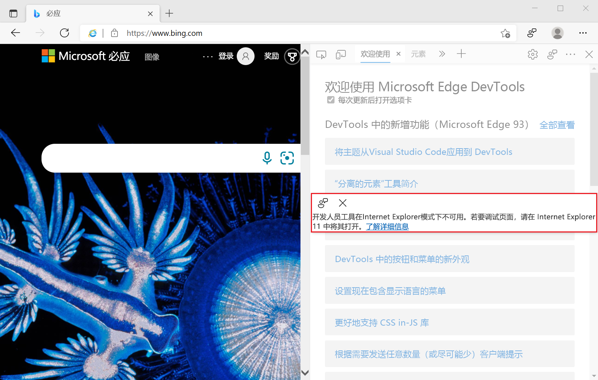

# <a name="use-devtools-in-internet-explorer-mode-ie-mode"></a>在 Internet Explorer 模式（IE 模式）中使用开发工具

Internet Explorer 模式 (IE 模式) 与 Microsoft Edge DevTools 集成。   IE 模式允许企业指定仅在 Internet Explorer 11 中工作的网站列表。 在Microsoft Edge中导航到这些网站时，Internet Explorer 11 的实例将运行并在选项卡中呈现该网站。

IE 模式允许企业管理与当前与任何新式 Web 浏览器不兼容的技术的兼容性。

IE 模式中包含对以下技术的支持：
*  IE 文档模式。
*  ActiveX控件。
*  其他旧组件。

在 IE 模式下，呈现过程基于 Internet Explorer 11。 Microsoft Edge进程管理器处理呈现过程的生存期。  呈现过程受限于特定站点 (或应用) 选项卡的生存期。  当选项卡以 IE 模式呈现时，IE 模式指示器图标将显示在特定选项卡的地址栏中。


IE 模式在 Windows 10 2019 年 5 月更新)  (1903 版本 1903 上提供，并适用于所有受支持的Windows平台。


<!-- ====================================================================== -->
## <a name="open-devtools-on-a-tab-in-ie-mode"></a>在 IE 模式下在选项卡上打开 DevTools

如果Enterprise管理员已将网站配置为以 IE 模式显示，则 IE 模式指示器图标将显示在地址栏中。  若要在 IE 模式下查看网站的文档模式，请在地址栏中选择 IE 模式指示器图标。


如果选项卡使用 IE 模式，则该选项卡具有以下限制：

*  某些 DevTools 面板不起作用，例如**网络**和**性能**，因为呈现引擎从Chromium切换到 Internet Explorer 11。

*  **检查元素** 在右键单击菜单上不可见。

*  右键单击，然后选择 **“视图源**”启动记事本。

*  按`F12`下或`I``Ctrl`+`Shift`+打开Microsoft Edge DevTools 的空白实例，并显示以下消息：开发**人员工具在 Internet Explorer 模式下不可用。 若要调试页面，请在 Internet Explorer 11 中将其打开。**



如果计算机上不可用 Internet Explorer，若要调试 IE 模式选项卡的内容，请使用 IEChooser 打开 Internet Explorer DevTools，如下所示：

1. 在Windows中，打开 **“运行**”对话框。  例如，按 .`Windows logo key` + `R`

1. 输入 `%systemroot%\system32\f12\IEChooser.exe`，然后单击 **“确定**”。

1. 在 IEChooser 中，选择“IE 模式”选项卡的条目。


<!-- ====================================================================== -->
## <a name="remote-debugging-in-ie-mode"></a>IE 模式下的远程调试

启动Microsoft Edge，从命令行接口启用远程调试。  Microsoft Visual Studio、Microsoft Visual Studio代码和其他开发工具通常运行命令来启动Microsoft Edge。  以下命令启动Microsoft Edge，将远程调试端口设置为 `9222`。

```shell
start msedge --remote-debugging-port=9222
```

使用命令行参数启动Microsoft Edge后，IE 模式不可用。  仍可导航到以 IE 模式显示的网站 (或应用) 。  网站 (或应用) 内容呈现使用Chromium，而不是 Internet Explorer 11。 依赖 Internet Explorer 11 的部分网页（如ActiveX控件）可能无法正确呈现。  IE 模式指示器图标不会显示在地址栏中。

在关闭并重启Microsoft Edge之前，IE 模式仍然不可用。


<!-- ====================================================================== -->
## <a name="replace-internet-explorer-automation"></a>替换 Internet Explorer 自动化

如果现有应用程序使用 [InternetExplorer](/previous-versions/windows/internet-explorer/ie-developer/platform-apis/aa752084(v=vs.85)) 对象自动执行 Internet Explorer 11，但 Internet Explorer 11 桌面应用程序不可用，则应用程序将不起作用。  Internet Explorer 11 将于 2022 年 6 月 15 日停用。  请参阅Windows 10[上的 Internet Explorer 的未来Microsoft Edge](https://blogs.windows.com/windowsexperience/2021/05/19/the-future-of-internet-explorer-on-windows-10-is-in-microsoft-edge/)。

Microsoft Edge不支持通过`InternetExplorer`对象自动执行 IE 模式，因此需要使用下面推荐的替代方法之一更新依赖于此对象的应用程序。  使用 [WebBrowser 控件](/previous-versions/windows/internet-explorer/ie-developer/platform-apis/aa752040(v=vs.85)) 的应用程序将继续工作，并且不会受到删除 Internet Explorer 11 的影响。

如果自动化应用程序不需要网站 IE 模式 (或应用) 内容才能正常运行，建议更新应用程序以使用Microsoft Edge而不是 Internet Explorer 11。 许多可用的自动化工具支持Microsoft Edge，包括 WebDriver 和 Playwright。

*  若要详细了解如何使用 WebDriver 自动Microsoft Edge，请[参阅使用 WebDriver 自动执行Microsoft Edge](../../webdriver-chromium/index.md)。
*  若要了解有关使用 Playwright 的详细信息，请参阅[使用 Playwright 在 Microsoft Edge 中自动执行和测试](../../playwright/index.md)。

需要网站 IE 模式的应用程序 (或应用) 内容才能正常运行，则应使用该控件 `WebBrowser` 。  该 `WebBrowser` 控件使用 Internet Explorer 平台 (MSHTML/Trident) 来呈现 Web 内容，即使 Internet Explorer 11 桌面应用程序不可用，也可正常工作。


<!-- ====================================================================== -->
## <a name="see-also"></a>另请参阅

*  [什么是 Internet Explorer (IE) 模式?](/deployedge/edge-ie-mode)
*  [配置 IE 模式策略](/deployedge/edge-ie-mode-policies)
*  [使用文档模式和企业模式站点列表修复 Web 兼容性问题](/internet-explorer/ie11-deploy-guide/fix-compat-issues-with-doc-modes-and-enterprise-mode-site-list)
