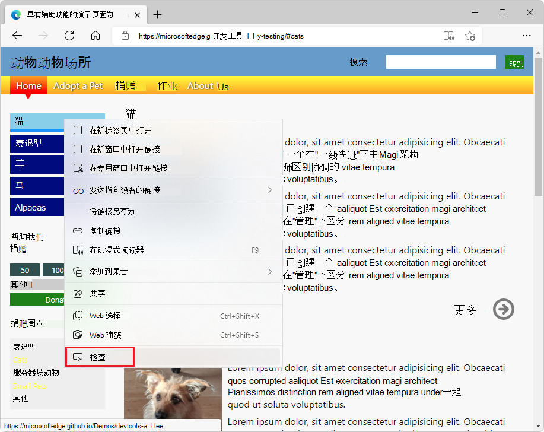
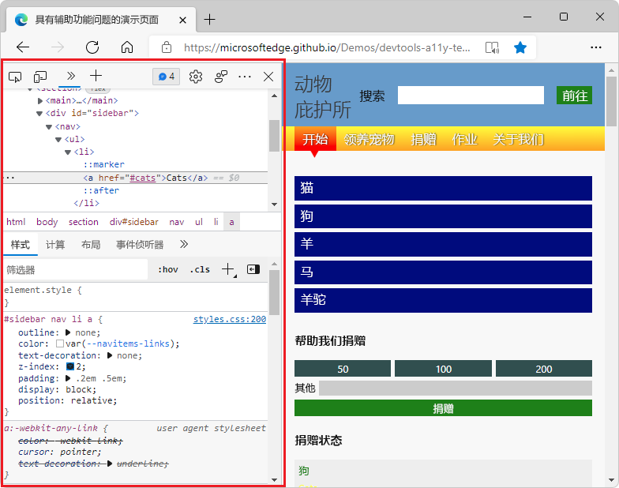
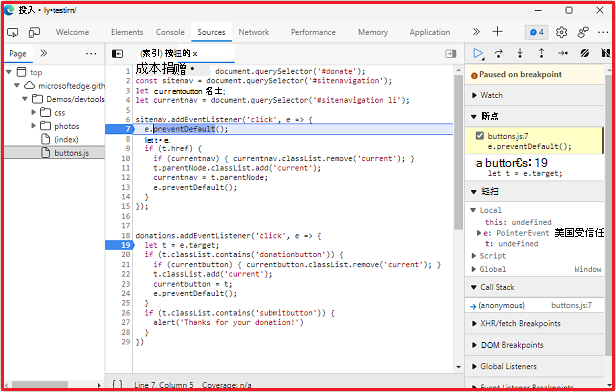
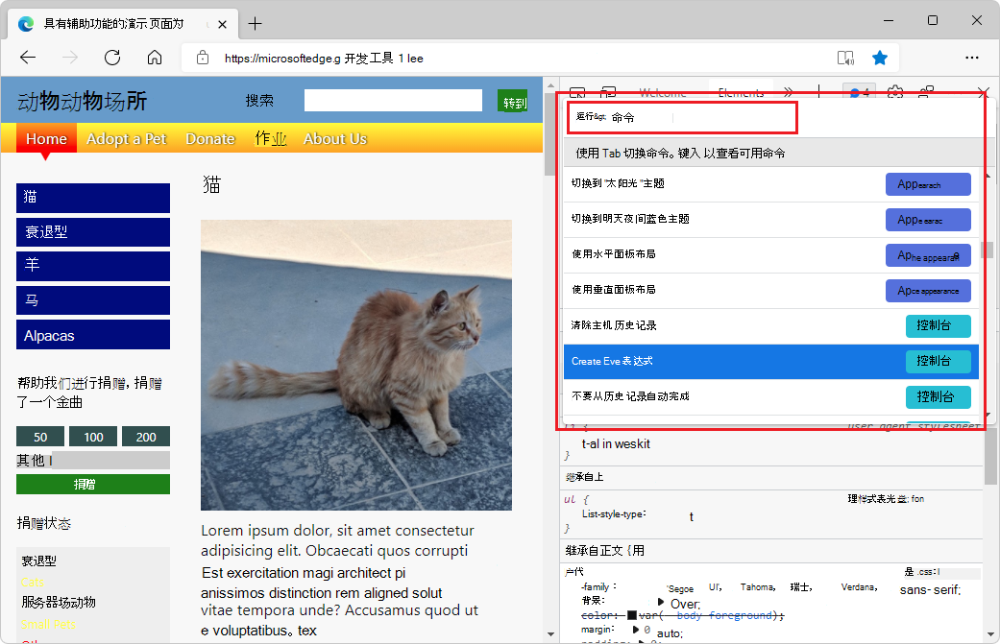
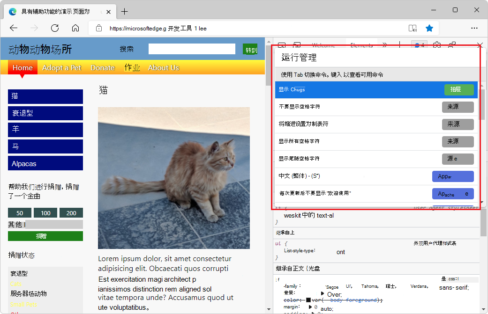
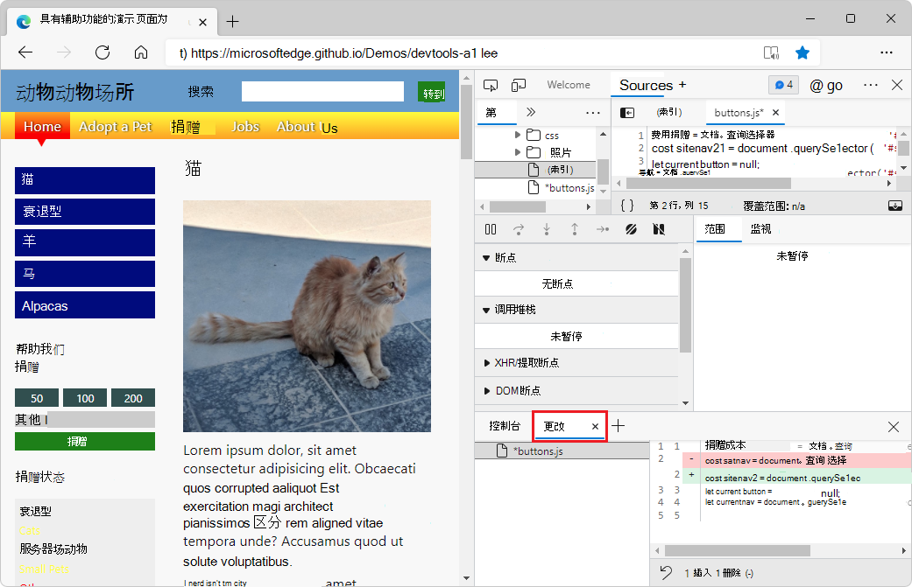
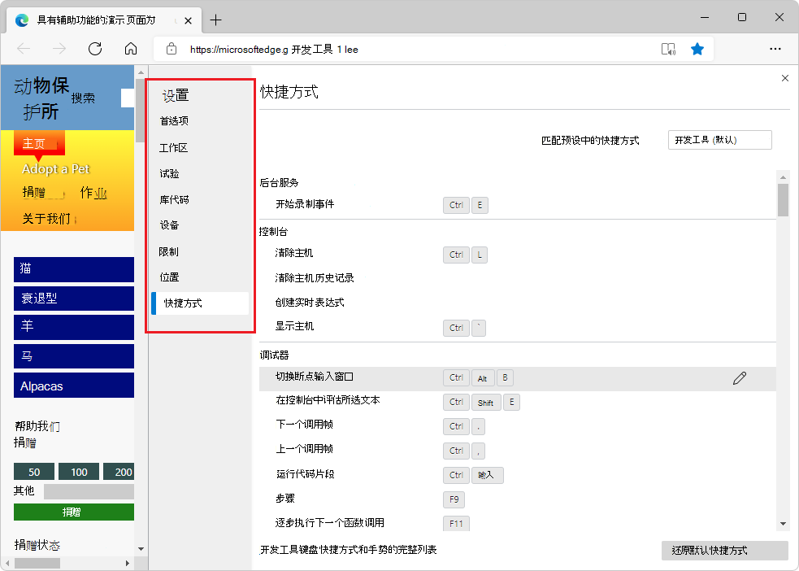

# 开发工具概述

<!-- be careful merging PRs; preserve page structure per PR 1700 (misc-fixes branch) -->

<!--
icon tagging to maintain here & propagate:
click the **Inspect tool** () button.
click the **Device Emulation** () button.
click the **More tabs** () button.
click the **More Tools** () button.
click the **JavaScript errors counter** () button.
click the **Issues counter** () button.
click the **Settings** () button.
click the **Send Feedback** () button.
click the **Customize and control DevTools** () menu button.
click the **Close** DevTools () button.
-->

Microsoft Edge DevTools 是一组 Web 开发工具，显示在"Web 浏览器"中呈现的网页Microsoft Edge旁边。

安装Microsoft Edge时，不仅会获得浏览器，还会获得开发人员工具，这提供了一种用于检查、调试甚至创建 Web 项目的强大方法。  这些开发人员工具部分基于开放源代码Chromium中的工具。  Microsoft Edge 开发人员工具也称为_Microsoft Edge DevTools，_ 或只是_DevTools。_

使用 DevTools 可以执行以下操作：

*  检查并更改浏览器中的当前 网页。

*  模拟产品在不同设备上的行为方式，并模拟具有不同网络条件的移动环境。

*  使用具有可视界面的 实时工具检查、调整和更改网页中元素的样式。

*  使用断点调试和实时控制台 调试JavaScript。

*  在 产品中查找 辅助功能、性能、兼容性和安全问题，并了解如何使用 DevTools 修复每个问题。

*  检查网络流量 并查看问题的位置。

*  检查浏览器以不同格式存储 内容的位置。

*  评估产品的性能，以查找内存问题和呈现问题。

*  使用开发环境将 DevTools 中的更改与文件系统和 Web 同步。

<!-- ====================================================================== -->
## 打开 DevTools

若要打开 DevTools，请右键单击网页上的任何项目，然后选择"检查 **"**。  DevTools 随即打开，其中选择了 **元素**工具。

DevTools 随即打开，在"元素"工具中突出显示右 **键单击** 的元素：

或者，按 `F12`。  将打开 DevTools，并选中 **欢迎** 工具或上次使用的工具。

或者，在 `Ctrl`++`Shift``I` macOS (上的 Windows/Linux) `I` `Command`+`Option`+或 (上) 。  将打开 DevTools，并选中 **欢迎** 工具或上次使用的工具。

另请参阅 [Open DevTools](./open/index.md)。

<!-- ====================================================================== -->

## 键盘支持

可以使用鼠标或键盘与 DevTools 交互。  键盘快捷方式提供了快速访问功能的方法，辅助功能需要这些快捷方式。  各种工具通过键盘和辅助技术（如屏幕阅读器）越来越易于访问。  请参阅[键盘快捷方式和](./shortcuts/index.md)[通过辅助技术导航 DevTools](accessibility/navigation.md)。

<!-- ====================================================================== -->
## 更改 DevTools 停靠在浏览器中的位置

若要更改 DevTools 放置在浏览器窗口中的位置，请执行以下操作：

*  单击"自定义**和控制 DevTools** 。) 菜单按钮，然后在"扩展坞"部分，选择布局选项。

**扩展坞**向左或**** 向右，使 DevTools 与 Web 产品并排运行，并且当你通过设备仿真功能模拟移动设备时 ([是) ](device-mode/index.md)。  **停靠到左侧**，**停靠到右侧**选项与高分辨率显示效果最佳。

**停靠到右侧** 是 DevTools 的默认位置：

**停靠到左侧** 是另一个并行选项：

当你没有足够的水平显示空间，或者你想在 DOM 或 **Console** 中调试长文本时，**停靠到底部**可以帮助你：

**取消停靠到单独的窗口** 可帮助你使用多个监视器，或者如果需要使用全屏应用：

请参阅[更改 DevTools 放置位置（取消停靠，停靠到底部，停靠到左侧）](customize/placement.md)。

<!-- ====================================================================== -->
## 主工具栏的功能

DevTools 为你提供了令人惊叹的功能，可以检查、调试和更改浏览器中当前显示的 Web 产品。  大多数工具实时显示更改。  实时更新使工具非常有用，无需刷新或生成即可优化 Web 项目的外观和导航或功能。

<!-- clarify: DevTools also allows you to change web-based third-party products on your computer. -->

有两个工具栏：DevTools 顶部的主工具栏，以及按下 时底部的"箱"****`Esc`。

默认情况下，主工具栏包含以下功能：

* 图标工具
   *  **检查工具 (**) 切换按钮。
   *  **设备仿真 (**。) 按钮。
* 工具选项卡
   *  **欢迎** 工具。
   *  **元素** 工具。  始终显示。
   *  **控制台** 工具。  始终显示。
   *  **源** 工具。  始终显示。
   *  **网络** 工具。
   *  **性能** 工具。
   *  **内存** 工具。
   *  **应用程序** 工具。
   *  **安全** 工具。
   *  **Lighthouse** 工具。
   *  **CSS 概述** 工具。
* 图标
   *  **更多选项卡 (**) 按钮。
   *  **更多工具** ( 。) 按钮。
   *  **JavaScript 错误计数器 (**  。) 按钮。
   *  **问题计数器** () 按钮。
   *  **设置** (设置按钮。
   *  **发送反馈** () 按钮。
   *  **自定义和控制 DevTools (**图标。) 菜单按钮。
   *  **关闭** DevTools ( 。) 按钮。

工具栏功能如下所述。

### 检查工具

单击"检查工具** (**) "按钮时，可以选择当前网页上的某个元素。  当 **Inspect** 工具处于活动状态时，您可以将鼠标移动到网页的不同部分，获取有关页面元素的详细信息，以及显示页面元素的布局尺寸、填充和边距的多色覆盖层。

### 设备仿真

单击" **设备仿真** ( 。) 按钮以在仿真设备模式下显示当前 Web 产品。  **设备仿真工具**允许你在调整浏览器大小时运行和测试产品的反应。  它还为你提供移动设备上的布局和行为估计。

请参阅 [模拟移动设备 (设备仿真) ](device-mode\index.md)。

### 欢迎工具

包括有关 DevTools 的新功能、如何联系团队的信息，并提供有关某些功能的信息。

### 元素工具

允许您编辑或检查 HTML 和 CSS。  可以在浏览器中实时显示更改时在工具中进行编辑。

**Elements 工具**始终位于主工具栏上。

### 控制台工具

[控制台](console/index.md)允许您显示和筛选日志消息。  日志消息是浏览器的自动日志，如网络请求和开发人员生成的日志。  您也可以在当前窗口或框架的上下文中直接在**控制台**中运行JavaScript。

**控制台工具**始终位于主工具栏上。

### 源工具

源 [工具](./sources/index.md) 是代码编辑器和 JavaScript 调试程序。  可以编辑项目、维护代码段和调试当前项目。

源 **工具** 始终位于主工具栏上。

### 网络工具

**网络**工具允许您监视和检查来自网络和浏览器缓存的请求或响应。  可以筛选请求和响应，以满足你的需求并模拟不同的网络条件。

请参阅 [检查网络活动](./network/index.md)。

### 性能工具

请参阅 [开始分析运行时性能](evaluate-performance/index.md)。

### 内存工具

请参阅 [修复内存问题](memory-problems/index.md)。

### 应用程序工具

请参阅 [查看、编辑和删除 Cookie](storage/cookies.md)。

### 安全工具

请参阅 [使用安全工具了解安全问题](security/index.md)。

### Lighthouse 工具

请参阅 [Lighthouse 工具](lighthouse/lighthouse-tool.md)。

### CSS 概述工具

确定潜在的 CSS 改进。  待定文章。 <!-- (issues/index.md) -->

### "更多选项卡"按钮

若要显示由于窗口过****图标。) 按钮。

### "更多工具"按钮

若要向工具栏添加工具，请单击"更多**工具" (**。) 按钮。

### JavaScript 错误计数器

**JavaScript 错误计数器 (** 。) 按钮显示以下内容：

*  一个红色圆圈 `X`，其中包含 ，后跟在当前网页上自动检测到的 JavaScript 错误数。

*  一个包含感叹号的黄色三角形，后跟在当前网页上自动检测到的 JavaScript 警告数。

JavaScript 计数器按钮的工具提示**** 是 **"打开控制台"以查看 # 错误和警告**。

单击 JavaScript 错误计数器以打开 [控制台](console/index.md) 并了解错误。

### 问题计数器

" **问题"** ( 。) 按钮显示在当前网页上自动发现的 HTML 或 CSS 问题数。

"问题"计数器的工具提示**是****"打开问题"以查看 # 问题**。  按钮图标是一个蓝色语音气泡图标，后跟 HTML 或 CSS 问题的数量。

单击" **问题"计数器** 以打开 ["问题"](./issues/index.md) 工具。

### 设置按钮

若要打开 DevTools **设置**网页，请单击"设置** (** 设置。) 按钮。  the **设置** page contains the following sub-pages：

*  首选项
*  Workspace
*  试验
*  库代码
*  设备
*  限制
*  位置
*  快捷方式
*  符号服务器

请参阅[设置](customize/index.md#settings) _DevTools 中的自定义工具_。

### "发送反馈"按钮

若要打开 **"发送反馈**"对话框，**请单击"**。) 按钮。  将 **打开"发送反馈** "对话框。  输入描述所发生情况的信息，并自动包含屏幕截图。  使用 **"发送反馈** "与 DevTools 团队联系，报告问题、问题或提出建议。

请参阅[联系开发人员Microsoft Edge团队](contact.md)。

### 自定义和控制 DevTools 菜单

"自定义和控制 **DevTools** () "按钮将打开一个下拉菜单，可让你定义停靠 DevTools、搜索、打开不同工具等位置。

### 关闭 DevTools 按钮

<!-- todo: add icon -->
单击" **关闭** DevTools  。单击 DevTools 右上角的) 按钮以关闭 DevTools 并使用整个窗口显示当前网页。

<!-- ====================================================================== -->
## 所有工具的列表

DevTools 包括以下工具。
<!-- add Desc column -->

| 工具 | 文章 |
| --- | --- |
| **3D 视图** 工具 | [使用 3D 视图工具导航 z 索引、DOM 和层](3d-view/index.md) |
| **动画** 工具 | [检查动画](inspect-styles/animations.md) |
| **应用程序** 工具 | [查看、编辑和删除 Cookie](storage/cookies.md) |
| **更改** 工具 | [使用更改工具跟踪对文件的更改](changes/changes-tool.md) |
| **控制台** 工具 | [控制台概述](console/index.md) |
| **覆盖** 工具 | [使用覆盖工具查找未使用的 JavaScript 和 CSS 代码](coverage/index.md) |
| **CSS 概述** 工具 | 确定潜在的 CSS 改进。 <!-- (issues/index.md) --> |
| **分离的元素** 工具 | [使用分离的元素工具调试 DOM 内存泄漏](memory-problems/dom-leaks.md) |
| **开发人员资源** 工具 |  |
| **设备仿真** | [模拟移动设备（设备仿真）](device-mode/index.md) |
| **元素** 工具 | [CSS 功能参考](css/reference.md) |
| **检查** 工具 | [使用检查工具分析页面](css/inspect.md) |
| **问题** 工具 | [使用问题工具查找和修复问题](issues/index.md) |
| **JavaScript Profiler** 工具 | 已弃用。 |
| **图层** 工具 |  |
| **Lighthouse** 工具 | [Lighthouse 工具](lighthouse/lighthouse-tool.md) |
| **媒体** 工具 | [查看和调试媒体播放器信息](media-panel/index.md) |
| **内存** 工具 | [修复内存问题](memory-problems/index.md) |
| **内存检查器** 工具 | 使用内存检查器检查 JavaScript ArrayBuffer。 <!-- (memory-inspector/index.md) --> |
| **网络** 工具 | [检查网络活动](network/index.md) |
| **网络条件** 工具 | [网络条件工具](network-conditions/network-conditions-tool.md) |
| **网络请求阻止** 工具 |  |
| **性能** 工具 | [分析运行时性能入门](evaluate-performance/index.md) |
| **性能监视器** 工具 | [使用性能监视器工具度量页面的运行时性能](performance-monitor/performance-monitor-tool.md) |
| **快速源** 工具 | [使用快速源工具显示或编辑源文件](quick-source/quick-source-tool.md) |
| **录制** 器工具 | 记录、重播和衡量用户流。 <!-- (recorder/recorder-tool.md) --> |
| **呈现** 工具 | [在呈现的页面中模拟深色或浅色方案](accessibility/preferred-color-scheme-simulation.md) |
| **搜索** 工具 | [使用搜索工具查找页面的源文件](search/search-tool.md) |
| **安全** 工具 | [使用安全工具了解安全问题](security/index.md) |
| **传感器** 工具 | [使用传感器工具模拟设备方向](device-mode/orientation.md) |
| **源** 工具 | [源工具概述](sources/index.md) |
| **WebAudio** 工具 |  |
| **WebAuthn** 工具 | [模拟身份验证器并调试 WebAuthn](webauthn/index.md) |
| **欢迎**工具 |  |

<!-- ====================================================================== -->
## 工具、选项卡或面板

通常，"tool"、"tab"或"panel"可以互换使用。  在"命令菜单"中，这些工具称为 _"面板"_;例如 **，Elements 工具** 称为" **元素"** 面板。  若要切换到"**元素"** 工具，请选择"**元素"** 选项卡。 工具栏上提供了"**** 更多工具" () "按钮和"更多选项卡"按钮，这两个按钮均**** 用于选择工具（也称为_面板）。_**+**

可以自定义每个工具，并且工具的内容可以根据上下文进行更改。       

<!-- ====================================================================== -->
## 关于面板和工具箱工具

"更多工具" () 中列出的**** 工具可以显示为主工具栏 (上的"面板"工具) 或" ("工具栏) 。**+**  在 **"命令菜单**"中，每个工具都标记为"面板 **"工具或** "箱 **式工具** "。  但是，您可以将它们添加到主工具栏或"箱"工具栏中，您可以使用以下任一方法打开它们或在两个工具栏之间移动它们。

使用 **"更多工具** () **+** "菜单选择任何"面板"工具或"箱"工具。  " **更多工具"** 菜单将显示在多个位置：

*  在 DevTools 右上角的主工具栏上，单击"自定义和控制 **DevTools** () "按钮，将鼠标悬停在"更多工具"命令上，然后选择工具。

*  在 DevTools 菜单顶部的主工具栏上 (_面板_ 工具通常) 。

*  在" **箱** "工具栏 (_通常位于"_ 箱"工具) 。

| 任务 | 步骤 |
| --- | --- |
| 在 DevTools 顶部的主工具栏上打开工具 | 在 DevTools 顶部的主工具栏上，单击"更多工具 **" (** **+**) 然后选择一个工具。 |
| 打开"箱"工具栏上的工具 | 当 DevTools 具有焦点时，按 **Esc** 显示"箱"。  在"箱"工具栏上，单击"其他 **工具** (**+**) "工具"，然后选择工具。 |
| 将工具从"箱"工具栏移动到主工具栏 | 当 DevTools 具有焦点时，按 **Esc** 显示"箱"。  在"箱"工具栏上，右键单击工具的选项卡，然后选择" **移动到顶部"**。 |
| 将工具从主工具栏移动到工具箱工具栏 | 在主工具栏上，右键单击工具的选项卡，然后选择" **移动到底部"**。 |
| 在其默认工具栏中打开工具 | **** 当 DevTools 具有`Control``P``Shift`++焦点时，按 (Windows、Linux`P` `Command`+`Shift`+) 或 (macOS 命令) 。  键入工具的名称，然后选择该工具。 |

有关面板工具、箱式工具以及一些其他工具（如检查工具和设备Emulator的概述，请参阅 [DevTools 概述](index.md)。

除面板工具和箱工具外，DevTools 还包括以下工具：
*  **Inspect 工具**。  请参阅 [将鼠标悬停在网页上方，使用检查工具检测辅助功能问题](accessibility/test-inspect-tool.md)。
*  设备**Emulator**。  请参阅 [模拟移动设备 (设备仿真) ](device-mode/index.md)。
*  命令 **菜单**。  请参阅[使用开发人员工具Microsoft Edge菜单运行命令](command-menu/index.md)。

<!-- ====================================================================== -->
## 电源提示：使用命令菜单

DevTools 提供了许多要用于 Web 产品的特性和功能。  可以通过多种方式访问 DevTools 的不同部分，但通常是使用命令菜单的快速方法。

在命令菜单中，这些工具称为"面板";例如 **，Elements 工具** 称为" **元素"** 面板。  若要切换到 **"元素** "工具，请选择" **元素"** 选项卡。

若要打开命令菜单，请执行下列操作之一：

*  单击" **自定义和控制 DevTools** ) "按钮，然后选择"运行 **命令"**。

*  按`Control`+`Shift`+`P`（Windows、Linux）或 `Command`+`Shift`+`P` （macOS）。

命令菜单允许你键入命令以在 DevTools 中显示、隐藏或运行功能。  打开命令菜单后，输入单词 **changes**，然后选择" **箱： 显示更改"**。

**更改**工具随即打开，这在编辑 CSS 时非常有用。  在这种情况下，"命令菜单"提供了一种快速替代方法，选择"更多**工具" (**...) 然后选择"****`.js`更改"，或在"源"工具中编辑文件，然后右**** 键单击并选择"本地修改 **"**。

键入 后 `changes`，命令菜单将显示选项：

将 **打开"更改** "工具：

另请参阅[使用 Microsoft Edge 开发人员工具命令菜单运行命令](command-menu/index.md)。

<!-- ====================================================================== -->
## 自定义 DevTools

<!-- todo: add icon -->
可以自定义 DevTools 以满足工作方式的需求。  若要更改设置，请单击**设置 (右上角**的齿轮图标) ，或按 `F1`。

在 **设置** > **Preferences** 页面中，可以更改 DevTools 的几个部分。  例如，可以使用 **"匹配浏览器语言** "设置在 DevTools 中使用浏览器中使用的相同语言。  有关另一个示例，请使用 **Theme** 设置更改 DevTools 的主题。

还可以更改高级功能的设置，例如：
*  将本地文件添加到 [Workspace](./workspaces/index.md)。
*  具有 **"忽略列表"** 的筛选器库代码。
*  定义 **设备** 模拟和测试模式下要包括的设备。  有关详细信息，请参阅模拟 [移动设备和 (仿真) ](device-mode/index.md)。
*  选择网络 **限制** 配置文件。
*  定义模拟 **位置**。
*  自定义键盘**快捷方式**。  例如，若要在 DevTools 中使用与在 Visual Studio Code 中相同的快捷方式，请**从预设中选择"匹配快捷方式** > **"Visual Studio Code。**

<!-- ====================================================================== -->
## 正在尝试试验性功能

DevTools 团队在 DevTools 中提供新功能作为_实验_。  可以打开或关闭每个试验。  若要查看[体验功能](experimental-features/index.md)的完整列表，请在 DevTools 中选择**设置**（齿轮图标），然后选择**实验**。

若要预览 [即将推出的 DevTools 最新功能](./whats-new/2021/02/devtools.md)，请下载 [Microsoft Edge Canary，](https://www.microsoftedgeinsider.com/download)该功能在夜间生成。

<!-- ====================================================================== -->
## 另请参阅

*  [HTML 和 DOM 入门](beginners/html.md)
*  [检查并更改当前网页](dom/index.md)
*  [模拟产品在不同设备上的行为方式](device-mode/index.md)
*  [检查、调整和更改元素的样式](./inspect-styles/edit-fonts.md)
*  [调试 JavaScript](./javascript/index.md)
*  [实时主机](console/index.md)
*  [辅助功能、性能、兼容性和安全问题](./issues/index.md)
*  [检查网络流量](./network/index.md)
*  [检查浏览器存储内容的位置](./storage/sessionstorage.md)
*  [评估性能](evaluate-performance/index.md)
*  [内存问题](memory-problems/index.md)
*  [呈现问题](./rendering-tools/index.md)
*  [使用开发环境](./sources/index.md)
*  [将 DevTools 中的更改与文件系统同步](./workspaces/index.md)
*  [从 Web 覆盖文件](./javascript/overrides.md)
