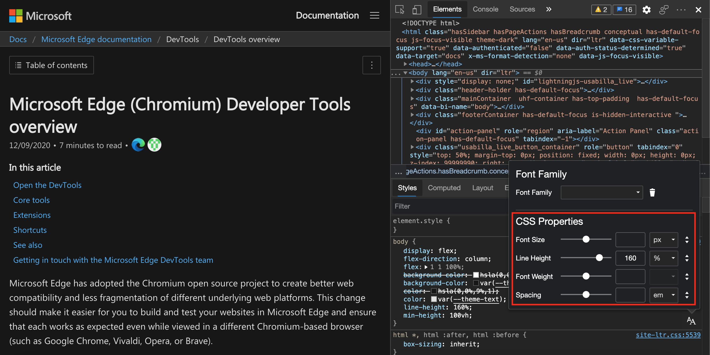
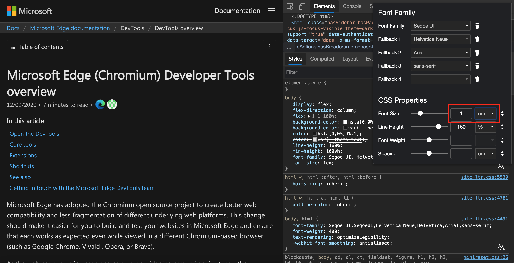

# 在“样式”窗格中编辑 CSS 字体样式和设置

为了在使用版式时更轻松地使用，现在“**样式**”窗格中提供了可视**字体编辑**器。  使用 **字体编辑器**，可以更改字体设置，并且更改会立即在浏览器中呈现 - 所有更改都不深入了解 CSS。  “ **元素** ”工具> **“样式** ”选项卡> **“字体编辑器** ”图标打开 **字体编辑**器，其中包含两个部分：

*  **字体系列**选择器。
*  **CSS 属性**编辑器。

网页版式是用户体验的重要组成部分。  你希望确保字体遵循公司品牌准则，并且内容按预期显示在各种设备上。  必须使用大小和线条高度让文本更易于阅读。  用户可以调整字体大小以满足单个需求。

对于特定字体在用户设备上不可用的情况，应提供回退字体选项。

近年来，CSS 为版式提供了更好的支持。  有数十种不同的 CSS 单位可用于定义文本大小。  可使用多个 CSS 属性来控制字号、间距、行高和其他版式功能。

目前，“[样式”窗格功能中的“启用新字体编辑器”工具](../experimental-features/index.md#enable-the-font-editor-tool-within-the-styles-pane)是实验性的，你需要[将其用于Microsoft Edge开发人员工具](../experimental-features/index.md#turning-an-experiment-on-or-off)。

**样式**窗格中的任何 CSS（字体定义或内联样式）都具有**字体编辑器**图标。  若要打开视觉 **对象字体编辑器**，请单击 **“字体编辑器** ”图标。

**字体编辑器**在“**样式**”窗格顶部打开：

可视“**字体编辑器**”中的所有字段都是根据“**样式**”窗格中的 CSS 值填充的。  例如， `line-height` 定义设置为 `160%` “ **样式** ”窗格中，因此显示行高文本字段 `160`，并显示 `%`单元下拉列表。  此外，滑块会自动设置为与文本字段的值匹配。

<!-- ====================================================================== -->
## “字体系列”选择器

“字体系列”选择器位于可视“**字体编辑器**”的上部。  若要选择 CSS 规则的字体，请在 CSS 编辑器中使用 **字体系列** 选择器。  可以为每个 CSS 规则选择主字体和回退字体。

“样**式**”窗格顶部打开的**字体编辑**器，其中突出显示了 **“字体系列**”选择器：

使用 **字体系列** 下拉列表选择字体。  字体分为四个组：

*  **计算字体**，这些字体是样式窗格中样式表中可用 **的** 字体。
*  **系统字体**，这些字体是当前操作系统上可用的字体。
*  **泛型字体系列**，例如 `serif` 或 `sans-serif`。
*  **全局值**，例如 `inherit`， `initial`和 `unset`。

“样**式**”窗格顶部打开的**字体编辑**器，其中突出显示了 **“字体系列**”选择器：

选择字体后，将显示另一个下拉菜单，以便选择回退字体。  最多可以选择 8 个回退字体。  若要删除字体，请单击 **“删除字体系列** ”图标。

<!---->

> [!NOTE]
> 如果为字体系列选择全局值，则不会获得另一个下拉菜单，因为 CSS 中没有回退。

<!-- ====================================================================== -->
## “CSS 属性”编辑器

可以在视觉对象字体编辑器的下半部分更改 CSS **字**体属性。  可以使用任何 UI 控件更改字号、行高、字体粗细和字母间距。  所做的更改将立即在浏览器中应用。

**字体编辑器**在“**样式**”窗格顶部打开，其中突出显示了 CSS 属性：

还可以使用视觉字 **体编辑**器转换 CSS 单元。  例如，可以在 CSS 规则上使用该工具，其中字 **体大小** 滑块最初设置为 `16 pixels`。  现在，使用单元下拉列表并选择值 `em`。  显示的 `1 em` 等于 `16 pixels`。

将字体大小更改为 `16 pixels`：

打开要转换为 `em`以下内容的单元下拉列表：

单元下拉列表提供所有可用的数值 CSS 单元。  字体大小、线条高度、字体粗细和间距都使用不同的单位。  当文本框具有焦点时，可以按下 `arrow up` 和 `arrow down` 键来微调设置。  若要将滑块与键盘配合使用，请按下 `arrow left` 和 `arrow down` 键。

“CSS 属性”编辑器还包括预设关键字。  若要使用预设关键字，请在右侧单击图 `Toggle Input Type` 标。  UI 更改，并显示预设关键字的下拉列表。  若要使用滑块和其他 UI 控件返回到 UI，请再次单击该 `Toggle Input Type` 图标。

打开预设关键字接口：

