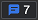

<!-- Copyright Sam Dutton

   Licensed under the Apache License, Version 2.0 (the "License");
   you may not use this file except in compliance with the License.
   You may obtain a copy of the License at

       https://www.apache.org/licenses/LICENSE-2.0

   Unless required by applicable law or agreed to in writing, software
   distributed under the License is distributed on an "AS IS" BASIS,
   WITHOUT WARRANTIES OR CONDITIONS OF ANY KIND, either express or implied.
   See the License for the specific language governing permissions and
   limitations under the License.  -->
# 使用问题工具查找和修复问题

“ **问题** ”工具会自动分析当前网页，按类型分组报告问题，并提供文档来帮助解释和解决问题。

**“问题**”工具提供以下类别的反馈：
*  辅助功能。
*  跨浏览器的兼容性。
*  性能。
*  渐进式Web 应用。
*  安全性。
*  其他。

**问题**工具中的反馈由多个源提供，包括Chromium平台、Deque 轴、MDN 浏览器兼容性数据和 Webhint。  有关填充 **问题** 工具的这些反馈来源的信息，请参阅：
*  [axe Tools 概述](https://www.deque.com/axe)
*  [browser-compat-data 存储库](https://github.com/mdn/browser-compat-data)
*  [webhint](https://webhint.io)

<!-- ====================================================================== -->
## 打开“问题”工具

1. 转到包含要修复的问题的网页。  例如，在新选项卡或窗口中打开 [辅助功能测试演示页](https://microsoftedge.github.io/Demos/devtools-a11y-testing/) 。

1. 打开 DevTools。  几秒钟后，“ **问题”计数器** () 显示在 DevTools 的右上角。

1. 刷新页面，因为某些问题是根据网络请求报告的。  请注意问题 **计数器**中的更新计数。

1. 选择 **“问题”计数器**。  **问题工具**随即打开，问题分组为不同的类别。

   

### 打开“问题”工具的其他方法

有几种其他方法可以打开 **“问题”** 工具：
*  单击主面板或**抽屉**中的“**更多工具** (**+**) 菜单，然后选择 **”问题**”。
*  选择 **“自定义并控制 DevTools** > **更多工具** > **问题**”。
*  在 **Elements** 工具的 DOM 树中，按 `Shift` 下并单击波浪下划线元素名称。  或者，打开波浪下划线元素上的上下文菜单，然后选择 **“查看”问题**。

### 问题按严重性自动排序

在每个问题类别中，首先列出错误，然后列出警告，然后列出提示。

<!-- ====================================================================== -->
## 展开“问题”工具中的条目

“ **问题** ”工具提供其他文档和建议的修补程序，以应用于每个问题。  若要展开问题以获取此附加信息，请选择问题，如下所示。

1. 在新窗口或选项卡中打开 [辅助功能测试演示页](https://microsoftedge.github.io/Demos/devtools-a11y-testing/) ，然后打开 DevTools。

1. 通过选择 **“问题** ” **计数器** () 。

1. 选择问题以展开问题。

   

每个显示的问题都有以下组件：

*  描述问题的标题。

*  提供更多上下文和建议解决方案的说明。

*  链接到 DevTools 中的资源（如**元素**、**源**或**网络**工具）的 **“受影响的资源**”部分。

*  指向更多文档的链接。

<!-- ====================================================================== -->
## 查看关联工具上下文中的问题

**“问题**”工具中的问题可能包括打开不同工具的一个或多个链接，例如 **“元素**”、“**源**”或 **“网络**”工具。 可以打开其中一个工具来执行其他故障排除步骤。

若要从 **“问题** ”工具打开链接的工具，请执行以下操作：

1. 如上一部分所述，打开演示页，然后在“ **问题** ”工具中展开问题。

1. 在 **受影响的资源** > **中打开**，选择工具名称。  受影响的资源显示在所选工具中：

   

    展开的问题可能有 **一个网络** 链接，用于在 **网络** 工具中显示受影响的资源：

   

<!-- ====================================================================== -->
## 从 DOM 树打开问题

如果元素存在关联问题， **则 Elements** 工具中的 DOM 树在元素名称下显示波浪下划线。  右键单击该元素，然后选择 **“查看问题**”。  或者，按住并按住 `Shift` ，然后单击带有波浪下划线的元素。

若要在 DOM 树中显示具有波浪下划线的元素的问题：

1. 在新窗口或选项卡中打开 [辅助功能测试演示网页](https://microsoftedge.github.io/Demos/devtools-a11y-testing/) 。

1. 右键单击网页中的任意位置，然后选择 **“检查**”。  或者按 `F12`。  DevTools 将在网页旁边打开。

1. 在 DevTools 中，选择 **“元素”** 选项卡。

1. 在 DOM 树中展开`<body>``<main>` > `<article id="cats">``<section>` >  > 。  请注意，该 `` 元素具有波浪下划线。

   

1. 将鼠标悬停在元素上 `` 。  工具提示显示有关问题的信息。

1. 使用波浪下划线打开元素上的上下文菜单，然后选择 **“查看”问题**。  **“问题**”工具随即打开并显示与该元素关联的问题。

   

<!-- ====================================================================== -->
## 筛选问题

若要减少 **问题工具中** 显示的问题数，可以按严重性、浏览器和源筛选列表。

### 按严重性筛选

默认情况下，仅显示错误和警告。 显示其他严重性级别的问题：

* 单击 **默认级别**。
* 选择任意数量的严重性级别：**使用技巧**、**信息**、**警告**、**错误**。
* 选择 **“默认** 值”以还原为仅警告和错误。

### 按浏览器筛选

属于 **兼容性** 类别的问题也可以通过浏览器进行筛选。 默认情况下，测试以下浏览器：

* Edge
* Chrome
* Firefox
* Safari
* Safari iOS
* Chrome for Android
* firefox for Android

若要更改测试兼容性问题的浏览器列表，请执行以下操作：

* 单击 **“顶部浏览器**”。
* 选择任何浏览器类别集： **顶级浏览器**、 **桌面浏览器**、 **移动浏览器**。
* 或者从列表中选择任意数量的单个浏览器。
* 单击 **“重新生成问题** ”，根据所选浏览器更新兼容性问题。

### 按源筛选

默认情况下，“ **问题** ”工具仅列出与当前网页代码相关的问题。 若要包含由网页加载的第三方库或框架导致的问题，请选中 **“包括第三方问题** ”复选框。

<!-- ====================================================================== -->
## 另请参阅

*  [自动测试网页中的辅助功能问题](../accessibility/test-issues-tool.md)

<!-- ====================================================================== -->
> [!NOTE]
> 此页面的某些部分是根据 [Google 创建和共享的](https://developers.google.com/terms/site-policies)作品所做的修改，并根据[ Creative Commons Attribution 4.0 International License ](https://creativecommons.org/licenses/by/4.0)中描述的条款使用。
> 原始页面 [在此](https://developer.chrome.com/docs/devtools/issues/) 处找到，由 [Sam Dutton](https://developers.google.com/web/resources/contributors#sam-dutton) (开发大使) 创作。

本作品根据[ Creative Commons Attribution 4.0 International License ](https://creativecommons.org/licenses/by/4.0)获得许可。
