<!-- Copyright Kayce Basques

   Licensed under the Apache License, Version 2.0 (the "License");
   you may not use this file except in compliance with the License.
   You may obtain a copy of the License at

       https://www.apache.org/licenses/LICENSE-2.0

   Unless required by applicable law or agreed to in writing, software
   distributed under the License is distributed on an "AS IS" BASIS,
   WITHOUT WARRANTIES OR CONDITIONS OF ANY KIND, either express or implied.
   See the License for the specific language governing permissions and
   limitations under the License.  -->
# 调试后台服务

Microsoft Edge DevTools 的 **“后台服务**”部分是 Web API 的工具集合，即使用户未使用您的网站，网站也可发送和接收数据，并使浏览器能够向服务器报告生产问题。

Microsoft Edge DevTools 将以下每个 API 都作为后台服务：

*  [后台提取](#background-fetch)
*  [后台同步](#background-sync)
*  [通知](#notifications)
*  [付款处理程序](#payment-handler)
*  [定期后台同步](#periodic-background-sync)
*  [推送消息](#push-messages)
*  [报告 API](#reporting-api)
<!-- TODO: add a section about Payment Handler -->

“ **后台服务** ”部分记录 API 事件，即使未使用 DevTools，也可帮助确保按预期发送和接收事件。

<!-- ====================================================================== -->
## 后台提取

使用 **后台提取 API** ，渐进式 Web 应用 **的服务工作者** 可以可靠地下载大型资源（如电影或播客）作为后台服务。  记录后台提取事件 3 天，即使 DevTools 未打开：

1. 通过右键单击网页并选择 **“检查**”打开 DevTools。  或者按 `Ctrl`++`Shift``I` (Windows、Linux) 或`I` `Command`+`Option`+ (macOS) 。

1. 在 DevTools 的主工具栏上，选择“ **应用程序** ”选项卡。 如果该选项卡不可见，请单击“ **更多”选项卡** () 按钮，或者“ **更多工具** () 按钮。

1. 在左侧的 **“后台服务”** 部分中，选择 **“后台提取**”。  “ **背景提取** ”页随即打开。

   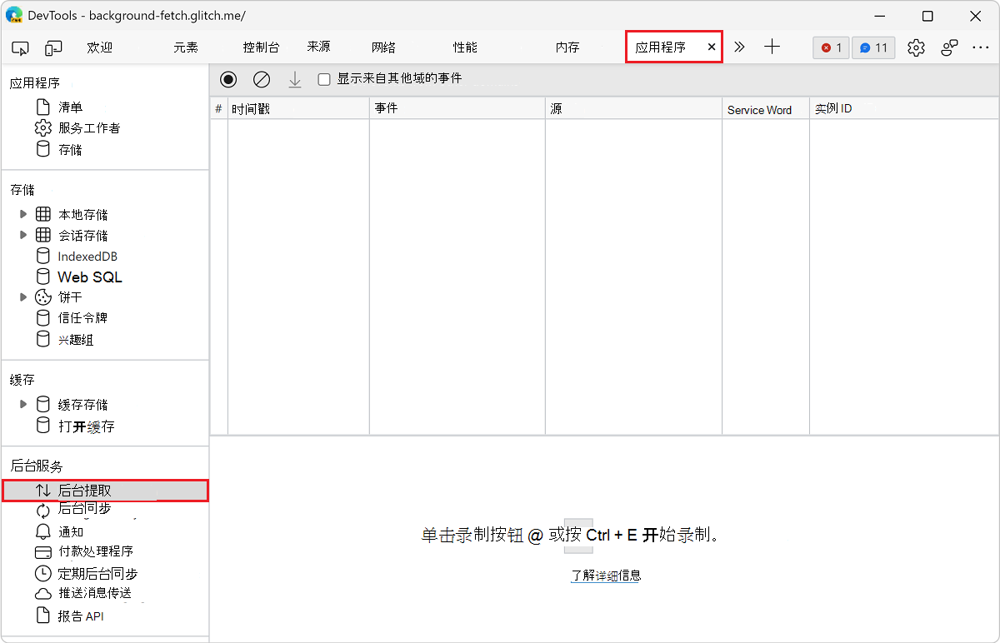

1. 单击 **“记录** () 。
   触发某些后台提取活动后，DevTools 记录事件到表中。

   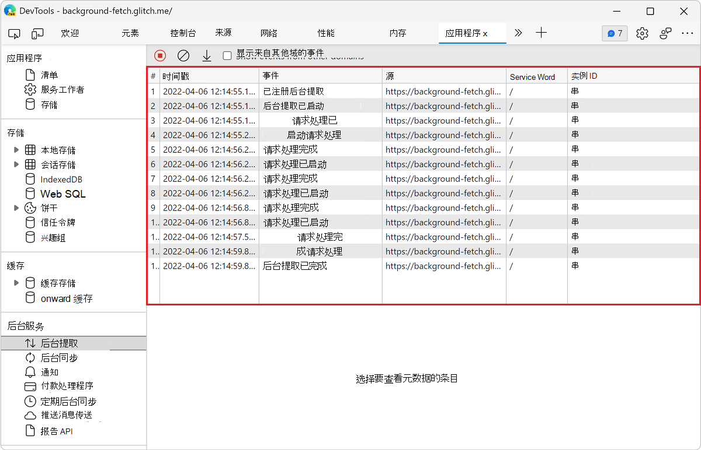

1. 单击事件可在表下方的空格中查看其详细信息。

   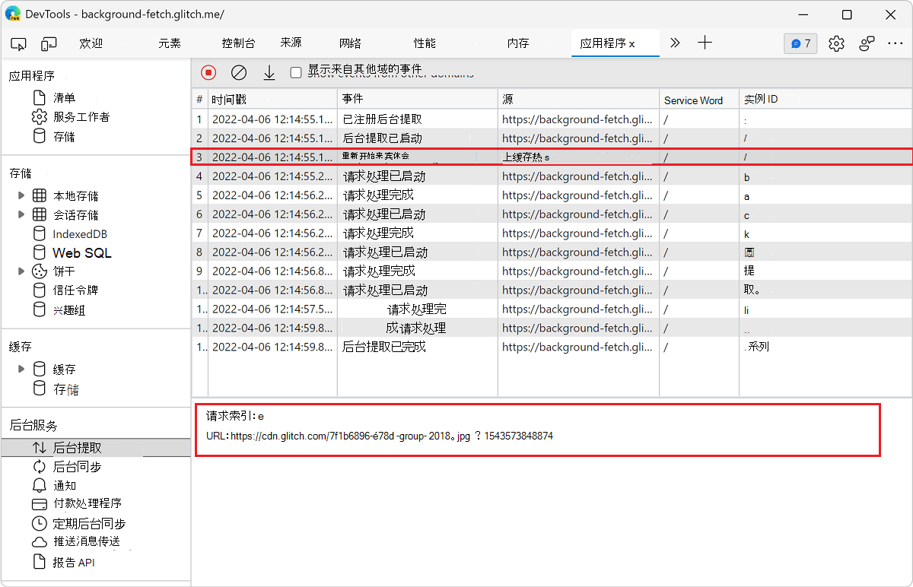

<!-- ====================================================================== -->
## 后台同步

后 **台同步 API** 使渐进式 Web 应用的脱机 **服务辅助角色** 能够在重新建立可靠的 Internet 连接后将数据发送到服务器。  记录后台同步事件 3 天，即使 DevTools 未打开：

1. 通过右键单击网页并选择 **“检查**”打开 DevTools。  或者按 `Ctrl`++`Shift``I` (Windows、Linux) 或`I` `Command`+`Option`+ (macOS) 。

1. 在 DevTools 的主工具栏上，选择“ **应用程序** ”选项卡。 如果该选项卡不可见，请单击“ **更多”选项卡** () 按钮，或者“ **更多工具** () 按钮。

1. 在左侧的 **“后台服务”** 部分中，选择 **“后台同步**”。 “ **背景同步** ”页随即打开。

   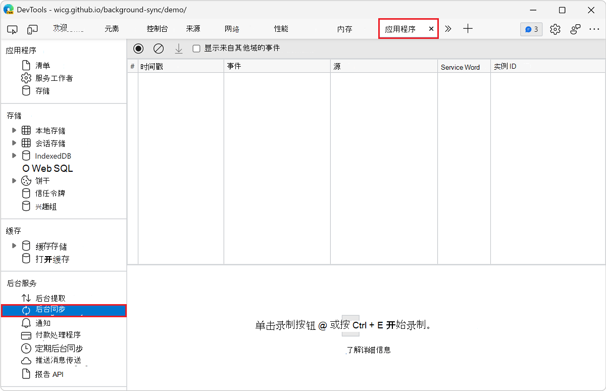

1. 单击 **“记录** () 。  触发某些后台同步活动后，DevTools 记录事件到表中。

   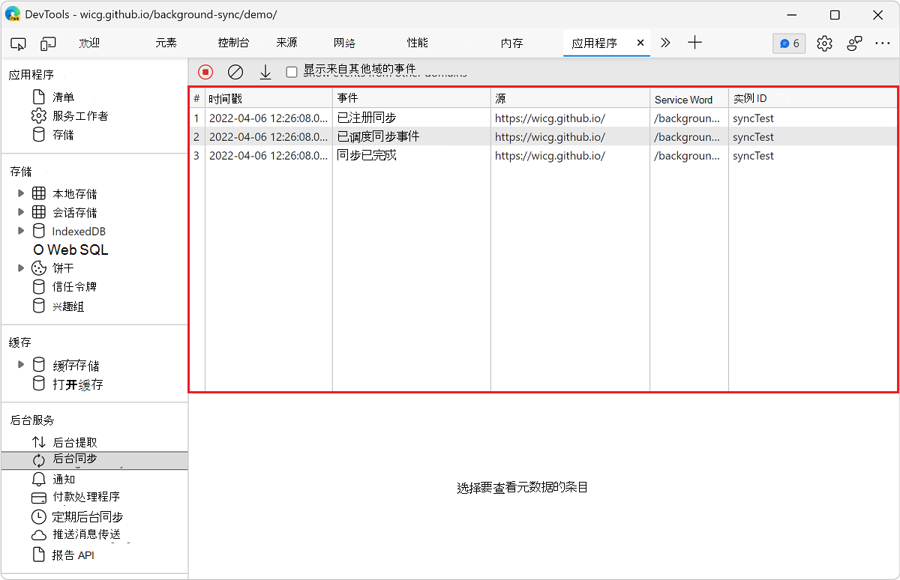

1. 选择一个事件以在表下方的空间中查看其详细信息。

   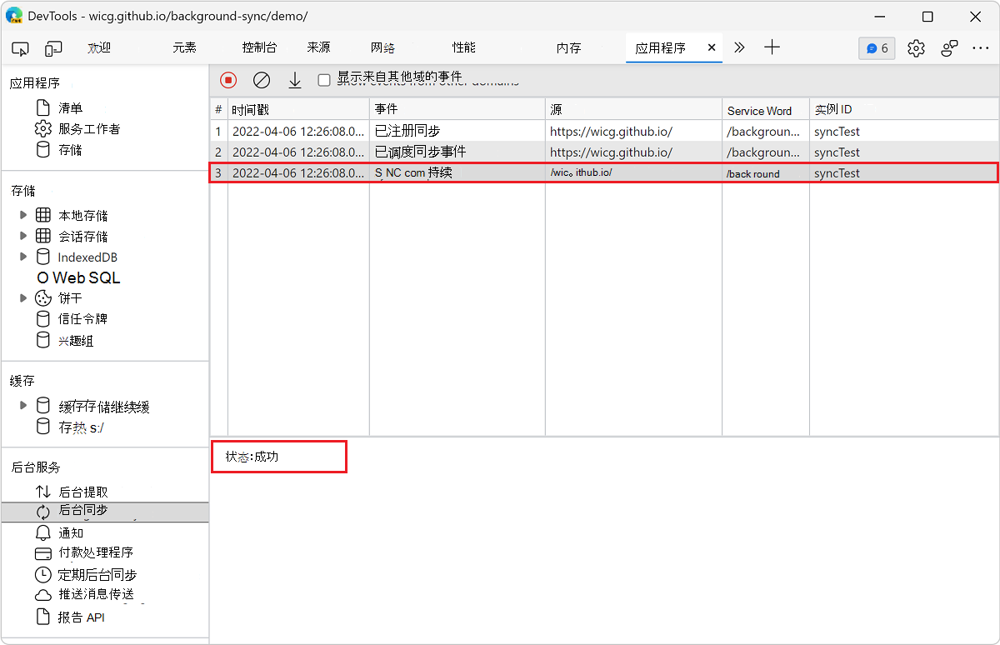

<!-- ====================================================================== -->
## 通知

**服务工作进程**从服务器接收一条[推送消息](https://developer.mozilla.org/docs/Web/API/Push_API)后，服务工作进程使用[通知 API](https://developer.mozilla.org/docs/Web/API/Notifications_API)向用户显示数据。  若要记录通知 3 天，即使 DevTools 未打开，

1. 通过右键单击网页并选择 **“检查**”打开 DevTools。  或者按 `Ctrl`++`Shift``I` (Windows、Linux) 或`I` `Command`+`Option`+ (macOS) 。

1. 在 DevTools 的主工具栏上，选择“ **应用程序** ”选项卡。 如果该选项卡不可见，请单击“ **更多”选项卡** () 按钮，或者“ **更多工具** () 按钮。

1. 在左侧的 **“后台服务”** 部分中，选择 **“通知**”。  “ **通知** ”页随即打开。

   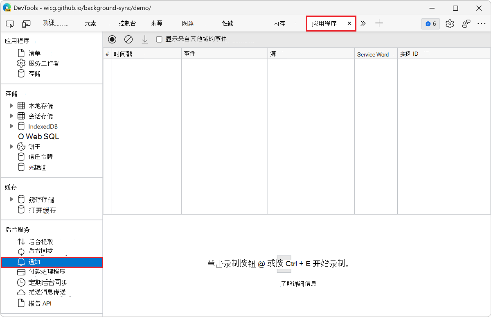

1. 单击 **“记录** () 。  触发某些通知活动后，DevTools 记录事件到表中。

   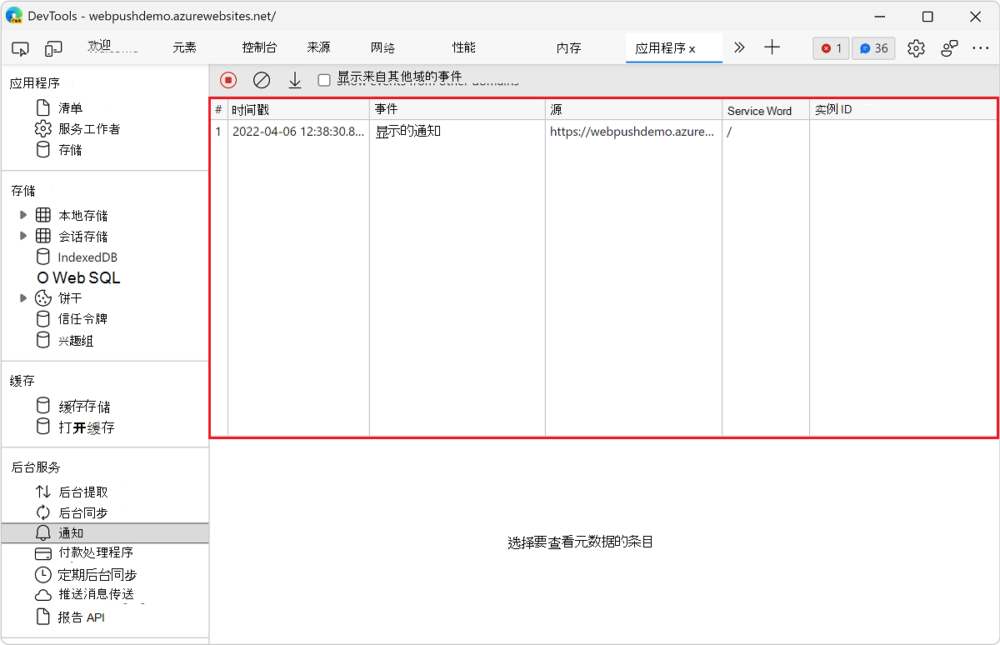

1. 单击事件可在表下方的空格中查看其详细信息。

   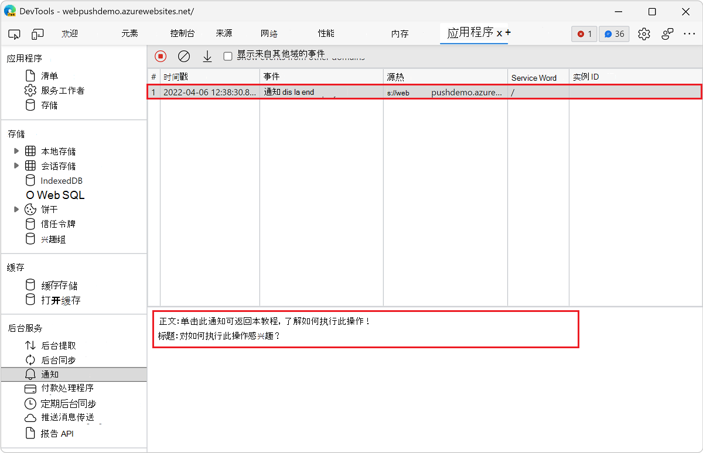

<!-- ====================================================================== -->
## 付款处理程序

[支付处理程序 API](https://web.dev/web-based-payment-apps-overview/) 允许 Web 应用程序代表用户处理付款请求。 若要记录付款请求和响应事件 3 天，即使 DevTools 未打开，

1. 通过右键单击网页并选择 **“检查**”打开 DevTools。  或者按 `Ctrl`++`Shift``I` (Windows、Linux) 或`I` `Command`+`Option`+ (macOS) 。

1. 在 DevTools 的主工具栏上，选择“ **应用程序** ”选项卡。 如果该选项卡不可见，请单击“ **更多”选项卡** () 按钮，或者“ **更多工具** () 按钮。

1. 在左侧的 **“后台服务”** 部分中，选择 **“付款处理程序**”。  “ **付款处理程序** ”页随即打开。

   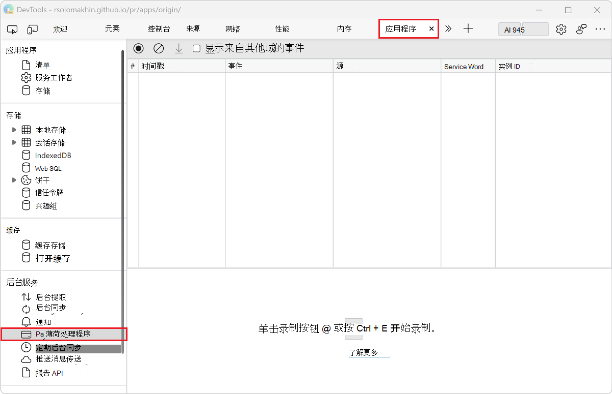

1. 单击 **“记录** () 。  触发某些付款请求后，DevTools 会将事件记录到表。

   

1. 单击事件可在表下方的空格中查看其详细信息。

   

<!-- ====================================================================== -->
## 定期后台同步

**定期后台同步 API** 使渐进式 Web 应用**的服务辅助角色**能够定期从服务器中检索数据，即使网站未打开。 若要详细了解 **定期后台同步 API**，请参阅 [使用定期后台同步 API 定期获取新内容](/microsoft-edge/progressive-web-apps-chromium/how-to/background-syncs#use-the-periodic-background-sync-api-to-regularly-get-fresh-content)。

记录定期后台同步事件 3 天，即使 DevTools 未打开：

1. 通过右键单击网页并选择 **“检查**”打开 DevTools。  或者按 `Ctrl`++`Shift``I` (Windows、Linux) 或`I` `Command`+`Option`+ (macOS) 。

1. 在 DevTools 的主工具栏上，选择“ **应用程序** ”选项卡。 如果该选项卡不可见，请单击“ **更多”选项卡** () 按钮，或者“ **更多工具** () 按钮。

1. 在左侧的 **“后台服务”** 部分中，选择 **定期后台同步**。 “ **定期背景同步** ”页随即打开。

   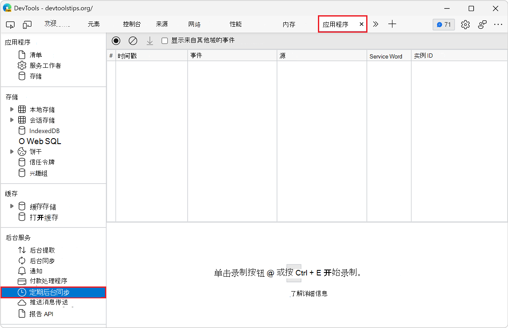

1. 单击 **“记录** () 。  触发一些定期后台同步活动后，DevTools 会将事件记录到表。

   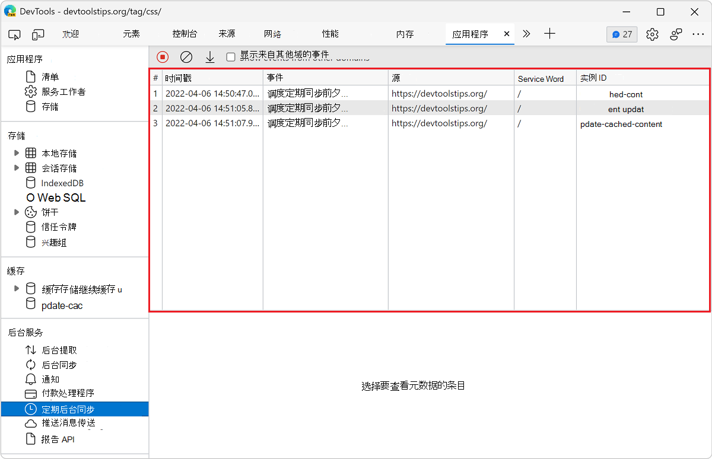

<!-- ====================================================================== -->
## 推送消息

若要向用户显示推送通知，渐进式 Web 应用 **的服务工作者** 必须首先使用 [推送消息 API](https://developer.mozilla.org/docs/Web/API/Push_API) 从服务器接收数据。  当服务工作进程准备好显示通知时，它将使用[通知 API](https://developer.mozilla.org/docs/Web/API/Notifications_API)。  若要记录推送消息 3 天，即使 DevTools 未打开，

1. 通过右键单击网页并选择 **“检查**”打开 DevTools。  或者按 `Ctrl`++`Shift``I` (Windows、Linux) 或`I` `Command`+`Option`+ (macOS) 。

1. 在 DevTools 的主工具栏上，选择“ **应用程序** ”选项卡。 如果该选项卡不可见，请单击“ **更多”选项卡** () 按钮，或者“ **更多工具** () 按钮。

1. 在左侧的 **“后台服务”** 部分中，选择 **“推送消息传送**”。  “ **推送消息传送”** 页随即打开。

   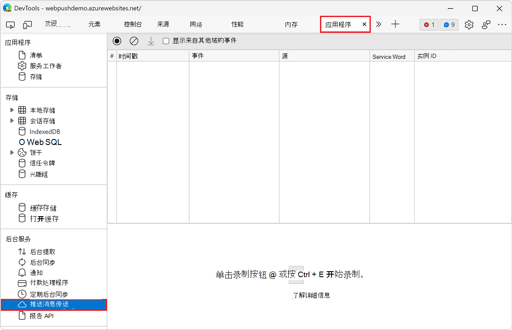

1. 单击 **“记录** () 。  触发某些推送消息活动后，DevTools 记录事件到表中。

   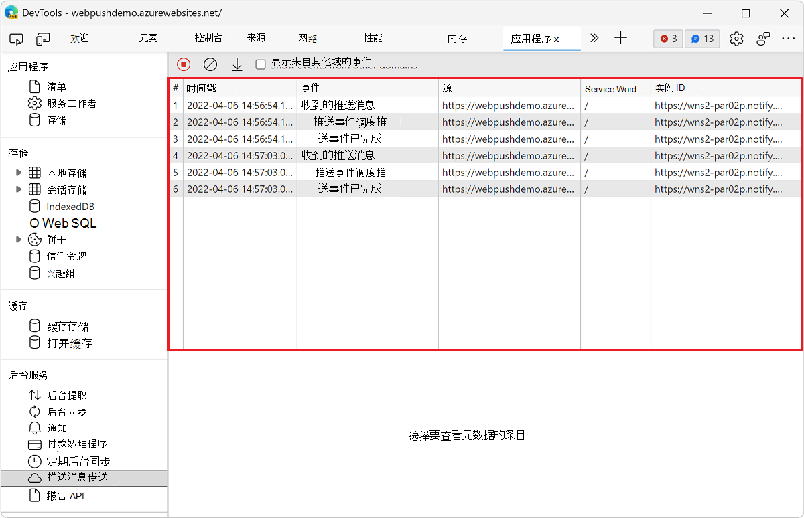

1. 单击事件可查看表下方空间中的详细信息。

   

<!-- ====================================================================== -->
## 报告 API

**报告 API** 使 Web 开发人员能够从其生产网站接收安全违规报告、已弃用的 API 调用和其他报告。

若要查看浏览器使用 **报告 API** 发送的报表，请执行以下操作：

1. 通过右键单击网页并选择 **“检查**”打开 DevTools。  或者按 `Ctrl`++`Shift``I` (Windows、Linux) 或`I` `Command`+`Option`+ (macOS) 。

1. 在 DevTools 的主工具栏上，选择“ **应用程序** ”选项卡。 如果该选项卡不可见，请单击“ **更多”选项卡** () 按钮，或者“ **更多工具** () 按钮。

1. 在左侧的 **“后台服务”** 部分中，选择 **“报告 API**”。  “ **报告 API** ”页随即打开。

   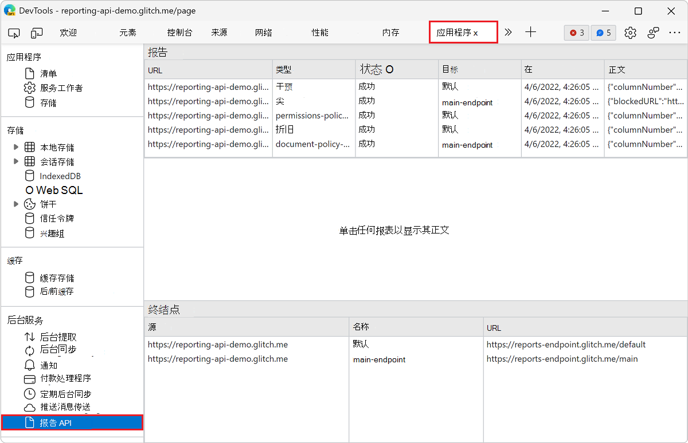

1. **“报告 API**”页显示顶部表中发送的报表。

   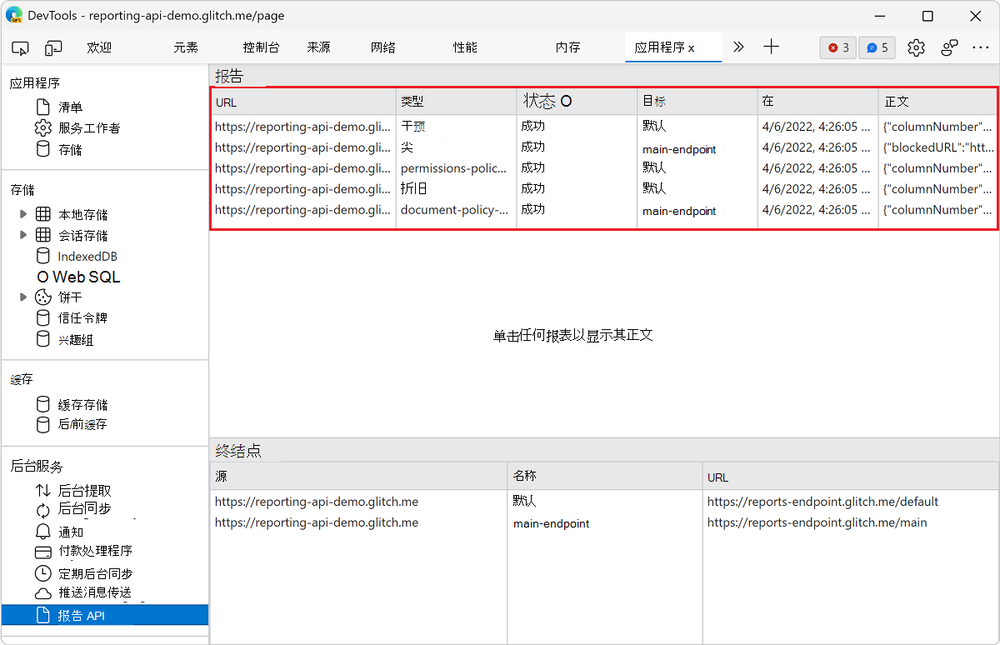

1. 单击报表可查看表下方空间中的详细信息。

   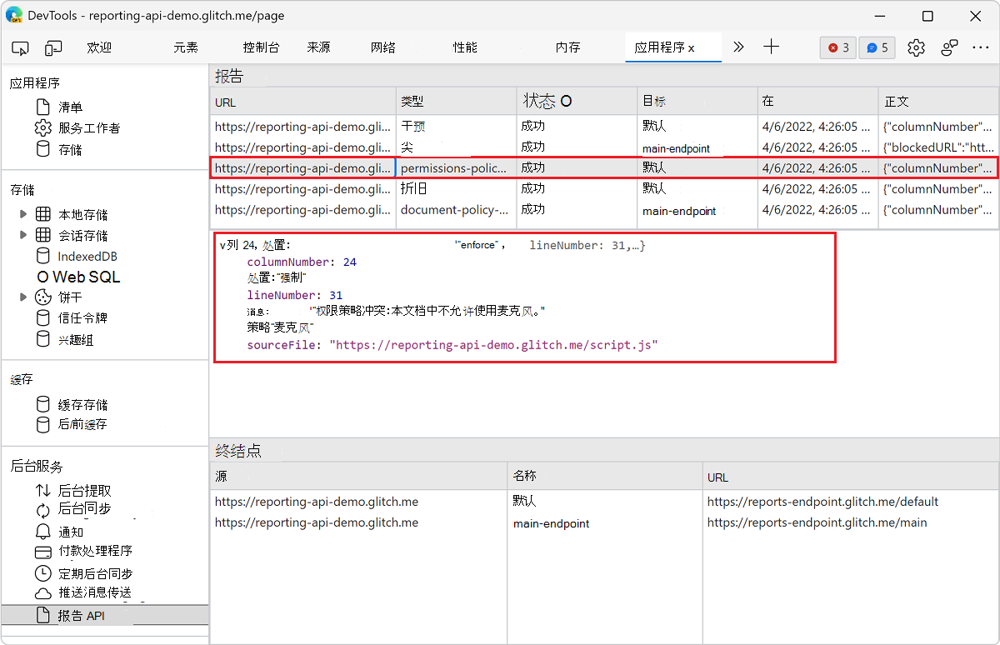

1. **“报告 API**”页还会显示通过`Reporting-Endpoints`底部表中的 HTTP 标头配置的报告终结点的列表。

   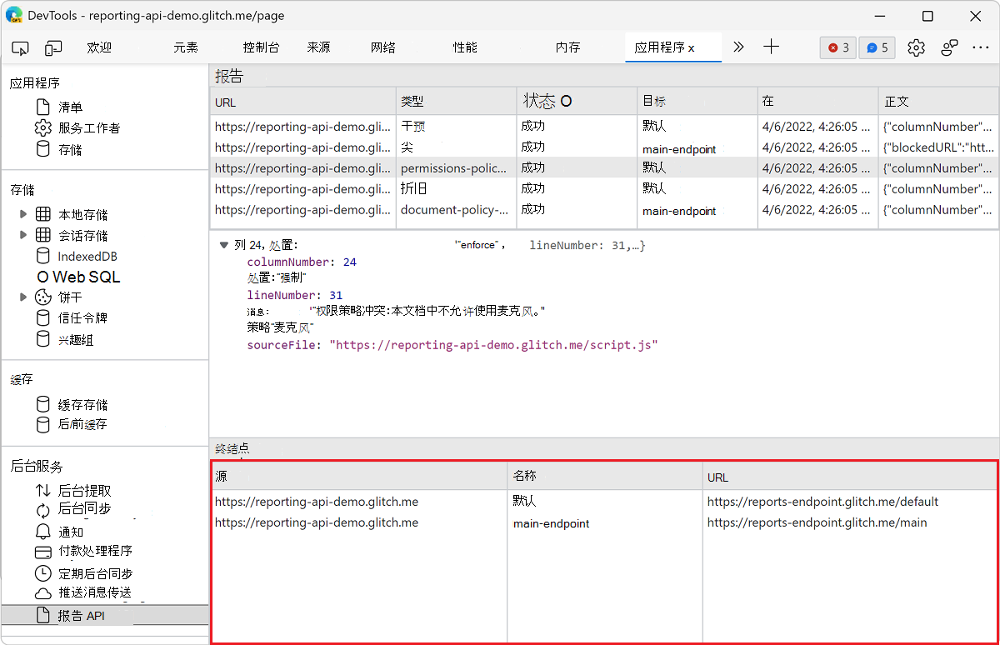

<!-- ====================================================================== -->
> [!NOTE]
> 此页面的某些部分是根据 [Google 创建和共享的](https://developers.google.com/terms/site-policies)作品所做的修改，并根据[ Creative Commons Attribution 4.0 International License ](https://creativecommons.org/licenses/by/4.0)中描述的条款使用。
> 原始页面位于[此处](https://developers.google.com/web/tools/chrome-devtools/javascript/background-services)，由 [Kayce Basques](https://developers.google.com/web/resources/contributors#kayce-basques)\（Chrome DevTools 和 Lighthouse 的技术作家）撰写。

本作品根据[ Creative Commons Attribution 4.0 International License ](https://creativecommons.org/licenses/by/4.0)获得许可。
