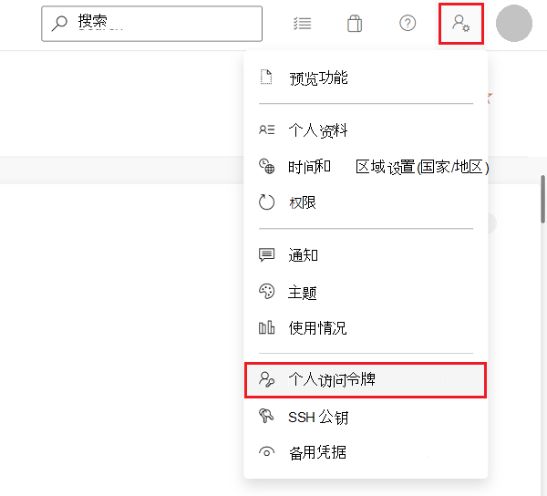
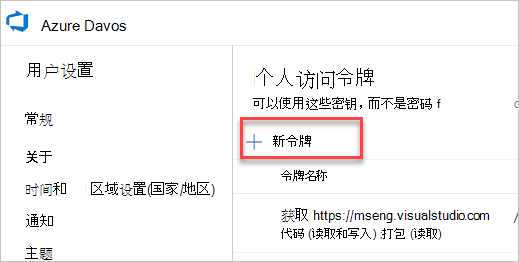
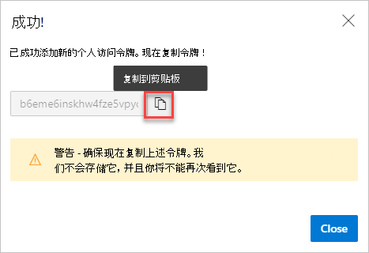

# 使用Azure Artifacts符号服务器源映射安全地调试原始代码

若要安全地查看和使用 DevTools 中的原始开发源代码，而不是 Web 服务器返回的编译、细化和捆绑生产代码，可以使用 Azure Artifacts 符号服务器上发布的源映射。

源映射将已编译的生产代码映射到原始开发源文件。 然后，在 DevTools 中，可以看到并使用熟悉的开发源文件，而不是编译的代码。 若要详细了解源映射和使用 DevTools 中的源映射，请参阅 [将已处理代码映射到原始源代码，以便进行调试](source-maps.md)。

从 Azure Artifacts 符号服务器下载源映射可通过安全地检索原始开发源代码来调试生产网站。

<!-- ====================================================================== -->
## 先决条件：将源映射发布到 Azure Artifacts 符号服务器

若要在 DevTools 中使用来自 Azure Artifacts 符号服务器的源映射，需要先将其发布到服务器。

若要了解如何发布源映射，请 [参阅通过将源映射发布到 Azure Artifacts 符号服务器来安全调试原始代码](publish-source-maps-to-azure.md)。

<!-- ====================================================================== -->
## 步骤 1：为 Azure DevOps 生成个人访问令牌

为了从 Azure Artifacts 符号服务器获取源映射，DevTools 使用提取协议与 Azure DevOps 通信，Azure DevOps 需要有效的个人访问令牌 (PAT) 。

即使已生成一个 PAT，也需要生成一个 PAT， [以便通过将源映射发布到 Azure Artifacts 符号服务器，在安全调试原始代码中将源映射发布到符号服务器](publish-source-maps-to-azure.md)。

若要在 Azure DevOps 中生成 PAT，

1. 通过转到 `https://dev.azure.com/{yourorganization}`Azure DevOps 组织登录。

1. 在 Azure DevOps 中，转到 **用户设置** > **个人访问令牌**：
    
   

   将显示 **“个人访问令牌”** 页：

   

1. 单击 **“新建令牌**”。  “ **创建新的个人访问令牌** ”对话框随即打开：

   

1. 在 **“名称”** 文本框中，输入 PAT 的名称，例如“devtool 源映射”。

1. 在 **“过期”** 部分中，输入 PAT 的到期日期。

1. 在“ **作用域”** 部分中，单击 **“显示所有范围** ”以展开该部分。

1. 向下滚动到 **符号**，然后选择 **“读取** ”复选框。

1. 单击 **“创建”** 按钮。  **成功！** 将显示对话框：

   

1. 单击 **“复制到剪贴板** ”按钮以复制 PAT。  请确保复制令牌并将其存储在安全位置。 为了安全起见，不会再显示它。

若要了解有关 PAT 的详细信息，请参阅 [“使用个人访问令牌](/azure/devops/organizations/accounts/use-personal-access-tokens-to-authenticate)”。

<!-- ====================================================================== -->
## 步骤 2：配置 DevTools

现在需要使用 PAT)  (个人访问令牌配置 DevTools，以成功检索源映射。

配置 DevTools：

1. 若要打开 DevTools，请在 Microsoft Edge 中右键单击网页，然后选择 **“检查**”。  或者，按“`Ctrl`+`Shift`+`I`”(Windows、Linux)或“`Command`+`Option`+`I`”(macOS)。

1. 在 DevTools 中，单击 **“设置**” (“设置”图标](../media/settings-gear-icon-light-theme.png)) >

1. 在 **“设置”** 页的边栏中，单击 **“符号服务器**”。

1. 在 **Azure DevOps 组织** 文本框中，输入创建 PAT 的 Azure DevOps 组织。

1. 在 **Azure DevOps 个人访问令牌** 文本框中，将个人访问令牌粘贴 (PAT) 。

   

1. 单击右上角的 **x** 关闭 **“设置”** 面板，然后单击 **“重新加载 DevTools** ”按钮。

<!-- ====================================================================== -->
## 步骤 3：检索 DevTools 中的原始代码

在上述设置步骤之后，当使用 DevTools 处理已发布符号的网站的内部版本时，现在可以看到原始源代码，而不是转换后的代码。

*  在 **控制台** 工具中，从日志消息到源文件的链接将转到原始文件，而不是编译的文件。

*  在 **“源** ”工具中单步执行代码时，原始文件将列在左侧的 **“导航器** ”窗格中。

*  在 **“源**”工具中，显示在**调试器**“**调用堆栈**”窗格中的源文件的链接打开原始源文件。

<!-- ====================================================================== -->
## 检查下载的源映射的状态

可以使用 **源地图监视器工具检查源映射** 的状态。

若要详细了解 **源地图监视器** 工具及其如何帮助监视所请求的源映射的源文件，以及这些源映射是否已加载，请参阅 [源地图监视器工具](../source-maps-monitor/source-maps-monitor-tool.md)。

<!-- ====================================================================== -->
## 另请参阅

* [通过将源映射发布到Azure Artifacts符号服务器来安全地调试原始代码](publish-source-maps-to-azure.md)
* [将已处理的代码映射到原始源代码，以便进行调试](source-maps.md)
* [源地图监视器工具](../source-maps-monitor/source-maps-monitor-tool.md)
