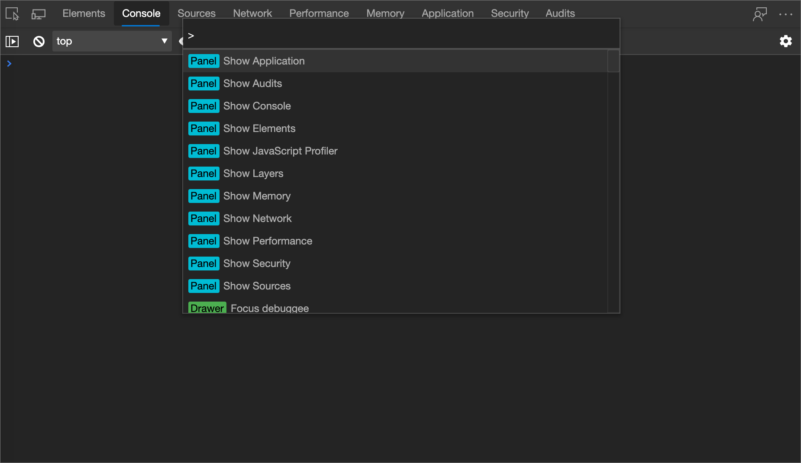
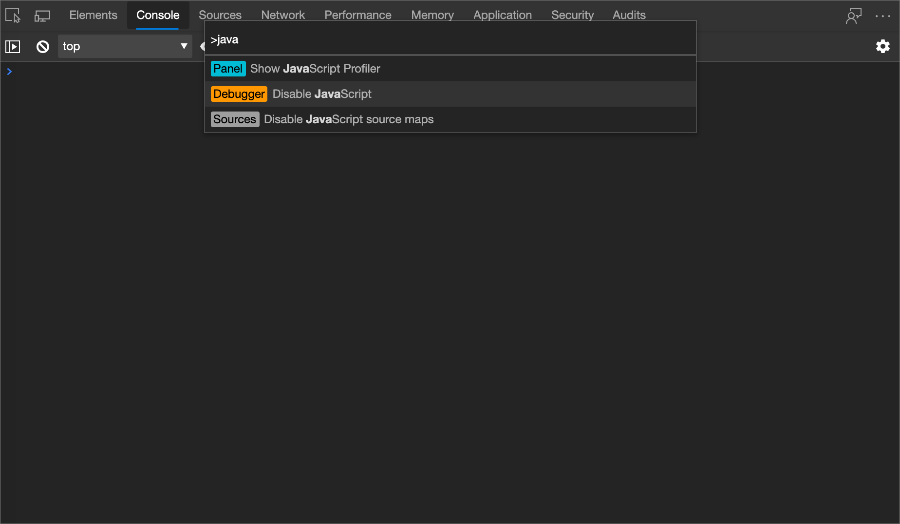
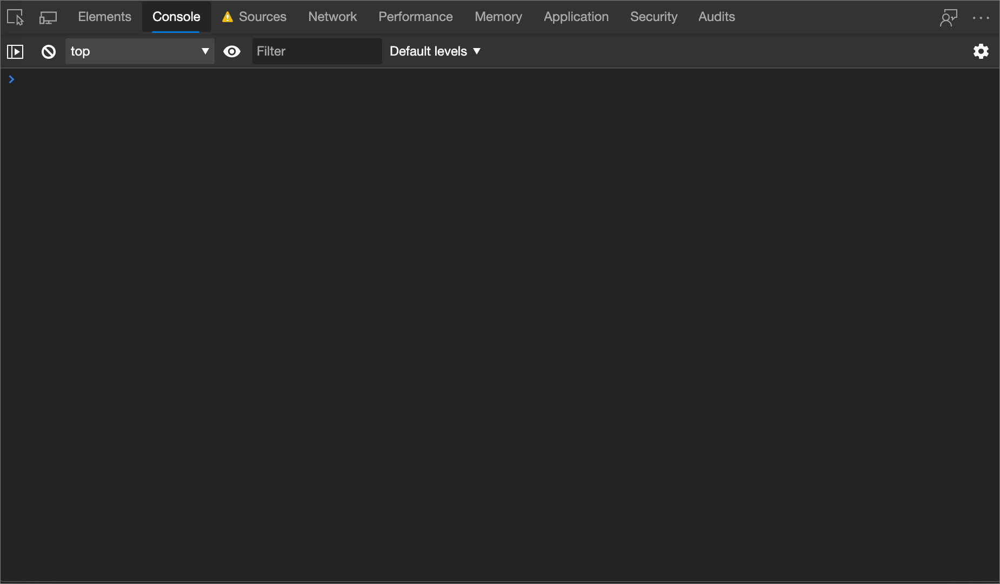

<!-- Copyright Kayce Basques

   Licensed under the Apache License, Version 2.0 (the "License");
   you may not use this file except in compliance with the License.
   You may obtain a copy of the License at

       https://www.apache.org/licenses/LICENSE-2.0

   Unless required by applicable law or agreed to in writing, software
   distributed under the License is distributed on an "AS IS" BASIS,
   WITHOUT WARRANTIES OR CONDITIONS OF ANY KIND, either express or implied.
   See the License for the specific language governing permissions and
   limitations under the License.  -->
# 禁用 JavaScript

若要查看浏览器不支持 JavaScript 时网页的呈现方式和行为，请暂时关闭 JavaScript。

若要关闭 JavaScript，请执行以下操作：

1. 要打开 DevTools，请右击网页，然后选择“**检查**”。  或者，按“`Ctrl`+`Shift`+`I`”(Windows、Linux)或“`Command`+`Option`+`I`”(macOS)。  DevTools 随即打开。

1. 按“`Ctrl`+`Shift`+`P`”(Windows、Linux)或“`Command`+`Shift`+`P`”(macOS)以打开“**命令菜单**”。

   

1. "开始"菜单键入`javascript`，选择 **“禁用 JavaScript**”，然后按下`Enter`以运行命令。  JavaScript 现已禁用。

   

    **源**旁边的黄色警告图标提醒你已禁用 JavaScript。

   

只要已打开 DevTools，JavaScript 在选项卡中保持禁用状态。

若要查看页面在加载时是否依赖于 JavaScript，请刷新页面。

若要重新启用 JavaScript，请执行以下操作：

1. 按“`Ctrl`+`Shift`+`P`”(Windows、Linux)或“`Command`+`Shift`+`P`”(macOS)以打开“**命令菜单**”。

1. 选择 **“启用 JavaScript”** 命令。

<!-- ====================================================================== -->
> [!NOTE]
> 此页面的某些部分是根据 [Google 创建和共享的](https://developers.google.com/terms/site-policies)作品所做的修改，并根据[ Creative Commons Attribution 4.0 International License ](https://creativecommons.org/licenses/by/4.0)中描述的条款使用。
> 原始页面位于[此处](https://developers.google.com/web/tools/chrome-devtools/javascript/disable)，由 [Kayce Basques](https://developers.google.com/web/resources/contributors#kayce-basques)\（Chrome DevTools 和 Lighthouse 的技术作家）撰写。

本作品根据[ Creative Commons Attribution 4.0 International License ](https://creativecommons.org/licenses/by/4.0)获得许可。
