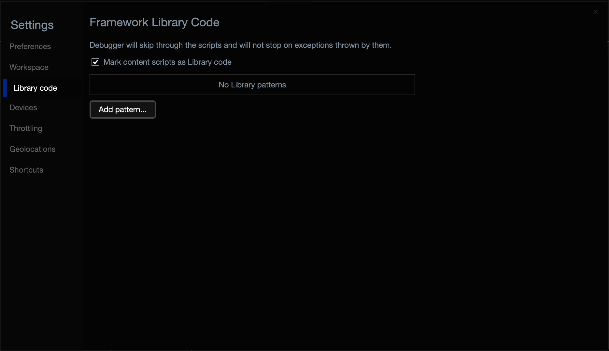

<!-- Copyright Kayce Basques

   Licensed under the Apache License, Version 2.0 (the "License");
   you may not use this file except in compliance with the License.
   You may obtain a copy of the License at

       https://www.apache.org/licenses/LICENSE-2.0

   Unless required by applicable law or agreed to in writing, software
   distributed under the License is distributed on an "AS IS" BASIS,
   WITHOUT WARRANTIES OR CONDITIONS OF ANY KIND, either express or implied.
   See the License for the specific language governing permissions and
   limitations under the License.  -->
# 将内容脚本标记为库代码

使用 **“源** ”工具逐步执行代码时，有时会在无法识别的代码上暂停。  你可能已暂停安装的某个 Microsoft Edge 扩展的代码。  为了避免暂停扩展代码：

1. 在 DevTools 的右上角，单击 **“设置** () 按钮。

1. 在 **“设置****库代码**” > 页中，选择 **“将内容脚本标记为库代码**”复选框。

   

1. 单击 **“关闭** DevTools () 按钮。

<!-- ====================================================================== -->
## 另请参阅

* [步骤 4：逐步完成](../index.md#step-4-step-through-the-code)开始_调试 JavaScript 中的_代码

<!-- ====================================================================== -->
> [!NOTE]
> 此页面的某些部分是根据 [Google 创建和共享的](https://developers.google.com/terms/site-policies)作品所做的修改，并根据[ Creative Commons Attribution 4.0 International License ](https://creativecommons.org/licenses/by/4.0)中描述的条款使用。
> 原始页面 [在此](https://developer.chrome.com/docs/devtools/javascript/ignore-chrome-extension-scripts/) 处找到，由 [Kayce Basques](https://developers.google.com/web/resources/contributors#kayce-basques) (Technical Writer、Chrome DevTools & Lighthouse) 创作。

本作品根据[ Creative Commons Attribution 4.0 International License ](https://creativecommons.org/licenses/by/4.0)获得许可。
