# <a name="override-webpage-resources-with-local-copies-overrides-tab"></a>使用本地副本替代网页资源（“替代”选项卡）

有时，你需要尝试一些可能的网页修复，但你无法访问源文件，或者更改页面需要缓慢而复杂的生成过程。  可以在 DevTools 中调试和修复所有类型的问题。  但是这些变化不会持续下去;刷新本地文件后，所有工作都已完成。  [“源](../sources/index.md)”工具中的“替代”功能可帮助你解决此问题。

现在可以获取当前网页的资源，并将其存储在本地。  刷新网页时，浏览器不会从服务器加载资源。  浏览器会将服务器资源替换为资源的本地副本。


<!-- ====================================================================== -->
## <a name="setting-up-your-local-folder-to-store-overrides"></a>设置本地文件夹以存储替代

1. 导航到 **“源** ”工具。
1. 在左侧)  (**导航器** 窗格中，单击“ **替代”** 选项卡。 如果未显示 **“替代** ”选项卡，请单击 <code>&#x0226B;</code><!--`≫`--> 图标。

    空间不足以显示 **“替代**”选项卡的 **“源**”工具：

   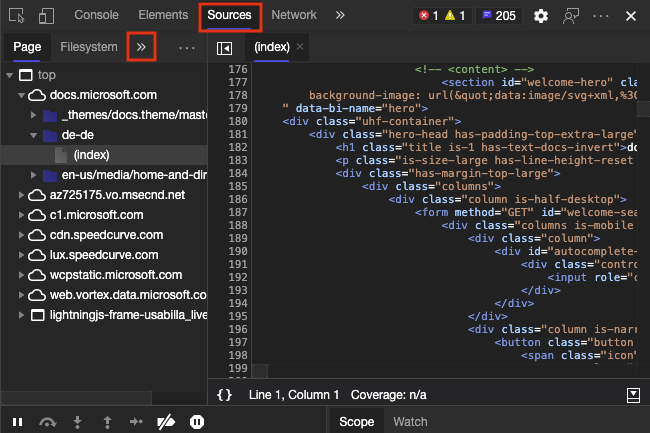

    选择“ **替代** ”选项卡：

   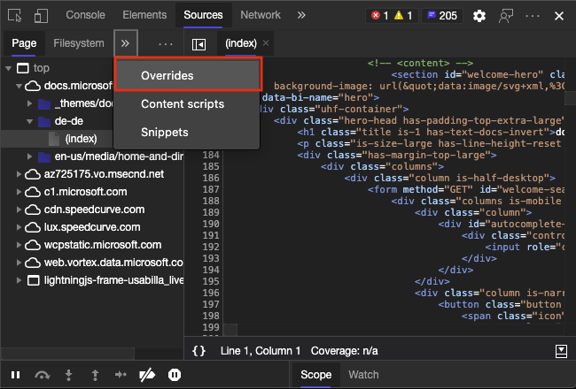

1. 在本地计算机上选择一个文件夹来存储要替换的资源文件。  若要搜索文件夹，请单击 **“+ 选择”文件夹以进行重写**。

   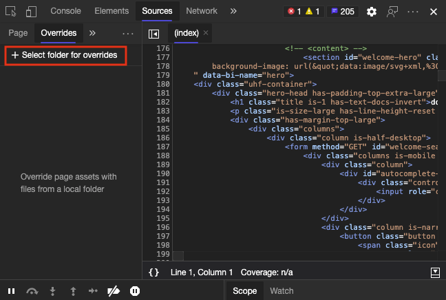

1. DevTools 警告您，该文件夹必须具有完全访问权限，并且不应显示任何敏感信息。  选择 **“允许** ”以授予访问权限。

   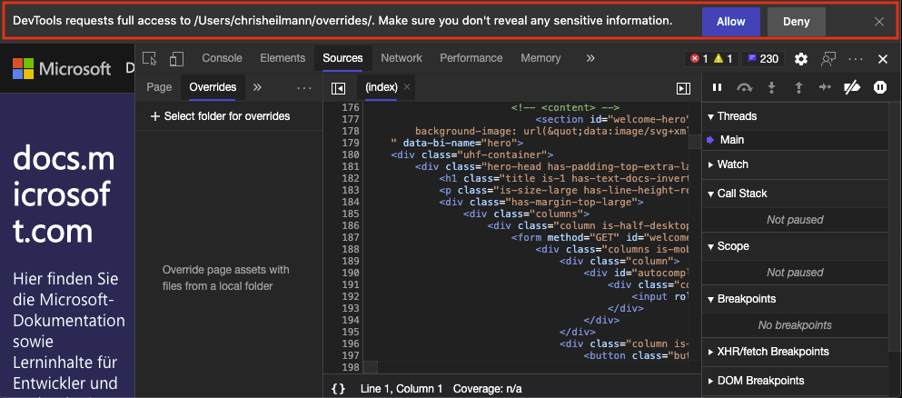

1. 在“ **替代** ”选项卡中，“ **启用本地覆盖”** 旁边会显示一个复选框。  **启用本地替代**的右侧是一个 **Clear 配置**图标，可用于删除本地替代设置。  现在，你已完成文件夹的设置，并已准备好将实时资源替换为本地资源。

   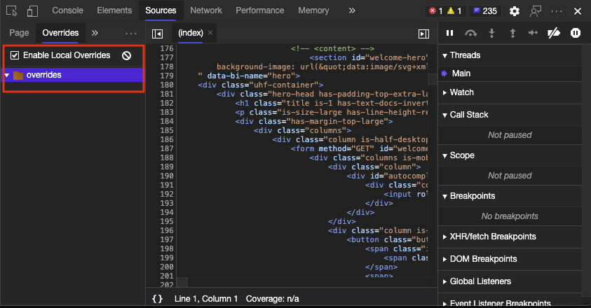


<!-- ====================================================================== -->
## <a name="adding-files-to-your-overrides-folder"></a>将文件添加到 Overrides 文件夹

若要将文件添加到替代文件夹，请打开 **Elements** 工具并检查网页。  若要编辑，请在 **样式检查器** 中单击 CSS 文件的名称。

在 **样式检查器** 中选择文件：

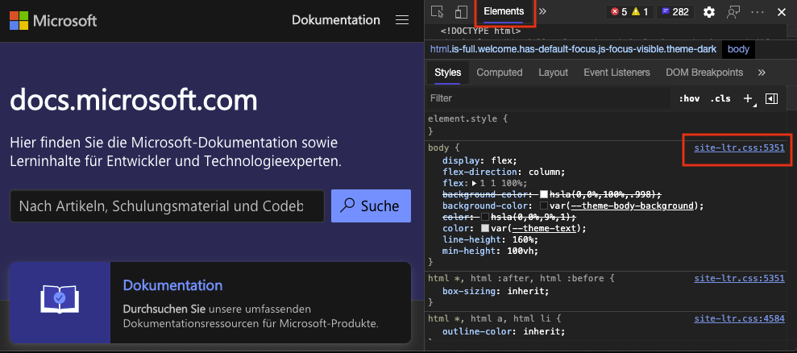

在 **“源** ”编辑器中，右键单击文件名，然后单击 **“保存以进行替代**”。

在“源”编辑器中，将文件的名称添加到替代列表：

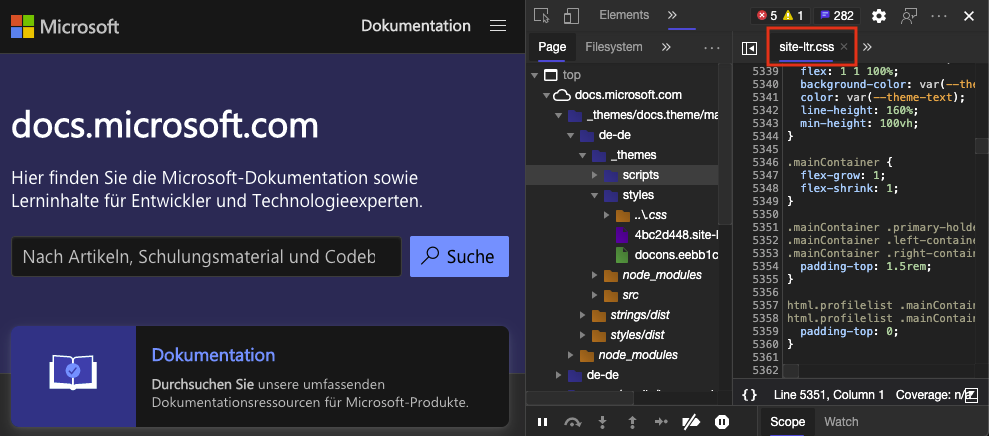

右键单击文件名，然后选择 **“保存以替代**”

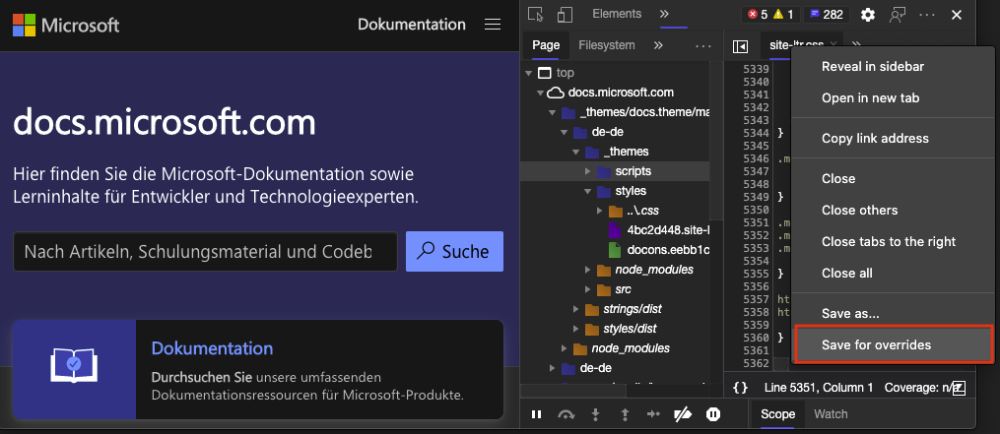

该文件存储在替代文件夹中。  验证 DevTools 是否创建了一个文件夹，该文件夹使用文件的 URL 和正确的目录结构进行命名。  文件存储在内部。  编辑器中的文件名现在还显示一个紫色点，指示文件是本地的，而不是实时的。

已成功将文件存储在替代文件夹中：

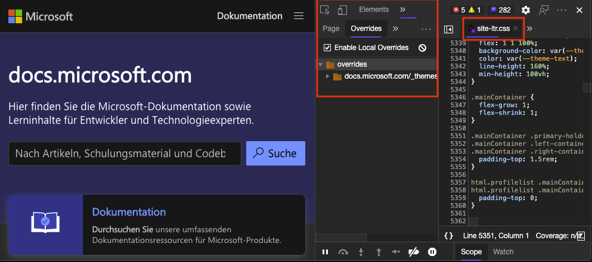

在以下示例中，现在可以更改网页的样式。  若要在文件周围添加红色边框，请在 **Styles 编辑器** 上复制以下样式，并将其添加到正文元素。

```css
border: 10px solid firebrick
```

该文件会自动保存在计算机上。  如果刷新文件，则会显示边框，并且不会丢失任何工作。

通过编辑替代文件夹中的文件，永久更改网页样式：

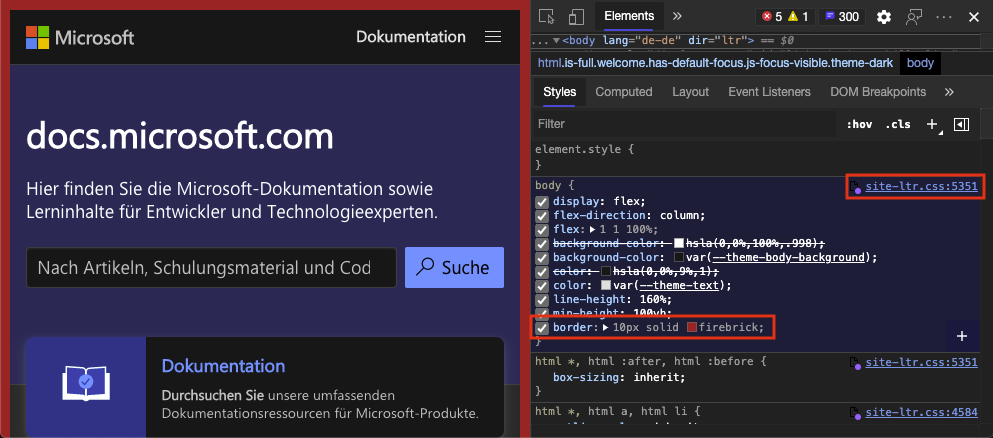

在 **“源** ”工具的 **“页面** ”部分中，右键单击文件，然后将其添加到替代。  已在替代文件夹中的文件在图标上具有紫色点。

从 **源** 工具中选择文件以替代：

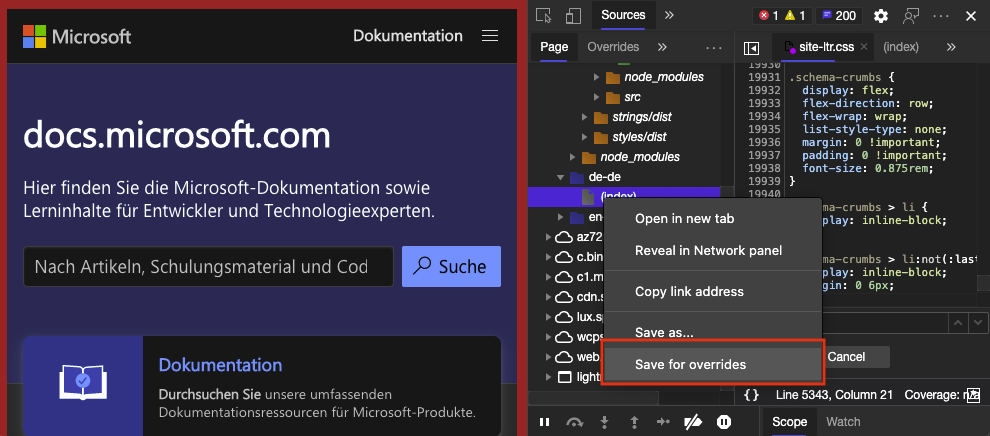

或者，在 **网络** 工具上，右键单击某个文件，然后将其添加到替代。  当重写生效时，位于计算机上而不是来自实时网页的文件。  当重写生效时，在 **网络** 工具上，找到文件名旁边的警告图标。

从 **网络** 工具中选择文件以替代：

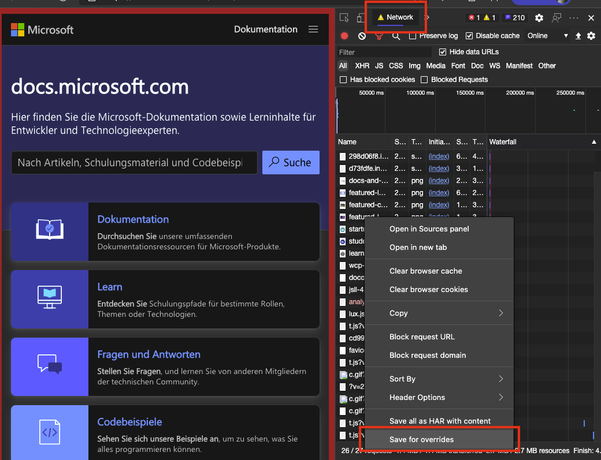


<!-- ====================================================================== -->
## <a name="two-way-interaction-of-overrides"></a>替代的双向交互

使用与 DevTools 的 **源** 工具或要更改文件的任何编辑器一起提供的编辑器。  更改会在访问覆盖文件夹中文件的所有产品中同步。
