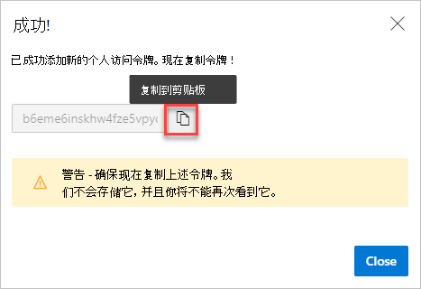

# <a name="securely-debug-original-code-by-publishing-source-maps-to-the-azure-artifacts-symbol-server"></a>通过将源映射发布到Azure Artifacts符号服务器来安全地调试原始代码

安全<!-- add sentence to define "securely", what are we making not happen?  what's the UX/end-result motivation for "securely"? --> 请参阅并使用 DevTools 中的原始开发源代码，而不是 Web 服务器返回的已编译、缩小和捆绑的生产代码，使用 Azure Artifacts 符号服务器所服务的源映射。

将源映射直接发布到 Web 服务器将公开显示原始源代码。  若要避免使原始源代码公开可见，请发布源地图到Azure Artifacts符号服务器。  通过此方法，在调试生产网站时，可以使用 DevTools 中的源地图，而无需将源映射发布到 Web 服务器。

源映射将编译的生产代码映射到原始开发源文件。 在 DevTools 中，你可以查看并处理熟悉的开发源文件，而不是已编译的代码。 若要了解有关源映射和在 DevTools 中使用源映射的信息，请参阅将处理的代码映射到原始 [源代码，以便进行调试](source-maps.md)。


<!-- ====================================================================== -->
## <a name="concepts"></a>概念

你必须在符号服务器上为源地图Azure Artifacts索引，以便你的源地图在调试生产网站时可供 DevTools 使用。

为此，在编译 `x_microsoft_symbol_client_key` 时将字符串属性添加到源映射。  此属性包含相应原始源文件的 [256 位 SHA-2](https://en.wikipedia.org/wiki/SHA-2) 哈希小写十六进制值。

然后，DevTools 能够计算每个已编译文件的此哈希，并使用哈希从符号服务器中检索Azure Artifacts映射。  为了安全地检索源地图，DevTools 使用你提供的个人访问令牌连接到Azure Artifacts服务器。


<!-- ====================================================================== -->
## <a name="step-1-generate-a-personal-access-token-for-azure-devops"></a>步骤 1：为用户生成个人访问Azure DevOps

发布源映射到 Azure Artifacts 符号服务器[需要个人访问](/azure/devops/organizations/accounts/use-personal-access-tokens-to-authenticate) (或 PAT) 。 编译代码和发布源映射时，生成系统将使用此 PAT。

若要生成一个 PAT，Azure DevOps：

1. 通过进入 Azure DevOps登录到组织`https://dev.azure.com/{yourorganization}`。

1. In Azure DevOps， go to **User settingsPerson** >  **access tokens**：
    
   

   将显示 **"个人访问令牌"** 页：

   

1. 单击 **"新建令牌"**。  将 **打开"创建新的个人访问令牌** "对话框：

   

1. 在 **"名称** "文本框中，输入 PAT 的名称，例如"发布源地图"。

1. 在" **到期** "部分，输入 PAT 的到期日期。

1. 在" **范围"** 部分，单击 **"显示所有范围"** 以展开该部分。

1. 向下滚动到" **符号"** 部分，然后选中"读写& **复选框** 。

1. 单击" **创建"** 按钮。  成功 **！** 将显示对话框：

   

1. 单击" **复制到剪贴板"** 按钮以复制 PAT。  请务必复制令牌，将其存储在安全的位置。 为了安全，它不会再次显示。

若要了解有关 PAT 的更多信息，请参阅 [使用个人访问令牌](/azure/devops/organizations/accounts/use-personal-access-tokens-to-authenticate)。


<!-- ====================================================================== -->
## <a name="step-2-compute-the-sha-256-hash-of-your-script-and-append-it-to-your-source-maps"></a>步骤 2：计算脚本的 SHA-256 哈希并将其附加到源映射

在应用程序生成过程的最后一步，对于要发布的每个源映射，应计算源映射所对应 JavaScript `x_microsoft_symbol_client_key` 文件的 SHA-256 哈希，然后通过 string 属性将其追加到源映射。

生成系统因应用程序而异，因此没有一种明确的应用方法。 但下面是一个示例 [Webpack 5 插件](https://webpack.js.org/)，如果正在使用它，可将其添加到 Webpack 配置中：

```js
// file: webpack.plugin-symbols.js
// Copyright (C) Microsoft Corporation. All rights reserved.
// Licensed under the BSD 3-clause license.

const crypto = require('crypto');
const fs = require('fs');
const path = require('path');
const process = require('process');

module.exports = class PrepareSourceMapsForSymbolServerPlugin {
  /**
   * @param {import('webpack').Compiler} compiler
   * @returns {void}
   */
  apply(compiler) {
    compiler.hooks.emit.tap('PrepareSourceMapsForSymbolServerPlugin', (compilation) => {
      const files = Object.keys(compilation.assets);
      const sourceMaps = files.filter(v => v.endsWith('.map'));
      const sourceFilesAndMapsNames = sourceMaps.map(mapFileName => {
        const sourceFileName = mapFileName.substring(0, mapFileName.length - 4);
        return {
          sourceFileName,
          mapFileName,
        };
      });
      const sourceFiles = sourceFilesAndMapsNames.map(({ sourceFileName, mapFileName }) => {
        const sourceFile = compilation.assets[sourceFileName];
        const sourceFileBuffer = sourceFile.buffer();
        const hasher = crypto.createHash('sha256');
        hasher.write(sourceFileBuffer);
        const digest = hasher.digest();
        const sourceFileHash = digest.toString('hex');

        const sourceMapAsset = compilation.assets[mapFileName];
        const sourceMapSource = sourceMapAsset.source();
        const sourceMapContents = JSON.parse(sourceMapSource);
        sourceMapContents['x_microsoft_symbol_client_key'] = sourceFileHash;
        const rewrittenSourceMapContents = JSON.stringify(sourceMapContents);
        if (!sourceMapAsset.isBuffer()) {
          // Not a buffer -- write to the _value property
          sourceMapAsset._value = rewrittenSourceMapContents;
        }
        else {
          sourceMapAsset._valueAsBuffer = Buffer.from(rewrittenSourceMapContents, 'utf-8');
        }

        return {
          sourceFileName,
          mapFileName,
          sourceFileHash,
          sourceMapAsset,
        };
      });
  }
};
```

然后，你可以将插件添加到 `plugins` 配置文件中的 `webpack.config.js` 部分：

```js
const PrepareSourceMapsForSymbolServerPlugin = require('./webpack.plugin-symbols.js');

// ...

module.exports = (env, args) => {
  const mode = process.env.NODE_ENV || (env && env.NODE_ENV) || 'production';
  return {
    devtool: mode === 'production' ? 'hidden-source-map' : 'inline-source-map',
    resolve: {
      modules: [
        path.resolve('./node_modules'),
      ],
    },
    output: {
      publicPath: '/',
      filename: '[name].bundle.js',
      chunkFilename: '[name].chunk.js',
    },
    plugins: [
        // ... other plugins
        new PrepareSourceMapsForSymbolServerPlugin(),
    ]
  });
};
```


<!-- ====================================================================== -->
## <a name="step-3-publish-source-maps-to-the-azure-artifacts-symbol-server"></a>步骤 3：将源映射发布到Azure Artifacts符号服务器


### <a name="publish-source-maps-using-azure-devops-pipelines"></a>使用地图发布源Azure DevOps Pipelines

Azure DevOps管道生成[`PublishSymbols@2`](/azure/devops/pipelines/tasks/build/index-sources-publish-symbols)任务附带。 此任务可用于将源映射发布到 Azure Artifacts 符号服务器。

确保将参数设置为 或 `indexableFileFormats` 来配置此任务`All``SourceMap`。


### <a name="publish-source-maps-using-symbolexe"></a>使用 发布源地图 `symbol.exe`

符号服务器团队发布了一个 .NET Core 应用程序 `symbol.exe`，该应用程序 [可自动](/rest/api/azure/devops/symbol/client/get) 下载。 下载后`symbol.exe`，可以执行命令将源映射发布到Azure Artifacts符号服务器：

```cmd
symbol publish
        -d {root directory containing your source maps}
        -n {a unique name for this job}
        -s {service URL, such as https://artifacts.dev.azure.com/contoso}
        --patAuthEnvVar {name of environment variable containing a PAT}
        --indexableFileFormats SourceMap
```

请注意，此参数 `-n` 必须是唯一的。 将拒绝重复作业名称，甚至拒绝失败的作业名称。


<!-- ====================================================================== -->
## <a name="see-also"></a>另请参阅

* [使用Azure Artifacts符号服务器源映射安全地调试原始代码](consume-source-maps-from-azure.md)
* [将已处理的代码映射到原始源代码，以便进行调试](source-maps.md)
