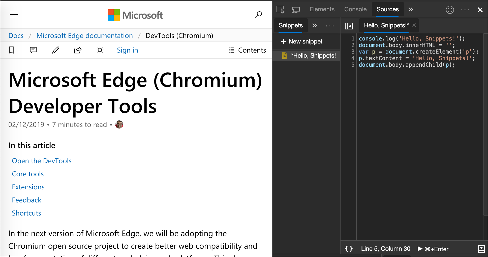
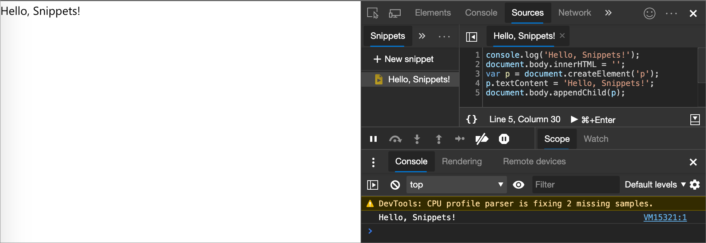
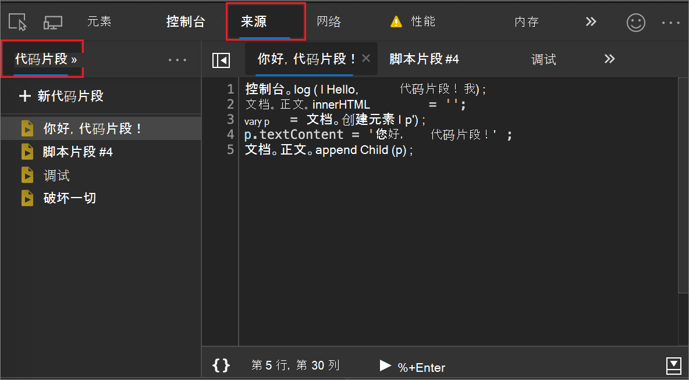
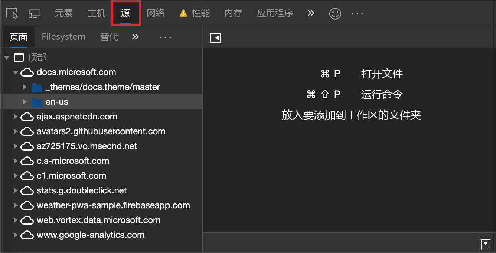
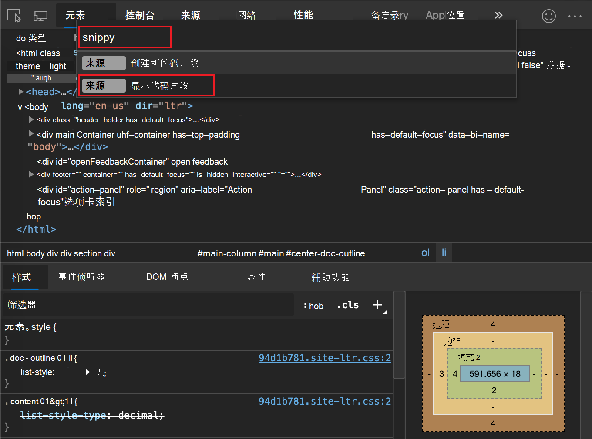
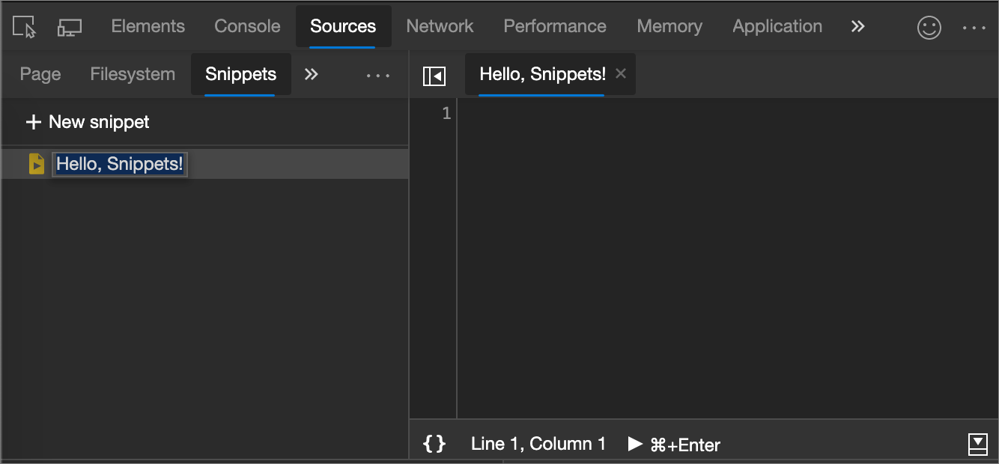
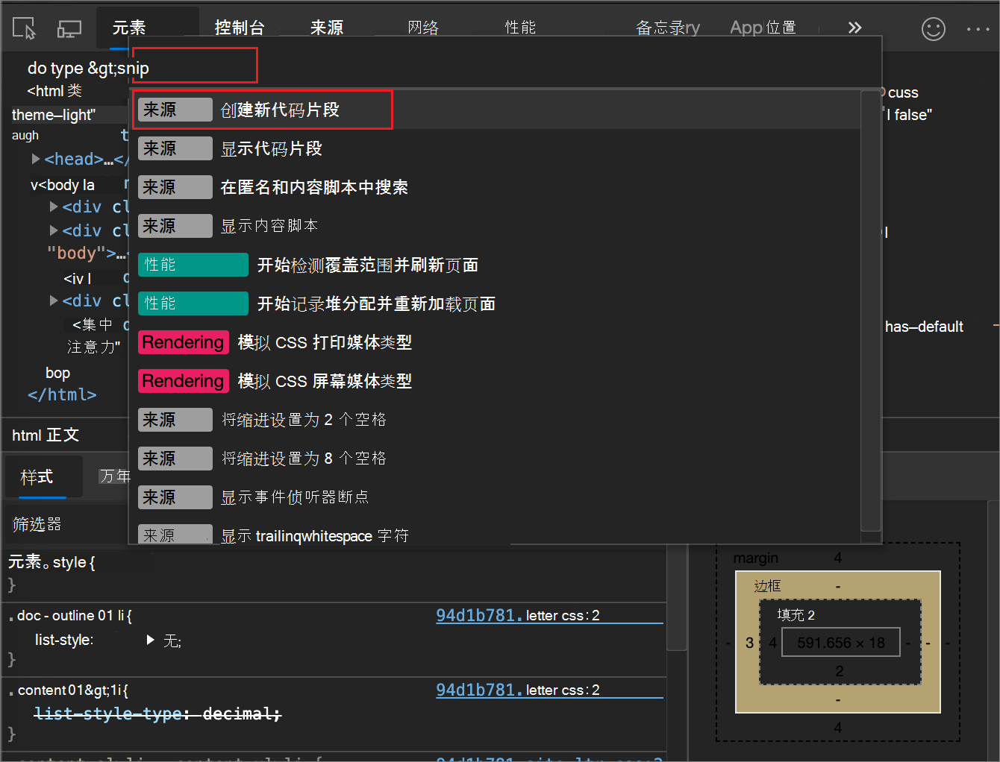
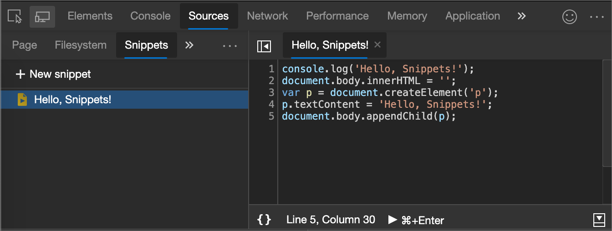
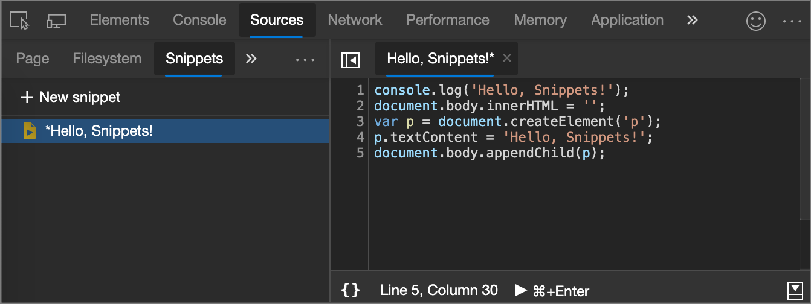
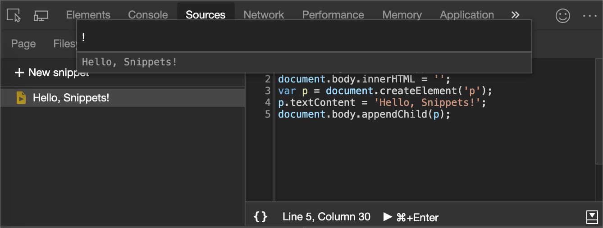

<!-- Copyright Kayce Basques

   Licensed under the Apache License, Version 2.0 (the "License");
   you may not use this file except in compliance with the License.
   You may obtain a copy of the License at

       https://www.apache.org/licenses/LICENSE-2.0

   Unless required by applicable law or agreed to in writing, software
   distributed under the License is distributed on an "AS IS" BASIS,
   WITHOUT WARRANTIES OR CONDITIONS OF ANY KIND, either express or implied.
   See the License for the specific language governing permissions and
   limitations under the License.  -->
# <a name="run-snippets-of-javascript-on-any-webpage"></a>在任何网页上运行 JavaScript 的代码片段

如果在[控制台](../console/index.md)中重复运行相同的代码，请考虑换成将代码另存为代码片段。  代码片段是在[源](../sources/index.md)工具中创作的脚本。  代码片段有权访问网页的 JavaScript 上下文，并且可以在任何网页上运行代码片段。  大多数网页的安全设置会阻止在代码片段中加载其他脚本。  因此，必须将所有代码都包括在一个文件中。

代码片段是书 [签](https://en.wikipedia.org/wiki/Bookmarklet) 的替代方法，其区别在于代码段仅在 DevTools 中运行，不限于允许的 URL 长度。

使用代码片段在第三方网页进行少许内容更改的绝佳方法。  将代码片段中的代码更改添加到当前网页，并在同一上下文中运行。  有关更改网页的现有代码的详细信息，请参阅 [“替代](overrides.md)”。

下图显示了左侧的 DevTools 主页和右侧的一些代码片段源代码。

运行代码片段之前的网页：



运行代码片段之前，网页中的代码段源代码：

```javascript
console.log('Hello, Snippets!');
document.body.innerHTML = '';
var p = document.createElement('p');
p.textContent = 'Hello, Snippets!';
document.body.appendChild(p);
```

下图所示为运行代码片段后出现的网页。  **“控制台抽屉**”弹出，显示`Hello, Snippets!`代码段日志和网页内容完全更改的消息：




<!-- ====================================================================== -->
## <a name="open-the-snippets-tab"></a>打开“代码段”选项卡

“代码 **片段** ”选项卡在左侧的 **“导航器** ”窗格中列出代码片段。  若要编辑代码片段，需要从“代码 **段** ”选项卡打开它：



### <a name="open-the-snippets-tab-with-a-mouse"></a>使用鼠标打开代码片段选项卡

1. 选择“ **源”** 选项卡。 将显示 **“源** ”工具：

   

1. 在左侧)  (**导航器** 窗格中，选择 **“代码段** ”选项卡。 若要访问 **代码片段** 选项，可能需要单击“ **更多”选项卡** () 按钮。

### <a name="open-the-snippets-tab-with-the-command-menu"></a>使用命令菜单打开“代码段”选项卡

1. 在 DevTools 中选择任何内容，以便 DevTools 具有焦点。

1. 按`Ctrl`++`Shift``P` (Windows、Linux) 或`P``Command`+`Shift`+ (macOS) 打开命令菜单。

1. 键入 `Snippets`，选择 **“显示代码段**”，然后按 `Enter` 下以运行命令：

   


<!-- ====================================================================== -->
## <a name="create-snippets"></a>创建代码片段

### <a name="create-a-snippet-through-the-sources-tool"></a>通过“源”工具创建代码段

1. [打开“代码片段”选项卡](#open-the-snippets-tab)。

1. 单击 **“新建”代码片段**。

1. 输入代码片段的名称，然后按 `Enter`：

   

### <a name="create-a-snippet-through-the-command-menu"></a>通过命令菜单创建代码片段

1. 将光标停在 DevTools 中的任一位置。

1. 按`Ctrl`++`Shift``P` (Windows、Linux) 或`P``Command`+`Shift`+ (macOS) 打开命令菜单。

1. "开始"菜单键入`snippet`，选择 **“新建代码片段**”，然后按`Enter`下：

   

若要使用自定义名称重命名新代码片段，请参阅 [重命名代码片段](#rename-snippets)。


<!-- ====================================================================== -->
## <a name="edit-snippets"></a>编辑代码片段

1. [打开“代码片段”选项卡](#open-the-snippets-tab)。

1. 在“ **代码片段** ”选项卡中，选择要编辑的代码段的名称。  代码片段将在 **代码编辑器**中打开：

   

1. 使用**代码编辑器**将 JavaScript 添加到代码片段。

1. 当代码片段名称旁边出现星号时，表示有代码未保存。  按`Ctrl`+`S` (Windows、Linux) 或`Command`+`S` (macOS) 保存：

   


<!-- ====================================================================== -->
## <a name="run-snippets"></a>运行代码片段

### <a name="run-a-snippet-from-the-sources-tool"></a>从“源”工具运行代码段

1. [打开“代码片段”选项卡](#open-the-snippets-tab)。

1. 单击要运行的代码段的名称。  代码片段将在 **代码编辑器**中打开：

1. 单击 **“运行代码段** () 。

### <a name="run-a-snippet-with-the-command-menu"></a>使用命令菜单运行代码片段

1. 将光标停在 DevTools 中的任一位置。

1. 按`Ctrl`++`Shift``P` (Windows、Linux) 或`P``Command`+`Shift`+ (macOS) 打开命令菜单。

1. 删除 `>` 该字符并键入 `!` 字符，然后键入要运行的代码段的名称：

   

1. 按 `Enter` 下以运行代码段。


<!-- ====================================================================== -->
## <a name="rename-snippets"></a>重命名代码片段

1. [打开“代码片段”选项卡](#open-the-snippets-tab)。

1. 右键单击代码段名称，然后选择 **“重命名**”。


<!-- ====================================================================== -->
## <a name="delete-snippets"></a>删除代码片段

1. [打开“代码片段”选项卡](#open-the-snippets-tab)。

1. 右键单击代码段名称，然后选择 **“删除**”。


<!-- ====================================================================== -->
## <a name="save-snippets"></a>保存代码段

默认情况下，代码片段仅在 DevTools 中可用，但也可以将其保存到磁盘。

1. [打开“代码片段”选项卡](#open-the-snippets-tab)。

1. 右键单击代码段名称，然后选择 **“另存为**”。

1. 出现提示时输入文件名和位置。


<!-- ====================================================================== -->
> [!NOTE]
> 此页面的某些部分是根据 [Google 创建和共享的](https://developers.google.com/terms/site-policies)作品所做的修改，并根据[ Creative Commons Attribution 4.0 International License ](https://creativecommons.org/licenses/by/4.0)中描述的条款使用。
> 原始页面位于[此处](https://developer.chrome.com/docs/devtools/javascript/snippets/)，由 [Kayce Basques](https://developers.google.com/web/resources/contributors#kayce-basques)\（Chrome DevTools 和 Lighthouse 的技术作家）撰写。

[](https://creativecommons.org/licenses/by/4.0)
本作品根据[ Creative Commons Attribution 4.0 International License ](https://creativecommons.org/licenses/by/4.0)获得许可。
