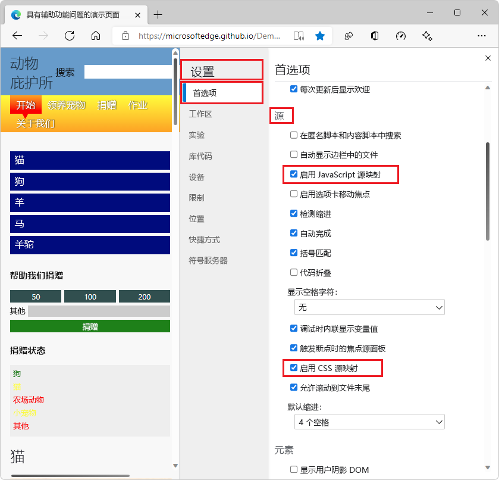

<!-- Copyright Meggin Kearney and Paul Bakaus

   Licensed under the Apache License, Version 2.0 (the "License");
   you may not use this file except in compliance with the License.
   You may obtain a copy of the License at

       https://www.apache.org/licenses/LICENSE-2.0

   Unless required by applicable law or agreed to in writing, software
   distributed under the License is distributed on an "AS IS" BASIS,
   WITHOUT WARRANTIES OR CONDITIONS OF ANY KIND, either express or implied.
   See the License for the specific language governing permissions and
   limitations under the License.  -->
# <a name="map-the-processed-code-to-your-original-source-code-for-debugging"></a>将已处理的代码映射到原始源代码，以便进行调试

若要在 DevTools 中调试 JavaScript 时查看和使用原始源代码，而不必使用 Web 服务器返回的代码的编译和细化版本，请使用源映射。

源映射使客户端代码可读且可调试，即使在生成过程编译和细化代码并将其合并到单个文件中之后也可调试。  源映射将已编译的细化代码映射到原始源代码文件。  然后，在 DevTools 中，可以读取和调试熟悉的原始源代码，而不是无法识别的转换和编译的代码。

若要使用此源映射技术，必须使用可生成源映射的预处理器。  确保 Web 服务器可以提供源映射。

<!--
no longer in original file:
todo: add link to preprocessors capable of producing source maps when section is available
/web/tools/setup/setup-preprocessors?#supported_preprocessors
-->


<!-- ====================================================================== -->
## <a name="get-started-with-preprocessors"></a>使用预处理器Első lépések

本文介绍如何在 **“源** ”工具中与 JavaScript 源映射交互。  <!--For a first overview of what preprocessors are, how each may help, and how source maps work; see Set Up CSS & JS Preprocessors.  -->

<!--
no longer in original file:
todo: add link to Set Up CSS & JS Preprocessors when section is available
/web/tools/setup/setup-preprocessors#debugging-and-editing-preprocessed-content
-->


<!-- ====================================================================== -->
## <a name="use-a-supported-preprocessor"></a>使用支持的预处理器

使用能够创建源映射的缩小器。  <!--For the most popular options, see the preprocessor support section.  -->  有关扩展视图，请参阅 [源地图：语言、工具和其他信息](https://github.com/ryanseddon/source-map/wiki/Source-maps:-languages,-tools-and-other-info) Wiki 页面。

<!--
no longer in original file:
todo: add link to display the preprocessor support section when section is available
/web/tools/setup/setup-preprocessors?#supported_preprocessors
-->

以下类型的预处理器通常与源映射结合使用：

*  转译器 ([巴贝尔](https://babeljs.io)， [特雷瑟](https://github.com/google/traceur-compiler/wiki/Getting-Started)) 。
*  编译器 ([关闭编译器](https://github.com/google/closure-compiler)、 [TypeScript](https://www.typescriptlang.org)、 [CoffeeScript](https://coffeescript.org)、 [Dart](https://www.dartlang.org)) 。
*  [UglifyJS](https://github.com/mishoo/UglifyJS))  (明细化器。


<!-- ====================================================================== -->
## <a name="source-maps-in-the-sources-tool"></a>源工具中的源映射

来自预处理器的源映射会导致 DevTools 加载原始文件以及缩小的文件。  然后，使用原始设置断点并逐步执行代码。  同时，Microsoft Edge运行缩小代码。  代码的运行使你在生产环境中运行开发站点的错觉。

在 DevTools 中运行源映射时，应注意到 JavaScript 未编译，并且会显示它引用的所有单个 JavaScript 文件。  DevTools 中的源映射使用源映射，但基础功能实际上运行已编译的代码。

任何错误、日志和断点都映射到原始源代码，以便更轻松地进行调试。


### <a name="enable-source-maps-in-settings"></a>在设置中启用源映射

默认情况下启用源映射。

若要确保已启用源映射，请执行以下操作：

1. 若要打开 DevTools，请在Microsoft Edge中右键单击网页，然后选择 **“检查**”。  或者，按“`Ctrl`+`Shift`+`I`”(Windows、Linux)或“`Command`+`Option`+`I`”(macOS)。

1. 在 DevTools 中，单击**设置** (设置) >**首选项**。

1. 在 **“首选项”** 页的 **“源** ”部分中，确保选中 **“启用 JavaScript 源映射** ”复选框和 **“启用 CSS 源映射** ”复选框：

   

1. 在**设置**右上角，单击“**关闭** (**x**) ”按钮。


### <a name="debugging-with-source-maps"></a>使用源映射进行调试

启用 [调试代码](index.md#step-4-step-through-the-code) 和源映射时，源映射会在多个位置使用：

*  在 **控制台** 工具中，从日志消息到源文件的链接将转到原始文件，而不是编译的文件。

*  单步执行 **“源** ”工具中的代码时，原始文件将显示在左侧的 **“导航器** ”窗格中。

*  在 **“源**”工具中，显示在**调试器**“**调用堆栈**”窗格中的源文件的链接打开原始源文件。


<!-- ====================================================================== -->
## <a name="use--sourceurl-to-name-evaluated-files-in-the-sources-tool"></a>用于 `//# sourceURL` 在“源”工具中命名已评估的文件

`//# sourceURL`杂注（例如`// # sourceURL=myFileName`）是一种约定，可让你在使用评估的 JavaScript 文件时更轻松地进行开发。  可以有空格字符之前或之后 `#`。

加载 JavaScript 文件并使用 `eval()` 函数评估这些文件时，“ **源** ”工具没有文件名在 **导航器** 窗格中显示这些文件。 通过在代码中包含以下特殊注释，可以命名已评估的文件、内联脚本和样式，以便每个文件在 **“源** ”工具中显示为可识别的文件名。  例如：

```javascript
//# sourceURL=source.coffee
```

<!-- This pragma isn't part of the source map specification. -->


<!-- ====================================================================== -->
## <a name="see-also"></a>另请参阅

* [通过将源映射发布到Azure Artifacts符号服务器来安全地调试原始代码](publish-source-maps-to-azure.md)
* [使用Azure Artifacts符号服务器源映射安全地调试原始代码](consume-source-maps-from-azure.md)
* [源地图监视器工具](../source-maps-monitor/source-maps-monitor-tool.md)


<!-- ====================================================================== -->
> [!NOTE]
> 此页面的某些部分是根据 [Google 创建和共享的](https://developers.google.com/terms/site-policies)作品所做的修改，并根据[ Creative Commons Attribution 4.0 International License ](https://creativecommons.org/licenses/by/4.0)中描述的条款使用。
> 原始页面 [在此](https://developers.google.com/web/tools/chrome-devtools/javascript/source-maps) 处找到，由 [Meggin Kearney](https://developers.google.com/web/resources/contributors#meggin-kearney) (Technical Writer) 和 [Paul Bakaus](https://developers.google.com/web/resources/contributors#paul-bakaus) (Open Web Developer Advocate， Google： Tools， Performance， Animation， and UX) 创作。

[](https://creativecommons.org/licenses/by/4.0)
本作品根据[ Creative Commons Attribution 4.0 International License ](https://creativecommons.org/licenses/by/4.0)获得许可。
