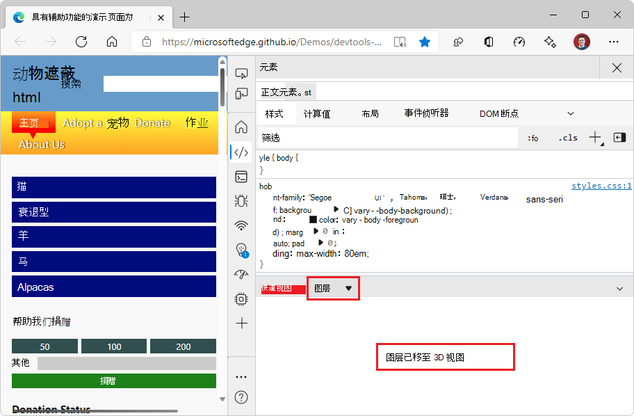

# 层工具

请改用 **3D 视图** 工具; [请参阅使用 3D 视图工具导航网页层、z 索引和 DOM](../3d-view/index.md)。

**“图层**”工具现在 (**3D 视图**工具) 表示 3D 空间中的网页，以帮助你提高网页的呈现性能。  使用 **“层** ”工具分析 CSS 代码创建的层数、层的较大程度以及它们的更改频率。  “ **图层** ”工具显示浏览器呈现引擎创建的不同层，然后在可旋转的 3D 空间中显示网页的复合图像。

“**图层**”工具现在被 **3D 视图**工具的 **“复合层**”选项卡取代。  以下屏幕截图显示了使用**焦点模式**（而不是在抽屉中）在**快速视图**中打开的 **“图层**”工具：

**“图层**”工具先前显示以下内容：

