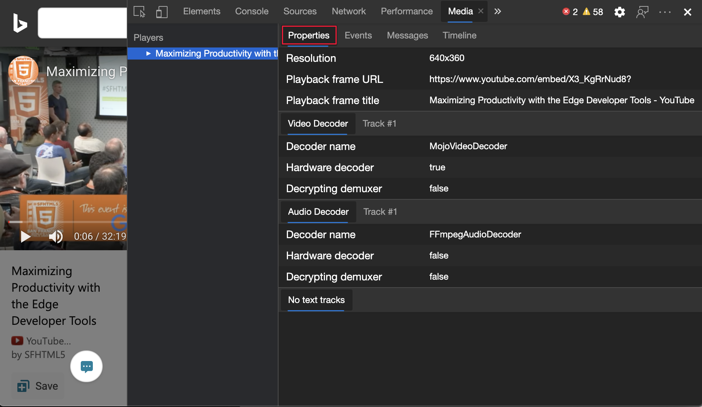
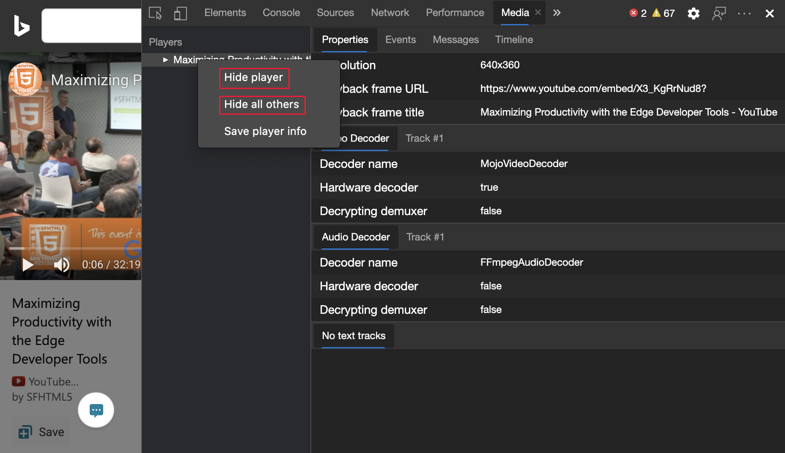

<!-- Copyright Jecelyn Yeen

   Licensed under the Apache License, Version 2.0 (the "License");
   you may not use this file except in compliance with the License.
   You may obtain a copy of the License at

       https://www.apache.org/licenses/LICENSE-2.0

   Unless required by applicable law or agreed to in writing, software
   distributed under the License is distributed on an "AS IS" BASIS,
   WITHOUT WARRANTIES OR CONDITIONS OF ANY KIND, either express or implied.
   See the License for the specific language governing permissions and
   limitations under the License.  -->
# 查看和调试媒体播放器信息

使用 **“媒体** ”工具查看信息，并按浏览器选项卡调试媒体播放器。

<!-- ====================================================================== -->
## 打开媒体工具

**媒体**工具是 DevTools 中用于检查网页媒体播放器的主要位置。

1. 要打开 DevTools，请右击网页，然后选择“**检查**”。  或者，按“`Ctrl`+`Shift`+`I`”(Windows、Linux)或“`Command`+`Option`+`I`”(macOS)。  DevTools 随即打开。

1. 在 DevTools 的主工具栏上，选择 **“媒体** ”选项卡。 如果该选项卡不可见，请单击“ **更多”选项卡** () 按钮，或者“ **更多工具** () 按钮。

   

<!-- ====================================================================== -->
## 查看媒体播放器信息

1. 使用媒体播放器导航到网页，例如以下网页。

    [使用 Edge 开发人员工具最大限度地提高工作效率](https://www.bing.com/videos/search?view=detail&mid=DE0BA14EC0E0D18C06C8DE0BA14EC0E0D18C06C8)

1. 在 **“玩家** ”菜单下，将显示一个媒体播放器。

1. 单击玩家。  **“属性**”面板显示媒体播放器的属性。

   

1. 若要查看所有媒体播放器事件，请单击 **“事件”** 面板。

   

1. 若要查看媒体播放器消息日志，请单击 **“消息”** 面板。  可以按日志级别或字符串筛选消息。

   

1. 在 **“时间线** ”面板上，媒体播放和缓冲区状态将实时显示。

   

### 远程调试

从Windows或macOS计算机查看Android设备上的媒体播放器信息。

1. 若要设置远程调试，请参阅[开始远程调试Android设备](../remote-debugging/index.md)。

1. 远程查看媒体播放器信息。

    <!-- TODO: recreate image using an Android device -->
    <!--
   
    -->

<!-- ====================================================================== -->
## 隐藏和显示媒体播放器

有时，你在网页上运行多个媒体播放器，或者使用相同的浏览器选项卡浏览不同的网页，每个网页都有媒体播放器。

可以隐藏 (或显示每个媒体播放器) ，以获得更轻松的调试体验：

1. 使用同一浏览器选项卡浏览到多个不同的视频网页。

1. 隐藏媒体播放器：
    *  若要隐藏单个媒体播放器，请右键单击媒体播放器，然后选择 **“隐藏播放器**”。
    *  若要隐藏所有其他媒体播放器，请右键单击媒体播放器，然后选择 **“隐藏所有其他**媒体播放器”。

<!-- ====================================================================== -->
## 导出媒体播放器信息

*  若要将媒体播放器信息下载为 JSON 文件，请右键单击媒体播放器，然后选择 **“保存播放器信息**”。

<!-- ====================================================================== -->
> [!NOTE]
> 此页面的某些部分是根据 [Google 创建和共享的](https://developers.google.com/terms/site-policies)作品所做的修改，并根据[ Creative Commons Attribution 4.0 International License ](https://creativecommons.org/licenses/by/4.0)中描述的条款使用。
> 原始页面位于 [此处](https://developer.chrome.com/docs/devtools/media-panel/)，并由 [Jecelyn Yeen](https://developers.google.com/web/resources/contributors#jecelyn-yeen)  \（开发人员支持者，Chrome DevTools\）制作。

本作品根据[ Creative Commons Attribution 4.0 International License ](https://creativecommons.org/licenses/by/4.0)获得许可。
