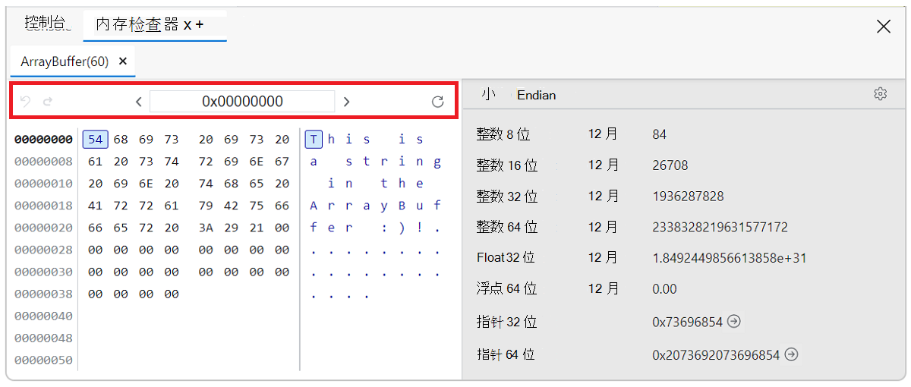
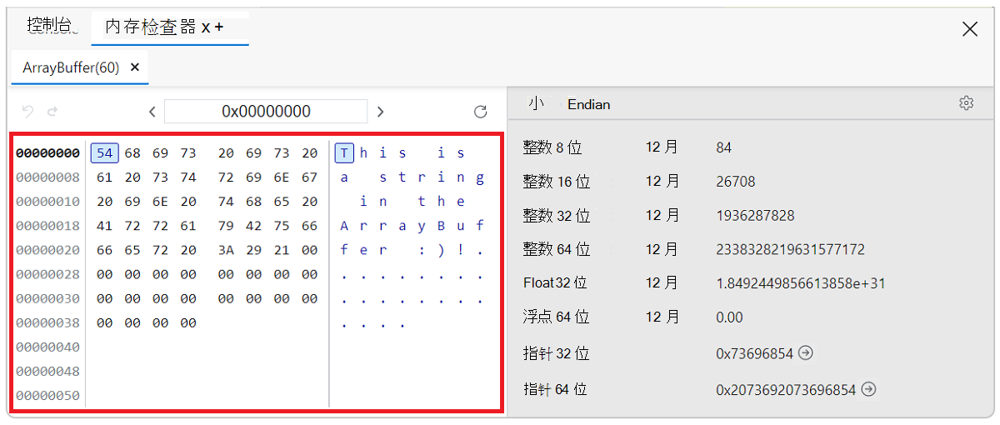
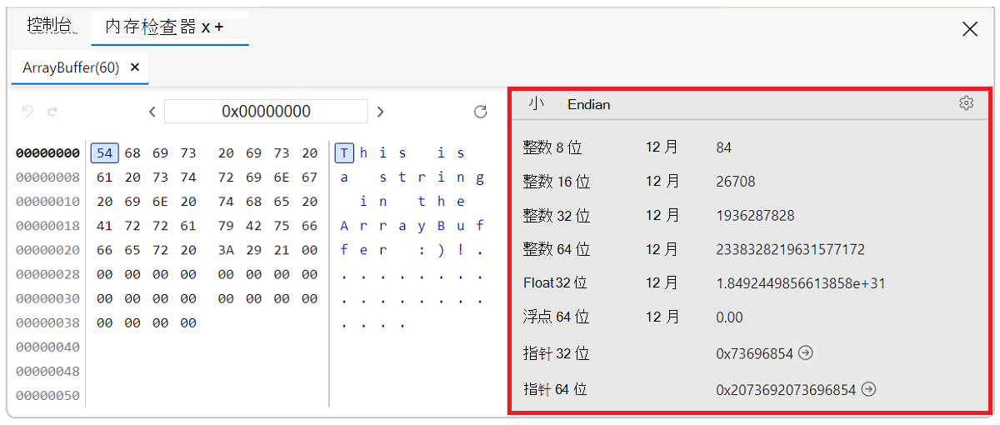

<!-- Copyright Kim-Anh Tran

   Licensed under the Apache License, Version 2.0 (the "License");
   you may not use this file except in compliance with the License.
   You may obtain a copy of the License at

       https://www.apache.org/licenses/LICENSE-2.0

   Unless required by applicable law or agreed to in writing, software
   distributed under the License is distributed on an "AS IS" BASIS,
   WITHOUT WARRANTIES OR CONDITIONS OF ANY KIND, either express or implied.
   See the License for the specific language governing permissions and
   limitations under the License.  -->

# 使用内存检查器检查 JavaScript ArrayBuffer

使用 **内存检查器** 查看和与以下类型的对象交互：

* [ArrayBuffer](https://developer.mozilla.org/docs/web/javascript/reference/global_objects/arraybuffer)
* [TypedArray](https://developer.mozilla.org/docs/Web/JavaScript/Reference/Global_Objects/TypedArray)
* [DataView](https://developer.mozilla.org/docs/Web/JavaScript/Reference/Global_Objects/DataView)
* [WebAssembly (Wasm) 内存](https://developer.mozilla.org/docs/Web/JavaScript/Reference/Global_Objects/WebAssembly/Memory)

使用 **内存检查器** 可以查看不同类型的内存对象，导航并选择用于解释值的类型。 它直接显示字节旁边的 ASCII 值，并允许你选择不同的尾数。

 

**内存检查器**工具提供的功能比**源**工具在调试时要大`ArrayBuffers`。 “源”工具中的“ **范围** ”视图显示数组缓冲区中单个值的列表，这使无法查看所有数据。 此外，导航到缓冲区内的特定区域需要滚动到特定索引，并且值始终显示为单个字节，即使你想要以其他格式（例如 32 位整数）查看它们。

<!-- this page's initial content was from
https://docs.microsoft.com/microsoft-edge/devtools-guide-chromium/whats-new/2021/04/devtools#new-memory-inspector-tool
-->

<!-- ====================================================================== -->
## 调试时打开内存检查器

1. "开始"菜单 Microsoft Edge。

1. 打开 [JS (JS) 内存中的测试站点“检查 ArrayBuffers ](http://memory-inspector.glitch.me/demo-js.html)”。 <!-- To do item: copy to Microsoft Repo and reference there -->

1. 按`F12`或`Shift``I`+`Ctrl`+ (Windows、Linux) 或`I``Command`+`Option`+ (macOS) 打开 DevTools。

1. 单击 **“源** ”并打开文件 `demo-js.js` 。

1. 在第 **18** 行设置断点，如下图所示。

    

1. 刷新网页。 它无法显示，因为 JavaScript 在断点处暂停。

1. 在“ **作用域**”下的右侧调试器窗格中，找到该行 `buffer` 。

1. 从行中 `buffer` ，可以使用以下方法之一打开内存检查器：

    * 单击 **“内存检查器中的显示”面板**图标 () ，或
 
    * 从上下文菜单。 右键单击该 `buffer` 属性，然后选择 **“内存检查器”面板中的“显示**”。

    

    JavaScript ArrayBuffer 将在内存检查器中打开。

    

### 检查多个对象

可以同时检查多个对象，例如 DataView 和 TypedArray。

在断点处暂停演示网页后，“**作用域**”视图中的对象`b2`为 TypedArray。 右键单击对象 `b2` ，然后选择 **“内存检查器”面板中的“显示”**

对象的新选项卡 `b2` 将在第一个选项卡旁边打开，该选项卡表示 `buffer` 内存检查器中的对象。

<!-- ====================================================================== -->
## 在内存检查器中导航

内存检查器面板包含三种类型的内容：

* [导航栏](#navigation-bar)
* [内存缓冲区](#memory-buffer)
* [值检查器](#value-inspector)

### 导航栏

 
Enter **地址** 文本框以十六进制格式显示当前字节地址。 可以更改值以跳转到内存缓冲区中的新位置。 在文本框中单击并更改值 `0x00000008`。 内存缓冲区会立即跳转到该字节地址。

内存缓冲区可能超过一页。 使用向左和向右键按钮分别导航 **上一页** () **<** 和 **下一页** (**>**) 。 如果只有一页内存缓冲区数据，箭头将转到页面的开头和结尾。

使用极左历史记录箭头**在地址**](../media/memory-inspector-go-back-address-history.png)历史记录 (返回历史记录)  () 。

### 内存缓冲区

 
从面板左侧读取 **，地址** 以十六进制格式显示。 当前选定的地址是加粗的。

**内存**也以十六进制格式显示，每个字节由空格分隔。 突出显示了当前选定的字节。 可以单击任何字节或使用箭头键导航 (左、右、上、下) 。

内存的 **ASCII 表示** 形式显示在面板的右侧。 突出显示的字符对应于所选字节。 可以单击任何字符或使用箭头键导航 (左、右、向上和向下) 。

### 值检查器

 
单击当前 Endian 类型， **在 Big endian** 和 **Little endian** 之间切换。

主区域根据设置显示每个值和解释。 默认情况下，将显示所有值。

单击 **切换值类型设置** () 以选择要在检查器中查看的值类型。 这将成为新的默认值类型设置。

可以使用下拉列表更改编码视图。 对于整数，你可以从十进制`dec`、十六进制和八进`oct`制`hex`中进行选择。 对于浮点，你可以在小数表示法 `dec` 和科学表示法 `sci`之间进行选择。

<!-- ====================================================================== -->
## 检查内存

完成以下步骤，在内存检查器中调试网页。

1. 在 **导航栏** 中，将地址更改为 `0x00000027`.

1. 查看 ASCII 表示形式和值解释。 所有值应为零或为空。

    

1. 单击 **“恢复脚本执行** ( ，或按 **F8** 或 **Ctrl +\\** 执行代码。

    ASCII 表示形式和值解释已更新。
    
    

1. 根据需要单击“**跳转到地址**”按钮 (，以跳转到下一个活动内存地址。 如果下一个内存地址不可用，则该按钮将关闭 () 工具提示 **地址超出内存范围**。

1. 自定义 **值检查器** 以仅显示浮点值。 单击 **切换值类型设置** () 并清除除两个 **浮点** 值以外的所有复选框。
    
    

1. 单击 **切换值类型设置** () 关闭值类型设置。

1. 使用下拉菜单将编码从 `dec` 更改为 `sci`。 值表示形式已更新。
    
    
    
1. 使用键盘或导航栏浏览内存缓冲区。

1. 重复步骤 **3** 和 **4** 以观察值更改。

<!-- ====================================================================== -->
## WebAssembly 内存检查

对于 WebAssembly (Wasm) 内存检查，此过程类似于检查 JavaScript 内存。

1. 在 [Wasm) 中打开 Wasm 测试站点检查 Wasm 记忆 (内存 ](http://memory-inspector.glitch.me/demo-wasm.html)。 <!-- To do item: copy to Microsoft Repo and reference there -->

1. 按`F12`或`Shift``I`+`Ctrl`+ (Windows、Linux) 或`I``Command`+`Option`+ (macOS) 打开 DevTools。

1. 单击 **“源** ”并打开文件 `memory-write.wasm` 。

1. 在循环的第一行设置断点，十六进制值 **0x03c**。

1. 刷新页面。

1. 在“ **作用域**”下的调试器窗格中，展开 **模块**。

    

1. 单击属性行末尾`$imports.memory`的“**在内存检查器中**显示”面板图标 () 。 

    Wasm ArrayBuffer 将在 **内存检查器**中打开。
    
    

<!-- ====================================================================== -->
> [!NOTE]
> 此页面的某些部分是根据 [Google 创建和共享的](https://developers.google.com/terms/site-policies)作品所做的修改，并根据[ Creative Commons Attribution 4.0 International License ](https://creativecommons.org/licenses/by/4.0)中描述的条款使用。
> 原始页面 [在此](https://developer.chrome.com/docs/devtools/memory-inspector/) 处找到，由 [Kim-Anh Tran](https://developer.chrome.com/authors/kimanh/) (Chrome DevTools) 创作。

本作品根据[ Creative Commons Attribution 4.0 International License ](https://creativecommons.org/licenses/by/4.0)获得许可。
