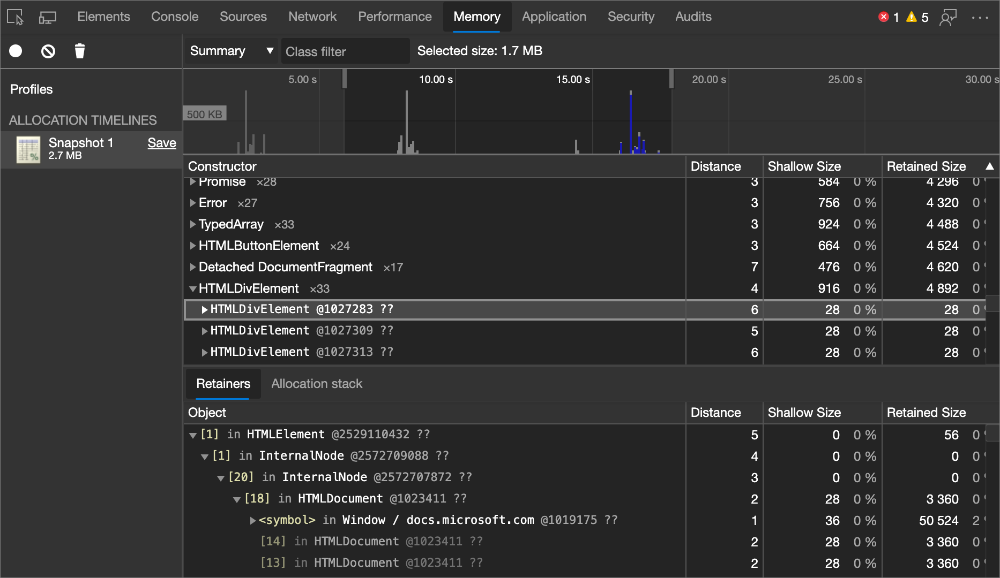
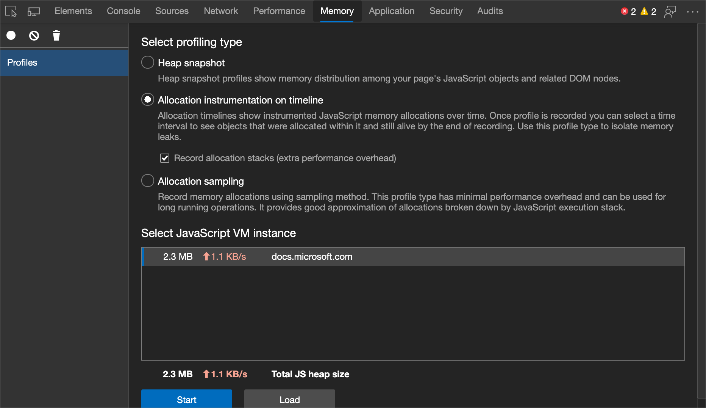
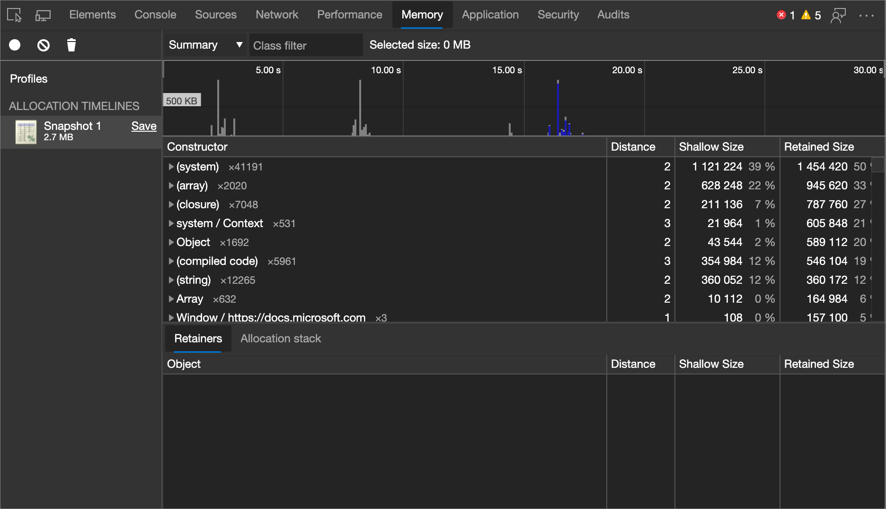
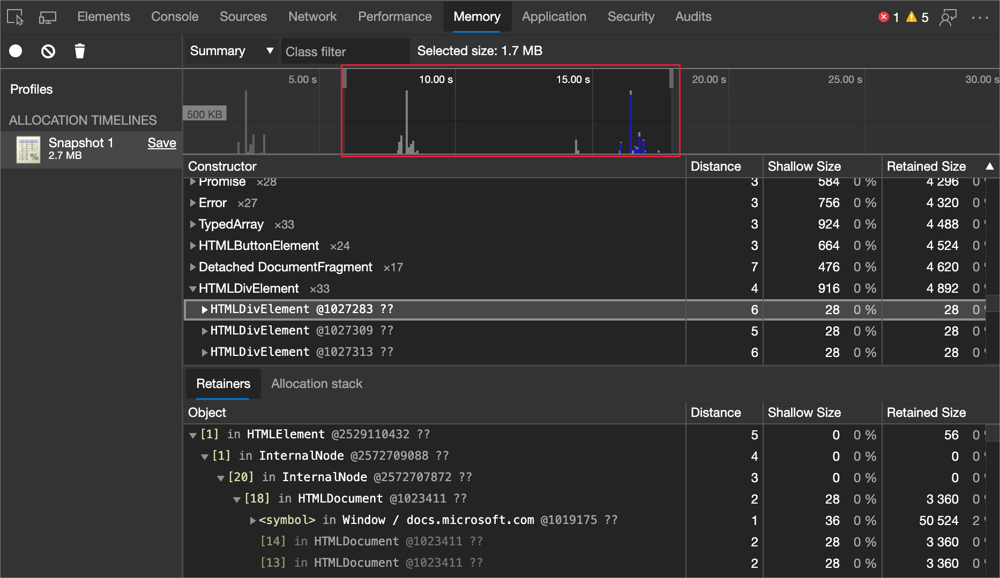

<!-- Copyright Meggin Kearney

   Licensed under the Apache License, Version 2.0 (the "License");
   you may not use this file except in compliance with the License.
   You may obtain a copy of the License at

       https://www.apache.org/licenses/LICENSE-2.0

   Unless required by applicable law or agreed to in writing, software
   distributed under the License is distributed on an "AS IS" BASIS,
   WITHOUT WARRANTIES OR CONDITIONS OF ANY KIND, either express or implied.
   See the License for the specific language governing permissions and
   limitations under the License. -->
# 在时间线上使用分配检测

<!-- title in other repo:
How to Use the Allocation Profiler Tool -->

在 **内存** 工具中，使用时间线单选按钮 **上的分配检测** 查找未正确垃圾回收的对象，并继续保留内存。

<!-- ====================================================================== -->
## 时间线上的分配检测的工作原理

**时间线上的分配检测** 将 [堆探查器](heap-snapshots.md) 的详细快照信息与 **性能** 工具的增量更新和跟踪相结合。  同样，跟踪对象的堆分配涉及启动录制、执行一系列操作以及停止录制以进行分析。

<!--todo: add profile memory problems (heap profiler) section when available  -->
<!--todo: add profile evaluate performance (Performance tool) section when available  -->

**时间线上的分配检测** 在录制 (中定期拍摄堆快照，就像每 50 毫秒) 一次，以及录制结束时的一个最终快照一样频繁。

> [!NOTE]
> 之后的数字 `@` 是一个对象 ID，它在录制会话期间拍摄的多个快照中保留。  永久性对象 ID 可在堆状态之间进行精确比较。  对象在垃圾回收过程中移动，因此显示对象的地址是没有意义的。

<!-- ====================================================================== -->
## 在时间线上启用分配检测

开始 **在时间线上使用分配检测**：

1. 要打开 DevTools，请右击网页，然后选择“**检查**”。  或者，按“`Ctrl`+`Shift`+`I`”(Windows、Linux)或“`Command`+`Option`+`I`”(macOS)。  DevTools 随即打开。

1. 在 DevTools 的主工具栏上，选择 **“内存** ”选项卡。 如果该选项卡不可见，请单击“ **更多”选项卡** () 按钮，或者“ **更多工具** () 按钮。

1. 在时间线单选按钮 **上选择“分配检测** ”。

1. 开始录制。

记录堆分配探查器：

<!-- ====================================================================== -->
## 读取堆分配时间线

堆分配时间线显示要创建对象的位置，并标识保留路径。  在下图中，顶部的条形图指示何时在堆中找到新对象。

每个条的高度对应于最近分配的对象的大小，条形图的颜色指示这些对象是否仍位于最终堆快照中。  蓝色条形图指示仍然位于时间线末尾的对象，灰色条表示在时间线期间分配但已回收垃圾的对象。

<!-- In the following figure, an action was performed 3 times.  The sample program caches five objects, so the last five blue bars are expected.  But the left-most blue bar indicates a potential problem. -->
<!-- todo: redo figure 4 with multiple click actions -->

可以使用上述时间线中的滑块缩放到该特定快照，并查看最近分配的对象：

单击堆中的特定对象会显示堆快照底部的保留树。  检查对象的保留路径应提供足够的信息来了解为何未收集该对象，并且应进行必要的代码更改以删除不必要的引用。

<!-- ====================================================================== -->
## 按函数查看内存分配

可以通过 JavaScript 函数查看内存分配。  请参阅 [按函数调查内存分配](index.md#investigate-memory-allocation-by-function)。

<!-- ====================================================================== -->
> [!NOTE]
> 此页面的某些部分是根据 [Google 创建和共享的](https://developers.google.com/terms/site-policies)作品所做的修改，并根据[ Creative Commons Attribution 4.0 International License ](https://creativecommons.org/licenses/by/4.0)中描述的条款使用。
> 原始页面 [在此](https://developer.chrome.com/docs/devtools/memory-problems/allocation-profiler/) 处找到，由 [Meggin Kearney](https://developers.google.com/web/resources/contributors#meggin-kearney) (Technical Writer) 创作。

本作品根据[ Creative Commons Attribution 4.0 International License ](https://creativecommons.org/licenses/by/4.0)获得许可。
