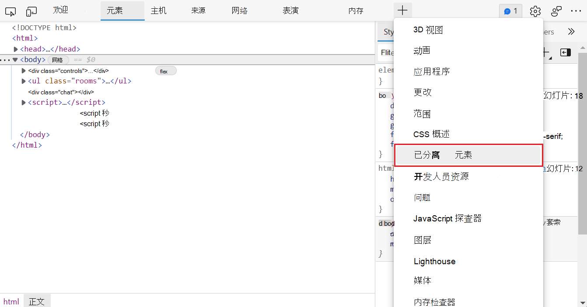
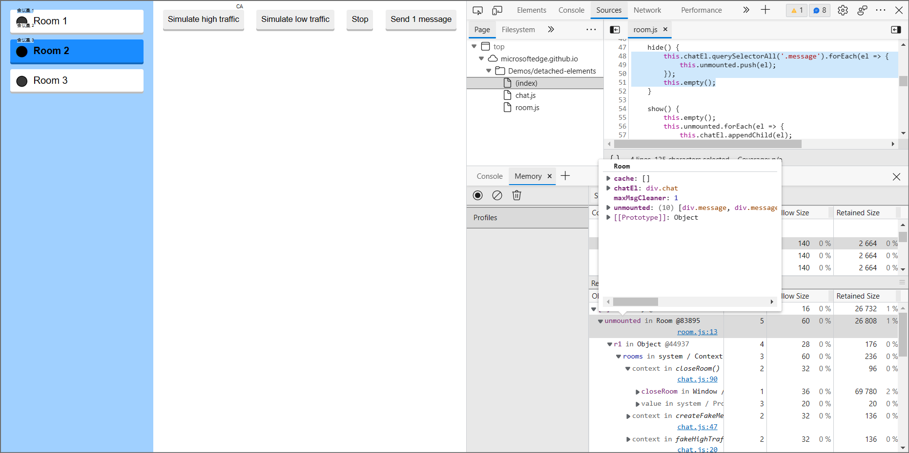
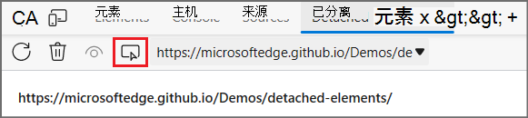

# 使用分离的元素工具调试 DOM 内存泄漏

使用 **分离元素** 工具查找浏览器无法垃圾回收的分离元素，并找到仍在引用已分离元素的 JavaScript 对象。  通过更改 JavaScript 以释放 元素，可以减少页面上的分离元素数量。

当某个元素不再附加到文档对象模型 (DOM) 树，但仍由页面上运行的一些 JavaScript 引用时，应用程序中可能会发生内存泄漏。 这些元素称为 *分离元素*。  对于在已分离元素 (GC) 进行垃圾回收的浏览器，不得从 DOM 树或 JavaScript 代码引用该元素。

有关堆快照和分离元素详细信息，请阅读使用堆快照发现分离 [的 DOM 树内存泄漏](index.md#discover-detached-dom-tree-memory-leaks-with-heap-snapshots)。

如修复内存 [问题中](index.md)介绍的，内存问题会影响页面性能，包括内存泄漏、内存不足和频繁垃圾回收。  用户症状包括：

*  随着时间的推移，页面的性能逐渐变差。
*  页面性能一直不佳。
*  页面性能会延迟或看似频繁暂停。

<!-- ====================================================================== -->
## 打开分离的元素工具

若要打开 **分离的元素** 工具并加载演示页面：

1. 打开新 [窗口或选项卡](https://microsoftedge.github.io/Demos/detached-elements/) 中的分离元素演示应用程序。

   <!-- You can view the source files for the Detached Elements demo in the [MicrosoftEdge/Demos > detached-elements](https://github.com/MicrosoftEdge/Demos/tree/main/detached-elements) repo folder. -->

1. 若要打开 DevTools，请右键单击该网页，然后选择"检查 **"**。  或者，按 `Ctrl`++`Shift``I` (Windows、Linux) 或 (`I` `Command`+`Option`+macOS) 。  将打开 DevTools。

1. 在 DevTools 中，在主工具栏上，选择"**分离的元素"** 选项卡。 **** 如果该选项卡 。) 按钮，或者单击"更多工具 (更多工具](../media/more-tools-icon-light-theme.png)"图标。) 按钮：

   > [!div class="mx-imgBorder"]
   > 

<!-- ====================================================================== -->
## 获取分离的元素

"**获取**分离的元素 ( "获取分离的元素"图标。"分离的元素"工具中的") "按钮**** 在网页上查找并显示所有分离的元素。

若要查找分离的元素：

1. 在演示应用程序中，确保选中" **会议室 1** "按钮。

1. 在演示应用程序中，单击" **模拟高流量"** 按钮。

1. 在演示应用程序中生成并显示某些消息后，单击演示的"停止 **"** 按钮：

   

1. 单击 **"会议室 2"** 按钮：

1. 在"**分离的元素"** 工具中，****。) 图标：

   

分离 **的元素** 工具显示页面的所有分离元素。  在演示应用程序中切换到 **Room 2** 时，会议室 **1** 中生成的消息不再附加到 DOM，但仍由 JavaScript 引用。

<!-- ====================================================================== -->
## 触发垃圾回收

接下来，在浏览器中 (GC) 垃圾回收：

1. 在"**分离的元素"** 工具中，单击****收集垃圾"图标。) 图标。

1. 单击" **获取分离的元素** ( 。) 图标。

选择" **收集垃圾"** 时，浏览器将运行垃圾回收。 选择"**获取分离的元素**"时，"**** 分离的元素"工具将显示无法进行垃圾回收的所有已分离元素。 如果应用程序不会重复使用这些分离的元素，则这些分离的元素可能是内存泄漏。

<!-- ====================================================================== -->
## 标识保留已分离元素的 JavaScript 代码

找到无法进行垃圾回收的分离元素后，可以使用分离元素工具中的"分析"按钮识别**** 仍在引用已分离**** 元素的页面上运行的 JavaScript 代码。 " **分析** "按钮获取堆快照，并使用已分离元素在堆中的位置填充该元素的 **ID** ：

> [!div class="mx-imgBorder"]
> 

有关堆快照详细信息，请阅读使用内存 [工具记录堆快照](heap-snapshots.md)。

若要标识引用已分离元素的 JavaScript 代码，请执行以下操作：

1. 在分离**的元素工具**中，**单击分析**。) 图标。

   内存 **工具** 将在 DevTools 的底部面板中打开。

1. 从 **"分离的元素"** 工具中，选择已分离元素的 **Id** 字段。

   **底部面板**中的"内存"工具会自动选择堆中引用已分离元素的对象。 我们将这些对象称为 **保留者**：

   

1. 在底部 **面板** 的"内存"工具中，选择"room.js ** ：13"**。

   " **源** "工具在顶部面板中打开到文件的第 13 ** 行 **room.js。

1. 在room.js`hide()` 函数中****，演示应用程序的 JavaScript 代码会将会议室中的每条消息添加到数组`unmounted`中。 数组 `unmounted` 是引用已分离元素的对象：

   

现在，你已确定阻止浏览器对已分离元素进行垃圾回收的保留器！

<!-- ====================================================================== -->
## 标识导致其他保留的 DOM 节点

由于 DOM 是一个完全连接的图形，因此当 JavaScript 将一个 DOM 节点保留在内存中时，它可能导致其他 DOM 节点随它一起保留。

若要标识导致保留整个树的已分离树中的原因节点：

1. 单击 **"分离**  ("图标中的"分离元素"。单击) "图标可销毁分离树内的父子链接：

   

1. 单击"**收集垃圾 (**图标。单击) 图标。

父子链接在分离的树内删除。

<!-- ====================================================================== -->
## 将所选目标更改为其他源

可以使用"选定目标"下拉列表检查不同源或帧中的分离元素。**** 

1. 单击 **"选定的目标** "下拉列表：

   

1. 选择其他源。

新源显示在分离 **的元素工具** 中。

   
<!-- ====================================================================== -->
## 其他注意事项

在查找内存泄漏时，请记住泄露可能取决于应用程序的上下文。 对于演示应用程序，你发现了浏览器无法垃圾回收的已分离元素，并且你标识了保留已分离元素的 JavaScript。 但是，在演示应用程序的上下文中，保留聊天消息列表是有意义的，这样，如果用户切换回会议室 **1**，则保留消息日志。

下图以用户从 **2** 室导航回会议室 1 时重新附加的消息形式显示分离 **的元素**：

同样，当用户滚动过去时，社交媒体中的源可能会分离元素，当用户向后滚动时，再将它们重新附加到 DOM。 分离的元素并不总是表示内存泄漏，内存泄漏并不总是由分离的元素导致。

对于长时间运行的应用，仅泄露几千字节的小内存可能会随着时间的推移显著降低性能。 使用此框架的 web React知道React维护 DOM 的虚拟化副本。 无法正确卸载组件可能会导致应用程序泄露虚拟 DOM 的较大部分。

此演示应用及其泄漏是人为的。 在生产网站或应用上测试分离的元素工具。 如果发现分离元素工具的潜在问题，请与 [Microsoft Edge DevTools 团队联系](../contact.md)，以发送有关分离元素工具和内存泄漏调试的反馈。****
