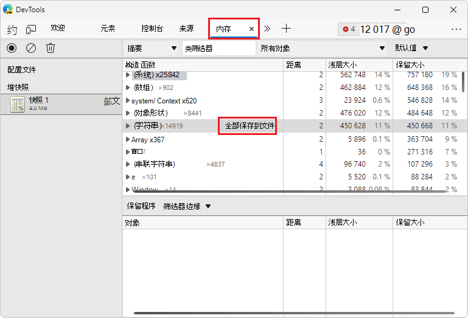

<!-- Copyright Meggin Kearney

   Licensed under the Apache License, Version 2.0 (the "License");
   you may not use this file except in compliance with the License.
   You may obtain a copy of the License at

       https://www.apache.org/licenses/LICENSE-2.0

   Unless required by applicable law or agreed to in writing, software
   distributed under the License is distributed on an "AS IS" BASIS,
   WITHOUT WARRANTIES OR CONDITIONS OF ANY KIND, either express or implied.
   See the License for the specific language governing permissions and
   limitations under the License.  -->
# <a name="record-heap-snapshots-using-the-memory-tool"></a>使用内存工具记录堆快照

使用 **内存** 工具中的堆探查器执行以下操作：
*  ) 快照 (JS 堆记录 JavaScript 堆。
*  分析内存图。
*  比较快照。
*  查找内存泄漏。

DevTools 堆探查器显示页面的 JavaScript 对象和相关 DOM 节点使用的内存分布。  另请参阅_内存术语_中[保留树](memory-101.md#objects-retaining-tree)) 的对象。

<!-- You can view the source files for the Heap Snapshots demo pages at the [MicrosoftEdge/Demos > devtools-memory-heap-snapshot](https://github.com/MicrosoftEdge/Demos/tree/main/devtools-memory-heap-snapshot) repo folder. -->
<!-- 21 hits on "devtools-memory-heap-snapshot" in this article -->


<!-- ====================================================================== -->
## <a name="take-a-snapshot"></a>拍摄快照

<!--
1. Open the __ demo page in a new tab or window.
-->

1. 在 DevTools 中，打开 **内存** 工具。

1. 在 **“选择分析类型** ”部分中，选择 **“堆快照** ”选项按钮。

1. 单击“**拍摄快照**”按钮，然后单击 **"开始"菜单**。  或者，按`Ctrl`+`E` (Windows、Linux) 或`Cmd`+`E` (macOS) 。

:::image type="content" source="../media/memory-problems-gh-nodejs-benchmarks-run-memory-heap-snapshots.msft.png" alt-text="在内存工具中选择“堆快照”分析类型。" lightbox="../media/memory-problems-gh-nodejs-benchmarks-run-memory-heap-snapshots.msft.png":::

**快照** 最初存储在呈现器进程内存中。  单击快照图标以查看快照时，快照将按需传输到 DevTools。

将快照加载到 DevTools 并已分析后，快照标题下方的数字将显示并显示 [可访问 JavaScript 对象的总大小](memory-101.md#object-sizes)。

:::image type="content" source="../media/memory-problems-gh-nodejs-benchmarks-run-memory-heap-snapshots-all.msft.png" alt-text="可访问对象的总大小。" lightbox="../media/memory-problems-gh-nodejs-benchmarks-run-memory-heap-snapshots-all.msft.png":::

> [!NOTE]
> 快照中仅包含可访问对象。  此外，创建快照始终从垃圾回收开始。


<!-- ====================================================================== -->
## <a name="clear-snapshots"></a>清除快照

单击 **“清除所有配置文件** ”图标可从 DevTools 中删除 (快照，以及与呈现器进程) 关联的任何内存。

:::image type="content" source="../media/memory-problems-gh-nodejs-benchmarks-run-memory-heap-snapshots-all-hover-clear-all-profiles.msft.png" alt-text="删除快照。" lightbox="../media/memory-problems-gh-nodejs-benchmarks-run-memory-heap-snapshots-all-hover-clear-all-profiles.msft.png":::

关闭 DevTools 窗口不会从与呈现器进程关联的内存中删除配置文件。  重新打开 DevTools 时，以前拍摄的所有快照都会重新出现在快照列表中。

> [!NOTE]
> 试用此 [分散对象](https://microsoftedge.github.io/Demos/devtools-memory-heap-snapshot/example-03.html) 示例，并使用堆探查器对其进行分析。  显示多个 (对象) 项分配。

<!-- You can view the source files for the Heap Snapshots demo pages at the [MicrosoftEdge/Demos > devtools-memory-heap-snapshot](https://github.com/MicrosoftEdge/Demos/tree/main/devtools-memory-heap-snapshot) repo folder. -->


<!-- ====================================================================== -->
## <a name="view-snapshots"></a>查看快照

从不同角度查看不同任务的快照。

**摘要视图** 显示按构造函数名称分组的对象。  使用它来查找对象 (和内存使用) 基于按构造函数名称分组的类型。  **摘要视图** 对于 **跟踪 DOM 泄漏**特别有用。

<!--todo: add profile memory problems memory diagnosis (tracking down DOM leaks) section when available  -->

**比较视图**。  显示两个快照之间的差异。  使用它来比较操作前后的两个 (或更多) 内存快照。  检查释放的内存和引用计数中的增量可确认内存泄漏的存在和原因。

**包含视图**。  允许探索堆内容。  **“包含”视图** 提供了更好的对象结构视图，有助于分析全局命名空间 (窗口中引用的对象，) 了解保留对象的内容。  使用它来分析关闭并深入了解低级别的对象。

若要在视图之间切换，请使用视图顶部的选择器。

:::image type="content" source="../media/memory-problems-gh-nodejs-benchmarks-run-memory-heap-snapshots-view-dropdown.msft.png" alt-text="切换视图选择器。" lightbox="../media/memory-problems-gh-nodejs-benchmarks-run-memory-heap-snapshots-view-dropdown.msft.png":::

> [!NOTE]
> 并非所有属性都存储在 JavaScript 堆上。  不会捕获使用运行本机代码的 getters 实现的属性。  此外，不会捕获非字符串值（如数字）。

### <a name="summary-view"></a>摘要视图

最初，快照将在“摘要”视图中打开，其中显示对象总数，可将其展开以显示实例：

:::image type="content" source="../media/memory-problems-gh-nodejs-benchmarks-run-memory-heap-snapshots-constructor-retainers.msft.png" alt-text="摘要视图。" lightbox="../media/memory-problems-gh-nodejs-benchmarks-run-memory-heap-snapshots-constructor-retainers.msft.png":::

顶级条目是“总计”行。

| 顶级条目 | 描述 |
|:--- |:--- |
| **构造函数** | 表示使用此构造函数创建的所有对象。  |
| **距离** | 使用节点的最短简单路径显示到根的距离。  |
| **浅层大小** | 显示由特定构造函数创建的所有对象的浅层大小的总和。  浅层大小是对象持有的内存大小，通常 (数组和字符串具有较大的浅) 大小。  请参阅 [对象大小](memory-101.md#object-sizes)。  |
| **保留大小** | 显示同一组对象中保留的最大大小。  删除对象后可释放的内存大小 (且依赖项不再可访问，) 称为保留大小。  请参阅 [对象大小](memory-101.md#object-sizes)。  |

<!--| **Number of object instances** | Displayed in the # column.  |  -->

在上视图中展开总行后，将显示所有实例。  对于每个实例，浅层和保留大小显示在相应的列中。  字符后 `@` 的数字是对象的唯一 ID，允许你根据每个对象比较堆快照。

* 黄色对象具有 JavaScript 引用。
* 红色对象是分离的节点。  从具有黄色背景的节点引用分离的节点。

**堆探查器中的各个构造函数 (组) 条目对应什么？**

:::image type="content" source="../media/memory-problems-gh-nodejs-benchmarks-run-memory-heap-snapshots-constructor-highlight.msft.png" alt-text="构造函数组。" lightbox="../media/memory-problems-gh-nodejs-benchmarks-run-memory-heap-snapshots-constructor-highlight.msft.png":::

| 构造函数 (组) 条目 | 描述 |
|:--- |:--- |
| ** (全局属性) ** | 全局对象之间的中间对象 (如 `window`) 和它引用的对象。  如果对象是使用构造函 `Person` 数创建的，并且由全局对象持有，则保留路径将表示为 `[global] > (global property) > Person`。  这与对象直接相互引用的规范形成鲜明对比。  存在用于性能的中间对象。  会定期修改全局，并且属性访问优化适用于非全局对象，不适用于全局对象。  |
| ** (根) ** | 保留树视图中的根条目是引用所选对象的实体。  这些也是引擎出于自身目的创建的引用。  引擎具有引用对象的缓存，但所有此类引用都较弱，并且不会阻止收集对象，因为没有真正强大的引用。  |
| ** (关闭) ** | 通过函数关闭对一组对象的引用计数。 |
| ** (数组、字符串、数字、regexp) ** | 具有引用数组、字符串、数字或正则表达式的属性的对象类型的列表。 |
| ** (编译的代码) ** | 与编译的代码相关的所有内容。  脚本类似于函数，但对应于正文 `<script>` 。  SharedFunctionInfos (SFI) 是位于函数和编译代码之间的对象。  函数通常具有上下文，而 SPI 则没有。 |
| **HTMLDivElement**、 **HTMLAnchorElement**、 **DocumentFragment** 等。  | 对代码引用的特定类型的元素或文档对象的引用。 |

<!--todo: add heap profiling summary section when available -->

### <a name="comparison-view"></a>比较视图

通过将多个快照相互比较来查找泄漏的对象。  通常，直接和反向操作的配对（例如打开文档，然后关闭文档）不应留下任何垃圾。

验证某个应用程序操作是否未创建泄漏：

1. 执行操作之前，请创建堆快照。

1. 执行操作。  也就是说，通过某种方式与可能导致泄漏的页面进行交互。

1. 执行反向操作。  也就是说，执行相反的交互并重复几次。

1. 创建第二个堆快照，并将此堆的视图更改为 **“比较**”，将其与 **快照 1** 进行比较。

在 **“比较** ”视图中，将显示两个快照之间的差异。  展开总条目时，会显示添加和删除的对象实例。

:::image type="content" source="../media/memory-problems-gh-nodejs-benchmarks-run-memory-heap-snapshots-comparison-dropdown.msft.png" alt-text="比较视图。" lightbox="../media/memory-problems-gh-nodejs-benchmarks-run-memory-heap-snapshots-comparison-dropdown.msft.png":::

<!--todo: add HeapProfilingComparison section when available  -->

### <a name="containment-view"></a>包含视图

**“包含**”视图本质上是应用程序对象结构的“鸟瞰图”。  它允许你查看函数关闭，观察虚拟机 (VM) 内部对象，这些对象共同构成 JavaScript 对象，并了解应用程序在极低级别使用的内存。

| 包含视图入口点 | 描述 |
|:--- |:--- |
| **DOMWindow 对象** | JavaScript 代码的全局对象。  |
| **GC 根** | VM 垃圾使用的实际 GC 根。  GC 根由内置对象映射、符号表、VM 线程堆栈、编译缓存、句柄范围和全局句柄组成。  |
| **本机对象** | JavaScript 虚拟机内的浏览器对象“推送” (JavaScript VM) 以允许自动化，例如 DOM 节点、CSS 规则。  |

:::image type="content" source="../media/memory-problems-gh-nodejs-benchmarks-run-memory-heap-snapshots-containment-dropdown.msft.png" alt-text="包含视图。" lightbox="../media/memory-problems-gh-nodejs-benchmarks-run-memory-heap-snapshots-containment-dropdown.msft.png":::

<!--todo: add heap profiling containment section when available  -->

### <a name="naming-functions-to-differentiate-between-closures-in-the-snapshot"></a>用于区分快照中关闭的命名函数

为函数命名，以便可以轻松区分快照中的关闭。  例如，此示例不使用命名函数：

```javascript
function createLargeClosure() {
    var largeStr = new Array(1000000).join('x');
    var lC = function() { // this is NOT a named function
        return largeStr;
    };
    return lC;
}
```

以下代码使用命名函数轻松区分快照中的关闭：

```javascript
function createLargeClosure() {
    var largeStr = new Array(1000000).join('x');
    var lC = function lC() { // this IS a named function
        return largeStr;
    };
    return lC;
}
```

#### <a name="demo-impact-of-closures-on-memory"></a>演示：关闭对内存的影响

若要分析关闭对内存的影响，请尝试以下示例：在新窗口或选项卡中打开演示网页 [为什么 `eval` 是邪恶](https://microsoftedge.github.io/Demos/devtools-memory-heap-snapshot/example-07.html) 的。

<!-- You can view the source files for the Heap Snapshots demo pages in the [MicrosoftEdge/Demos > devtools-memory-heap-snapshot](https://github.com/MicrosoftEdge/Demos/tree/main/devtools-memory-heap-snapshot) repo folder. -->

#### <a name="demo-recording-heap-allocations"></a>演示：录制堆分配

你可能还有兴趣使用以下示例跟进上述演示，该示例将引导你记录堆分配：在新窗口或选项卡中打开演示网页 [堆分配](https://microsoftedge.github.io/Demos/devtools-memory-heap-snapshot/example-08.html) 。

<!-- You can view the source files for the Heap Snapshots demo pages in the [MicrosoftEdge/Demos > devtools-memory-heap-snapshot](https://github.com/MicrosoftEdge/Demos/tree/main/devtools-memory-heap-snapshot) repo folder. -->

<!--
:::image type="content" source="../media/memory-problems-domleaks.msft.png" alt-text="Name functions to distinguish between closures." lightbox="../media/memory-problems-domleaks.msft.png":::
-->


<!-- ====================================================================== -->
## <a name="filter-a-heap-snapshot-by-node-type"></a>按节点类型筛选堆快照

使用筛选器专注于堆快照的特定部分。  例如，如果只对堆中的字符串或数组感兴趣，则可以按节点类型进行筛选。

在内 **存** 工具中查看堆快照中的所有对象时，可能很难专注于特定对象或保留路径。  查看堆快照时，请使用 **节点类型** 筛选器，只关注特定类型的节点。  例如，若要仅查看堆中的数组和字符串对象，请在 **“节点类型**”筛选器中选择 **“数组**”和 **“字符串**”条目。


<!-- ====================================================================== -->
## <a name="look-up-color-coding"></a>查找颜色编码

对象的属性和属性值具有不同的类型，并相应地着色。  每个属性有四种类型之一：

| 属性类型 | 描述 |
|:--- |:--- |
| **a： 属性** | 具有名称的常规属性，通过 `.` (点) 运算符访问，或通过 `[` `]` (括号) 表示法进行访问，例如 `["foo bar"]`。  |
| **0：元素** | 具有数值索引的常规属性，通过 `[` `]` (括号) 表示法访问。  |
| **a： context var** |  函数上下文中的变量，可通过函数关闭中的变量名称访问。  |
| **a：系统道具** | JavaScript VM 添加的属性，无法从 JavaScript 代码访问。  |

指定为 `System` 没有相应 JavaScript 类型的对象。  每个是 Javascript VM 的对象系统实现的一部分。  V8 分配与用户的 JS 对象相同的堆中的大多数内部对象。  因此，这些只是 V8 内部。


<!-- ====================================================================== -->
## <a name="find-a-specific-object"></a>查找特定对象

若要在收集的堆中查找对象，可以使用 `Ctrl`+`F` 搜索并提供对象 ID。


<!-- ====================================================================== -->
## <a name="uncover-dom-leaks"></a>发现 DOM 泄漏

堆探查器能够反映浏览器本机对象 (DOM 节点、CSS 规则) 和 JavaScript 对象之间的双向依赖关系。  这有助于发现由于被遗忘的分离 DOM 子树四处漂浮而发生的不可见泄漏。

DOM 泄漏可能比你想象的要大。  请考虑以下示例。  垃圾回收何时 `#tree` ？

```javascript
var select = document.querySelector;
var treeRef = select("#tree");
var leafRef = select("#leaf");
var body = select("body");

body.removeChild(treeRef);

//#tree in not GC yet due to treeRef
treeRef = null;

//#tree is not GC yet due to indirect reference from leafRef

leafRef = null;
//#NOW can be #tree GC
```

维护 `#leaf` 对相关父 (parentNode) 和递归到 `#tree`的引用，因此只有 `leafRef` 当为 nullified 时，才会在垃圾回收 (GC) 的候选项下 `#tree` 使用 WHOLE 树。

:::image type="content" source="../media/memory-problems-tree-gc.msft.png" alt-text="DOM 子树。" lightbox="../media/memory-problems-tree-gc.msft.png":::


### <a name="example-leaking-dom-nodes"></a>示例：泄漏 DOM 节点

请尝试此 [DOM 节点泄漏](https://microsoftedge.github.io/Demos/devtools-memory-heap-snapshot/example-06.html) 示例，了解 DOM 节点可能泄漏的位置，以及如何检测此类泄漏。

<!-- You can view the source files for the Heap Snapshots demo pages at the [MicrosoftEdge/Demos > devtools-memory-heap-snapshot](https://github.com/MicrosoftEdge/Demos/tree/main/devtools-memory-heap-snapshot) repo folder. -->


### <a name="example-dom-leaks-being-bigger-than-expected"></a>示例：DOM 泄漏大于预期

另请尝试此 [DOM 泄漏大于预期](https://microsoftedge.github.io/Demos/devtools-memory-heap-snapshot/example-09.html)的示例。

<!-- You can view the source files for the Heap Snapshots demo pages at the [MicrosoftEdge/Demos > devtools-memory-heap-snapshot](https://github.com/MicrosoftEdge/Demos/tree/main/devtools-memory-heap-snapshot) repo folder. -->


若要详细了解 DOM 泄漏和内存分析基础知识，请查看使用 Gonzalo Ruiz de Villa [的 Microsoft Edge DevTools 查找和调试内存泄漏](https://slid.es/gruizdevilla/memory)。

<!-- Example: Try this **demo** to play with detached DOM trees. -->

<!-- todo: add heap profiling dom leaks section when available -->


<!-- ====================================================================== -->
<!--[heap profiling comparison](https://developer.alphabet.com/devtools/docs/heap-profiling-comparison) -->
<!--[heap profiling containment](https://developer.alphabet.com/devtools/docs/heap-profiling-containment) -->
<!--[heap profiling DOM leaks](https://developer.alphabet.com/devtools/docs/heap-profiling-dom-leaks) -->
<!--[heap profiling summary](https://developer.alphabet.com/devtools/docs/heap-profiling-summary) -->
<!--[narrow down causes of memory leaks](../profile/memory-problems/memory-diagnosis#narrow-down-causes-of-memory-leaks) -->


<!-- ====================================================================== -->
## <a name="save-and-export-strings-from-a-heap-snapshot-to-json"></a>将堆快照中的字符串保存并导出到 JSON

在 **内存** 工具中创建堆快照时，可以将快照中的所有字符串对象导出到 JSON 文件。  在 **“内存** ”工具的 **“构造函数** ”部分中，单击条目旁边的 **“全部保存到文件** ” `(string)` 按钮：



**内存**工具导出一个 JSON 文件，其中包含堆快照中的所有字符串对象：


<!-- ====================================================================== -->
> [!NOTE]
> 此页面的某些部分是根据 [Google 创建和共享的](https://developers.google.com/terms/site-policies)作品所做的修改，并根据[ Creative Commons Attribution 4.0 International License ](https://creativecommons.org/licenses/by/4.0)中描述的条款使用。
> 原始页面 [在此](https://developers.google.com/web/tools/chrome-devtools/memory-problems/heap-snapshots) 处找到，由 [Meggin Kearney](https://developers.google.com/web/resources/contributors#meggin-kearney) (Technical Writer) 创作。

[](https://creativecommons.org/licenses/by/4.0)
本作品根据[ Creative Commons Attribution 4.0 International License ](https://creativecommons.org/licenses/by/4.0)获得许可。
