<!-- Copyright Kayce Basques

   Licensed under the Apache License, Version 2.0 (the "License");
   you may not use this file except in compliance with the License.
   You may obtain a copy of the License at

       https://www.apache.org/licenses/LICENSE-2.0

   Unless required by applicable law or agreed to in writing, software
   distributed under the License is distributed on an "AS IS" BASIS,
   WITHOUT WARRANTIES OR CONDITIONS OF ANY KIND, either express or implied.
   See the License for the specific language governing permissions and
   limitations under the License.  -->
# <a name="fix-memory-problems"></a>修复内存问题

了解如何使用 Microsoft Edge 和 DevTools 查找影响页面性能的内存问题，包括内存泄漏、内存膨胀和频繁的垃圾回收。

*  了解页面当前与Microsoft Edge浏览器任务管理器一起使用的内存量。
*  使用内存面板可视化一段时间内的 **内存** 使用情况。
*  使用 **堆快照**识别分离的 DOM 树 (内存泄漏的常见原因) 。
*  了解何时在 JavaScript 堆中分配新内存 (JS 堆) **在时间线上使用分配检测**。

另请参阅 [使用分离元素工具调试 DOM 内存泄漏](dom-leaks.md)。


<!-- ====================================================================== -->
## <a name="overview"></a>概述

本着 **RAIL** 的精神<!-- [RAIL](/profile/evaluate-performance/rail) --> 性能模型，性能工作的重点应该是你的用户。

<!--todo: add RAIL section when available  -->

内存问题非常重要，因为用户通常会察到这些问题。  用户可能会通过以下方式感知内存问题：

*  **随着时间推移，页面的性能逐渐恶化**。  这可能是内存泄漏的症状。  内存泄漏是当页面中的 bug 导致页面随时间推移逐渐使用越来越多的内存时。

*  **页面的性能一直不佳**。  这可能是内存膨胀的症状。  内存 Bloat 是页面使用比最佳页面速度所需的内存更多的内存时。

*  **页面的性能延迟或出现频繁暂停**。  这可能是频繁进行垃圾回收的症状。  垃圾回收是在浏览器回收内存时。  浏览器决定何时发生这种情况。  在集合期间，运行的所有脚本都将暂停。  因此，如果浏览器正在大量回收垃圾，脚本运行时将暂停很多。

### <a name="memory-bloat-how-much-is-too-much"></a>内存膨胀：多少是“太多”？

内存泄漏易于定义。  如果站点正在逐步使用越来越多的内存，则会发生泄漏。  但内存膨胀有点难以固定。  哪些条件是“使用过多内存”？

这里没有硬数字，因为不同的设备和浏览器具有不同的功能。  在高端智能手机上平稳运行的同一页可能会在低端智能手机上崩溃。

此处的关键是使用 RAIL 模型并专注于用户。  了解用户常用的设备，然后在这些设备上测试页面。  如果体验持续不佳，页面可能会超过这些设备的内存功能。


<!-- ====================================================================== -->
## <a name="monitor-memory-use-in-realtime-with-the-microsoft-edge-browser-task-manager"></a>使用Microsoft Edge浏览器任务管理器实时监视内存使用

使用Microsoft Edge浏览器任务管理器作为内存问题调查的起点。  Microsoft Edge浏览器任务管理器是一个实时监视器，用于告知页面当前使用的内存量。

1. 按`Shift`+`Esc`或转到Microsoft Edge主菜单，然后选择 **“更多工具** > **浏览器任务管理器**”打开Microsoft Edge浏览器任务管理器。

   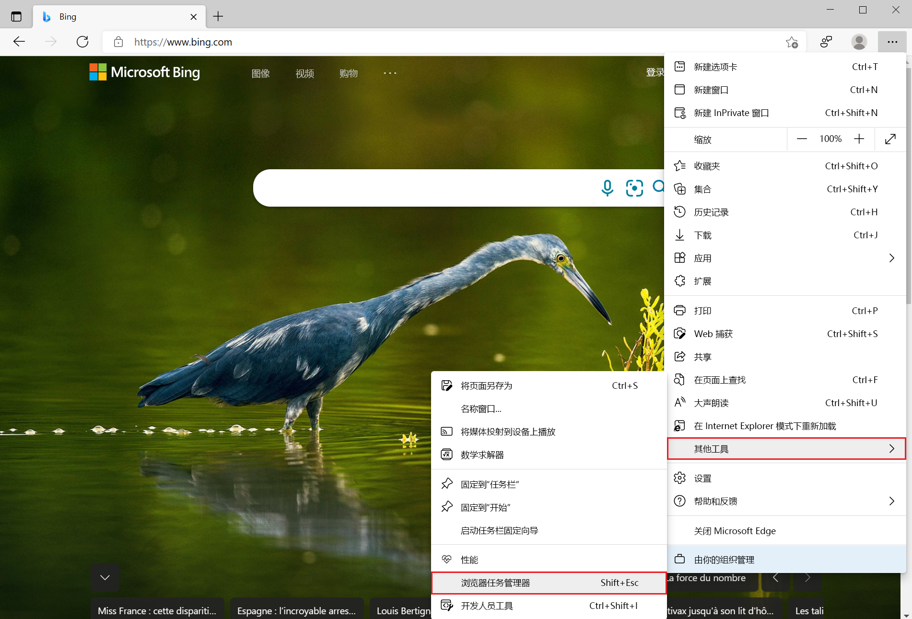

1. 右键单击Microsoft Edge浏览器任务管理器的表标题，然后启用 **JavaScript 内存**。

   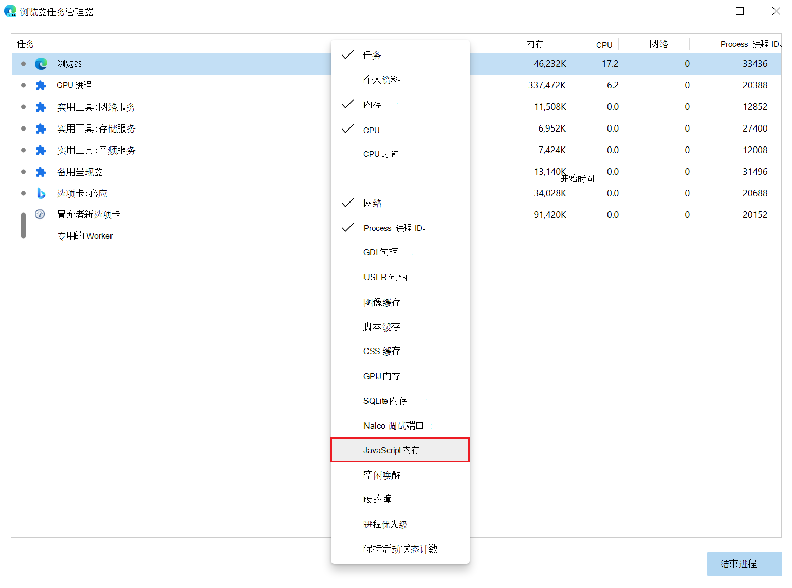

这两列告诉你有关页面如何使用内存的不同信息：

*  **内存**列表示本机内存。  DOM 节点存储在本机内存中。  如果此值正在增加，将创建 DOM 节点。

*  **JavaScript 内存**列表示 JS 堆。  此列包含两个值。  你感兴趣的值是 (括号) 中的数字的实时编号。  实时编号表示页面上可访问对象使用的内存量。  如果此数字正在增加，则会创建新对象，或者现有对象正在增长。

<!--*  live number reference: https://groups.google.com/d/msg/google-chrome-developer-tools/aTMVGoNM0VY/bLmf3l2CpJ8J  -->


<!-- ====================================================================== -->
## <a name="visualize-memory-leaks-with-performance-panel"></a>使用性能面板可视化内存泄漏

还可以使用性能面板作为调查的另一个起点。  “性能”面板可帮助你直观显示页面的内存使用情况。

1. 在 DevTools 中，打开 **“性能** ”工具。

1. 选中 **“内存** ”复选框。

1. [录制](../evaluate-performance/reference.md#record-performance)。

最好使用强制垃圾回收来开始和结束录制。  若要强制垃圾回收，请单击**回收垃圾** 录制时的按钮。

若要演示内存记录，请考虑以下代码：

```javascript
var x = [];
function grow() {
    for (var i = 0; i < 10000; i++) {
        document.body.appendChild(document.createElement('div'));
    }
    x.push(new Array(1000000).join('x'));
}
document.getElementById('grow').addEventListener('click', grow);
```

每次单击代码中引用的按钮时，将向文档正文追加 10，000 `div` 个节点，并将 1，000，000 `x` 个字符的字符串推送到数 `x` 组。  运行前面的代码示例会在 **性能** 面板中生成记录，如下图所示：

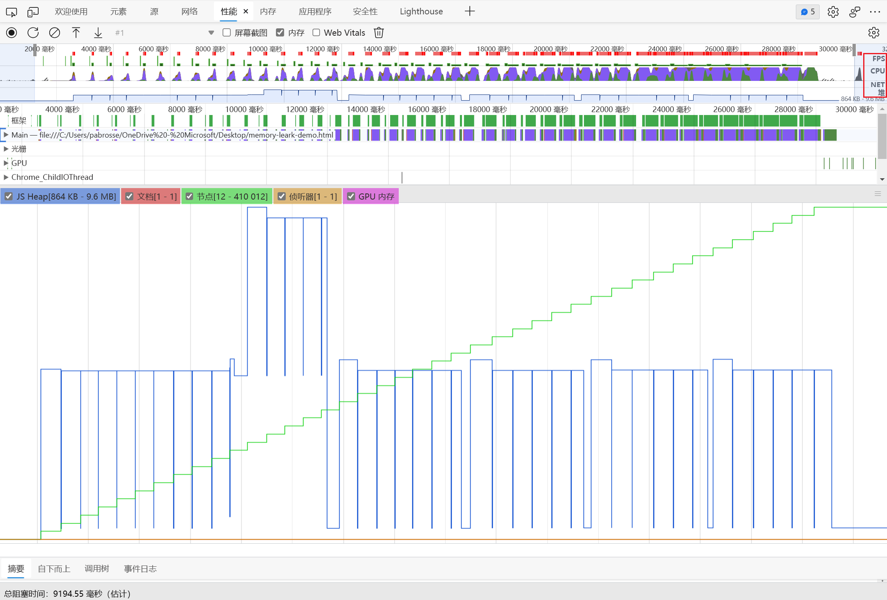

首先，用户界面的说明。  “**概述**”窗格中的 **HEAP** 图 (**NET**) 下方表示 JS 堆。  “ **概述** ”窗格下面是 **“计数器** ”窗格。  在**概述窗格**) 、文档、DOM 节点、侦听器和 GPU 内存中，JS 堆 (与 **HEAP** 图形一样分解内存使用情况。  清除复选框以将其从图形中隐藏。

现在，对代码的分析与上一个数字进行比较。  如果查看 (绿色图) 的节点计数器，它将与代码完全匹配。  节点计数在离散步骤中增加。  可以假定节点计数的每一次增加都是调用 `grow()`。

蓝色图 (JS 堆图) 并不简单。  根据最佳做法，第一次浸入实际上是强制垃圾回收 (单击**回收垃圾** 。

随着录制过程的进行，将显示 JS 堆大小峰值。  这是自然和预期的：JavaScript 代码正在单击的每个按钮上创建 DOM 节点，并且在创建 100 万个字符的字符串时会执行大量工作。

这里的关键是，JS 堆的结尾高于它开始 (“开始”在这里是强制垃圾回收) 后的点。  在现实世界中，如果看到这种增加 JS 堆大小或节点大小的模式，则可能会指示内存泄漏。

<!--todo: the Heap snapshots and Profiles panel aren't found in Edge  -->


<!-- ====================================================================== -->
## <a name="discover-detached-dom-tree-memory-leaks-with-heap-snapshots"></a>使用堆快照发现分离的 DOM 树内存泄漏

<!-- do not change the heading wording; that would break the link from the DevTools > Memory tool > Help-mode tooltip to this section; would default to top of article instead of this section anchor -->

仅当页面上运行的 DOM 树或 JavaScript 代码中没有对节点的引用时，DOM 节点才会被垃圾回收。  节点在从 DOM 树中删除时据说是“分离的”，但一些 JavaScript 仍然引用它。  分离的 DOM 节点是内存泄漏的常见原因。

本部分介绍如何使用 DevTools 中的堆探查器来标识分离的节点。

下面是分离的 DOM 节点的简单示例：

```javascript
var detachedTree;

function create() {
    var ul = document.createElement('ul');
    for (var i = 0; i < 10; i++) {
        var li = document.createElement('li');
        ul.appendChild(li);
    }
    detachedTree = ul;
}
document.getElementById('create').addEventListener('click', create);
```

单击代码中引用的按钮会创建一个 `ul` 具有 10 `li` 个子级的节点。  这些节点由代码引用，但它们不存在于 DOM 树中，因此每个节点都已分离。

堆快照是标识分离节点的一种方法。  顾名思义，堆快照显示如何在快照的时间点在页面的 JS 对象和 DOM 节点之间分布内存。

若要创建快照，请执行以下操作：

1. 打开 DevTools 并转到 **“内存** ”面板。

1. 单击 **“堆快照** ”单选按钮，然后单击面板底部的 **“拍摄快照** ”按钮。

   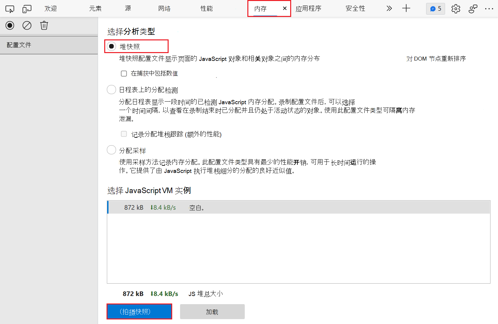

   快照可能需要一些时间来处理和加载。

1. 快照完成后，从左侧面板中选择它， (它名为 **HEAP SNAPSHOTS**) 。

1. 在 **“类筛选器** ”文本框中，键 `Detached`入以搜索分离的 DOM 树：

   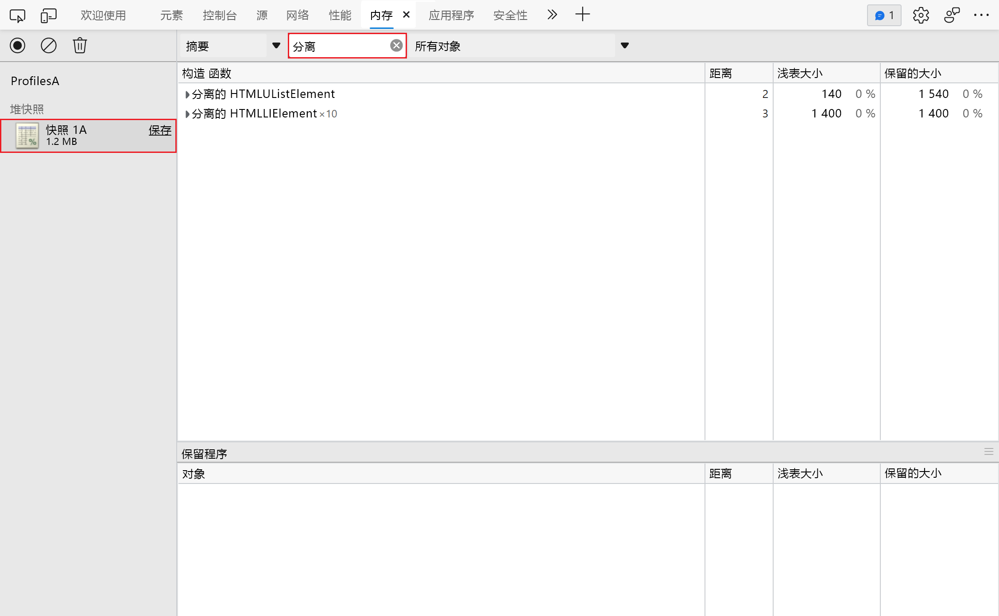

1. 展开克拉来调查分离的树：

   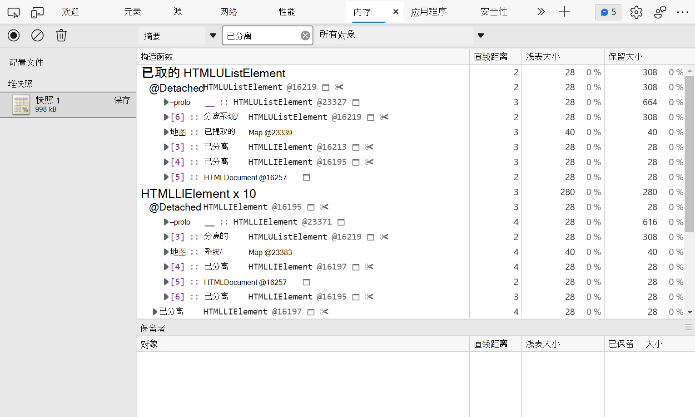

   <!--
   Nodes that are highlighted yellow have direct references to them from the JavaScript code.  Nodes that are highlighted in red don't have direct references.  They are only alive because they are part of the tree for the yellow node.  In general, you want to focus on the yellow nodes.  Fix your code so that the yellow node isn't alive for longer than it needs to be, and you also get rid of the red nodes that are part of the tree for the yellow node.
   -->

1. 单击某个节点以进一步调查它。

   在 **“对象** ”窗格中，可以看到有关引用节点的代码的详细信息。  例如，在下图中 `detachedTree` ，变量引用节点。

1. 若要修复特定的内存泄漏，请研究使用该变量的 `detachedTree` 代码，并确保在不再需要节点时删除对该节点的引用。

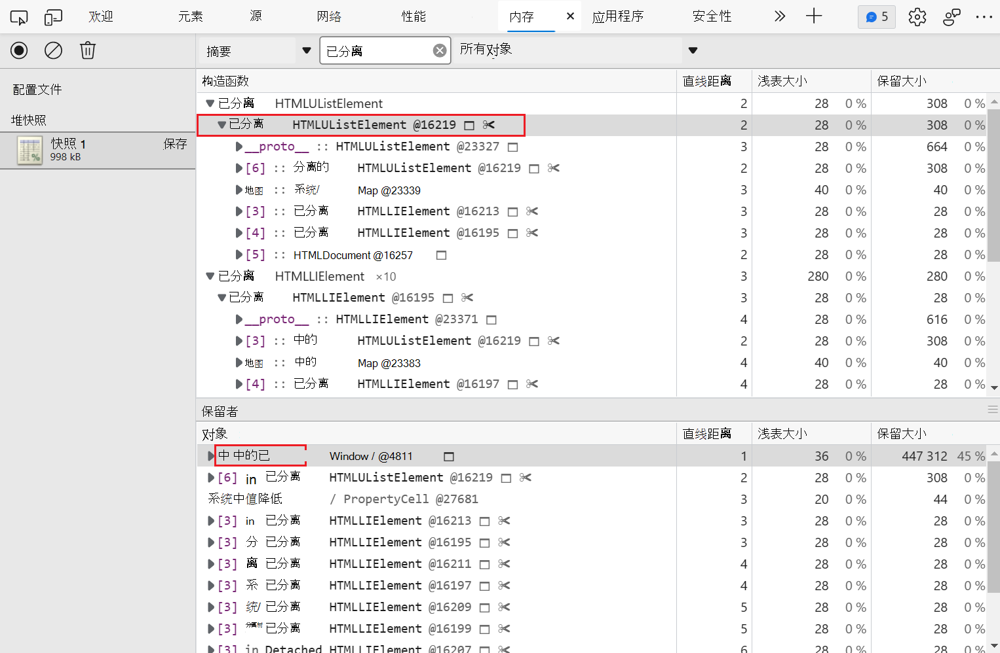

<!--todo: the allocation timeline doesn't appear in the DevTools in Edge  -->


<!-- ====================================================================== -->
## <a name="identify-js-heap-memory-leaks-with-allocation-instrumentation-on-timeline"></a>使用时间线上的分配检测识别 JS 堆内存泄漏

**时间线上的分配检测** 是另一个工具，可帮助你跟踪 JS 堆中的内存泄漏。

使用以下代码 **演示时间线上的分配检测**  ：

```javascript
var x = [];
function grow() {
    x.push(new Array(1000000).join('x'));
}
document.getElementById('grow').addEventListener('click', grow);
```

每次单击代码中引用的按钮时，都会向 `x` 数组中添加一百万个字符的字符串。

若要在时间线上记录分配检测，请执行以下操作：

1. 打开 DevTools，然后选择 **“内存** ”面板。

1. 单击时间线单选按钮**上的“分配检测**”，然后单击 **"开始"菜单**按钮。

1. 执行你怀疑导致内存泄漏的操作。

1. 完成后，单击 **“停止录制堆配置文件** 按钮。

1. 录制时，请注意时间线上是否显示任何蓝色条形图，如下图所示：

   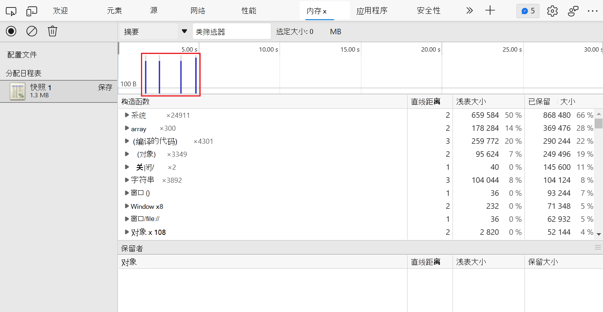

   这些蓝色条表示新的内存分配。  这些新的内存分配是内存泄漏的候选项。

1. 放大条形图以筛选 **“构造函数** ”窗格，以仅显示在指定时间范围内分配的对象。

   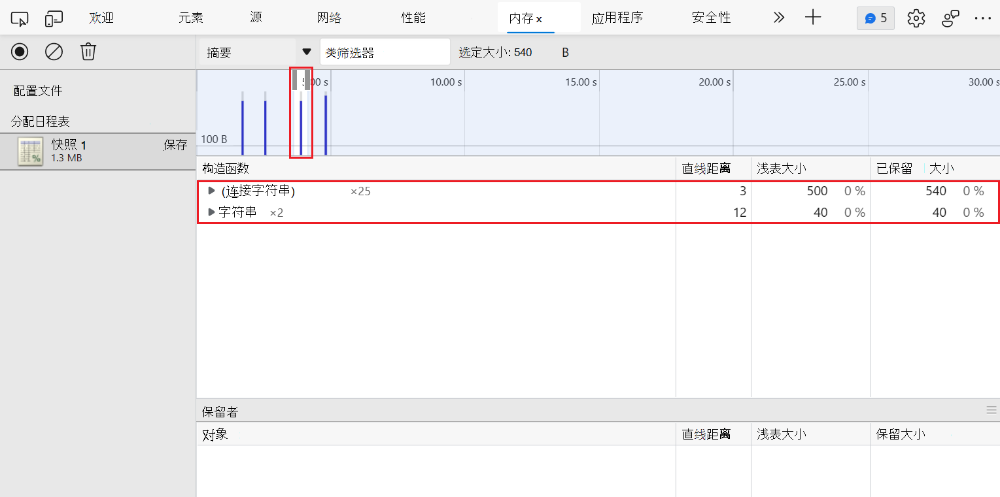

1. 展开对象并选择该值以在 **“对象** ”窗格中查看更多详细信息。

   例如，在下图中，在新分配的对象的详细信息中指示已将其分配给 `x` 范围中的 `Window` 变量：

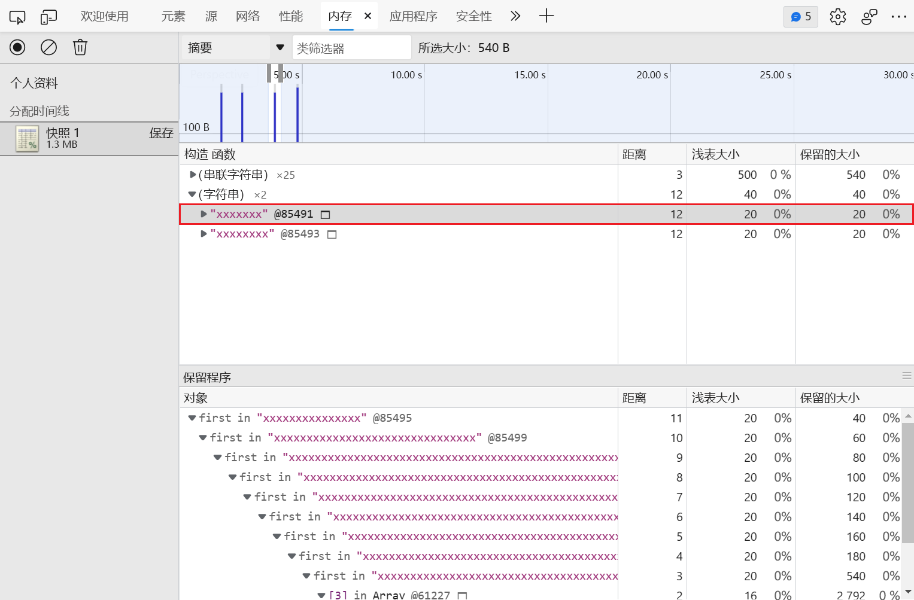


<!-- ====================================================================== -->
## <a name="investigate-memory-allocation-by-function"></a>按函数调查内存分配

使用 **分配采样** 分析类型查看 JavaScript 函数的内存分配。

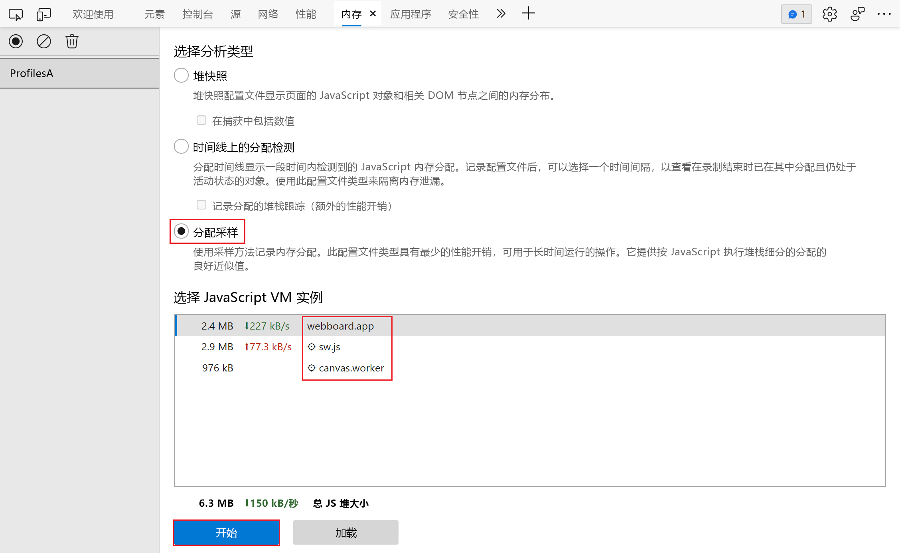

1. 单击“ **分配采样** 单选”按钮。

1. 如果页面上有辅助角色，则可以使用 **"开始"菜单**按钮旁边的下拉菜单将其选为分析目标。

1. 单击 **"开始"菜单**按钮。

1. 在网页上，执行要调查的操作。

1. 完成所有操作后，单击 **“停止** ”按钮。

DevTools 显示按函数划分的内存分配细分。  默认视图为 **“重 (自下而上”) **，显示在顶部分配最多内存的函数。

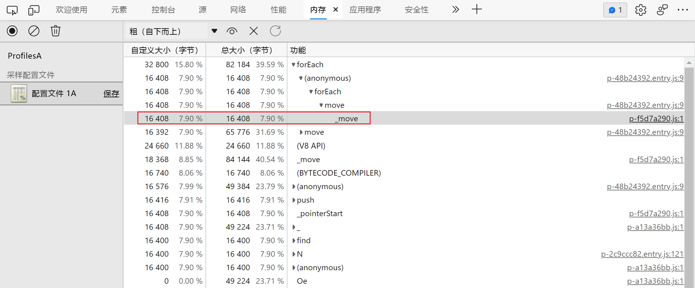


<!-- ====================================================================== -->
## <a name="spot-frequent-garbage-collections"></a>发现频繁的垃圾回收

如果页面出现频繁暂停，则可能会出现垃圾回收问题。

可以使用Microsoft Edge浏览器任务管理器或性能内存录制来发现频繁的垃圾回收。

*  在Microsoft Edge浏览器任务管理器中，经常上升和下降**的内存**或 **JavaScript 内存**值表示频繁的垃圾回收。

*  在性能记录中，频繁的更改 (JS 堆或节点计数图) 上升和下降表示频繁的垃圾回收。

确定问题后，可以在 **时间线记录中使用分配检测** 来找出分配内存的位置以及哪些函数导致分配。


<!-- ====================================================================== -->
> [!NOTE]
> 此页面的某些部分是根据 [Google 创建和共享的](https://developers.google.com/terms/site-policies)作品所做的修改，并根据[ Creative Commons Attribution 4.0 International License ](https://creativecommons.org/licenses/by/4.0)中描述的条款使用。
> 原始页面位于[此处](https://developers.google.com/web/tools/chrome-devtools/memory-problems/index)，由 [Kayce Basques](https://developers.google.com/web/resources/contributors#kayce-basques)\（Chrome DevTools 和 Lighthouse 的技术作家）撰写。

[](https://creativecommons.org/licenses/by/4.0)
本作品根据[ Creative Commons Attribution 4.0 International License ](https://creativecommons.org/licenses/by/4.0)获得许可。

<!-- [recording](/profile/evaluate-performance/timeline-tool#make-a-recording) -->
<!-- [hngd](https://jsfiddle.net/kaycebasques/tmtbw8ef/) -->
