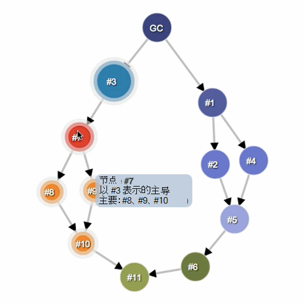

<!-- Copyright Meggin Kearney

   Licensed under the Apache License, Version 2.0 (the "License");
   you may not use this file except in compliance with the License.
   You may obtain a copy of the License at

       https://www.apache.org/licenses/LICENSE-2.0

   Unless required by applicable law or agreed to in writing, software
   distributed under the License is distributed on an "AS IS" BASIS,
   WITHOUT WARRANTIES OR CONDITIONS OF ANY KIND, either express or implied.
   See the License for the specific language governing permissions and
   limitations under the License. -->
# 内存术语

本文介绍内存分析中使用的常见术语，适用于不同语言的各种内存分析工具。

此处介绍的术语和概念是指内存 [面板](./heap-snapshots.md)。  如果你曾经使用过 Java、.NET 或其他一些内存探查器，那么本文可能是一个刷新的文章。

<!-- ====================================================================== -->
## 对象大小

将内存视为包含基元类型的图形 (数字和字符串) 关联数组 (对象) 。  内存可以直观地表示为具有多个互连点的图形，如下所示：

:::image type="content" source="../media/memory-problems-thinkgraph.msft.png" alt-text="内存的视觉表示形式。" lightbox="../media/memory-problems-thinkgraph.msft.png":::

对象可以通过两种方式保留内存：

*   直接;内存由对象本身持有。

*   隐式，通过保留对其他对象的引用。  保留对其他对象的引用的对象可防止垃圾回收器在 GC 数据库上 (这些) 。

DevTools 中的内存面板是调查内存问题的工具。 

使用"内存"面板时，可能会发现自己正在查看一些不同的信息列。  两个突出的列是 **"浅表大小****"和"保留大小"：**

:::image type="content" source="../media/memory-problems-shallow-retained.msft.png" alt-text="浅表和保留大小。" lightbox="../media/memory-problems-shallow-retained.msft.png":::

### 浅表大小

_浅表_大小是对象所持有的内存大小。

典型的 JavaScript 对象会保留一些内存以供其说明和存储即时值。  通常，只有数组和字符串可以具有明显的浅表大小。  但是，字符串和外部数组通常具有呈现器内存中的主存储，从而在 JavaScript 堆上只公开一个小包装对象。

_呈现器内存_ 是呈现已检查页面的过程的所有内存：

_呈现器内存_  = _本机内存_  + _页面的 JS 堆内存_  + _由页面启动的所有专用工作者的 JS 堆内存_

但是，即使一个小对象，也可以通过防止自动垃圾回收过程释放其他对象来间接地保留大量内存。

### 保留大小

保留__ 大小是对象删除后释放的内存大小，以及因垃圾回收根目录和 GC 根 (无法访问的依赖) 。

_垃圾回收根_由从本机代码到__ V8 VM 外部的 JavaScript 对象进行引用时 (创建为本地或全局) 的句柄。  可以在 GC 根下的堆快照内找到所有此类**** 句柄  >  **处理范围**和**GC 根**  >  **全局句柄**。  在本文档中介绍句柄而不深入介绍浏览器实现的详细信息可能会令人困惑。  垃圾回收根和句柄都不需要担心。

有许多内部 GC 根，其中大多数根对用户不感兴趣。  从应用程序的角度来看，有以下类型的根：

*   窗口全局对象 (iframe 对象) 。  在堆快照中，字段指示窗口最短保留 `distance` 路径上的属性引用数。

*   文档 DOM 树，由通过遍历文档可到达的所有本机 DOM 节点组成。  并非所有节点都有 JavaScript 包装器，但如果节点有包装器，则节点在文档处于活动状态时处于活动状态。

*   有时，对象由源工具和控制台中的调试上下文保留****，例如控制台评估**** 之后。  使用清除的控制台工具 **创建** 堆快照，在"源"工具的调试器中没有活动的 **断** 点。

>[!TIP]
> 在"内存"工具中拍摄堆 [快照之前，](./heap-snapshots.md) 请清除 **"** 控制台"工具，并停用"源"工具中的 **断** 点。  若要清除 **控制台工具** ，请运行 `clear()` 方法。

内存图以根开头，根目录可能是浏览器的对象或Node.js `window` `Global` 对象。  你无法控制如何对根对象进行垃圾回收。

:::image type="content" source="../media/memory-problems-dontcontrol.msft.png" alt-text="你无法控制如何对根对象进行垃圾回收。" lightbox="../media/memory-problems-dontcontrol.msft.png":::

从根目录无法到达的任何对象都会进行垃圾回收。

> [!NOTE]
> "浅表大小"和"保留大小"列中[显示的数量是](#retained-size)字节数。

<!-- ====================================================================== -->
## 保留树的对象

堆是互连对象的网络。  在数学世界，此结构称为_图形或__内存图_。  图形从 _通过边缘连接的_ 节点 _构造_。

为图形中的节点和边缘提供标签，如下所示：

*   _节点_ (_或_) 对象标有用于生成节点的构造函数函数的名称。 __

*   _边缘_ 使用属性 的名称 _标记_。

了解如何 [使用堆配置文件器记录配置文件](./heap-snapshots.md)。  在下图中，内存工具中堆快照记录中的一些值得注意的事项包括**Distance，** 即与垃圾回收根之间的距离。  如果几乎同一类型的所有对象都位于同一距离，而其中一些对象距离较大，那么这很值得调查。

与根之间的距离：

:::image type="content" source="../media/memory-problems-root.msft.png" alt-text="与根之间的距离。" lightbox="../media/memory-problems-root.msft.png":::

<!-- ====================================================================== -->
## Dominators

Dominator 对象由树结构组成，因为每个对象只有一个管理程序。  对象的管理者可能缺少对它所控制的对象的直接引用。  也就是说，管理器的树不是图形的跨越树。

下图中：

*   节点 1 控制节点 2。
*   节点 2 控制节点 3、4 和 6。
*   节点 3 将控制节点 5。
*   节点 5 将控制节点 8。
*   节点 6 将控制节点 7。

:::image type="content" source="../media/memory-problems-dominatorsspanning.msft.png" alt-text="管理器树结构。" lightbox="../media/memory-problems-dominatorsspanning.msft.png":::

在下图中，node `#3` 是节点 的管理者 `#10` 。  但节点也存在于从垃圾回收根 GC 到节点 `#7` 的 **每个** 简单路径 `#10` 中。 因此，如果对象存在于从根到对象的每个简单路径中，则对象 `B` `A` `B` 是对象的管理程序 `A` 。

节点 `GC` 将节点 `#1` 、 `#3` 和 `#11` ：

 
节点 `#3` 由节点和 `GC` 优势节点控制 `#7` ：

 
节点 `#7` 由节点和 `#3` 位置节点 、 `#8` `#9` 和 控制 `#10` ：

 
节点 `#8` 由节点控制 `#7` ，不会控制任何节点：

 
节点 `#10` 由节点控制 `#7` ，不会控制任何节点：

 
节点 `#11` 由节点控制 `#1` ，不会控制任何节点：

<!-- ====================================================================== -->
## V8 特定内容

分析内存时，了解堆快照为何以特定方式显示非常有用。  本节介绍一些与内存相关的主题，这些主题专门与 _V8 JavaScript_ 虚拟机相对应 (此处缩写为 _V8 VM，_ 或仅 _VM_) 。

### JavaScript 对象表示形式

在 JavaScript 中，有三种基元类型：

*   数字 (， `3.14159...` 如) 。
*   布尔值 (`true` 或 `false`) 。
*   字符串 (，如 `"Werner Heisenberg"`) 。

基元无法引用其他值，并且始终是叶节点 (也称为终止_节点) 。_

**可以将** 数字存储为：

*   SMIS 中称为小整数的直接 31 **位整数** (_SMIS_) 。

*   堆对象，称为堆 **数**。  堆编号用于存储不适合 SMI 表单的值（如双精度数）或需要对值**** 进行装箱时（例如设置其属性）。 ****

**字符串** 可以存储在两者之一：

*   **VM 堆**。

*   呈现器**内存中的外部。**  创建 _包装_ 对象并用于访问外部存储，例如，存储从 Web 接收的脚本源和其他内容，而不是复制到 VM 堆。

新 JavaScript 对象的内存从专用 JavaScript 堆或 VM 堆 (_分配) 。_  这些对象由 VM V8 的垃圾回收器管理，因此，只要至少有一个强引用，这些对象就会保持活动状态<!-- undefined term --> 。

**本机对象** - 任何不在 JavaScript 堆中的对象都称为 _本机对象_。  与堆对象相反，本机对象在其整个生命周期内不由 V8 垃圾回收器管理，并且只能使用 JavaScript 包装对象从 JavaScript 访问。

cons **string** (concatenation string) is an object that consists of pairs of strings that are stored and then joined， and is a result of concatenation.  仅根据需要 **联接 cons 字符串** 内容。  例如，需要构造联接字符串的子字符串时。

例如，如果连接 和 ，则得到一个表示连接结果的字符串，并且 `a` `b` `(a, b)` 是一个 cons 字符串。  如果稍后连接了 `d` 该结果，则得到另一个 cons 字符串 `((a, b, d)` ：。

**Arrays** - _数组_ 是一个包含数字键的对象。  数组在 V8 VM 中广泛使用，用于存储大量数据。  像字典一样使用的键值对集作为数组 **实现**。

典型的 JavaScript 对象仅存储为两种数组类型 **之** 一：

典型的 JavaScript 对象可以是两种数组类型之一：

* 用于存储命名属性的数组。
* 用于存储数值元素的数组。

当有少量属性时，这些属性将内部存储在 JavaScript 对象中。

**Map** 是描述对象种类和布局的对象。  例如，映射用于描述用于快速属性访问的隐式 [对象层次结构](https://v8.dev/blog/fast-properties)。

### 对象组

每个 _本机对象组_ 由相互引用的对象所共同决定。  例如，考虑一个 DOM 子树，其中每个节点都有一个指向相对父级的链接和指向下一个子级和下一个同级元素的链接，从而形成一个连接的图形。

请注意，本机对象不会在 JavaScript 堆中表示。  缺少表示是本机对象的大小为零的原因。  相反，会创建包装对象。

每个包装对象保存对相应本机对象的引用，用于将命令重定向到该对象。  反过来，对象组会保留包装对象。  这不会创建一个不可存储的循环，因为垃圾回收足够智能，可以释放不再引用其包装器的对象组。  但忘记释放单个包装器将保留对整个组和任何关联包装器的引用。

<!-- ====================================================================== -->
> [!NOTE]
> 此页面的某些部分是根据 [Google 创建和共享的](https://developers.google.com/terms/site-policies)作品所做的修改，并根据[ Creative Commons Attribution 4.0 International License ](https://creativecommons.org/licenses/by/4.0)中描述的条款使用。
> 原始页面位于 [此处，](https://developers.google.com/web/tools/chrome-devtools/memory-problems/memory-101) 由 [Meggin Kearney](https://developers.google.com/web/resources/contributors#meggin-kearney) (Technical Writer) 。

本作品根据[ Creative Commons Attribution 4.0 International License ](https://creativecommons.org/licenses/by/4.0)获得许可。
