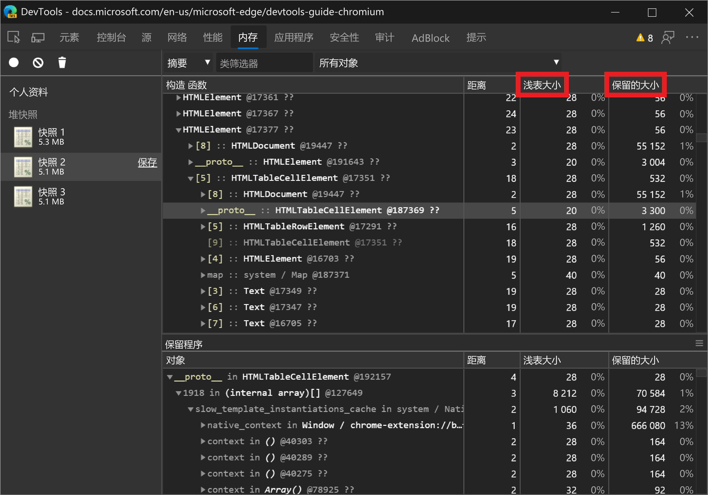
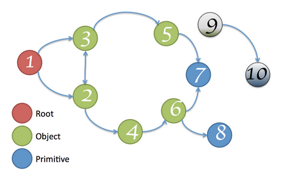

<!-- Copyright Meggin Kearney

   Licensed under the Apache License, Version 2.0 (the "License");
   you may not use this file except in compliance with the License.
   You may obtain a copy of the License at

       https://www.apache.org/licenses/LICENSE-2.0

   Unless required by applicable law or agreed to in writing, software
   distributed under the License is distributed on an "AS IS" BASIS,
   WITHOUT WARRANTIES OR CONDITIONS OF ANY KIND, either express or implied.
   See the License for the specific language governing permissions and
   limitations under the License. -->
# 内存术语

本文介绍内存分析中使用的常见术语，适用于不同语言的各种内存分析工具。

此处所述的术语和概念指的是 [“内存”面板](heap-snapshots.md)。  如果你曾经使用过 Java、.NET 或其他一些内存探查器，则本文可能是一个刷新器。

<!-- ====================================================================== -->
## 对象大小

将内存视为具有基元类型的图形 (如数字和字符串) 和对象 (关联数组) 。  内存可直观地表示为具有多个互连点的图形，如下所示：

对象可以通过两种方式保存内存：

*  直接;内存由对象本身保存。

*  隐式保存对其他对象的引用。  保存对其他对象的引用的对象可防止垃圾回收器 (GC) 自动释放这些对象。

DevTools 中的 [内存](heap-snapshots.md) 面板是用于调查内存问题的工具。

使用“内存”面板时，你可能会发现自己正在查看几列不同的信息。  突出显示的两列是 **浅层大小** 和 **保留大小**：

### 浅层大小

_浅层大小_是对象保存的内存大小。

典型的 JavaScript 对象为其说明和存储即时值保留一些内存。  通常，只有数组和字符串可以具有显著的浅浅大小。  但是，字符串和外部数组通常在呈现器内存中具有主存储，在 JavaScript 堆上只公开一个小包装器对象。

_呈现器内存_ 是呈现已检查页面的过程的所有内存：

_呈现器内存_ = _本机内存_ + 页面 + _的 JS 堆内存__页面启动的所有专用辅助角色的 JS 堆内存_

然而，即使一个小对象也可以通过防止自动垃圾回收过程释放其他对象来间接保存大量的内存。

### 保留大小

_保留大小_是删除对象后释放的内存大小，以及从垃圾回收根 (GC 根) 无法访问的依赖对象。

_垃圾回收根由_ 在从本机代码引用到 V8 VM 外部的 JavaScript 对象时 (作为本地或全局) 创建的 _句柄_ 组成。  可以在 **GC 根****句柄范围**和 **GC 根** >  > **全局句柄**下的堆快照中找到所有这些句柄。  描述本文档中的句柄而不深入了解浏览器实现的详细信息可能会令人困惑。  垃圾回收根和句柄都不是你需要担心的。

有许多内部 GC 根，其中大多数对用户来说并不有趣。  从应用程序的角度来看，有以下类型的根：

*  每个 iframe) 中的窗口全局对象 (。  在堆快照中，字 `distance` 段指示窗口的最短保留路径上的属性引用数。

*  文档 DOM 树，由通过遍历文档可访问的所有本机 DOM 节点组成。  并非所有节点都有 JavaScript 包装器，但如果节点具有包装器，则该节点在文档处于活动状态时处于活动状态。

*  有时，**源工具和****控制台**中的调试上下文会保留对象，例如在控制台评估之后。  在 **“源**”工具的调试器中，使用已清除的**控制台**工具和没有活动断点创建堆快照。

>[!TIP]
> 在 [内存](heap-snapshots.md) 工具中创建堆快照之前，请清除 **控制台** 工具并停用 **“源** ”工具中的断点。  若要清除 **控制台** 工具，请运行该 `clear()` 方法。

内存图以根开头，根可能是 `window` 浏览器的对象或 `Global` Node.js模块的对象。  你无法控制根对象的垃圾回收方式。

任何无法从根目录访问的东西都会被垃圾回收。

> [!NOTE]
> 浅 [层大小](#shallow-size) 和 [保留大小](#retained-size) 列中显示的数字是字节数。

<!-- ====================================================================== -->
## 保留树的对象

堆是互连对象的网络。  在数学世界中，此结构称为 _图形_ 或 _内存图_。  图形是从由边缘连接的 _节点_ 构造 _的_。

为图形中的节点和边缘提供标签，如下所示：

*  _节点_ (或 _对象_) 使用用于生成它们的 _构造函_ 数的名称进行标记。

*  _边缘_ 使用 _属性_名称进行标记。

了解 [如何使用堆探查器记录配置文件](heap-snapshots.md)。  在下图中， [内存](heap-snapshots.md) 工具中的堆快照录制中的一些值得注意的内容包括 **距离**垃圾回收根目录的距离距离。  如果几乎所有相同类型的对象都位于相同的距离，并且少数对象位于更大的距离，则值得调查。

与根的距离：

<!-- ====================================================================== -->
## 控制器

控制器对象由树结构组成，因为每个对象只有一个控制器。  对象的统治者可能缺乏对其主导的对象的直接引用。  也就是说，统治者的树不是图形的跨行树。

下图：

*  节点 1 主导节点 2。
*  节点 2 主导节点 3、4 和 6。
*  节点 3 主导节点 5。
*  节点 5 主导节点 8。
*  节点 6 主导节点 7。

在下图中，节点 `#3` 是节 `#10`点的控制者。  但是，从垃圾回收根 **GC** 到节点的每个简单路径中也都存在节`#7`点。`#10` 因此， `B` 如果对象存在于从根到对象 `A` 的每个简单路径中，则对象 `B` 是对象的控制者 `A`。

节点 `GC` 主导节点 `#1`， `#3`并且 `#11`：

 
节点 `#3` 以节点 `GC` 为主，并主导节点 `#7`：

 
节点 `#7` 以节点 `#3` 为主，并主导节点 `#8`， `#9`并且 `#10`：

 
`#8`节点以节点`#7`为主，不主导任何节点：

 
`#10`节点以节点`#7`为主，不主导任何节点：

 
`#11`节点以节点`#1`为主，不主导任何节点：

<!-- ====================================================================== -->
## V8 细节

分析内存时，了解堆快照以某种方式显示的原因很有帮助。  本部分介绍一些与内存相关的主题，这些主题专门与 _V8 JavaScript 虚拟机_ 相对应， (在此处缩写为 _V8 VM_，或者只是 _VM_) 。

### JavaScript 对象表示形式

在 JavaScript 中，有三种基元类型：

*  数字 (如 `3.14159...`) 。
*  布尔 (`true` 或 `false`) 。
*  字符串 (，例如 `"Werner Heisenberg"`) 。

基元不能引用其他值，并且始终是叶节点 (也称为 _终止节点_) 。

**数字** 可以存储为以下任一：

*  称为 **小型整数** 的即时 31 位整数值 (_SMIs_) 。

*  堆对象，称为 **堆号**。  堆数用于存储不适应 SMI 窗体的值，例如 **双倍**值或需要 **装箱**值时，例如在该窗体上设置属性。

**字符串** 可以存储在以下任一项中：

*  **VM 堆**。

*  **呈现器内存**的外部。  创建 _包装器对象_ 并用于访问外部存储，例如，脚本源和从 Web 接收的其他内容存储在 VM 堆中，而不是复制到 VM 堆中。

新的 JavaScript 对象的内存是从专用 JavaScript 堆 (或 _VM 堆_) 分配的。  这些对象由 VM V8 的垃圾回收器管理，因此，只要至少有一个强引用，这些对象就会保持活动状态<!-- undefined term --> 对他们。

**本机对象** - 任何不在 JavaScript 堆中的东西都称为 _本机对象_。  与堆对象相反，本机对象在其整个生存期内不由 V8 垃圾回收器管理，只能使用 JavaScript 包装器对象从 JavaScript 访问。

 (串联字符串) 的 **cons 字符串** 是一个对象，该对象由存储后联接的字符串对组成，并且是串联的结果。  **缺点字符串**内容的联接仅根据需要进行。  例如，当需要构造联接字符串的子字符串时。

例如，如果连接 `a` ， `b`则会获得一个字符串，该字符串 `(a, b)` 表示串联的结果，并且是一个缺点字符串。  如果后来与该结果串联 `d` ，则会获得另一个缺点字符串： `((a, b, d)`。

**数组** - 数 _组_ 是具有数值键的对象。  在 V8 VM 中广泛使用数组来存储大量数据。  像字典一样使用的键值对集作为 **数组**实现。

典型的 JavaScript 对象仅存储为两种 **数** 组类型之一：

典型的 JavaScript 对象可以是两种数组类型之一：

* 用于存储命名属性的数组。
* 用于存储数值元素的数组。

当有少量属性时，这些属性将内部存储在 JavaScript 对象中。

**Map** 是一个对象，用于描述它的对象类型和布局。  例如，地图用于描述用于 [快速访问属性](https://v8.dev/blog/fast-properties)的隐式对象层次结构。

### 对象组

每个 _本机对象组_ 由相互引用的对象组成。  例如，请考虑一个 DOM 子树，其中每个节点都有指向相对父级的链接，并链接到下一个子级和下一个同级，从而形成连接的图形。

请注意，本机对象未在 JavaScript 堆中表示。  缺少表示形式是本机对象大小为零的原因。  而是创建包装器对象。

每个包装器对象都包含对相应本机对象的引用，以便将命令重定向到该对象。  反过来，对象组会保留包装器对象。  这不会创建一个无法收集的周期，因为垃圾回收足够智能，可以释放不再引用其包装器的对象组。  但是，忘记释放单个包装器会包含对整个组和任何关联包装器的引用。

<!-- ====================================================================== -->
## 周期

_周期_ 是至少在保留器路径中显示两次的节点。
节点的一个外观早于保留器路径，该节点的其他外观稍后会出现在保留器路径中。

若要释放内存，最重要的是删除首先出现在保留器路径中的节点的出现。
节的第二个和可能的后续显示仍显示在 **“保留器** ”部分中。

### 使用筛选器隐藏周期

循环显示在堆快照的 **“保留器** ”部分中。
为了帮助简化保留器路径，**内存**工具中的 **“保留器**”部分具有用于隐藏周期的筛选器。

在 **“保留器** ”部分中，循环节点通过灰显来指示。

在下图中，在 **“筛选器边缘** ”下拉菜单中，未选择 **“隐藏周期** ”，因此会显示)  (灰显的循环节点：

在 **“筛选器边缘** ”下拉菜单中，选择了 **“隐藏循环** ”，因此不显示循环节点：

### 使用筛选器隐藏内部节点

若要筛选出内部节点的显示，以便它们不会显示在 **“保留器** ”部分中，请在 **“筛选器边缘** ”下拉菜单中选择 **“隐藏内部**”。
_内部节点_ 是特定于 V8 (Microsoft Edge) 中的 JavaScript 引擎的对象。

<!-- ====================================================================== -->
> [!NOTE]
> 此页面的某些部分是根据 [Google 创建和共享的](https://developers.google.com/terms/site-policies)作品所做的修改，并根据[ Creative Commons Attribution 4.0 International License ](https://creativecommons.org/licenses/by/4.0)中描述的条款使用。
> 原始页面 [在此](https://developer.chrome.com/docs/devtools/memory-problems/memory-101/) 处找到，由 [Meggin Kearney](https://developers.google.com/web/resources/contributors#meggin-kearney) (Technical Writer) 创作。

本作品根据[ Creative Commons Attribution 4.0 International License ](https://creativecommons.org/licenses/by/4.0)获得许可。
