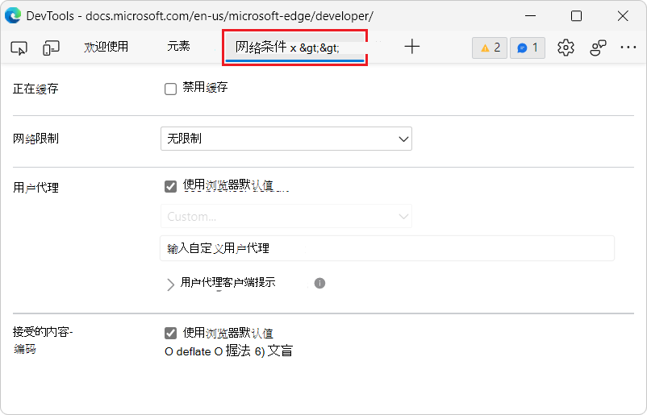

# 网络条件工具

使用 **网络条件** 工具执行以下操作：
*  禁用浏览器缓存。
*  设置网络限制。
*  设置用户代理字符串。
*  设置 Content-Encodings，如 deflate、gzip 和 br。

<!-- ====================================================================== -->
## 禁用浏览器缓存

请参阅[网络功能参考中的从网络条件箱禁用](../network/reference.md#disable-the-browser-cache-from-the-network-conditions-drawer)_浏览器缓存_。

<!-- ====================================================================== -->
## 设置网络限制

请参阅[网络功能参考中的模拟来自网络条件箱](../network/reference.md#emulate-slow-network-connections-from-the-network-conditions-drawer)_的慢速网络连接_。

<!-- ====================================================================== -->
## 设置用户代理字符串

请参阅：
* [在模拟移动设备和](../device-mode/index.md#set-the-user-agent-string) 设备仿真 (_中设置用户) _。
* [替代用户代理字符串](../device-mode/override-user-agent.md)。
* [在网络功能参考中设置](../network/reference.md#set-user-agent-client-hints)_用户代理客户端提示_。

<!-- ====================================================================== -->
## 设置 Content-Encodings，如 deflate、gzip 和 br

请参阅 [使用 Lighthouse](../speed/get-started.md#enable-text-compression) _优化网站速度中的启用文本压缩_。

<!-- ====================================================================== -->
## 另请参阅

以下"新增功能"条目提供了其他信息：

* [更轻松地自定义 User-Agent](../whats-new/2021/07/devtools.md#easier-customization-of-user-agent-client-hints) _93 (Microsoft Edge中的_新增功能中的客户端) 。
* [User-Agent Client Hints for devices in the Network conditions tab](../whats-new/2021/05/devtools.md#user-agent-client-hints-for-devices-in-the-network-conditions-tab) in _What's New In DevTools (Microsoft Edge 92) _.
* [在](../whats-new/2021/04/devtools.md#new-options-to-configure-content-encodings-in-the-network-conditions-tool) 91 年 9 月 1 日，在"开发工具中的新增功能"中的"网络条件"工具中配置 (Microsoft Edge_编码) _。
* [更新User-Agent](../whats-new/2019/12/devtools.md#updated-user-agent-strings) _DevTools (Microsoft Edge 80 中的_新增功能中的) 。
