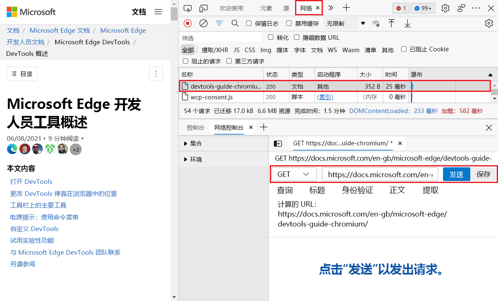

# 使用网络控制台工具撰写和发送 Web API 请求

使用 **网络控制台** 工具发送 Web API 请求。  例如，在开发和测试 Web API 时，请使用 **网络控制台** 工具。

若要测试 URL，请执行以下操作：

1. 要打开 DevTools，请右击网页，然后选择“**检查**”。  或者，按“`Ctrl`+`Shift`+`I`”(Windows、Linux)或“`Command`+`Option`+`I`”(macOS)。  DevTools 随即打开。

1. 在 DevTools 中，在主工具栏或底部的抽屉工具栏上，选择 **“网络控制台** ”选项卡。 如果该选项卡不可见，请单击“ **更多”选项卡** () 按钮，或者“ **更多工具** () 按钮。

   网络控制台工具随即打开：

   

1. 在网络控制台工具的主窗格中，单击 **“创建请求**”。

1. 在 **“无标题请求** ”文本框中，输入要测试的 URL。

1. 在 **GET** 下拉列表中，选择 REST 方法： **GET**、 **HEAD**、 **POST**、 **PUT** 或 **PATCH**。

1. （可选）在 **“查询** ”部分中，单击 **“键** ”和 **“值** ”文本框并输入键/值对：

   

   输入键/值对时 **，计算 URL** 会更新。

1. 单击“ **发送** ”按钮。

<!-- ====================================================================== -->
## 从网络工具开始

若要从**网络**工具开始使用**网络控制台**，请执行以下操作：

1. 转到网页进行测试。

1. 要打开 DevTools，请右击网页，然后选择“**检查**”。  或者，按“`Ctrl`+`Shift`+`I`”(Windows、Linux)或“`Command`+`Option`+`I`”(macOS)。  DevTools 随即打开。

1. 在 DevTools 的主工具栏上，选择 **“网络** ”选项卡。 如果该选项卡不可见，请单击“ **更多”选项卡** () 按钮，或者“ **更多工具** () 按钮。

1. 刷新网页。

   **网络**工具显示用于构造网页的资源。

1. 右键单击要更改和重新发送的网络请求，然后选择 **“编辑”和“重新发送**”：

   

   资源在 DevTools 底部抽屉的 **网络控制台** 工具中打开。

1. 在 **网络控制台**中编辑网络请求信息，然后单击“ **发送** ”按钮：

   

   <!-- Another screenshot (used by Experimental Features article)

    -->

<!-- ====================================================================== -->
## 保存和导出集合、环境和环境变量

您可以：
*  保存和导出集合。
*  保存和导出环境。
*  编辑和导出环境变量集。

输入新环境的名称：

选择新环境的格式：

**网络控制台**工具与 [Postman v2.1](https://schema.getpostman.com/json/collection/v2.1.0/docs/index.html) 和 [OpenAPI v2](https://swagger.io/specification/v2) 架构兼容。

另请参阅：
* [使用网络控制台保存和导](../whats-new/2020/10/devtools.md#save-and-export-using-the-network-console)出 _DevTools 中的新增功能 (Microsoft Edge 87) _

<!-- ====================================================================== -->
<!-- ## See also -->

<!-- * [edge-devtools-network-console repo](https://github.com/microsoft/edge-devtools-network-console) -->
