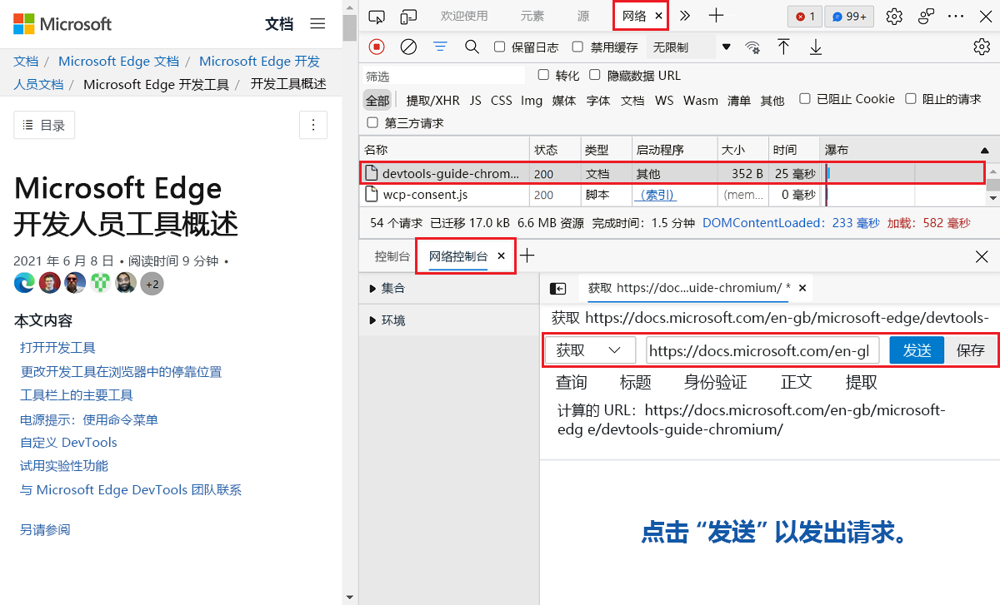

# 使用网络控制台工具撰写和发送 Web API 请求

使用 **网络控制台** 工具发送 Web API 请求。  例如， **在开发和测试** Web API 时，请使用网络控制台工具。

若要测试 URL：

1. 若要打开 DevTools，请右键单击该网页，然后选择"检查 **"**。  或者，按 `Ctrl`++`Shift``I` (Windows、Linux) 或 (`I` `Command`+`Option`+macOS) 。  将打开 DevTools。

1. 在 DevTools 中，在主工具栏或底部的"箱"工具栏上，选择"网络**控制台"** 选项卡。 如果该选项卡不可见，请单击"更多选项卡" (**** 更多选项卡"图标](../media/more-tabs-icon-light-theme.png)。****) 按钮 

1. 在网络控制台工具的主窗格中，单击" **创建请求"**。

1. 在 **"无提示请求"** 文本框中，输入要测试的 URL。

1. 在 **"GET** "下拉列表中，选择 REST 方法： **GET**、 **HEAD**、 **POST**、 **PUT** 或 **PATCH**。

1. （可选）在"查询 **"** 部分，单击 **"键** "和" **值** "文本框并输入键/值对：

   

   输入 **键** /值对时，将更新计算 URL。

1. 单击" **发送"** 按钮。

<!-- ====================================================================== -->
## 从"网络"工具开始

若要从 **"网络"工具** 开始使用 **网络控制台** ，请执行以下操作：

1. 转到网页进行测试。

1. 若要打开 DevTools，请右键单击该网页，然后选择"检查 **"**。  或者，按 `Ctrl`++`Shift``I` (Windows、Linux) 或 (`I` `Command`+`Option`+macOS) 。  将打开 DevTools。

1. 在 DevTools 中，在主工具栏上，选择"网络 **"** 选项卡。 如果该选项卡不可见，请单击"更多选项卡" (**** 更多选项卡"图标](../media/more-tabs-icon-light-theme.png)。****) 按钮 

   资源将在 DevTools **底部的** "箱"中的"网络控制台"工具中打开。

1. 在 **网络控制台中**，编辑网络请求信息，然后单击"发送 **"** 按钮：

   

   <!-- Another screenshot (used by Experimental Features article)

    -->

<!-- ====================================================================== -->
<!-- ## See also -->

<!-- * [edge-devtools-network-console repo](https://github.com/microsoft/edge-devtools-network-console) -->
