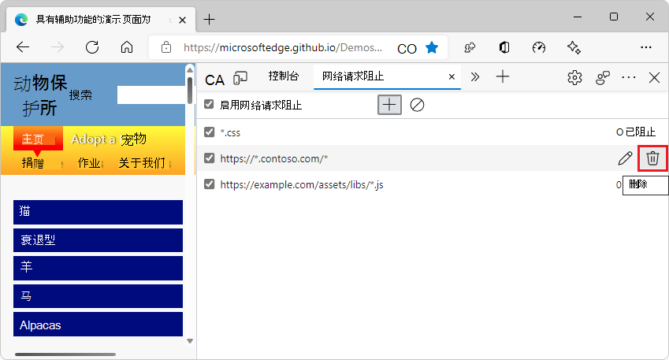

# <a name="network-request-blocking-tool"></a>网络请求阻止工具

使用 **网络请求阻止** 工具检查当某些资源（如图像文件、JavaScript 文件、字体或 CSS 样式表）不可用时网页的外观和行为。  使用此工具可测试阻止对指定 URL 模式的网络请求，并查看网页的行为方式。

当 _网页依赖于 HTML_ 网页外的其他服务器上承载的外部资源时，有时某些用户可能无法响应或无法使用这些服务器。 发生这种情况时，Web 浏览器可能无法检索网页依赖的一些资源。  检查在外部资源无法加载时网页的行为方式非常重要。  测试网页是否正常处理缺少的资源，或向用户显示损坏。

创建阻止的网络请求并测试网页后，可以编辑或删除阻止的网络请求。


<!-- ====================================================================== -->
## <a name="block-a-network-request"></a>阻止网络请求

要阻止网络请求，请运行：

1. 转到要阻止其网络请求的网页。

1. 若要打开 DevTools，请右键单击该网页，然后选择"检查 **"**。  或者，按 `Ctrl`++`Shift``I` (Windows、Linux) 或 (`I` `Command`+`Option`+macOS) 。

1. 在 DevTools 中的主工具栏上，单击"**网络请求阻止"** 选项卡。 如果该选项卡不可见，请单击"更多选项卡" (**** 更多选项卡"图标](../media/more-tabs-icon-light-theme.png)。****) 按钮 。) 按钮。  自动 **选中"启用网络请求阻止** "复选框。

1. 在 **"用于阻止网络请求** 的文本模式"文本框中，键入要阻止的网络请求的 URL。  可以键入完整 URL，或将其部分替换为 进行 `*` 通配符模式匹配。

1. 单击" **添加"** 按钮：

   


<!-- ====================================================================== -->
## <a name="delete-a-blocked-network-request"></a>删除阻止的网络请求

删除特定网络阻止请求：

*  在"**网络请求阻止**"表中，将鼠标****按钮) 按钮：

   


若要一次删除所有网络阻止请求，请运行：

*  在工具栏中，单击"删除**所有模式 (**按钮。


<!-- ====================================================================== -->
## <a name="modify-a-blocked-network-request"></a>修改阻止的网络请求

若要更改现有阻止的网络请求，请运行：

*  在"**网络请求阻止"** 表中，将鼠标****

   


<!-- ====================================================================== -->
## <a name="toggle-network-request-blocking"></a>切换网络请求阻止

切换网络请求阻止而无需删除并重新创建所有阻止的网络请求：

*  在工具栏中，选中或清除" **启用网络请求阻止"** 复选框：

   


<!-- ====================================================================== -->
## <a name="block-a-network-request-by-using-the-network-tool"></a>使用网络工具阻止网络请求

您可以使用网络请求阻止工具或网络工具阻止网页提出的**网络**请求。****

若要使用网络工具阻止网络 **请求** ，请执行以下操作：

1. 转到要阻止其网络请求的网页。

1. 若要打开 DevTools，请右键单击该网页，然后选择"检查 **"**。  或者，按 `Ctrl`++`Shift``I` (Windows、Linux) 或 (`I` `Command`+`Option`+macOS) 。  将打开 DevTools。

1. 在 DevTools 中的主工具栏上，单击"网络 **"** 选项卡。 如果该选项卡不可见，请单击"更多选项卡" (**** 更多选项卡"图标](../media/more-tabs-icon-light-theme.png)。****) 按钮 


<!-- ====================================================================== -->
## <a name="try-the-network-request-blocking-tool"></a>尝试网络请求阻止工具

若要尝试 **网络请求阻止工具** ，请执行以下操作：

1. 在单独的窗口或选项卡中，转到 [辅助功能测试演示网页](https://microsoftedge.github.io/Demos/devtools-a11y-testing/)。

1. 若要打开 DevTools，请右键单击该网页，然后选择"检查 **"**。  或者，按 `Ctrl`++`Shift``I` (Windows、Linux) 或 (`I` `Command`+`Option`+macOS) 。  将打开 DevTools。

1. 在 DevTools 中，在主工具栏上，选择"**网络请求阻止"** 选项卡。 如果该选项卡不可见，请单击"更多选项卡" (**** 更多选项卡"图标](../media/more-tabs-icon-light-theme.png)。****) 按钮 

1. 在"网络**请求阻止** **** 。) 图标或"添加模式"按钮（如果显示）。

1. 在 **"用于阻止匹配请求的文本** 模式"文本框中，粘贴以下 URL 路径，然后单击"添加 **"** 按钮：

   ```http
   https://microsoftedge.github.io/Demos/
   ```
   
1.  刷新页面。  现在，页面中的大多数元素都未显示，并且许多网络请求被指示为已阻止：

    

1. 单击"**删除所有模式 (**) 图标，然后单击"刷新 **"**。  重新显示页面内容。
