<!-- Copyright Kayce Basques

   Licensed under the Apache License, Version 2.0 (the "License");
   you may not use this file except in compliance with the License.
   You may obtain a copy of the License at

       https://www.apache.org/licenses/LICENSE-2.0

   Unless required by applicable law or agreed to in writing, software
   distributed under the License is distributed on an "AS IS" BASIS,
   WITHOUT WARRANTIES OR CONDITIONS OF ANY KIND, either express or implied.
   See the License for the specific language governing permissions and
   limitations under the License. -->
# 检查网络活动

使用 **网络** 工具确保网页需要运行的资源按预期下载，并正确发送对服务器端 API 的请求。  检查单个 HTTP 请求和响应的属性，例如 HTTP 标头、内容或大小。

此为 **网络** 工具的分步教程演练，用于检查页面的网络活动。

有关与网络相关的 DevTools 功能的概述，请参阅 [网络功能参考](reference.md)。

有关本教程的视频版本，请查看以下视频：

<!-- TODO: entire section needs a Microsoft Edge DevTools rewrite  -->

<!-- Read on, or watch the video version of this tutorial: [!VIDEO embed/e1gAyQuIFQo] -->

<!-- ====================================================================== -->
## 何时使用网络工具

一般情况下，当需要确保资源正确下载且服务器端 API 的请求按预期发送时，请使用网络工具。  **网络**工具最常见的用例是：

*  确保正在实际下载资源。

*  验证服务器端 API 调用的请求参数和响应。

如果正在寻找提高页面负载性能的方法， **网络** 工具可以帮助了解下载数据的数量以及下载数据所需的时间，但还有许多其他类型的负载性能问题与网络活动无关。  若要进一步调查页面加载性能问题，可以使用 **性能工具**、 **问题** 工具和 **Lighthouse** 工具，因为它提供有关如何改进页面的有针对性的建议。  例如，请参阅 [使用 Lighthouse 优化网站速度](../speed/get-started.md)。

<!-- ====================================================================== -->
## 打开网络工具

要充分利用本教程，请打开演示并试用演示页面上的功能。

1. 在新的选项卡或窗口中打开“[检查网络活动演示](https://microsoftedge.github.io/Demos/network-tutorial/)”:

   

   <!-- You can view the source files for this demo in the [MicrosoftEdge/Demos > devtools-css-get-started](https://github.com/MicrosoftEdge/Demos/tree/main/network-tutorial) repo folder: -->

   <!--
   
   -->

1. 要打开 DevTools，请右击网页，然后选择“**检查**”。  或者，按“`Ctrl`+`Shift`+`J`”(Windows、Linux)或“`Command`+`Option`+`J`”(macOS)。  DevTools 随即打开。

1. 在 DevTools 的主工具栏上，选择 **“网络** ”选项卡。 如果该选项卡不可见，请单击“ **更多工具** ” () 按钮：

   你可能更愿意 [将 DevTools 停靠到窗口底部](../customize/placement.md):

   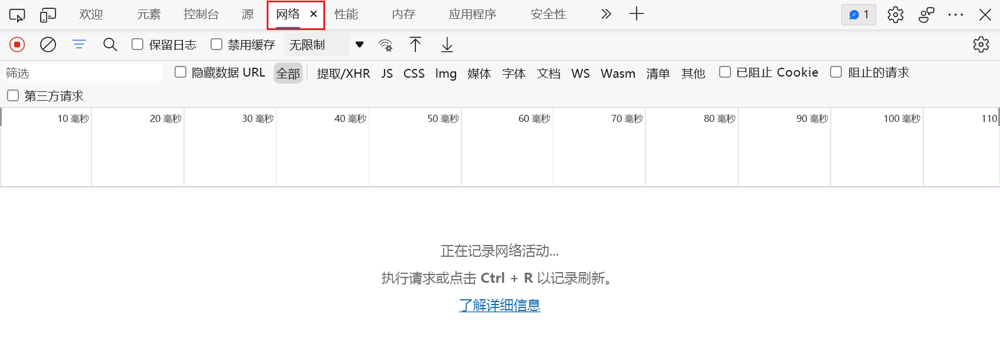

**网络** 工具最初为空。  DevTools 仅在打开后才记录网络活动，自打开 DevTools 以来未发生任何网络活动。

<!-- ====================================================================== -->
## 了解网络工具用户界面

网络工具分为三个主要部分：

* 顶部工具栏包含用于自定义工具和筛选网络请求的选项。
* 在顶部工具栏下方，“ **概述** ”图提供了一段时间内网络流量的高级概述，并允许筛选网络请求。
* 在 **“概述** ”图下， **“网络日志** ”部分显示网络活动并允许检查单个请求。

<!-- ====================================================================== -->
## 记录网络活动

查看页面导致的网络活动：

1. 刷新网页。  **网络**工具记录**网络日志**中的所有网络活动：

   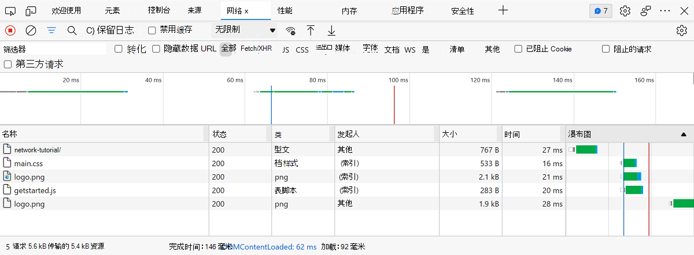

   **网络日志**的每一行表示一个资源。  默认情况下，按时间顺序列出资源。  顶部资源通常是主 HTML 文档。  底部资源是最后请求的任何资源。

   每个列表示有关资源的信息。  上图会显示默认列。

    *  **状态**。  响应的 HTTP 状态代码。

    *  **类型**。  资源类型。

    *  **发起程序**。  资源请求的原因。  点击“**发起程序**”列中的链接会转到导致请求的源代码。

    *  **时间**。  请求的持续时间。

    *  **粘滞键**。  请求的不同阶段的图形表示形式。  要显示细目，请将鼠标悬停在“**瀑布图**”上。

    请注意，“ **概述** ”图还显示了网络活动。  本教程不会使用 **概述** 图，因此可以将其隐藏。  请参阅 [隐藏概述窗格](reference.md#hide-the-overview-pane)。

   打开 DevTools 后，它会记录 **网络日志** 中的网络活动。

1. 若要演示这一点，请首先查看**网络日志** 的底部，并记下上一次活动。

1. 现在，点击演示中的“**获取数据**”按钮。

1. 再次查看**网络日志** 的底部。  会显示名为 `getstarted.json` 的新资源:

   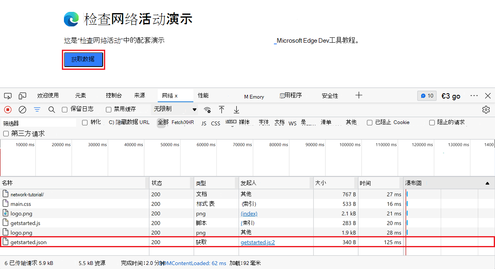

<!-- ====================================================================== -->
## 显示详细信息

网络日志的列是可配置的。  可以隐藏未使用的列。  还有许多默认隐藏的列，你可能会发现这些列很有用。

1. 右击网络日志表的标题，然后选择“**域**”。  现在会显示每个资源的域:

   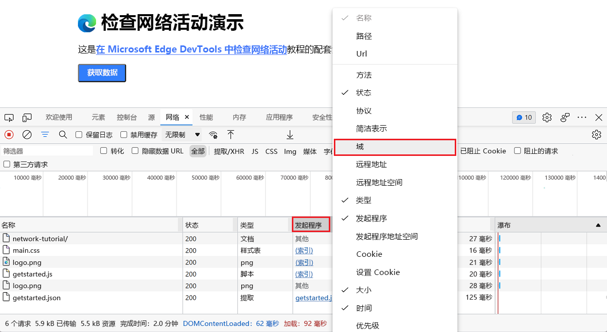

1. 要查看资源的完整 URL，请在“**名称**”列中将鼠标悬停该资源的单元格上。

<!-- ====================================================================== -->
## 模拟较慢的网络连接

用于构建站点的计算机的网络连接可能比用户的移动设备的网络连接速度快。  通过限制页面，可以更好地了解页面在移动设备上加载所花的时间。

1. 选择顶部工具栏中的 **“限制** ”下拉列表。 默认情况下，它设置为 **“无限制** ”。

1. 选择“**慢速 3G**”:

   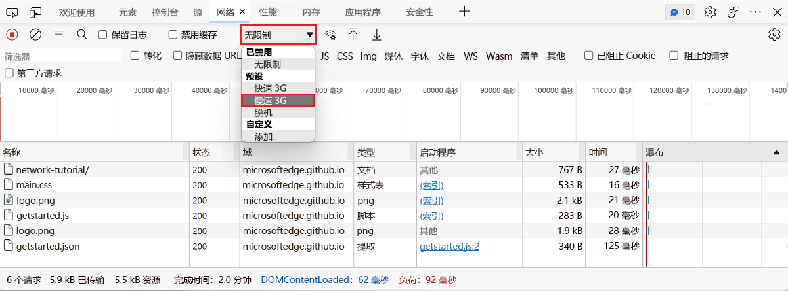

1. 长按“**重载**”(“”)(或右击“**刷新**”)，然后选择“**空缓存和硬性刷新**”:

   

在重复访问时，浏览器通常会从[缓存](https://developer.mozilla.org/docs/Web/HTTP/Caching)中提供一些文件，从而加快页面加载速度。  **空缓存和硬性刷新** 会强制浏览器转到所有资源的网络。  使用它来显示第一次访问者如何体验页面加载。

**空缓存和硬性刷新** 工作流仅在 DevTools 打开时可用。

另请参阅_网络功能参考_中的[模拟慢速网络连接](../network/reference.md#emulate-slow-network-connections)。

<!-- ====================================================================== -->
## 捕获屏幕截图

屏幕截图显示网页在加载时的外观。

1. 点击(“”)按钮，然后选择“**捕获屏幕截图**”复选框:

   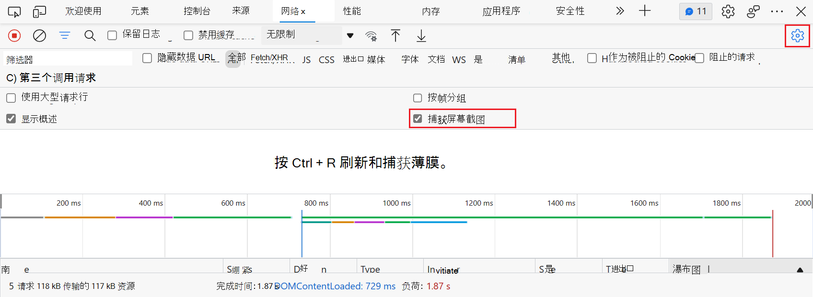

1. 使用 **空缓存和硬性刷新** 工作流再次刷新页面。  如果需要有关如何执行此操作的提醒，请参阅上方的 [模拟慢速连接](#simulate-a-slower-network-connection)。

   **屏幕截图** 面板提供页面在加载流程中如何查看各点的缩略图:

   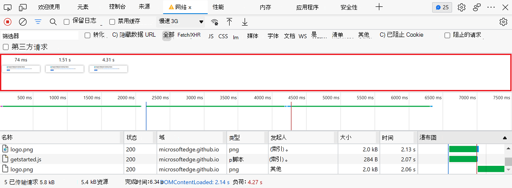

1. 点击第一个缩略图。  DevTools 会及时显示当时发生的网络活动:

   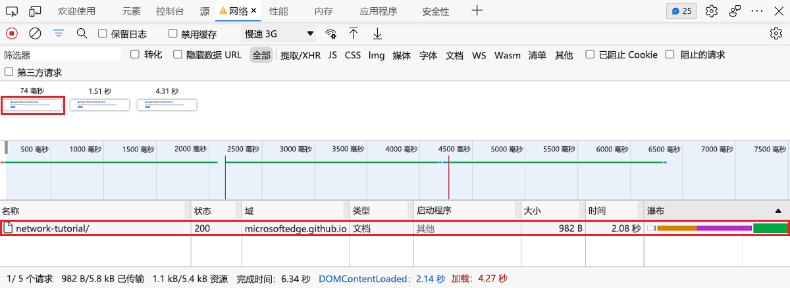

1. 再次点击(“”)并关闭“**捕获屏幕截图**”复选框以关闭“**屏幕截图**”窗格。

1. 再次刷新页面。

<!-- ====================================================================== -->
## 检查资源的详细信息

选择资源以了解有关它详细信息。

1. 选择 `network-tutorial/`。  将显示 **"标题** "面板。  使用此面板检查 HTTP 标头:

   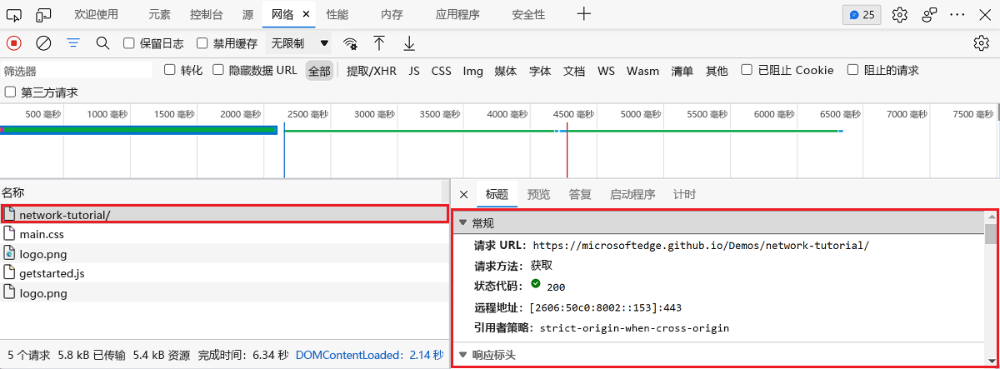

1. 选择 **预览** 面板。  会显示 HTML 的基本呈现:

   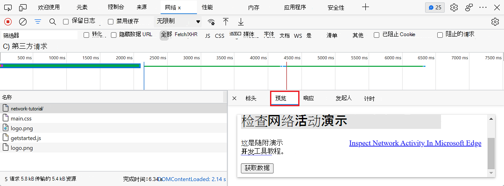

    当 API 以 HTML 格式返回错误代码时，面板非常有用。  你可能会发现，读取呈现的 HTML 比读取 HTML 源代码更容易，或者在检查图像时更容易读取呈现的 HTML。

1. 选择 **响应** 面板。  会显示 HTML 源代码:

   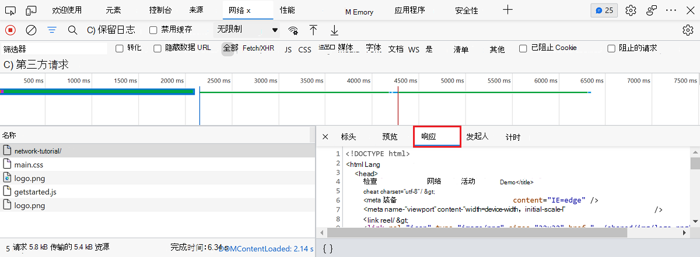

   提示: 缩小文件后，选择“**响应**”面板底部的“**格式**”(“”)按钮，从而重新设置文件内容的格式以实现可读性。

1. 选择 **计时** 面板。  会显示资源的网络活动的细目:

   

1. 点击“**关闭**”(“”)以再次查看网络日志:

   

<!-- ====================================================================== -->
## 搜索网络标头和响应

当您需要搜索特定字符串或正则表达式的所有资源的 HTTP 标头和响应时，请使用“**搜索**”窗格。

例如，假设你想要验证你的资源是否使用了合理的**缓存策略**。<!--[cache policies](../../../web/tools/lighthouse/audits/cache-policy) -->

<!--TODO: add cache policies section when available  -->

1. 选择“**搜索**”(“”)。  “搜索”窗格会在网络日志的左侧打开:

   

1. 键入“`no-cache`”，然后按“`Enter`”。  “搜索”窗格会列出它在资源标头或内容中找到的所有 `no-cache` 实例:

   

1. 点击结果以查看在其中找到结果的资源。  如果要查看资源的详细信息，请选择直接转到它的结果。  例如，如果在标头中发现查询，则 **标题面板** 将打开。   如果在内容中找到查询，则“**响应**”面板会打开:

   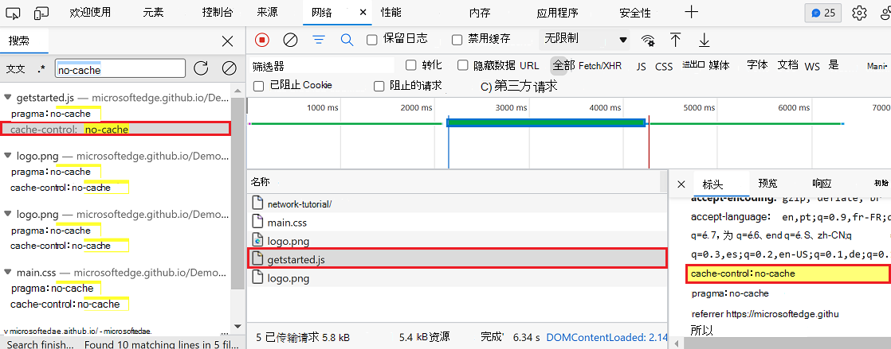

1. 关闭"搜索"窗格和 **"标题"** 面板。

<!-- ====================================================================== -->
## 筛选资源

DevTools 提供了许多工作流，用于筛选出与当前任务无关的资源。

默认情况下 **应** 打开"筛选器"工具栏。  如果“ **筛选器”** 工具栏未打开，请单击“ **筛选** 器 () 显示：

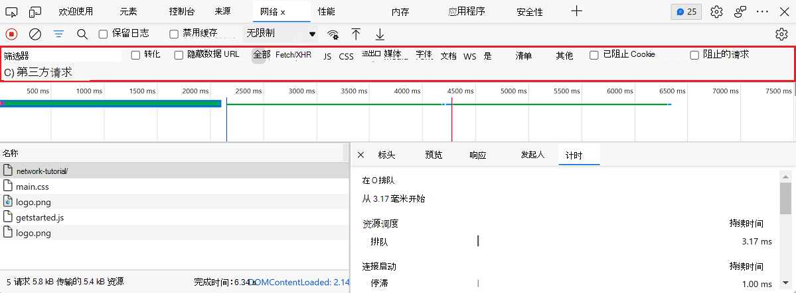

### 按字符串、正则表达式或属性筛选

“**筛选器**”文本框支持许多不同类型的筛选。

1. 键入 `png` 到“**筛选器**”文本框。  只显示包含文本 `png` 的文件。  在这种情况下，与筛选器匹配的唯一文件是 PNG 图像。

1. 类型 `/.*\.[cj]s+$/`，即 JavaScript 正则表达式。  DevTools 筛选出文件名不以 1 个`j`或`c``s`多个字符结尾的任何资源。

1. 键入 `-main.css`。  DevTools 筛选器出 `main.css`。  如果任何文件与该模式匹配，也会将其筛选掉。

1. 键入 `larger-than:1000` 到“**筛选器**”文本框。  DevTools 筛选出响应小于 1000 字节的资源。

   有关可筛选属性的完整列表，请参阅 [按属性筛选请求](reference.md#filter-requests-by-properties)。

1. 清除任何文本的“**筛选器**”文本框。

### 按资源类型筛选

若要专注于某些类型的文件，如样式表：

1. 选择 **CSS**。  会筛选出所有其他文件类型:

   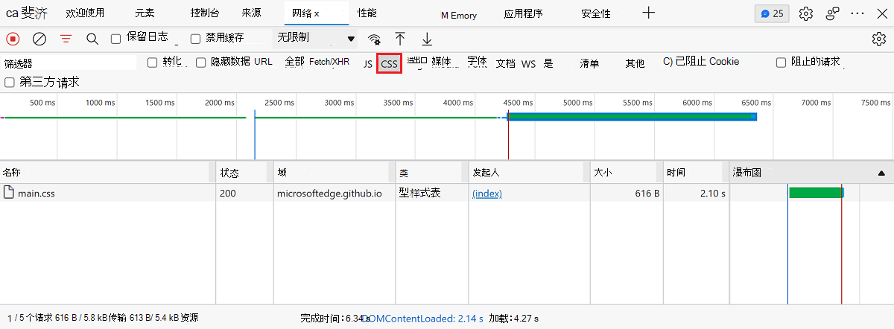

1. 若要显示脚本，请长按“`Ctrl`”(Windows、Linux) 或“`Command`”(macOS)，然后点击“**JS**”。

1. 要删除筛选器并再次显示所有资源，请选择 **全部**。

有关其他筛选工作流，请参阅 [筛选请求](reference.md#filter-requests)。

<!-- ====================================================================== -->
## 阻止请求

当一些页面资源不可用时，页面有什么样的外观和行为?  它是完全失败，还是仍有点功能？  阻止查找请求：

1. 按“`Ctrl`+`Shift`+`P`”(Windows、Linux)或“`Command`+`Shift`+`P`”(macOS)以打开“**命令菜单**”。

1. 键入“`block`”，选择“**显示请求阻止**”，然后按“`Enter`”:

   

1. 单击 **“添加模式** () ，然后键入 `main.css`，然后单击 **”添加**：

   

1. 刷新页面。  与预期一样，由于已阻止主样式表，因此页面的样式略为混乱。

   在网络日志的 `main.css` 行中，红色文本表示已阻止资源:

   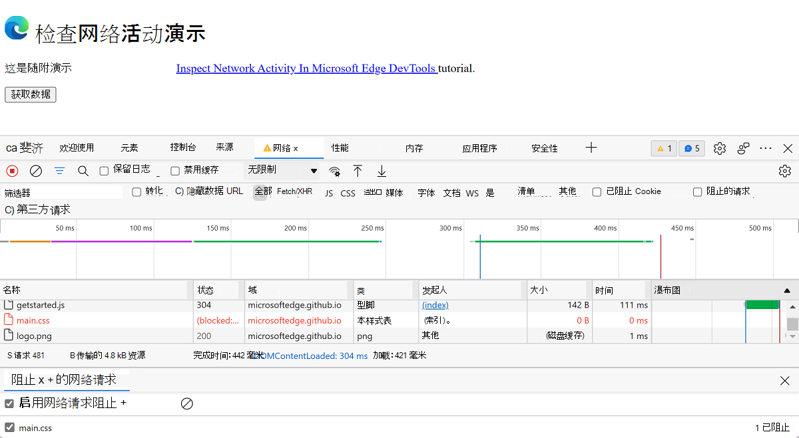

1. 清除“**启用请求阻止**”复选框。

<!-- ====================================================================== -->
## 总结

恭喜，你已完成本教程!  现在，你已了解如何使用 Microsoft Edge DevTools 中的 **网络** 工具。

若要发现更多与检查网络活动相关的 DevTools 功能，请参阅 [网络功能参考](reference.md)。

<!-- ====================================================================== -->
> [!NOTE]
> 此页面的某些部分是根据 [Google 创建和共享的](https://developers.google.com/terms/site-policies)作品所做的修改，并根据[ Creative Commons Attribution 4.0 International License ](https://creativecommons.org/licenses/by/4.0)中描述的条款使用。
> 原始页面位于[此处](https://developer.chrome.com/docs/devtools/network/)，由 [Kayce Basques](https://developers.google.com/web/resources/contributors#kayce-basques)\（Chrome DevTools 和 Lighthouse 的技术作家）撰写。

本作品根据[ Creative Commons Attribution 4.0 International License ](https://creativecommons.org/licenses/by/4.0)获得许可。
