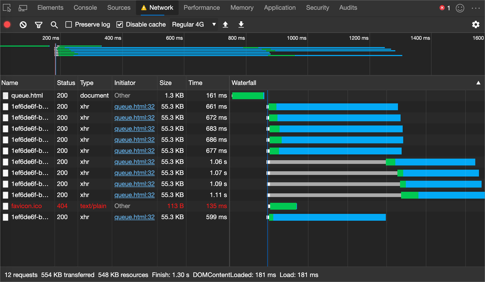
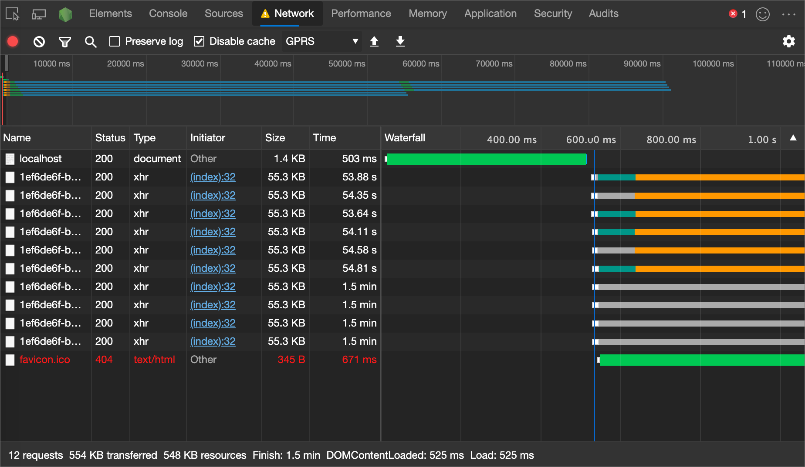
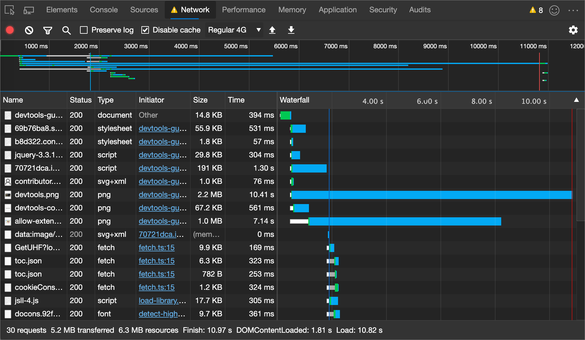

<!-- delete this notice and at bottom of file? search other repo to try to confirm that this article is based on a copy -->
<!-- Copyright Kayce Basques and Jonathan Garbee

   Licensed under the Apache License, Version 2.0 (the "License");
   you may not use this file except in compliance with the License.
   You may obtain a copy of the License at

       https://www.apache.org/licenses/LICENSE-2.0

   Unless required by applicable law or agreed to in writing, software
   distributed under the License is distributed on an "AS IS" BASIS,
   WITHOUT WARRANTIES OR CONDITIONS OF ANY KIND, either express or implied.
   See the License for the specific language governing permissions and
   limitations under the License.  -->
# 网络问题指南

本指南将演示如何使用 Microsoft Edge DevTools 的网络面板检测网络问题或优化机会。

若要了解 **网络** 工具的基础知识，请参阅 [“检查网络活动](index.md)”。

<!-- ====================================================================== -->
## 请求排队或暂停

**症状**

六个请求正在同时下载。  之后，一系列的请求处于排队或暂停状态。  一旦前六个请求中完成一个，队列中的一个请求开始下载。

在下图的**瀑布图**中，`edge-iconx1024.msft.png` 资产的前六个请求同时开始。  后续请求将保持暂停，直到原来的六个请求中的一个完成。

**原因**

对单个域提出的请求过多。  在 HTTP/1.0 或 HTTP/1.1 连接上，Microsoft Edge 允许每个主机最多同步六个 TCP 连接。

**修补程序**

*  实现域分片<!-- (splitting resources across multiple domains)--> 如果必须使用 HTTP/1.0 或 HTTP/1.1。

*  使用 HTTP/2。  请勿将域分片与 HTTP/2 配合使用。

*  删除或延迟不必要的请求，以便提前下载关键请求。

<!-- ====================================================================== -->
## 第一字节时间 (TTFB) 缓慢

**症状**

请求等待接收服务器的第一个字节的时间过长。

下图中，**瀑布图**中的绿色条形图表示请求等待了很长时间。  这是使用限制网速并添加延迟的配置文件进行的模拟。

**原因**

*  客户端和服务器之间的连接速度很慢。

*  服务器响应缓慢。  在本地托管服务器，以确定是连接速度慢还是服务器速度慢。  如果在访问本地服务器时仍遇到缓慢的“第一字节” (TTFB) ，则服务器速度较慢。

**修补程序**

*  如果连接速度缓慢，请考虑在 CDN 上托管内容或更改托管提供者。

*  如果服务器运行缓慢，请考虑优化数据库查询，同时实现缓存或修改服务器配置。

<!-- ====================================================================== -->
## 内容下载缓慢

**症状**

下载请求需要很长时间。

下图中，png 旁**瀑布图**的蓝色条形图表示下载花费了很长时间。

**原因**

*  客户端和服务器之间的连接速度很慢。

*  正在下载大量内容。

**修补程序**

*  请考虑在 CDN 上托管内容或更改托管提供者。

*  通过优化请求发送更少的字节。

<!-- ## Contribute knowledge  / Getting in touch

Do you have a network issue that should be added to this guide?

*  Send a tweet to [@EdgeDevTools](https://twitter.com/intent/tweet?text=@EdgeDevTools%20[Network%20Issues%20Guide%20Suggestion]).
*  Click **Send Feedback** () in the DevTools or press `Alt`+`Shift`+`I` (Windows, Linux) or `Option`+`Shift`+`I` (macOS) to provide feedback or feature requests.
*  [Open an issue](https://github.com/MicrosoftDocs/edge-developer/issues/new?title=%5BDevTools%20Network%20Issues%20Guide%20Suggestion%5D) on the docs repo.  -->

<!-- ====================================================================== -->
<!-- delete this notice? search other repo to try to confirm that this article is a copy -->
> [!NOTE]
> 此页面的某些部分是根据 [Google 创建和共享的](https://developers.google.com/terms/site-policies)作品所做的修改，并根据[ Creative Commons Attribution 4.0 International License ](https://creativecommons.org/licenses/by/4.0)中描述的条款使用。
> 此[处找到原始](https://developers.google.com/web/tools/chrome-devtools/network/issues)页面<!-- redirects to https://developer.chrome.com/docs/devtools/network/ --> 由 [Kayce Basques](https://developers.google.com/web/resources/contributors#kayce-basques) (技术作家、Chrome DevTools \& Lighthouse) 和 [Jonathan Garbee](https://developers.google.com/web/resources/contributors#jonathan-garbee) (Google 开发人员 Web 技术专家) 创作。

本作品根据[ Creative Commons Attribution 4.0 International License ](https://creativecommons.org/licenses/by/4.0)获得许可。
