<!-- Copyright Kayce Basques

   Licensed under the Apache License, Version 2.0 (the "License");
   you may not use this file except in compliance with the License.
   You may obtain a copy of the License at

       https://www.apache.org/licenses/LICENSE-2.0

   Unless required by applicable law or agreed to in writing, software
   distributed under the License is distributed on an "AS IS" BASIS,
   WITHOUT WARRANTIES OR CONDITIONS OF ANY KIND, either express or implied.
   See the License for the specific language governing permissions and
   limitations under the License.  -->
# <a name="network-features-reference"></a>网络功能参考

本文概述了**网络**工具的各种功能，该工具用于网络分析和检查网页的网络活动。

另请参阅[查看网络活动](index.md)，这是**网络**工具的分步教程演练。


<!-- ====================================================================== -->
## <a name="record-network-requests"></a>记录网络请求

默认情况下，只要开发人员工具处于打开状态，它就会在“**网络**”工具中记录所有网络请求。

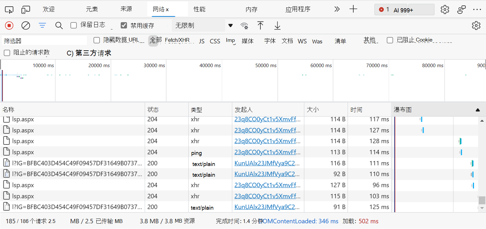

### <a name="stop-recording-network-requests"></a>停止记录网络请求

若要停止记录请求，请：

1. 在“**网络**”工具上，单击“**停止记录网络日志**（“”）。  它变为灰色，表示开发人员工具不再记录请求。

1. 当“**网络**”工具成为焦点时，按 `Ctrl`+`E`(Windows、Linux) 或 `Command`+`E`(macOS)。

### <a name="clear-requests"></a>清除请求

在“**网络**”工具上单击“**清除**”（“”）按钮，从“请求”表中清除所有请求。

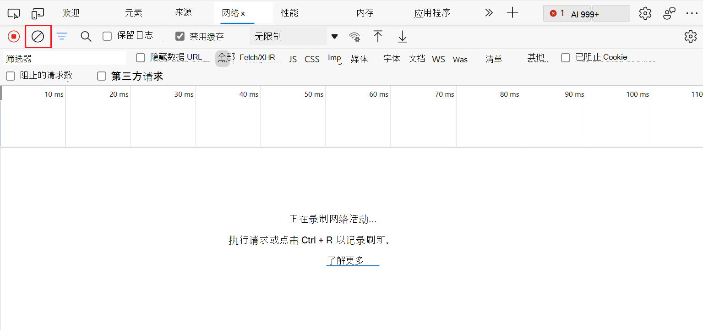

### <a name="save-requests-across-page-loads"></a>跨页面加载保存请求

若要跨页面加载保存请求，请在“**网络**”工具上选择“**保留日志**”复选框：

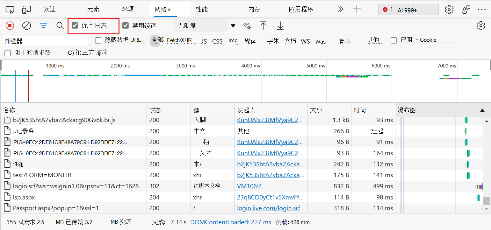

开发人员工具将保存所有请求，直到禁用“**保留日志**”。

### <a name="capture-screenshots-during-page-load"></a>在页面加载期间捕获屏幕截图

你可以捕获屏幕截图以分析在等待页面加载时为用户显示的内容。

若要启用屏幕截图：

1. 在 DevTools 中，打开**网络**工具。

1. 在“**网络**”工具的右上角，单击“**网络设置**”（齿轮）图标。  将显示一行复选框。

1. 选中**捕获屏幕截图**复选框：

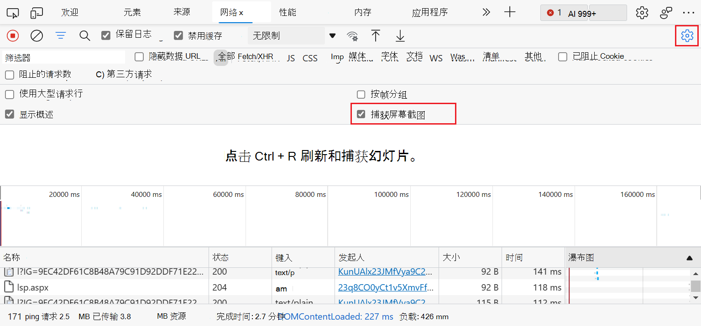

要捕获屏幕截图：

1. 当“**网络**”工具具有焦点时，按 `Ctrl`+`F5` 刷新页面。  将捕获屏幕截图，并在复选框行下方显示缩略图。

   可以按如下所示与屏幕截图进行交互。

1. 将鼠标悬停在屏幕截图上以显示截图的位置。  **视图**图表窗格上显示黄色垂直线。

   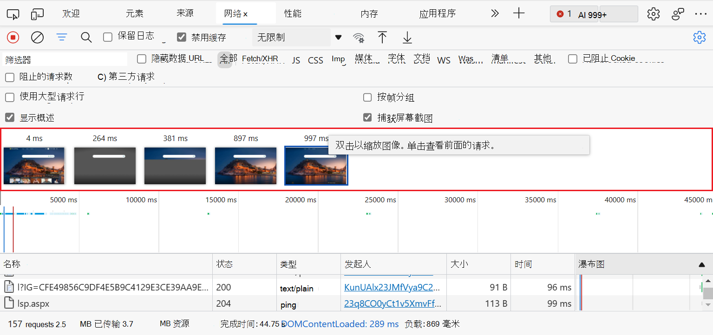

1. 单击截图的缩略图以过滤截图后发生的任何请求。

1. 双击屏幕截图缩略图以放大并查看屏幕截图。
 
1. 按 `Esc` 关闭屏幕截图查看器。

<!--  ### Replay XHR request  -->

<!--  To replay an XHR request, right-click the request in the Requests table, and then click **Replay XHR**.  -->

<!--

-->


<!-- ====================================================================== -->
## <a name="change-loading-behavior"></a>更改加载行为

### <a name="emulate-a-first-time-visitor-by-disabling-the-browser-cache"></a>通过禁用浏览器缓存来模拟首次访问者

要模拟首次用户体验你的网站的方式，请启用“**禁用缓存**”复选框。  开发工具禁用浏览器缓存。  此功能更准确地模拟了首次用户的体验，因为在重复访问时，请求是从浏览器缓存中获得的。

“**禁用缓存**”复选框：

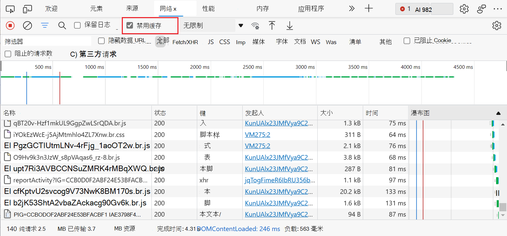

#### <a name="disable-the-browser-cache-from-the-network-conditions-drawer"></a>从“网络条件”抽屉中禁用浏览器缓存

如果要在其他开发工具面板中工作时禁用缓存，请使用“网络条件”抽屉：

1. 打开“**网络条件**”抽屉。

1. 选择或清除“**禁用缓存**”复选框。

<!--todo: add network condition section when available -->

### <a name="manually-clear-the-browser-cache"></a>手动清除浏览器缓存

若要随时手动清除浏览器缓存，请右键单击“请求”表中的任意位置，然后单击“**清除浏览器缓存**”。

选择“**清除浏览器缓存**：

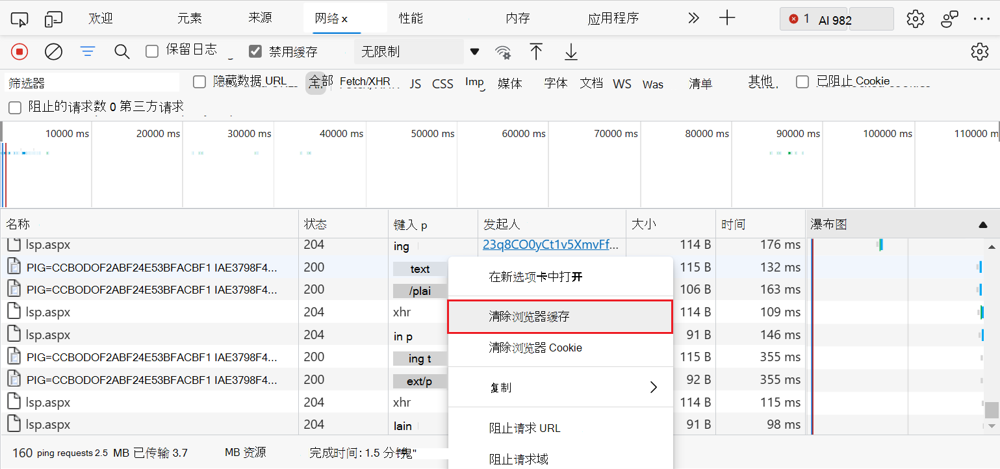


### <a name="emulate-offline"></a>模拟脱机

一种称为“[渐进式 Web 应用](../progressive-web-apps/index.md)”的新 web 应用程序，，可在**服务人员**的帮助下脱机运行。<!-- [service workers](/web/fundamentals/getting-started/primers/service-workers) --> 在构建这种类型的应用程序时，快速模拟没有数据连接的设备可能会很有用。

若要模拟脱机网络体验，请选择**无限制** 下拉菜单 > **预设** > **脱机**。

“**脱机**”下拉菜单：

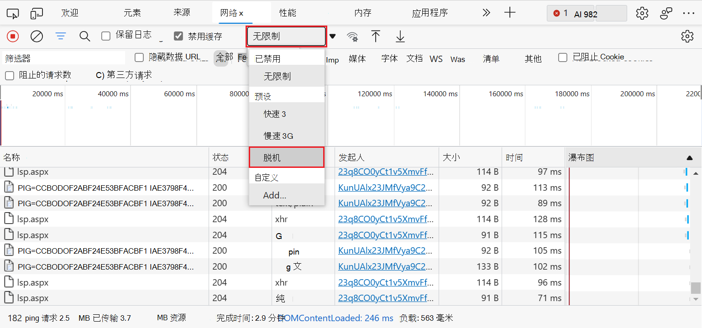


### <a name="emulate-slow-network-connections"></a>模拟慢速网络连接

从“**无限制**”下拉菜单中模拟慢速 3G、快速 3G 和其他连接速度。

“**限制**”下拉菜单：

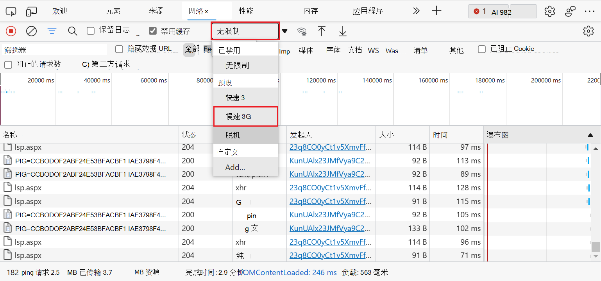

可以选择不同的预设，如慢速 3G 或快速 3G。  若要添加自定义预设，请打开“限制”菜单，然后选择“**自定义**” > “**添加**”。

开发人员工具会在“**网络**”工具旁边显示一个警告图标，提醒已启用限制。

另请参阅在_检查网络活动中_[模拟较慢的网络连接](../network/index.md#simulate-a-slower-network-connection)。


#### <a name="emulate-slow-network-connections-from-the-network-conditions-drawer"></a>从“网络条件”抽屉模拟慢速网络连接

如果要在其他开发工具面板中工作时限制网络连接，请使用“**网络条件**”抽屉工具：

1. 打开“**网络条件**”抽屉。

1. 从“**限制**”菜单中选择连接速度。

<!--todo: add network condition section when available -->


### <a name="manually-clear-browser-cookies"></a>手动清除浏览器 Cookie

若要随时手动清除浏览器 Cookie，请右键单击“请求”表中的任意位置，然后选择“**清除浏览器 Cookie**”。

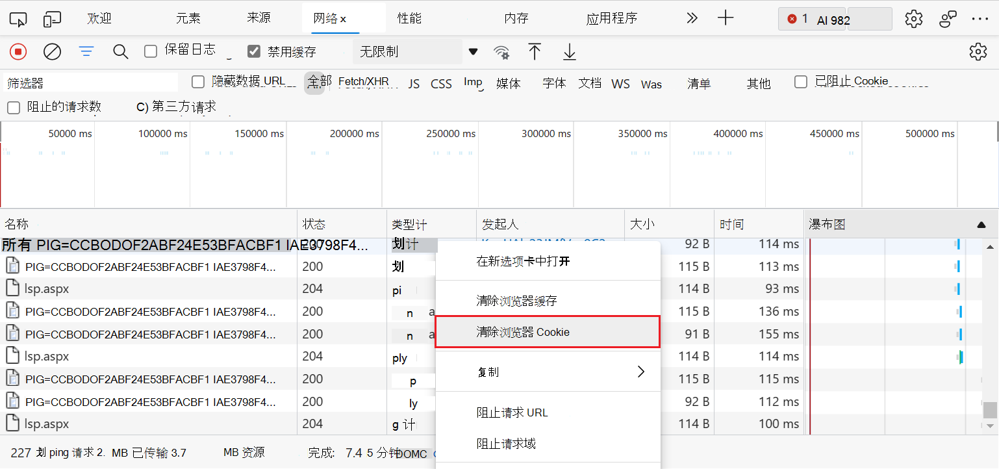

### <a name="override-the-user-agent"></a>替代用户代理

若要手动重写用户代理，请执行以下操作：

1. 打开“**网络条件**”抽屉工具。

1. 清除“**自动选择**”复选框。

1. 从菜单中选择用户代理选项，或在文本框中输入自定义用户代理。


<!-- ====================================================================== -->
## <a name="set-user-agent-client-hints"></a>设置用户代理客户端提示

如果站点采用[用户代理客户端提示](../../web-platform/user-agent-guidance.md)，请使用**网络条件**面板提供不同的用户代理客户端提示。

1. 右键单击网页，然后选择**检查**。

1. 选择**网络** > **网络条件**。

1. 在“用户代理”面板中，清除**使用浏览器默认值**复选框，然后选择**用户代理客户端提示**。

   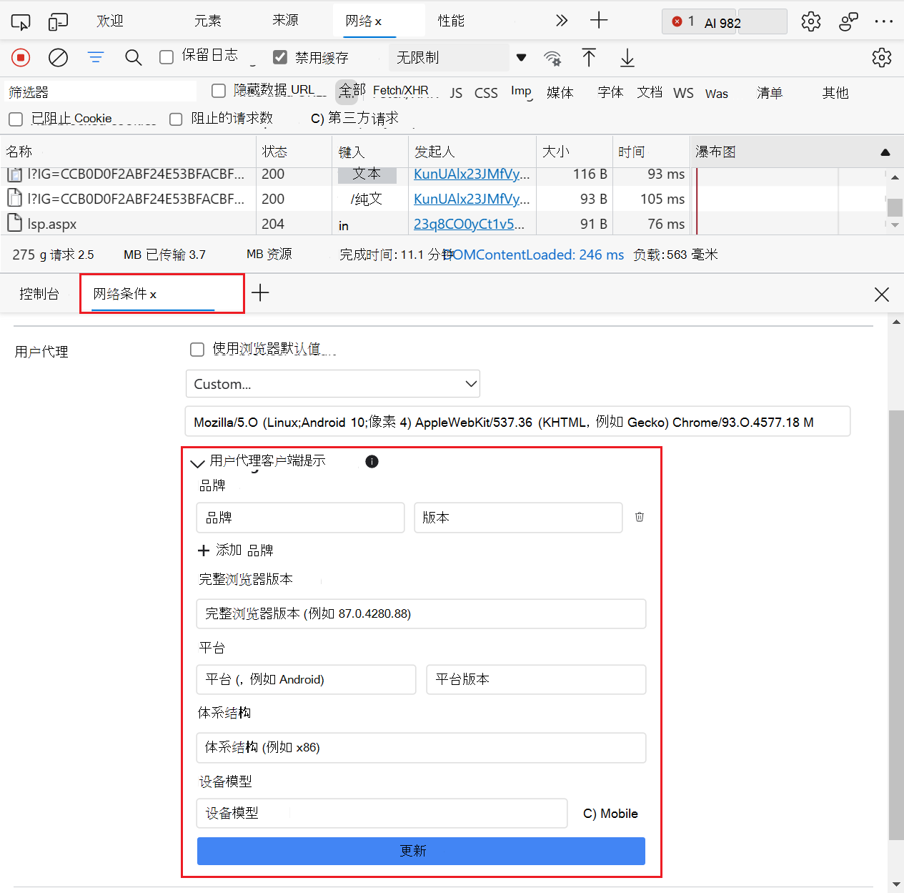

1. 接受**自定义...** 的默认值，或从下拉列表中选择预定义的浏览器和设备。

1. 对于任一选择，请按如下所示设置用户代理客户端提示：
    * **品牌**和**版本**，如 *Edge* 和 *92*。  单击 **+ 添加品牌**添加多个品牌和版本对。
    * **完整浏览器版本**，如 *92.0.1111.0*。
    * **平台**和**版本**，如 *Windows* 和 *10.0*。
    * **体系结构**，如 *x86*。
    * **设备模型**，如 *Galaxy Nexus*。

    > [!NOTE]
    > 设置或更改任何用户代理客户端提示。 没有必需的值。

1. 选择**更新**。

1. 若要验证更改，请单击**控制台**并键入 `navigator.userAgentData`。 根据需要展开结果以查看对用户代理数据的更改。

还可以在[仿真移动设备（设备仿真）](../device-mode/index.md)中设置用户代理客户端提示。


<!-- ====================================================================== -->
## <a name="filter-requests"></a>筛选请求

可以按属性、类型或时间筛选请求，并且可以隐藏数据 URL。

### <a name="filter-requests-by-properties"></a>按属性筛选请求

使用“**筛选器**”本框按属性（如请求的域或大小）筛选请求。

如果未显示文本框，则“**筛选器**”窗格可能已隐藏。
有关详细信息，请参阅[隐藏筛选器窗格](#hide-the-filters-pane)。

“**筛选器**”文本框：

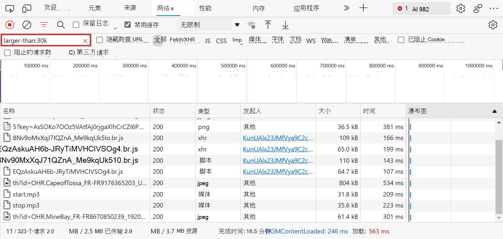

用空格分隔每个属性，可以同时使用多个属性。  例如，`mime-type:image/png larger-than:1K` 显示大于 1 KB 的所有 PNG。  多属性筛选器相当于 `AND` 操作。  `OR` 当前不支持操作。

支持属性的完整列表：

| 属性 | 详细信息 |
|:--- | :--- |
| `domain` | 仅显示指定域中的资源。  可以使用通配符 (`*`) 包含多个域。  例如，`*.com` 显示以 `.com` 结尾的所有域名中的资源。  开发工具在自动完成下拉菜单中填充找到的所有域。 |
| `has-response-header` | 显示包含指定 HTTP 响应头的资源。  开发工具用找到的所有响应头填充“自动完成”下拉列表菜单。 |
| `is` | 用 `is:running` 查找 `WebSocket` 资源。 |
| `larger-than` | 以字节为单位显示大于指定大小的资源。  将值设置为 `1000` 相当于将值设置为 `1k`。 |
| `method` | 显示通过指定的 HTTP 方法类型检索的资源。  开发工具用找到的所有 HTTP 方法填充下拉列表菜单。 |
| `mime-type` | 显示指定 MIME 类型的资源。  开发工具用找到的所有 MIME 类型填充下拉列表菜单。 |
| `mixed-content` | 显示所有混合内容资源 (`mixed-content:all`) 或仅显示当前显示的内容资源 (`mixed-content:displayed`)。 |
| `scheme` | 显示通过未受保护的 HTTP (`scheme:http`) 或受保护的 HTTPS (`scheme:https`) 检索的资源。 |
| `set-cookie-domain` | 显示具有与指定值匹配的 `Domain` 属性的 `Set-Cookie` 标头的资源。  开发工具用找到的所有 Cookie 域填充“自动完成”。 |
| `set-cookie-name` | 显示具有名称与指定值匹配的 `Set-Cookie` 标头的资源。  开发工具用找到的所有 Cookie 名称填充“自动完成”。 |
| `set-cookie-value` | 显示具有值与指定值匹配的 `Set-Cookie` 标头的资源。  开发工具用找到的所有 Cookie 值填充“自动完成”。 |
| `status-code` | 显示与特定 HTTP 状态代码匹配的资源。  开发工具用找到的所有状态代码填充“自动完成”下拉菜单。 |

### <a name="filter-requests-by-type"></a>按类型筛选请求

若要按请求类型筛选请求，请单击**网络**面板上的按钮：
*  **XHR**
*  **JS**
*  **CSS**
*  **Img**
*  **Media**
*  **字体**
*  **Doc**
*  **WS** - WebSocket。
*  **Manifest**
*  **其他** - 此处未列出的任何其他类型。

如果未显示按钮，则可能隐藏**筛选器**窗格。  参阅[隐藏“筛选器”窗格](#hide-the-filters-pane)。

若要同时启用多个类型筛选器，请长按 `Control` (Windows、Linux) 或 `Command` (macOS)，然后单击筛选器。

使用**类型**筛选器来显示 JS、CSS、文档资源：

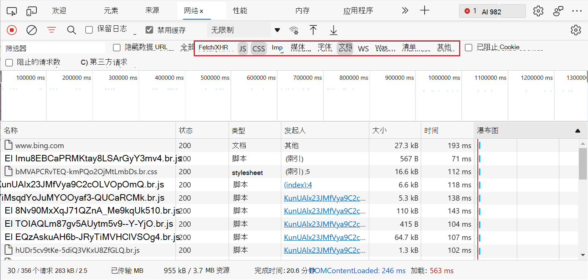

### <a name="filter-requests-by-time"></a>按时间筛选请求

在“**概述**”窗格中单击并向左或向右拖动，以仅显示在该时间段内处于活动状态的请求。  筛选器为非独占。  将显示在突出显示的时间内处于活动状态的任何请求。

筛选出处于非活动状态约 300 毫秒的所有请求：

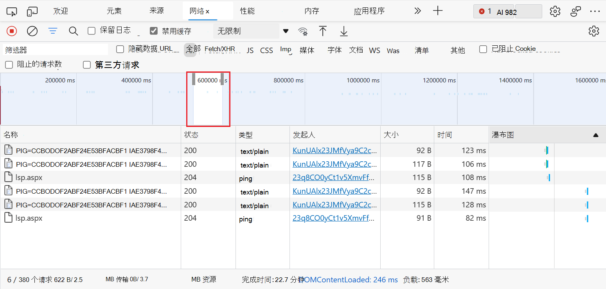

### <a name="hide-data-urls"></a>隐藏数据 URL

[数据 URL](https://developer.mozilla.org/docs/Web/HTTP/Basics_of_HTTP/Data_URIs) 是嵌入到其他文档中的小文件。  任何显示在“请求”表中以 `data:` 开头的请求都是数据 URL。

若要隐藏请求，请关闭“**隐藏数据 URL**”复选框：

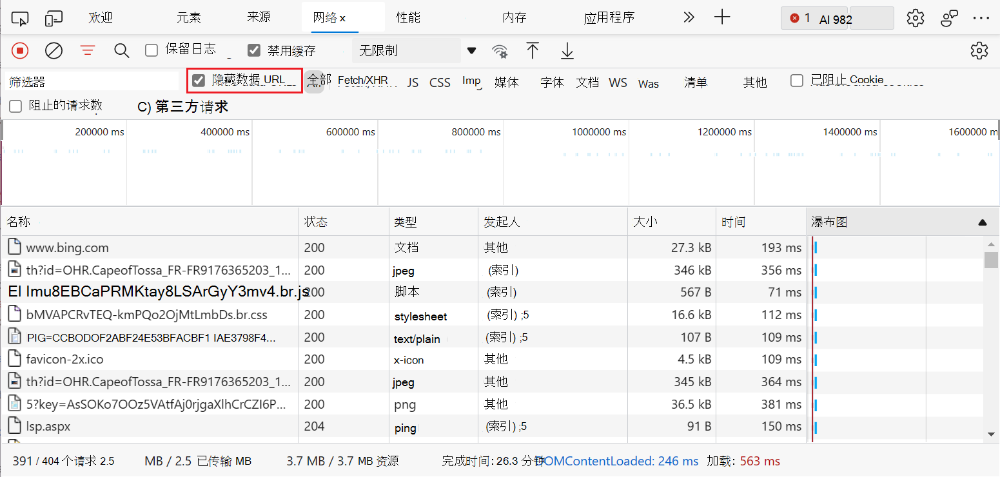


<!-- ====================================================================== -->
## <a name="sort-requests"></a>排序请求

默认情况下，“请求”表中的请求按启动时间排序，但可使用其他条件对表进行排序。

### <a name="sort-by-column"></a>按列排序

单击“请求”中任何列的标题以按该列对请求进行排序。

### <a name="sort-by-activity-phase"></a>按活动阶段排序

若要更改瀑布图对请求的排序方式，请执行以下操作：

* 右键单击请求表的标题，将鼠标悬停在**瀑布飞溅**上，然后选择以下选项之一：

   * **开始时间** - 启动的第一个请求位于顶部。
   
   * **响应时间** - 开始下载的第一个请求位于顶部。
   
   * **结束时间** - 完成的第一个请求位于顶部。
   
   * **总计持续时间**–具有最短连接设置和请求或响应的请求位于顶部。
   
   * **延迟**–等待响应时间最短的请求位于顶部。
      
这些描述假设每个选项按最短到最长进行排列。  单击“**瀑布飞溅**”列的标题以反转顺序。

下面显示了按总持续时间对瀑布图进行的排序。  每个条形的较浅部分是等待时间，较暗的部分是下载字节所用的时间：

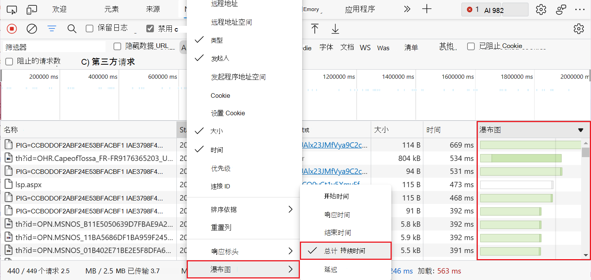


<!-- ====================================================================== -->
## <a name="analyze-requests"></a>分析请求

只要开发人员工具处于打开状态，它就会在“**网络**”工具中记录所有请求。  使用“网络”面板分析请求。

### <a name="display-a-log-of-requests"></a>显示请求日志

使用“**请求**”表可以显示开发工具打开时发出的所有请求的日志。  若要显示有关每个项目的详细信息，请单击或将鼠标悬停在请求上。

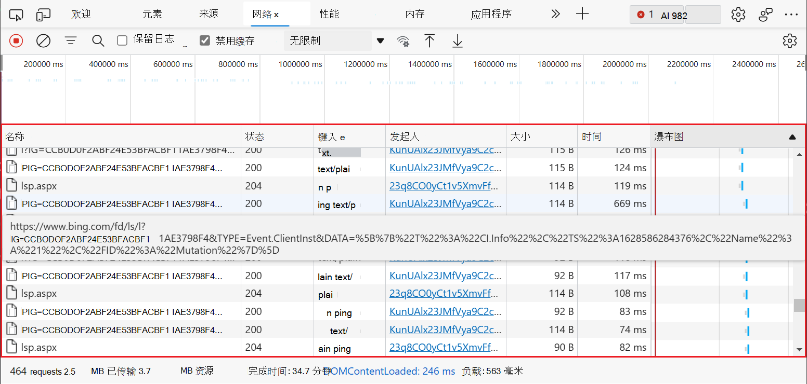

默认情况下，“请求”表显示以下列：

- **名称**。 资源的文件名或标识符。
- **状态**。 HTTP 状态代码。
- **类型**。 请求资源的 MIME 类型。
- **发起程序**。 以下对象或进程可以启动请求：
  - **分析程序**。 HTML 分析器。
  - **重定向**。 HTTP 重定向。
  - **脚本**。 JavaScript 函数。
  - **其他**。 其他一些过程或操作，例如通过链接导航到页面或在地址栏中输入 URL。
- **大小**。 服务器传递的响应头和响应正文的组合大小。
- **时间**。 从请求开始到收到响应中最后一个字节的总持续时间。
- [粘滞键](#display-the-timing-relationship-of-requests)。 每个请求活动的可视化细目。

#### <a name="add-or-remove-columns"></a>添加或删除列

右键单击“请求”表的标题，然后选择要隐藏或显示的选项。  当前显示的选项旁边有复选标记。

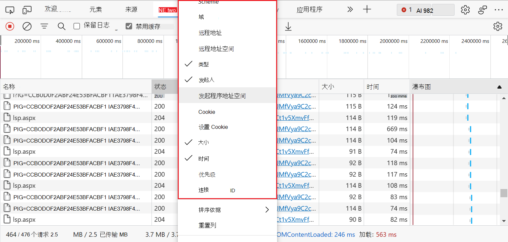

#### <a name="add-custom-columns"></a>添加自定义列

若要向“请求”表添加自定义列，请右键单击“请求”表的标题，然后选择**响应标头** > **管理标头列**。

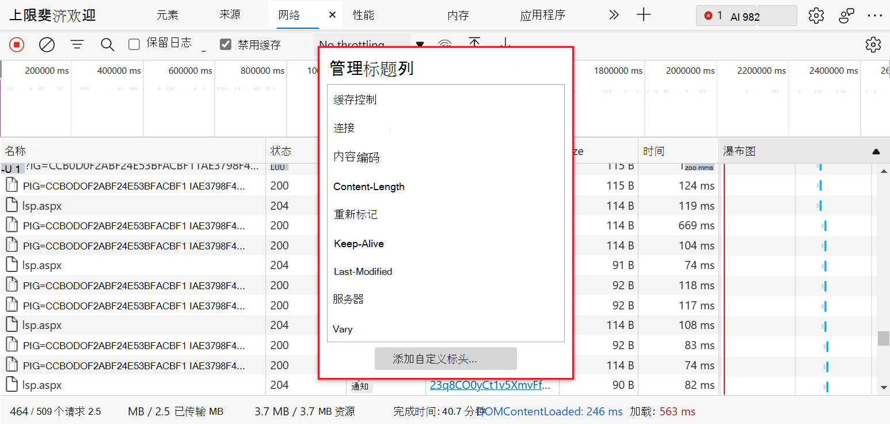

### <a name="display-the-timing-relationship-of-requests"></a>显示请求的计时关系

使用瀑布显示请求的计时关系。  默认情况下，瀑布是按请求的开始时间进行组织的。  因此，最左边的请求比最右边的请求更早开始。

若要查看可对瀑布图进行排序的不同方式，请转到[按活动阶段排序](#sort-by-activity-phase)。

“**请求**”窗格的“瀑布飞溅”列：


<!-- ### Analyze the frames of a WebSocket Connection  -->

<!--To view the frames of a WebSocket connection:

1. Click the URL of the WebSocket connection, under the **Name** column of the Requests table.
1. Click the **Frames** panel.  The table shows the last 100 frames.

To refresh the table, re-select the name of the WebSocket connection under the **Name** column of the Requests table.  -->

<!--

-->

<!--The table contains the following three columns.

*  **Data**.  The message payload.  If the message is plain text, it is displayed here.  For binary opcodes, this column displays the name and code of the opcode.  The following opcodes are supported: Continuation Frame, Binary Frame, Connection Close Frame, Ping Frame, and Pong Frame.
*  **Length**.  The length of the message payload, in bytes.
*  **Time**.  The time when the message was received or sent.  -->

<!--Messages are color-coded according to each type.

*  Outgoing text messages are light-green.
*  Incoming text messages are white.
*  WebSocket opcodes are light-yellow.
*  Errors are light-red.  -->

### <a name="display-a-preview-of-a-response-body"></a>显示响应正文的预览

若要显示响应正文的预览，请使用以下步骤。

1. 在“请求”表的“**名称**”列下，单击请求的 URL。
1. 选择**预览**选项卡。

“预览”选项卡在显示图像时最有用。

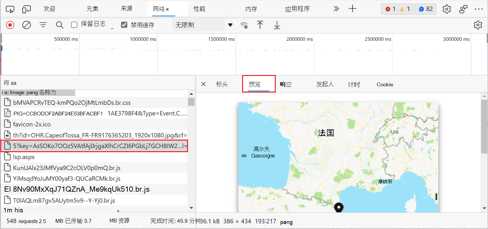

### <a name="display-a-response-body"></a>显示响应正文

要显示请求的响应主体，请使用以下步骤。

1. 在“请求”表的“**名称**”列下，单击请求的 URL。
1. 单击**响应**选项卡。

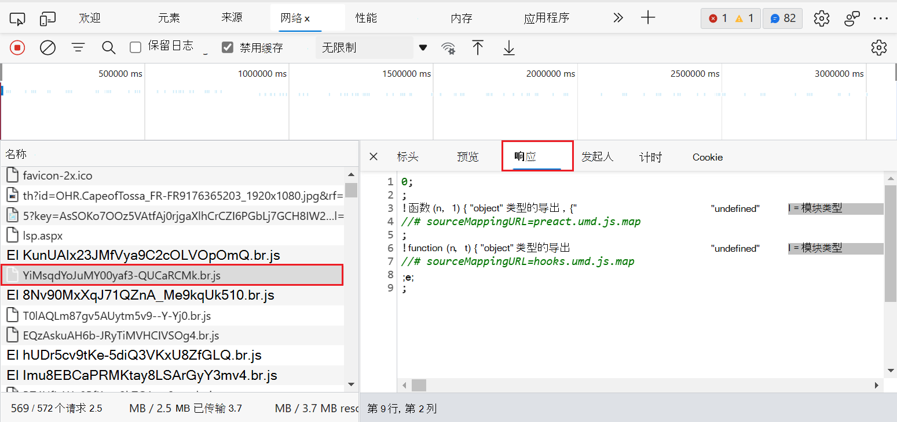

### <a name="display-http-headers"></a>显示 HTTP 标头

要显示有关请求的 HTTP 标头数据，请使用以下步骤。

1. 在“请求”表的“**名称**”列下，单击请求的 URL。

1. 单击**标头**选项卡。

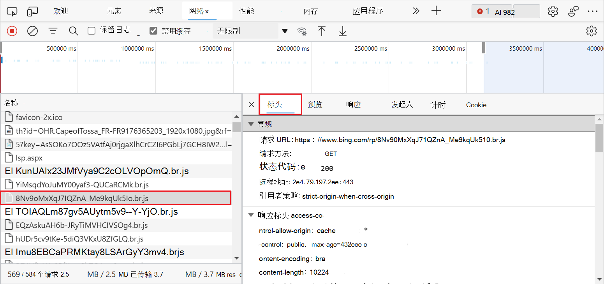

#### <a name="display-http-header-source"></a>显示 HTTP 标头源

默认情况下，“**标头**”面板按字母顺序显示标头名称。  若要按接收的顺序显示 HTTP 标头名称，请使用以下步骤。

1. 打开感兴趣的请求的“**标头**”面板。  有关详细信息，请参阅[显示 HTTP 标头](#display-http-headers)。

1. 单击“**请求标题**”或“**响应标题**”部分旁边的**查看源**。

### <a name="display-query-string-parameters"></a>显示查询字符串参数

若要以可读格式显示 URL 的查询字符串参数，请使用以下步骤。

1. 打开感兴趣的请求的“**标头**”面板。  有关详细信息，请参阅[显示 HTTP 标头](#display-http-headers)。

1. 导航到“**查询字符串参数**”部分。

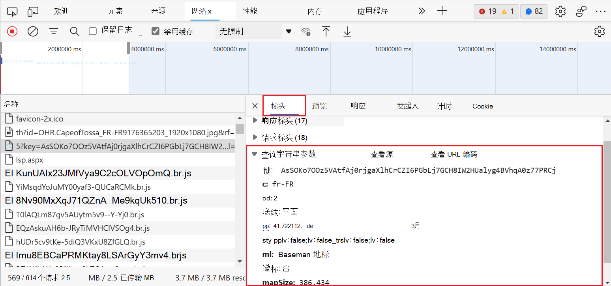

#### <a name="display-query-string-parameters-source"></a>显示查询字符串参数源

若要显示请求的查询字符串参数源，请使用以下步骤。

1. 导航到“**查询字符串参数**”部分。  有关详细信息，请参阅[显示查询字符串参数](#display-query-string-parameters)。

1. 选择**查看源**。

#### <a name="display-url-encoded-query-string-parameters"></a>显示 URL 编码的查询字符串参数

若要以可读格式显示查询字符串参数，但保留编码，请使用以下步骤。

1. 导航到“**查询字符串参数**”部分。  有关详细信息，请参阅[显示查询字符串参数](#display-query-string-parameters)。

1. 单击**查看 URL 编码**。

### <a name="display-cookies"></a>显示 Cookie

若要显示请求的 HTTP 标头中发送的 Cookie，请使用以下步骤。

1. 在“请求”表的“**名称**”列下，单击请求的 URL。
1. 单击 **Cookies** 选项卡。

<!--For more information about each of the columns, see [Fields](manage-data/cookies#fields).  TODO: add link when section is available -->

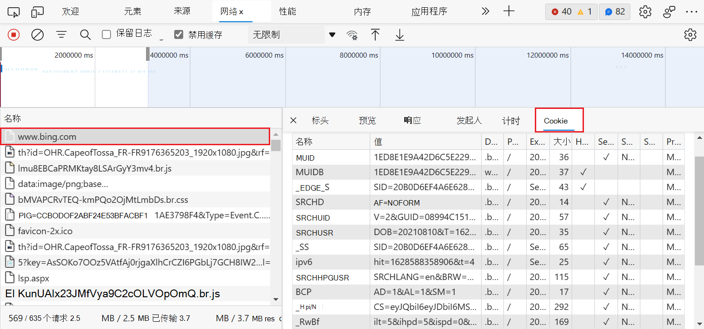

### <a name="display-the-timing-breakdown-of-a-request"></a>显示请求的计时细分

若要显示请求的计时细分，请使用以下步骤。

1. 在“请求”表的“**名称**”列下，单击请求的 URL。
1. 单击**计时**选项卡。

若要更快地访问数据，请参阅本文中的 [预览版计时细分](#preview-a-timing-breakdown)。

有关计 **时** 面板中可能显示的每个阶段的详细信息，请参阅本文中 [介绍的计时细分阶段](#timing-breakdown-phases-explained)。

“**计时**”面板：

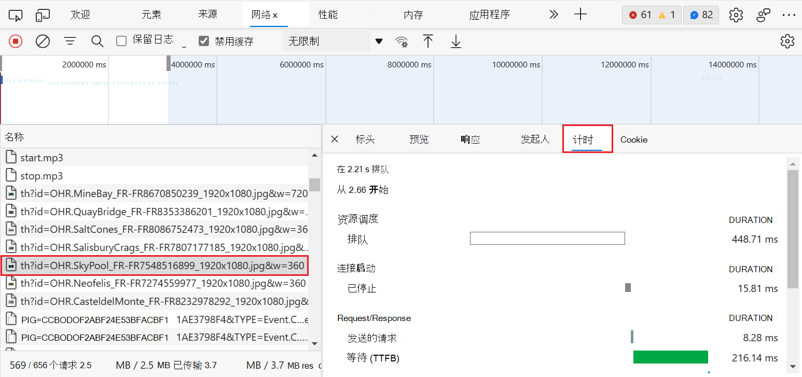

有关各阶段的更多信息。

有关访问视图的详细信息，请参阅“[显示计时明细](#display-the-timing-breakdown-of-a-request)”。

#### <a name="preview-a-timing-breakdown"></a>预览计时细分

要显示请求的计时细分预览，请在“请求”表的“**瀑布**”列中，将鼠标悬停在请求的条目上。

预览请求的计时细分：

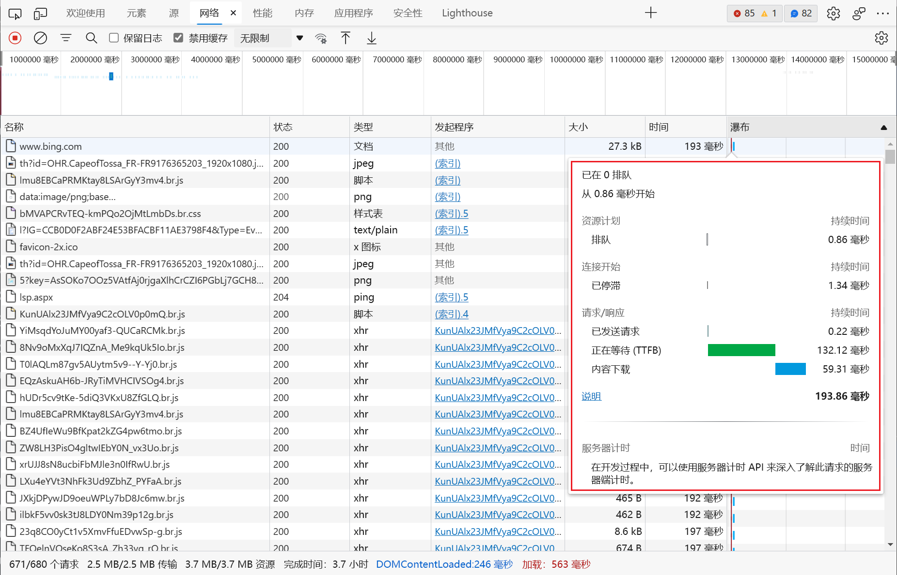

若要在不悬停的情况下查看数据，请参阅当前部分的顶部， [显示请求的计时细目](#display-the-timing-breakdown-of-a-request)。

#### <a name="timing-breakdown-phases-explained"></a>计时细分阶段说明

每个阶段都可能出现在**计时**选项卡中：

- **排队**。 浏览器在以下情况下将请求排队
  - 有更高优先级的请求。
  - 已为此源打开六个 TCP 连接，这是限制。 仅适用于 HTTP/1.0 和 HTTP/1.1。
  - 浏览器正在磁盘缓存中短暂分配空间。

- **已停止**。 该请求可能由于“**排队**”中描述的任何原因而停止。

- **DNS 查找**。 浏览器正在解析请求的 IP 地址。

- **初始连接**。 浏览器正在建立连接，包括 TCP 握手和重试以及协商安全套接字层 (SSL)。

- **代理协商**。 浏览器正在与[代理服务器](https://en.wikipedia.org/wiki/Proxy_server)协商请求。

- **已发送请求**。 正在发送请求。

- **ServiceWorker 准备**。 浏览器正在启动服务工作进程。

- **到 ServiceWorker 的请求**。 请求正在发送到服务工作进程。

- **正在等待 (TTFB)**。 浏览器正在等待响应的首个字节。 TTFB 表示_到首个字节的时间_。 此计时包括一次往返延迟和服务器准备响应所用的时间。

- **内容下载**。 浏览器正在接收响应。

- **接收推送**。 浏览器正在通过 HTTP/2 服务器推送接收此响应的数据。

- **读取推送**。 浏览器正在读取以前接收的本地数据。

### <a name="display-initiators-and-dependencies"></a>显示发起程序和依赖项

若要显示请求的发起程序和依赖项，请按住 `Shift` 并将鼠标悬停在“**请求**”表中的请求上。

DevTools 颜色： 
*  发起程序以绿色显示。
*  依赖项以红色显示。

显示请求的发起程序和依赖项：

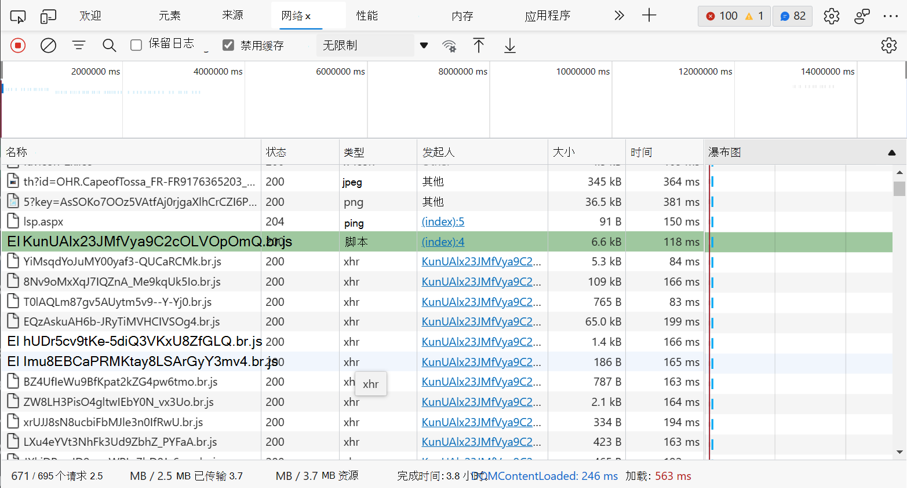

当“请求”表按时间顺序排列时，如果将鼠标悬停在某一行上，则它前面的行将显示绿色请求。  绿色请求是依赖项的发起程序。  如果在此之上还有另一个绿色请求，则该更高的请求是发起程序的发起程序。  等等。

### <a name="display-load-events"></a>显示加载事件

开发人员工具在“**网络**”工具的多个位置显示 `DOMContentLoaded` 和 `load` 事件的计时。  `DOMContentLoaded` 事件颜色为蓝色，`load` 事件颜色为红色。

“**网络**”工具上 `DOMContentLoaded` 和 `load` 事件的位置：

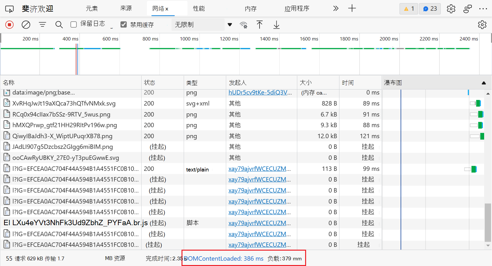

### <a name="display-the-total-number-of-requests"></a>显示请求总数

请求总数列在“**网络**”工具底部的“**摘要**”窗格中。

> [!CAUTION]
> 此数字仅跟踪自打开开发人员工具以来记录的请求。  如果在打开开发工具之前发生了其他请求，则不计算这些请求。

自打开开发工具以来的请求总数

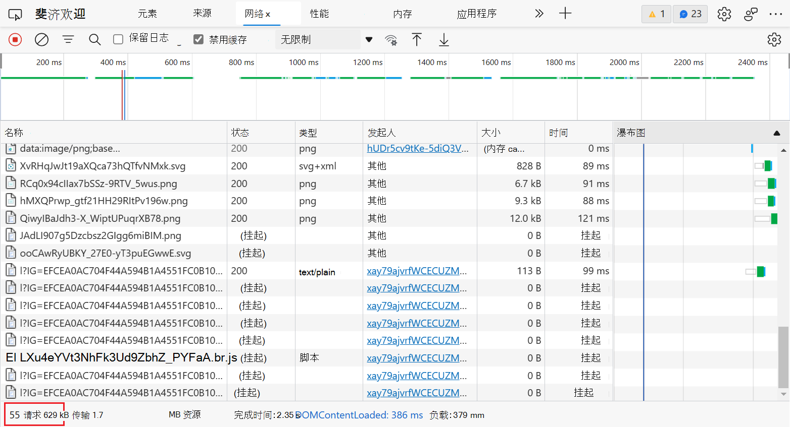

### <a name="display-the-total-download-size"></a>显示总下载大小

请求的总下载大小列在“**网络**”工具底部的“**摘要**”窗格中。

> [!CAUTION]
> 此数字仅跟踪自打开开发人员工具以来记录的请求。  如果在打开开发工具之前发生了其他请求，则不计算以前的请求。

请求的总下载大小：

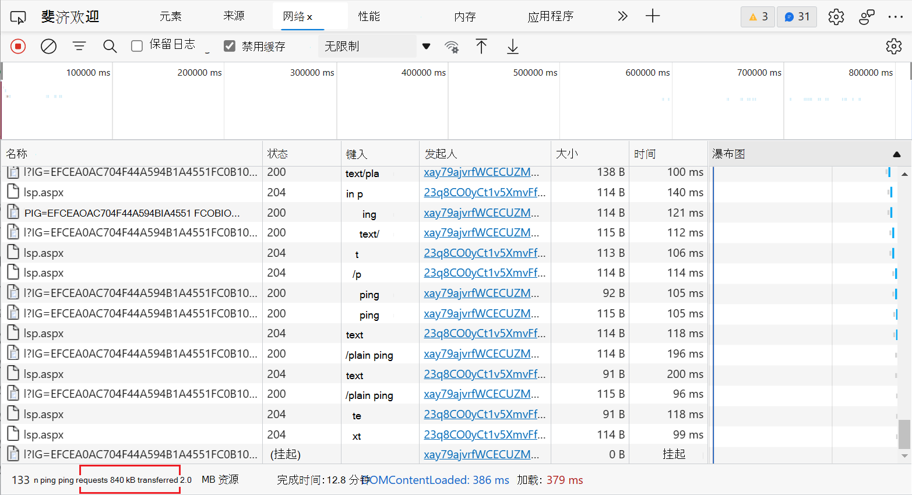

若要在浏览器解压缩每个项目后验证资源的大小，请参阅“[显示资源的未压缩大小](#display-the-uncompressed-size-of-a-resource)”。

### <a name="display-the-stack-trace-that-caused-a-request"></a>显示导致请求的堆栈跟踪

JavaScript 语句请求资源后，将鼠标悬停在“**发起程序**”列上以显示请求之前的堆栈跟踪。

<!-- [codepen.io/contoso/pen/yLBrOWa?editors=0010#0](https://codepen.io/contoso/pen/yLBrOWa?editors=0010#0) -->

<!--
```javascript
function init() {
  getData();
}

function getData() {
  fetch('https:/httpbin.org/get?message=hi');
}

init();
```
-->

导致资源请求的堆栈跟踪：

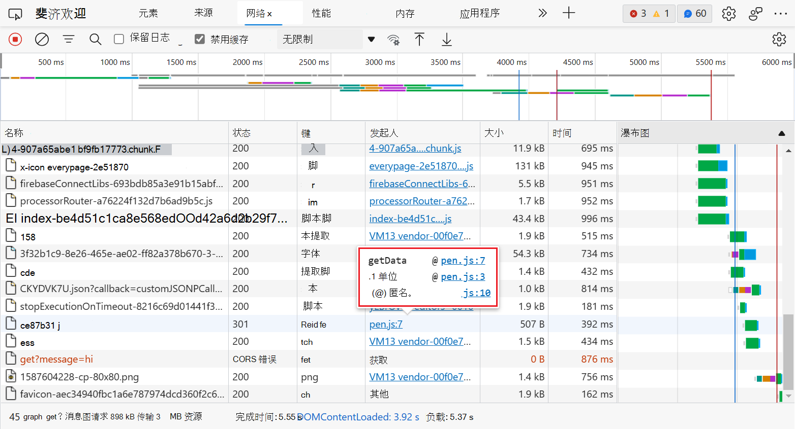

### <a name="display-the-uncompressed-size-of-a-resource"></a>显示资源的未压缩大小

启用“**使用大请求行**”复选框，然后检验“**大小**”列的底部值。

下面是未压缩资源的示例。  通过网络发送的 `jquery-3.3.1.min.js` 文件的压缩大小为 `29.9 KB`，而未压缩的大小为 `84.9 KB`：

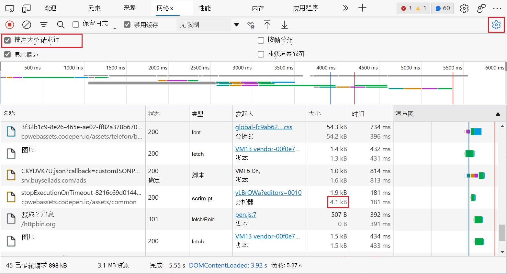


<!-- ====================================================================== -->
## <a name="export-requests-data"></a>导出请求数据

### <a name="save-all-network-requests-to-a-har-file"></a>将所有网络请求保存到 HAR 文件

若要将所有网络请求保存到 HAR 文件：

1. 在“**请求**”表中，右键单击请求，然后选择**与内容另存为 HAR**。  开发工具将自打开开发工具以来发生的所有请求保存到 HAR 文件中。  无法筛选请求，并且无法保存单个请求。

保存 HAR 文件后，可以将其导入开发工具进行分析。  将 HAR 文件拖放到“**请求**”表中。
<!--For more information, see also [HAR Analyzer](https://toolbox.alphabetapps.com/apps/har_analyzer)  Todo: add section link when content is available  -->

选择**与内容另存为 HAR**：

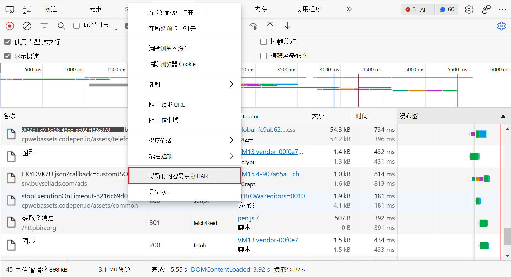

### <a name="copy-one-or-more-requests-to-the-clipboard"></a>将一个或多个请求复制到剪贴板

在“请求”表的“**名称**”列下，右键单击请求，将鼠标悬停在“**复制**”上，然后选择以下选项之一：

| 名称 | 详细信息 |
| --- | --- |
| **复制链接地址** | 将请求的 URL 复制到剪贴板。 |
| **复制响应** | 将响应正文复制到剪贴板。 |
| **复制为 Fetch** | &nbsp; |
| **复制为 cURL** | 将请求复制为 cURL 命令。 |
| **全部复制为 Fetch** | &nbsp; |
| **全部复制为 cURL** | 将所有请求复制为一系列 cURL 命令。 |
| **全部复制为 HAR** | 将所有请求复制为 HAR 数据。 |

选择**复制响应**：

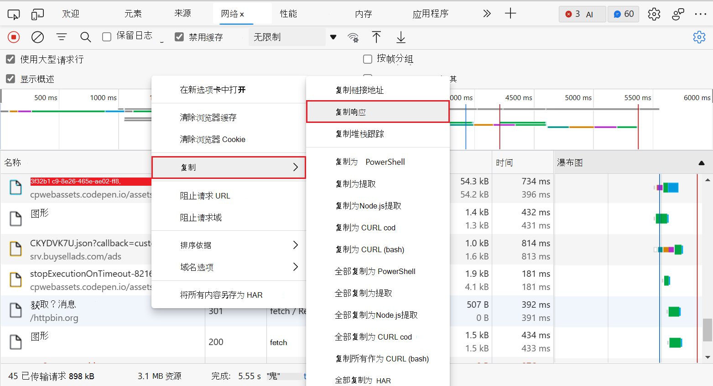

### <a name="copy-formatted-response-json-to-the-clipboard"></a>将格式化响应 JSON 复制到剪贴板

选择网络请求然后导航到“**标头**”窗格。  若要复制响应的 JSON 值，请导航到**请求有效负载**，右键单击 JSON 响应内容，然后选择**复制值**。


在 Microsoft Visual Studio Code 中粘贴格式化响应 JSON：

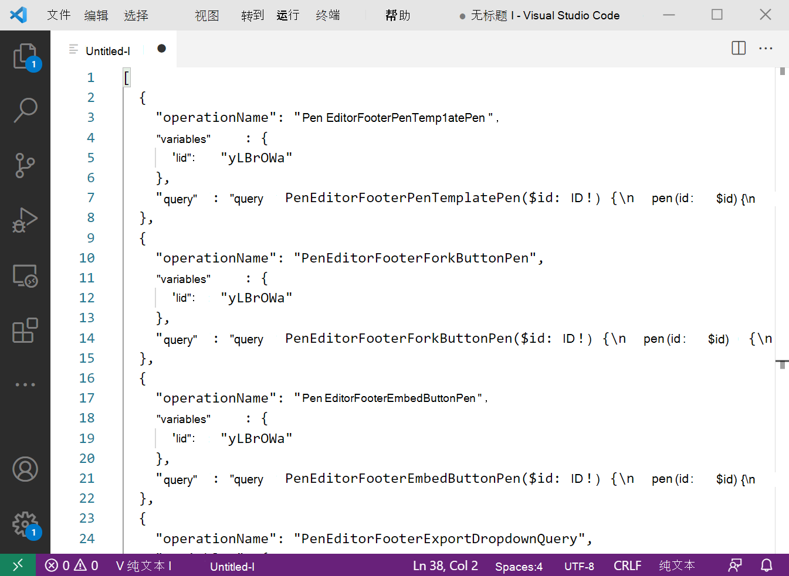

### <a name="copy-property-values-from-network-requests-to-your-clipboard"></a>将属性值从网络请求复制到剪贴板

若要将属性值从网络请求复制到剪贴板：

1. 打开“**标头**”窗格。

1. 打开以下其中一个标头部分。
    *  请求有效负载 (JSON)
    *  窗体数据
    *  查询字符串参数
    *  请求标头
    *  响应标头

1. 右键单击某个值，然后选择**复制值**。  现在可以将该值粘贴到任何编辑器中以查看它。


<!-- ====================================================================== -->
## <a name="change-the-layout-of-the-network-panel"></a>更改“网络”面板的布局

可以展开或折叠“**网络**”工具用户界面的各部分，以集中重要信息。

### <a name="hide-the-filters-pane"></a>隐藏“筛选器”窗格

默认情况下，开发工具显示“**筛选器**”窗格。  若要隐藏**筛选器**窗格，选择**筛选器**（）。

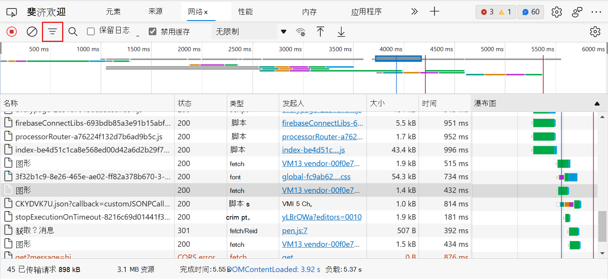

### <a name="use-large-request-rows"></a>使用大请求行

如需网络请求表中有更多空白，请使用大行。  在使用大行时，有些列还提供了更多的信息。  例如，“**大小**”列的底部值是请求的未压缩大小。

要启用大行，请选择“**使用大请求行**”复选框。  “**请求**”窗格中大请求行的示例：

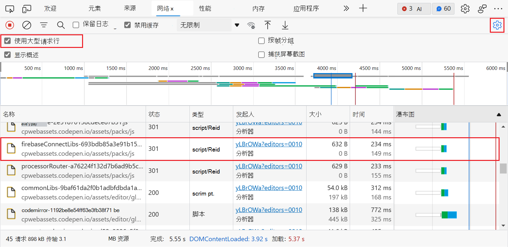

### <a name="hide-the-overview-pane"></a>隐藏概述窗格

默认情况下，开发工具显示“**概述**”窗格。  若要隐藏**概述**窗格，请清除**显示概述**复选框。

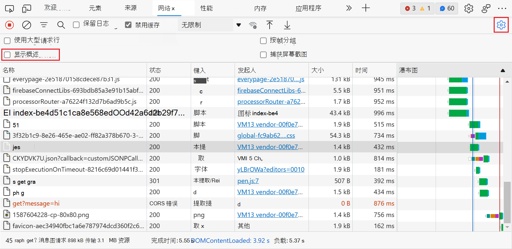


<!-- ====================================================================== -->
> [!NOTE]
> 此页面的某些部分是根据 [Google 创建和共享的](https://developers.google.com/terms/site-policies)作品所做的修改，并根据[ Creative Commons Attribution 4.0 International License ](https://creativecommons.org/licenses/by/4.0)中描述的条款使用。
> 原始页面位于[此处](https://developers.google.com/web/tools/chrome-devtools/network/reference)，由 [Kayce Basques](https://developers.google.com/web/resources/contributors#kayce-basques)\（Chrome DevTools 和 Lighthouse 的技术作家）撰写。

[](https://creativecommons.org/licenses/by/4.0)
本作品根据[ Creative Commons Attribution 4.0 International License ](https://creativecommons.org/licenses/by/4.0)获得许可。
