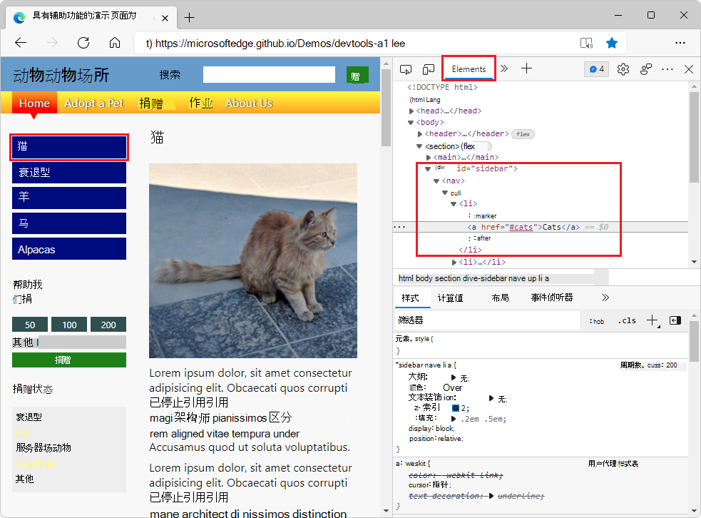
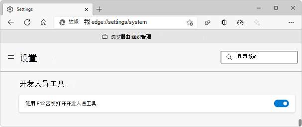
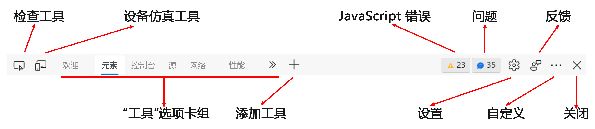
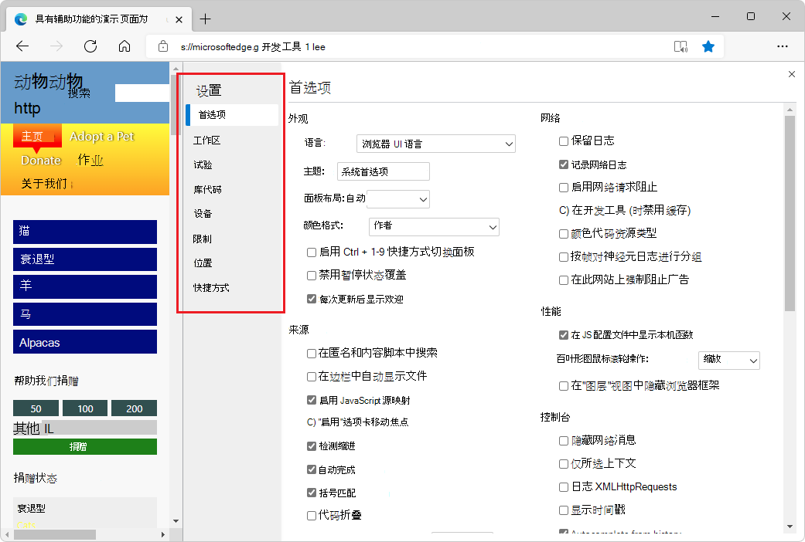

# <a name="overview-of-devtools"></a>开发工具概述

<!-- icon clipboard below -->

<!-- ====================================================================== -->
<!-- keep sync'd:
* [Overview of DevTools](overview.md) - intro section
* [Microsoft Edge DevTools](../develop-web-microsoft-edge.md#microsoft-edge-devtools) in _Develop for the web with Microsoft Edge_
-->

Microsoft Edge浏览器附带内置 Web 开发工具，称为 Microsoft Edge DevTools。  DevTools 是一组 Web 开发工具，显示在浏览器中呈现的网页旁边。  DevTools 提供了一种用于检查和调试网页和 Web 应用的强大方法。  甚至可以在 DevTools 环境中编辑源文件并创建网站项目。

使用 DevTools 可以执行以下操作：

*  使用具有可视界面的 实时工具检查、调整和更改网页中元素的样式。  检查浏览器存储内容以构造网页的位置，包括`.html``.css``.js`文件格式和`.png`文件格式。

*  模拟网站在不同设备上的行为方式，并模拟具有不同网络条件的移动环境。  检查网络流量并查看问题的位置。

*  使用断点调试和实时控制台 调试JavaScript。  查找 Web 应用的内存问题和呈现问题。

*  查找产品中的辅助功能、性能、兼容性和安全问题，并使用 DevTools 修复找到的辅助功能问题。

*  使用开发环境将 DevTools 中的更改与文件系统和 Web 同步。

<!-- /keep sync'd -->


<!-- See also [Reasons to use Microsoft Edge DevTools](devtools-guide-chromium/reasons-edge-devtools.md). -->


<!-- ====================================================================== -->
## <a name="open-devtools"></a>打开开发工具
<!-- keep sync'd:
[Open DevTools](../overview.md#open-devtools) in _Overview of DevTools_
[Open DevTools](accessibility/navigation.md#open-devtools) in _Navigate DevTools with assistive technology_
-->

在Microsoft Edge中，可以通过以下任一方式使用鼠标或键盘打开 DevTools。  打开哪个工具取决于打开 DevTools 的方式。

**主要方式：**

| 操作 | 生成的工具 |
|---|---|
| 右键单击网页上的任何项，然后选择 **“检查**”。 | **“元素**”工具，其中扩展了 DOM 树以显示右键单击的页面元素。 |
| 按`Ctrl`+`Shift`+`I`（Windows、Linux）或 `Command`+`Option`+`I` （macOS）。| 以前使用的工具或 **欢迎** 工具。 |
| 按 `F12`。 | 以前使用的工具或 **欢迎** 工具。 |

**其他方法：**

| 操作 | 生成的工具 |
|---|---|
| 在Microsoft Edge工具栏上，**选择设置和更多** () >**更多工具** >  **开发人员工具**。 | 以前使用的工具或 **欢迎** 工具。 |
| 按`Ctrl`+`Shift`+`J`（Windows、Linux）或 `Command`+`Option`+`J` （macOS）。 | **控制台**工具。 |
| 按`Ctrl`+`Shift`+`C`（Windows、Linux）或 `Command`+`Option`+`C` （macOS）。 | **“元素**”工具，其中扩展了 DOM 树以显示元素`<body>`。 |
| 按 `Shift`+`F10` 下以打开右键单击菜单。  若要选择 **“检查**”命令，请按下，然后`Enter`按`Up Arrow`。 | **“元素**”工具，其中扩展了 DOM 树以显示元素`<html>`。 |
| 按 `Tab` 下并 `Shift`+`Tab` 将焦点放在页面元素上。  然后按 `Shift`+`F10` 下以打开右键单击菜单。  若要选择 **“检查**”命令，请按下，然后`Enter`按`Up Arrow`。 | **“元素**”工具，其中扩展了 DOM 树以显示重点页面元素。 |

<!-- /keep sync'd -->

<!--
hit counts:

`F12` 45 (in 30)

`Ctrl`+`Shift`+`J` 22 (in 14)
`Ctrl`+`Shift`+`I` 21 (in 11)
`Ctrl`+`Shift`+`C` 7 (in 6)

`Command`+`Option`+`J`  21  (in 12)
`Command`+`Option`+`I` 15    (in 6)
`Command`+`Option`+`C`  3   (in 2)
 -->

### <a name="open-devtools-by-right-clicking-an-item-in-a-webpage"></a>通过右键单击网页中的项打开 DevTools

打开 DevTools 的一个好方法是右键单击网页上的项，然后选择 **“检查**”


DevTools 随即打开，**在 Elements** 工具的 **DOM 树**中突出显示了右键单击的元素：




### <a name="open-devtools-by-using-the-microsoft-edge-toolbar"></a>使用Microsoft Edge工具栏打开 DevTools

在Microsoft Edge工具栏上，可以选择**设置和更多** () > `...` **更多工具** >  **开发人员工具**：


### <a name="have-devtools-automatically-open-when-you-open-a-new-tab"></a>打开新选项卡时，让 DevTools 自动打开

若要让 DevTools 在浏览器中打开新选项卡时自动打开：

1. 在命令行中，打开Microsoft Edge，传入`--auto-open-devtools-for-tabs`标志，如下所示：

   Windows命令提示符：
   
   ```cmd
   start msedge --auto-open-devtools-for-tabs
   ```
   
   Windows PowerShell：
   
   ```powershell
   Start-Process -FilePath "msedge" -ArgumentList "--auto-open-devtools-for-tabs"
   ```
   
   bash shell on macOS：
   
   ```bash
   /Applications/Microsoft\ Edge\ Beta.app/Contents/MacOS/Microsoft\ Edge\ Beta --auto-open-devtools-for-tabs
   ```
   
   Linux 上的 bash shell：
   
   ```bash
   microsoft-edge-dev --auto-open-devtools-for-tabs
   ```
   

### <a name="turning-off-the-f12-keyboard-shortcut"></a>关闭 F12 键盘快捷方式

防止按下打开 `F12` DevTools：

1. 在Microsoft Edge，去`edge://settings/system`。

1. 在“ **开发人员工具** ”部分中，在 **按下 F12 键切换时关闭“打开 DevTools** ”。

   


<!-- ====================================================================== -->
## <a name="keyboard-support"></a>键盘支持

可以使用鼠标或键盘与 DevTools 交互。  键盘快捷方式提供了访问功能的快速方法，并且是辅助功能所需的。  各种工具越来越多地通过键盘和辅助技术（如屏幕阅读器）访问。

使用辅助技术查看 [键盘快捷方式](shortcuts/index.md) 和 [导航 DevTools](accessibility/navigation.md)。


<!-- ====================================================================== -->
## <a name="change-where-devtools-is-docked-in-the-browser"></a>更改 DevTools 停靠在浏览器中的位置

可以将 DevTools 停靠在浏览器的右侧、左侧或底部，或将其撤并到单独的窗口中。  请参阅[更改 DevTools 放置位置（取消停靠，停靠到底部，停靠到左侧）](customize/placement.md)。


<!-- ====================================================================== -->
## <a name="zoom-devtools-in-or-out"></a>放大或缩小 DevTools

DevTools UI 是使用 HTML 和 CSS（如网页）实现的，因此可以使用标准键盘快捷方式进行放大和缩小。  DevTools 的缩放级别和呈现的页面是独立的。

**若要缩放浏览器的 DevTools 部分，请执行以下操作：**

1. 如果焦点尚未放在 DevTools 上，请单击 DevTools 中的某个位置。
1. 按`Ctrl`+`+`或`Ctrl`+`-` (Windows或 Linux) 。  或者，按`Command`+`+`或`Command`+`-` (macOS) 。


<!--  -->

若要缩放呈现的页面，请单击该页面，然后使用与上面相同的键盘快捷方式。

**将缩放还原到 100%：**

1. 请确保焦点位于浏览器的所需部分（DevTools 或呈现的页面）上。
1. `Ctrl``NumPad0`+按`Ctrl`+`0`或 (Windows或 Linux) 或`Command`+`0` (macOS) 。

**若要缩放 DevTools 设置：**

1. 在 DevTools **设置**中，单击右上角的 **“关闭** (**x**) ”。
1. 更改 DevTools 的缩放级别，如上所述。
1. 单击**设置 (** 设置) 按钮。

**若要使用命令菜单缩放 DevTools：**

1. 单击 **“自定义并控制 DevTools** () 菜单按钮，然后选择 **“运行”命令**。
1. 在 **命令菜单**中，开始键入 **缩放**，然后选择缩放命令：
   *  **重置缩放级别**
   *  **放大**
   *  **缩小**


<!-- ====================================================================== -->
## <a name="display-devtools-tooltips"></a>显示 DevTools 工具提示

DevTools 工具提示功能可帮助你了解所有不同的工具和窗格。  请将鼠标悬停在开发人员工具的每个概述区域上，以了解有关如何使用工具的更多信息。  若要打开工具提示，请执行以下操作之一： 

*  选择“**自定义和控制 DevTools** (`...`)”>“**帮助**” > “**切换 DevTools 工具提示**”。
*  按`Ctrl`+`Shift`+`H`（Windows、Linux）或 `Cmd`+`Shift`+`H` （macOS）。
*  [打开命令菜单](command-menu/index.md#open-the-command-menu)，然后键入 `tooltips`。

然后将鼠标悬停在开发人员工具的每个概述区域上：


要关闭工具提示，请按“`Esc`”。  


<!-- ====================================================================== -->
## <a name="features-of-the-main-toolbar"></a>主工具栏的功能

DevTools 为你提供了极大的功能来检查、调试和更改当前显示在浏览器中的网站。  大多数工具实时显示更改。  实时更新使工具非常有用，无需刷新或生成即可优化 Web 项目的外观和导航或功能。


### <a name="tabbed-tool-panels-containing-tabs-and-pages"></a>包含选项卡和页面的 Tabbed 工具面板

除了**检查工具和****设备仿真**)  (几个图标工具外，DevTools 分为一组选项卡式工具，例如**元素**工具、**控制台**工具和**源**工具。  在 **命令菜单**中，工具称为 _面板_。  工具的选项卡包含包含工具 UI 的面板。

**更高级别的选项卡：**

工具被组织成主工具栏和抽屉工具栏上的一组选项卡。  大多数工具也称为 _面板_。  面板是工具的内部 UI。  工具的选项卡可以显示在主工具栏和抽屉工具栏上。

**下层选项卡：**

在某些工具的面板中，有一个或多个选项卡集 (选项卡窗格) 。  例如，“ **元素”** 工具包含一组选项卡，其中包括 **样式**、 **事件侦听器**和 **辅助功能** 选项卡。  对于其他工具，该工具的面板沿左侧列出了页面。


### <a name="the-main-toolbar-and-the-drawer-toolbar"></a>主工具栏和抽屉工具栏

<!-- clarify: DevTools also allows you to change web-based third-party products on your computer.  extensions? -->

有两个工具栏：DevTools 顶部的主工具栏，以及按`Esc`下时底部的**抽屉**。

主工具栏包含以下功能：

* 图标工具：
   *  **检查工具** () 切换按钮。
   *  **设备仿真** () 按钮。

* 工具选项卡：
   *  **欢迎** 工具。
   *  **元素** 工具。  永久。
   *  **控制台** 工具。  永久。
   *  **源** 工具。  永久。
   *  **网络** 工具。
   *  **性能** 工具。
   *  **内存** 工具。
   *  **应用程序** 工具。
   *  **安全** 工具。
   *  **Lighthouse** 工具。
   *  **CSS 概述** 工具。

* 图标：
   *  **更多选项卡** () 按钮。
   *  **“更多工具** () 按钮。
   *  **JavaScript 错误计数器** () 按钮。
   *  **问题计数器** () 按钮。
   *  **设置** () 按钮。
   *  **发送反馈** () 按钮。
   *  **自定义和控制 DevTools** () 菜单按钮。
   *  **关闭** DevTools () 按钮。



下面介绍了工具栏功能。


### <a name="inspect-tool"></a>检查工具

单击“ **检查”工具** () 按钮，可以选择当前网页上的元素。  当 **检查** 工具处于活动状态时，可以将鼠标移动到网页的不同部分，以获取有关页面元素的详细信息，以及显示页面元素的布局尺寸、填充和边距的多色覆盖。


### <a name="device-emulation"></a>设备仿真

单击 **设备仿真** () 按钮以模拟设备模式显示当前网站。  **设备仿真工具**允许你在调整浏览器大小时运行和测试产品的反应。  它还为你提供移动设备上的布局和行为估计。


请参阅 [模拟移动设备 (设备仿真) ](device-mode/index.md)。


### <a name="welcome-tool"></a>欢迎工具

包括有关 DevTools 的新功能、如何联系团队的信息，并提供有关某些功能的信息。


### <a name="elements-tool"></a>元素工具

允许检查、编辑和调试 HTML 和 CSS。  可以在浏览器中实时显示更改时在工具中进行编辑。

**元素**工具始终存在于主工具栏上。


### <a name="console-tool"></a>控制台工具

在 **控制台** 工具中，可以：
*  从网络请求或 JavaScript 日志语句查看和筛选记录的消息。
*  输入要实时评估的 JavaScript 语句。  表达式在当前上下文中进行计算，例如当 **源** 工具中的 JavaScript 调试器在断点处暂停时。

主工具栏和抽屉工具栏上始终存在 **控制台** 工具。

请参阅 [控制台](console/index.md)。


### <a name="sources-tool"></a>源工具

[“源](sources/index.md)”工具是代码编辑器和 JavaScript 调试器。  可以编辑项目、维护代码段和调试当前项目。

**源**工具始终存在于主工具栏上。


### <a name="network-tool"></a>网络工具

使用 **网络** 工具可以监视和检查来自网络和浏览器缓存的请求或响应。  可以筛选请求和响应，以满足你的需求并模拟不同的网络条件。

请参阅 [“检查网络活动](network/index.md)”。

### <a name="performance-tool"></a>性能工具

请参阅[开始分析运行时性能](evaluate-performance/index.md)。


### <a name="memory-tool"></a>内存工具

请参阅 [“修复内存问题](memory-problems/index.md)”。


### <a name="application-tool"></a>应用程序工具

请参阅 [视图、编辑和删除 Cookie](storage/cookies.md)。


### <a name="security-tool"></a>安全工具

请参阅 [使用安全工具了解安全问题](security/index.md)。


### <a name="lighthouse-tool"></a>Lighthouse 工具

请参阅 [Lighthouse 工具](lighthouse/lighthouse-tool.md)。


### <a name="css-overview-tool"></a>CSS 概述工具

确定潜在的 CSS 改进。

请参阅 [CSS 概述工具](css/css-overview-tool.md)。


### <a name="more-tabs-button"></a>“更多选项卡”按钮

若要显示因窗口太窄而打开但隐藏的工具，请单击“ **更多”选项卡** () 按钮。


### <a name="more-tools-button"></a>“更多工具”按钮

若要将工具添加到工具栏，请单击“ **更多工具** () 按钮。

### <a name="javascript-errors-counter"></a>JavaScript 错误计数器

**JavaScript 错误计数器** () 按钮显示以下内容：

*  包含一个 `X`红色圆圈，后跟在当前网页上自动检测到的 JavaScript 错误数。

*  包含感叹号的黄色三角形，后跟在当前网页上自动检测到的 JavaScript 警告数。

**JavaScript 计数器**按钮的工具提示是**打开控制台以查看 # 错误， # 警告**。

单击 JavaScript 错误计数器打开 [控制台](console/index.md) 并了解错误。


### <a name="issues-counter"></a>问题计数器

问题 **计数器** () 按钮显示当前网页上自动找到的 HTML 或 CSS 问题数。

**“问题”计数器**的工具提示是 **“打开的问题”以查看 # 问题**。  按钮的图标是蓝色语音气泡图标，后跟 HTML 或 CSS 问题的数量。

单击 **“问题”计数器** 打开 [“问题](issues/index.md) ”工具。


### <a name="settings-button"></a>设置按钮

若要打开 DevTools **设置** 网页，请单击**设置 (** 设置) 按钮。  **设置**页包含以下子页：

*  首选项
*  工作
*  试验
*  库代码
*  设备
*  限制
*  位置
*  快捷方式
*  符号服务器

请参阅自_定义 DevTools_ 中的[设置](customize/index.md#settings)。


### <a name="send-feedback-button"></a>“发送反馈”按钮

若要打开“ **发送反馈** ”对话框，请单击“ **发送反馈** () 按钮。  随即打开“ **发送反馈** ”对话框。  输入信息以描述所发生的情况，并自动包含屏幕截图。  使用 **"发送反馈** "与 DevTools 团队联系，报告问题、问题或提出建议。

请参阅[联系 Microsoft Edge DevTools 团队](contact.md)。


### <a name="customize-and-control-devtools-menu"></a>自定义和控制 DevTools 菜单

**自定义和控制 DevTools** () 按钮将打开一个下拉菜单，用于定义停靠 DevTools、搜索、打开不同工具等的位置。


### <a name="close-devtools-button"></a>关闭 DevTools 按钮

<!-- todo: add icon -->
单击 **“关闭** DevTools () DevTools 右上角的按钮关闭 DevTools，并使用整个窗口显示当前网页。


<!-- ====================================================================== -->
## <a name="overview-of-all-tools"></a>所有工具概述

有关每个工具的摘要，请参阅 _“关于工具”列表_中[所有工具的概述](about-tools.md#overview-of-all-tools)。


<!-- ====================================================================== -->
## <a name="tool-tab-or-panel"></a>工具、选项卡或面板

通常可互换使用“tool”、“tab”或“panel”一词。  在命令菜单中，这些工具称为 _面板_;例如，“ **元素** ”工具称为 **“元素** ”面板。  若要切换到 **“元素”** 工具，请选择 **“元素”** 选项卡。 有一个 **“更多工具** ” (**+**) 按钮和列表，工具栏上有一个 **“更多”选项卡** 按钮，这两个选项卡都用于选择工具（也称为 _面板_）。

可以自定义每个工具，并且工具的内容可以根据上下文进行更改。       


<!-- ====================================================================== -->
## <a name="about-panel-and-drawer-tools"></a>关于面板和工具箱工具

**“更多工具**” () **+** 中列出的工具可以显示为主工具栏) 上的面板工具 (，也可以在抽屉工具栏) 上 (抽屉工具。  在 **命令菜单**中，每个工具都标记为 **面板** 工具或 **抽屉** 工具。  但是，可以将它们添加到主工具栏或抽屉工具栏，并且可以使用以下任一方法来打开它们或在两个工具栏之间移动它们。

使用 **“更多工具** ” (**+**) 菜单选择任何面板工具或抽屉工具。  **“更多工具”** 菜单显示在多个位置：

*  在 DevTools 右上角的主工具栏上，单击 **“自定义和控制 DevTools** ” () 按钮，将鼠标悬停在 **“更多工具** ”命令上，然后选择一个工具。

*  在 DevTools (顶部的主工具栏上， _面板_ 工具通常) 。

*  在 **抽屉** 工具栏 (_抽屉_ 工具通常) 。

| 任务 | 步骤 |
| --- | --- |
| 在 DevTools 顶部的主工具栏上打开工具 | 在 DevTools 顶部的主工具栏上，单击“ **更多工具** ” () **+** ，然后选择一个工具。 |
| 在抽屉工具栏上打开工具 | 当 DevTools 具有焦点时，按 **Esc** 显示抽屉。  在抽屉工具栏上，单击“ **更多工具** ” () **+** ，然后选择一个工具。 |
| 将工具从抽屉工具栏移动到主工具栏 | 当 DevTools 具有焦点时，按 **Esc** 显示抽屉。  在抽屉工具栏上，右键单击工具的选项卡，然后选择 **“移动到顶部**”。 |
| 将工具从主工具栏移动到抽屉工具栏 | 在主工具栏上，右键单击工具的选项卡，然后选择 **“移到底部**”。 |
| 在其默认工具栏中打开工具 | 当 DevTools 具有焦点时，按++`Ctrl``P``Shift` (Windows、Linux) 或`Command``P`++`Shift` (macOS) 打开**命令菜单**。  键入工具的名称，然后选择该工具。 |

除了面板工具和抽屉工具，DevTools 还包括以下工具：
*  **“检查**”工具。  请参阅 [使用“检查”工具通过将鼠标悬停在网页上来检测辅助功能问题](accessibility/test-inspect-tool.md)。
*  **设备仿真**工具。  请参阅 [模拟移动设备 (设备仿真) ](device-mode/index.md)。
*  **命令菜单**。  请参阅[包含 Microsoft Edge DevTools 命令菜单的“运行”命令](command-menu/index.md)。

### <a name="see-also"></a>另请参阅

* [关于工具列表](about-tools.md)


<!-- ====================================================================== -->
## <a name="power-tip-use-the-command-menu"></a>电源提示：使用命令菜单

DevTools 提供了许多可用于网站的功能和功能。  可以通过多种方式访问 DevTools 的不同部分，但通常快速使用命令菜单。


在命令菜单中，这些工具称为“面板”;例如，“ **元素** ”工具称为 **“元素** ”面板。  若要切换到 **"元素** "工具，请选择" **元素"** 选项卡。

若要打开命令菜单，请执行以下任一操作：

*  单击 **“自定义并控制 DevTools** () ”按钮，然后选择 **“运行”命令**。

*  按`Ctrl`+`Shift`+`P`（Windows、Linux）或 `Command`+`Shift`+`P` （macOS）。


命令菜单允许键入命令以在 DevTools 中显示、隐藏或运行功能。  打开命令菜单后，输入“ **更改**”一词，然后选择 **“抽屉：显示更改**”。

**更改**工具随即打开，这在编辑 CSS 时非常有用。  在这种情况下，命令菜单提供了一个快速的替代方法，即选择 **“更多工具** (...) ，然后选择 **”更改**“，或在 **”源**“工具中编辑`.js`文件，然后右键单击并选择 **”本地修改**”。

键入 **cha** 后，命令菜单将显示以下选项：


按 `Enter`下，然后打开 **“更改** ”工具：


另请参阅[使用 Microsoft Edge 开发人员工具命令菜单运行命令](command-menu/index.md)。


<!-- ====================================================================== -->
## <a name="customizing-devtools"></a>自定义 DevTools

<!-- todo: add icon -->
可以自定义 DevTools 以满足工作方式的需求。  若要更改设置，请单击**设置** (右上角的齿轮图标) ，或按。`F1`

在 **“设置** > **参考**”页中，可以更改 DevTools 的多个部分。  例如，可以使用 **"匹配浏览器语言** "设置在 DevTools 中使用浏览器中使用的相同语言。  有关另一个示例，请使用 **Theme** 设置更改 DevTools 的主题。



还可以更改高级功能的设置，例如：
*  将本地文件添加到 [工作区](workspaces/index.md)。
*  具有 **"忽略列表"** 的筛选器库代码。
*  定义 **设备** 模拟和测试模式下要包括的设备。  有关详细信息，请参阅 [模拟移动设备（设备仿真）](device-mode/index.md)。
*  选择网络 **限制** 配置文件。
*  定义模拟 **位置**。
*  自定义键盘**快捷方式**。  例如，若要在 DevTools 中使用与在 Visual Studio Code 中相同的快捷方式，请**从预设中选择"匹配快捷方式** > **"Visual Studio Code。**


<!-- ====================================================================== -->
## <a name="trying-experimental-features"></a>正在尝试试验性功能

DevTools 团队在 DevTools 中提供新功能作为_实验_。  可以打开或关闭每个试验。  若要查看[体验功能](experimental-features/index.md)的完整列表，请在 DevTools 中选择**设置**（齿轮图标），然后选择**实验**。

若要预览 [即将推出的 DevTools 最新功能](whats-new/2021/02/devtools.md)，请下载 [Microsoft Edge Canary，](https://www.microsoftedgeinsider.com/download)该功能在夜间生成。


<!-- ====================================================================== -->
## <a name="see-also"></a>另请参阅

<!--
* [Reasons to use Microsoft Edge DevTools](devtools-guide-chromium/reasons-edge-devtools.md)
-->

* [关于工具列表](about-tools.md)
* [HTML 和 DOM 入门](beginners/html.md)
* [检查并更改当前网页](dom/index.md)
* [模拟产品在不同设备上的行为方式](device-mode/index.md)
* [检查、调整和更改元素的样式](inspect-styles/edit-fonts.md)
* [调试 JavaScript](javascript/index.md)
* [实时主机](console/index.md)
* [辅助功能、性能、兼容性和安全问题](issues/index.md)
* [检查网络流量](network/index.md)
* [检查浏览器存储内容的位置](storage/sessionstorage.md)
* [评估性能](evaluate-performance/index.md)
* [内存问题](memory-problems/index.md)
* [呈现问题](rendering-tools/index.md)
* [使用开发环境](sources/index.md)
* [将 DevTools 中的更改与文件系统同步](workspaces/index.md)
* [从 Web 覆盖文件](javascript/overrides.md)


<!-- ====================================================================== -->
<!-- ## Clipboard: How to open DevTools and any specific tool tab

1. To open DevTools, right-click the webpage, and then select **Inspect**.  Or, press `Ctrl`+`Shift`+`I` (Windows, Linux) or `Command`+`Option`+`I` (macOS).  DevTools opens.

1. In DevTools, on the main toolbar, select the **__** tab.  If that tab isn't visible, click the **More tabs** () button, or else the **More Tools** () button.


don't need, if have the above step:
1. In DevTools, on the main toolbar, click the **More Tools** () button, and then select **(toolname)**.

1. To the right of the **Styles** tab, click the **Accessibility** tab.  If the **Accessibility** tab isn't visible, click the **More tabs** () button.


### Clipboard entry for opening a specific Settings page:


1. To open DevTools, right-click the webpage, and then select **Inspect**.  Or, press `Ctrl`+`Shift`+`I` (Windows, Linux) or `Command`+`Option`+`I` (macOS).  DevTools opens.

1. In DevTools, on the main toolbar, click the **Settings** () button.  Or, press `Shift`+`?`.  The **Settings** panel opens, with the **Preferences** page selected.

1. On the left side of the **Settings** panel, select the **__** page.
-->


<!-- ====================================================================== -->
<!-- ## Clipboard: Mid-sentence icons

icon tagging to maintain here & propagate:
to paste these into articles, always need to add ../ prefix:
click the **Inspect tool** () button.
click the **Device Emulation** () button.
click the **More tabs** () button.
click the **More Tools** () button.
click the **JavaScript errors counter** () button.
click the **Issues counter** () button.
click the **Settings** () button.
select **Settings and more** ()
click the **Send Feedback** () button.
click the **Customize and control DevTools** () menu button.
click the **Close** DevTools () button.
-->
