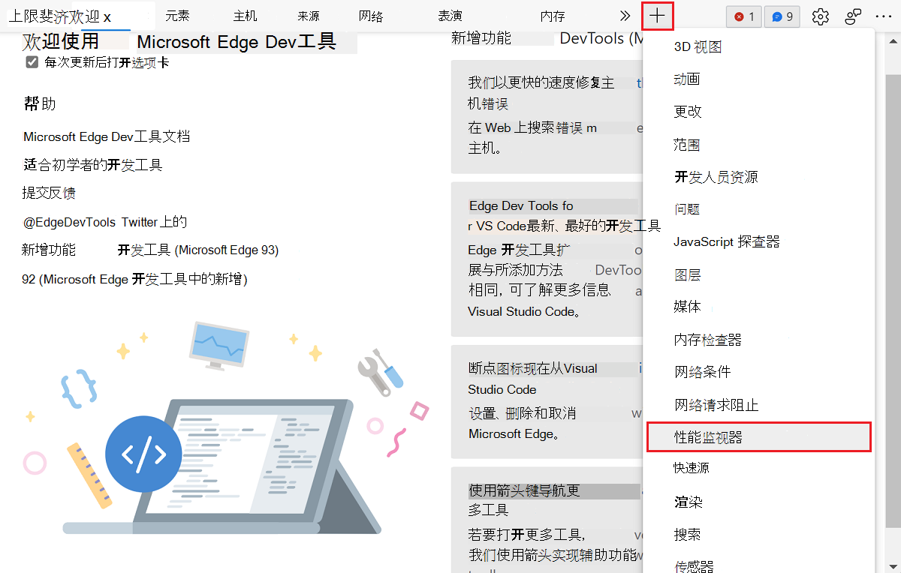

# 使用性能监视器工具度量页面的运行时性能

使用 **性能监视器** 工具获取网页运行时性能的实时视图。

**性能监视**器工具可帮助确定性能问题来源。  网站运行缓慢的原因有很多。  此工具提供线索，以了解问题是否与以下原因相关：
*  内存或 CPU 使用率较高。
*  布局和样式计算过于频繁。
*  DOM 节点和事件侦听器太多。

<!-- ====================================================================== -->
## 打开性能监视器工具

若要打开性能监视器，请执行以下操作：

1. 要打开 DevTools，请右击网页，然后选择“**检查**”。  或者，按“`Ctrl`+`Shift`+`I`”(Windows、Linux)或“`Command`+`Option`+`I`”(macOS)。  DevTools 随即打开。

1. 在 DevTools 的主工具栏上，选择 **“性能监视器** ”选项卡。 如果该选项卡不可见，请单击“ **更多”选项卡** () 按钮，或者“ **更多工具** () 按钮。

性能监视器显示实时更新的各种性能指标的图形。

:::image type="content" source="../media/performance-monitor-tool/performance-monitor-first-open.png" alt-text="首次打开性能监视器工具时的外观。" lightbox="../media/performance-monitor-tool/performance-monitor-first-open.png":::

<!-- ====================================================================== -->
## 选择要监视的性能指标

**性能监视**器工具默认显示三个性能指标，并提供其他指标。

| 性能指标 | 描述 |
|---|---|
| **CPU 使用情况** | 网页使用的 CPU 百分比。  默认显示。 |
| **JS 堆大小** | 页面上 JavaScript 程序使用的内存量。  默认显示。 |
| **DOM 节点** | 浏览器中跨选项卡 (的 DOM 节点数) 。  默认显示。 |
| **JS 事件侦听器** | 浏览器中跨选项卡 (的 JavaScript 事件侦听器数) 。 |
| **文档** | 浏览器中跨选项卡 (的文档对象数) 。 |
| **文档框架** | 浏览器中的文档帧数 (跨选项卡) 。 |
| **Layouts / sec** | 浏览器引擎每秒构造页面布局的次数。 |
| **样式重新缩放 /秒** | 浏览器引擎每秒计算页面的 CSS 样式的次数。 |

若要启用或禁用任何可用性能指标，请单击侧栏中的标签。

:::image type="content" source="../media/performance-monitor-tool/performance-monitor-metrics.png" alt-text="性能监视器边栏，显示可切换的各种指标。" lightbox="../media/performance-monitor-tool/performance-monitor-metrics.png":::
