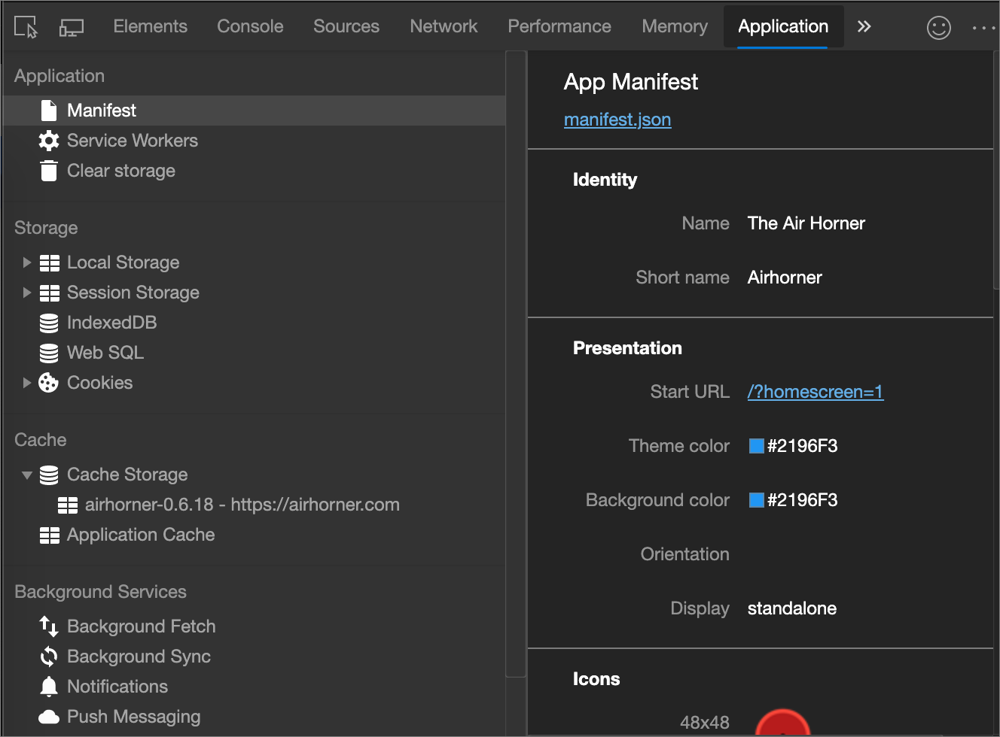
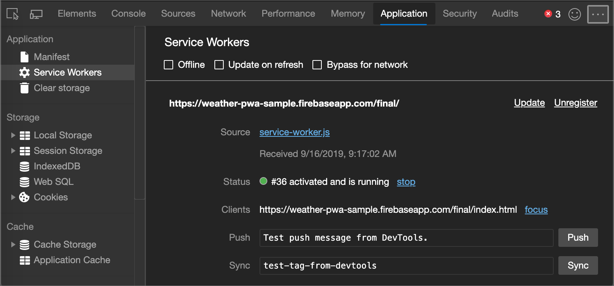
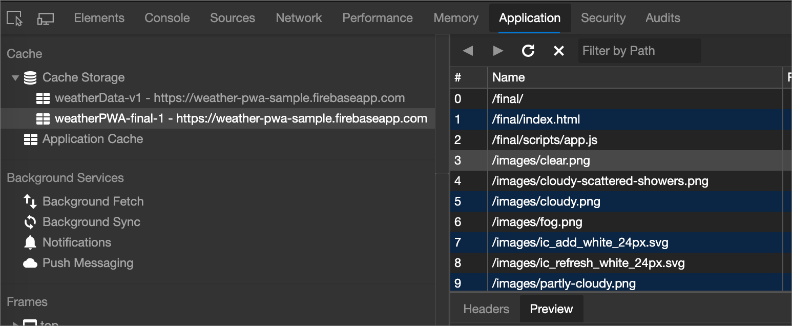
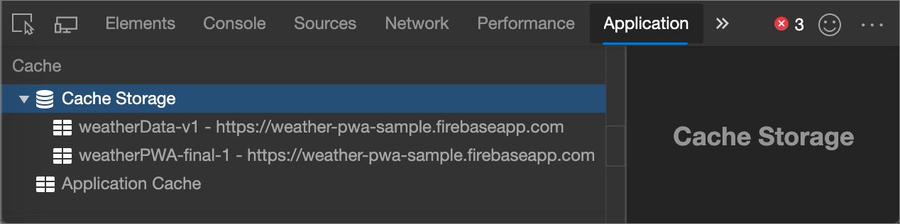

<!-- Copyright Kayce Basques

   Licensed under the Apache License, Version 2.0 (the "License");
   you may not use this file except in compliance with the License.
   You may obtain a copy of the License at

       https://www.apache.org/licenses/LICENSE-2.0

   Unless required by applicable law or agreed to in writing, software
   distributed under the License is distributed on an "AS IS" BASIS,
   WITHOUT WARRANTIES OR CONDITIONS OF ANY KIND, either express or implied.
   See the License for the specific language governing permissions and
   limitations under the License.  -->
# 调试渐进式 Web 应用 (PWA)

使用 **应用程序面板** 检查、修改和调试 Web 应用清单、服务工作者和服务辅助角色缓存。

本文仅讨论 **应用程序面板的** 渐进式 Web 应用功能。  有关 **应用程序** 面板中其他窗格的帮助，请参阅 [“查看页面资源](../resources/index.md) ”和 [“查看”并编辑本地存储](../storage/localstorage.md)。

另请参阅[进步Web 应用 (PVA) 概述](../../progressive-web-apps-chromium/index.md)。

### 摘要

*  使用 **“清单** ”窗格检查 Web 应用清单并触发“添加到主屏幕”事件。

*  使用 **“服务工作者** ”窗格执行一系列与服务辅助角色相关的任务，例如取消注册或更新服务、模拟推送事件、脱机或停止服务辅助角色。

*  从 **“缓存存储**”窗格中查看服务辅助角色缓存。

*  从“ **清除存储** ”窗格单击一个按钮，取消注册服务辅助角色并清除所有存储和缓存。

<!-- ====================================================================== -->
## Web 应用清单

如果希望用户能够将应用添加到其移动主屏幕，则需要 Web 应用清单。  清单定义了应用在主屏幕上的显示方式、从主屏幕启动时引导用户的位置以及启动时应用的外观。

<!--Related Guides:

* [Improve user experiences with a Web App Manifest](/web/fundamentals/web-app-manifest)
* [Using App Install Banners](/web/fundamentals/app-install-banners)  -->

<!--TODO:  Link to sections when available. -->

设置清单后，可以使用**应用程序面板的****“清单**”窗格对其进行检查。

*  若要查看清单源，请单击上图) 中“ **应用清单** 标签” (`https://airhorner.com/manifest.json` 下方的链接。
<!-- *  Click the **Add to homescreen** button to simulate an Add to Homescreen event.  Check out the next section for more information.  -->

*  标 **识** 和 **演示文稿** 部分仅在用户更友好的显示中显示清单源中的字段。

*  “ **图标”** 部分显示已指定的每个图标。

<!--### Simulate Add to Homescreen events  -->

<!--A web app may only be added to a homescreen when the site is visited at least twice, with at least five minutes between visits.  While developing or debugging your Add to Homescreen workflow, the criteria is potentially inconvenient.
The **Add to homescreen** button on the **App Manifest** pane lets you simulate Add to Homescreen events whenever you want.  -->

<!--You can test out this feature with the [Microsoft I/O 2016 progressive web app](https://events.alpahabet.com/io2016/), which has proper support for Add to Homescreen.  Choosing on **Add to Homescreen** while the app is open prompts Microsoft Edge to display the "add this site to your shelf" banner, which is the desktop equivalent of the "add to homescreen" banner for mobile devices.  -->

<!--

-->

<!--
> [!Tip]
> Keep the **Console** drawer open while simulating Add to Homescreen events.  The Console tells you if your manifest has any issues and logs other information about the Add to Homescreen lifecycle.  -->

<!--The **Add to Homescreen** feature cannot yet simulate the workflow for mobile devices.  Notice how the "add to shelf" prompt was triggered in the screenshot above, even though DevTools is in Device Mode (Device Emulation).  However, if you can successfully add your app to your desktop shelf, then it works for mobile, too.  -->

<!-- TODO: Rework content after sample app is created. -->

<!--If you want to test out the genuine mobile experience, you can connect a real mobile device to DevTools via [remote debugging](/debug/remote-debugging/remote-debugging), and then click the **Add to Homescreen** button (on DevTools) to trigger the "add to homescreen" prompt on the connected mobile device.  -->

<!--TODO:  Link Debug "remote debugging" sections when available. -->

<!-- ====================================================================== -->
## 服务工作者

服务工作者是未来 Web 平台中的基础技术。  它们是浏览器在后台运行的脚本，独立于网页。  这些脚本允许你访问不需要网页或用户交互的功能，例如推送通知、后台同步和脱机体验。

<!--Related Guides:

* [Intro to Service Workers](/web/fundamentals/primers/service-worker)
* [Push Notifications: Timely, Relevant, and Precise](/web/fundamentals/push-notifications)  -->

<!-- [How Push Works](/web/fundamentals/push-notifications/how-push-works) -->

<!--TODO:  Link to sections when available. -->

**应用程序**面板中的 **“服务工作者**”窗格是 DevTools 中用于检查和调试服务工作者的主要位置。

*  如果服务辅助角色已安装到当前打开的页面，则会在此窗格中列出该辅助角色。  例如，在上图中，为范围 `https://weather-pwa-sample.firebaseapp.com`安装了一个服务辅助角色。

*  **脱机**复选框将 DevTools 置于脱机模式。  这等效于**网络**工具提供的脱机模式或`Go offline`[命令菜单](../command-menu/index.md)中的选项。

*  **“重新加载更新**”复选框强制服务辅助角色在每个页面加载上进行更新。

*  网络复选框的 **旁路** 绕过服务辅助角色，并强制浏览器转到网络获取请求的资源。

*  “ **更新”** 按钮执行指定服务辅助角色的一次性更新。

*  **“推送**”按钮模拟不带有效负载的推送通知 (也称为**发痒**) 。

*  “ **同步** ”按钮模拟后台同步事件。

*  **“取消注册”** 按钮将注销指定的服务辅助角色。  单击一个按钮，查看 [“清除存储](#clear-storage) ”，了解取消注册服务辅助角色以及擦除存储和缓存的方法。

*  **源**行会告知当前正在运行的服务辅助角色的安装时间。  链接是服务辅助角色的源文件的名称。  选择链接会将你发送到服务辅助角色的源。

*  **“状态**”行将告知服务辅助角色的状态。  上图中绿色状态指示器旁边的 ID 号 (`#36`) 当前处于活动状态的服务辅助角色。  在状态旁边，如果服务辅助角色) 停止，则 (**启动按钮** ;如果显示服务辅助角色正在运行) ，则 (**停止** 按钮。  服务辅助角色设计为随时由浏览器停止和启动。  使用 **“停止** ”按钮显式停止服务辅助角色可能会模拟这一点。  停止服务辅助角色是测试当服务辅助角色重新启动时代码的行为方式的好方法。  它经常显示 bug，因为对持久性全球状态的错误假设。

*  客户 **端** 行将告知服务辅助角色的作用域。  启用 **“显示所有**”复选框后，**焦点**按钮最为有用。  启用该复选框后，将列出所有已注册的服务工作者。  如果单击另一个选项卡中运行的服务辅助角色旁边**的“焦点**”按钮，Microsoft Edge将焦点放在该选项卡上。

如果服务辅助角色导致任何错误，则会显示名为 **“错误** ”的新标签。

<!--

-->

<!--TODO:  Capture Service Worker Errors sample when available. -->
<!--TODO:  Link Web "How tickle works" sections when available. -->

<!-- ====================================================================== -->
## 服务辅助角色缓存

**“缓存存储**”窗格提供使用 (服务辅助角色) [缓存 API](https://developer.mozilla.org/docs/Web/API/Cache) 缓存的资源的只读列表。

> [!NOTE]
> 首次打开缓存并向其添加资源时，DevTools 可能无法检测到更改。  刷新页面并显示缓存。

如果已打开两个或多个缓存，缓存将显示**在缓存存储**下拉列表下，如以下屏幕截图所示。

<!-- ====================================================================== -->
## 配额使用情况

**缓存存储**窗格中的某些响应可能标记为“不透明”。<!-- [opaque](/web/fundamentals/glossary#opaque-response) -->  这指的是从其他源检索的响应，例如从**CDN**<!-- [CDN](/web/fundamentals/glossary#CDN) --> 如果未启用 [CORS](https://fetch.spec.whatwg.org/#http-cors-protocol) ，则为远程 API。

<!--TODO:  Link Web "CDN" section when available. -->
<!--TODO:  Link Web "opaque" section when available. -->

为了避免跨域信息泄露，将大量填充添加到用于计算存储配额限制的不透明响应的大小 (例如，API 是否 `QuotaExceeded`) 和报告 `navigator.storage` 异常。

<!--TODO:  Link Estimating "`navigator.storage` API" sections when available. -->
<!-- [Estimating available storage space](whats-new/2017/08/estimating-available-storage-space) -->

此填充的详细信息因浏览器而异，但对于Microsoft Edge，这意味着任何单个缓存不透明响应对总体存储使用量的贡献**的最小大小**[约为 7 MB](https://bugs.chromium.org/p/chromium/issues/detail?id=796060#c17)。  在确定要缓存的不透明响应数量时，请记住填充，因为根据不透明资源的实际大小，可能会比预期的更快轻松超出存储配额限制。

相关指南：

* [堆栈溢出：不透明的响应有哪些限制？](https://stackoverflow.com/q/39109789/385997)
<!--* [Alphabet work container: Understanding Storage Quota](/web/tools/Alphabet-work-container/guides/storage-quota#beware_of_opaque_responses)  -->

<!--TODO:  Link Work container storage quota for opaque responses section when available. -->

<!-- ====================================================================== -->
## 清除存储

在开发渐进式 Web 应用时，“**清除存储**”窗格是一项非常有用的功能。  此窗格允许注销服务人员，并单击单击一个按钮清除所有缓存和存储。  <!--Check out the section below to learn more.  -->

<!--Related Guides:

* [Clear Storage](/iterate/manage-data/local-storage#clear-storage)  -->

<!--TODO:  Link to sections when available. -->

<!--## Other Application panel guides

Check out the guides below for more help on the other panes of the **Application** panel.

Related Guides:

* [Inspect page resources](/iterate/manage-data/page-resources)
* [Inspect and manage local storage and caches](/iterate/manage-data/local-storage)  -->

<!-- ====================================================================== -->
> [!NOTE]
> 此页面的某些部分是根据 [Google 创建和共享的](https://developers.google.com/terms/site-policies)作品所做的修改，并根据[ Creative Commons Attribution 4.0 International License ](https://creativecommons.org/licenses/by/4.0)中描述的条款使用。
> 原始页面位于[此处](https://developers.google.com/web/tools/chrome-devtools/progressive-web-apps)，由 [Kayce Basques](https://developers.google.com/web/resources/contributors#kayce-basques)\（Chrome DevTools 和 Lighthouse 的技术作家）撰写。

本作品根据[ Creative Commons Attribution 4.0 International License ](https://creativecommons.org/licenses/by/4.0)获得许可。
