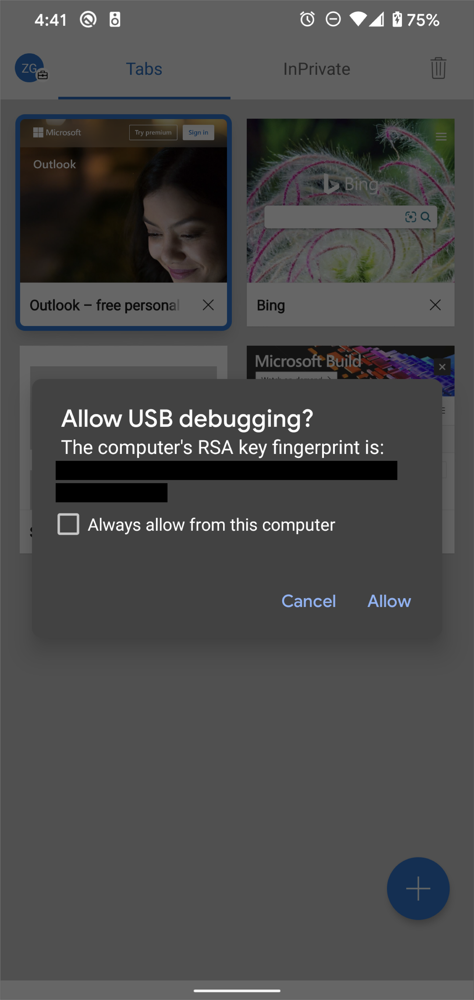
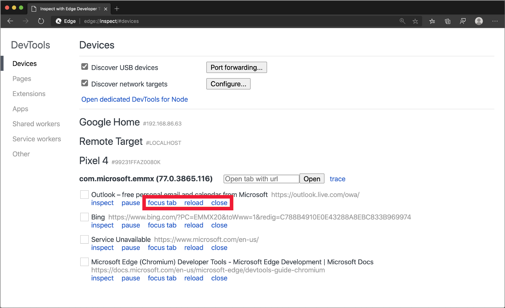

<!-- Copyright Kayce Basques

   Licensed under the Apache License, Version 2.0 (the "License");
   you may not use this file except in compliance with the License.
   You may obtain a copy of the License at

       https://www.apache.org/licenses/LICENSE-2.0

   Unless required by applicable law or agreed to in writing, software
   distributed under the License is distributed on an "AS IS" BASIS,
   WITHOUT WARRANTIES OR CONDITIONS OF ANY KIND, either express or implied.
   See the License for the specific language governing permissions and
   limitations under the License.  -->
# 远程调试 Android 设备

从你的 Windows 或 macOS 计算机在 Android 设备上远程调试实时内容。  以下教程页面介绍如何：

*  设置 Android 设备进行远程调试，然后从开发计算机中发现。

*  在开发设备上检查和调试 Android 设备上的实时内容。

*  将 Android 设备中的内容截屏到开发计算机上的开发工具实例上。

<!--

-->

> [!NOTE]
> 目前不支持在iOS设备上远程调试Microsoft Edge应用。  以下指南专门针对 Android 设备上的 Microsoft Edge 进行远程调试。
> 如果使用的是 macOS 设备，请按照 [Brightcove 调试指南](https://general.support.brightcove.com/developer/debugging-mobile-devices.html)使用 Safari 在 iOS 设备上远程调试 Microsoft Edge。  有关 Safari 中的 Web 检查器工具的详细信息，请参阅 [Safari Web 开发工具](https://developer.apple.com/safari/tools)。

<!-- ====================================================================== -->
## 步骤 1：发现 Android 设备

下面的工作流适用于大多数用户。  有关详细帮助，请参阅[故障排除：DevTools 未检测Android设备](#troubleshooting-devtools-isnt-detecting-the-android-device)，如下所示。

1. 打开 Android 上的“**开发人员选项**”屏幕。  请参阅 [“配置设备上开发人员选项](https://developer.android.com/studio/debug/dev-options)”。

1. 选择 **“启用 USB 调试**”。

1. 在开发计算机上，打开 Microsoft Edge。

1. 在地址栏中，转到 `edge://inspect`。

   

1. 使用 USB 电缆将 Android 设备直接连接到开发计算机。  首次尝试连接时，将显示有关开发工具检测未知设备的提示。  在 Android 设备上接受“**允许 USB 调试**”权限提示。

   

1. 如果显示 Android 设备的型号名称，则 Microsoft Edge 已成功与设备建立连接。  继续[第 2 步](#step-2-debug-content-on-your-android-device-from-your-development-machine)部分。

   <!--
   
   -->

### 故障排除：DevTools 未检测Android设备

使用以下提示可帮助你对硬件的正确设置进行故障排除。

*  如果使用 USB 集线器，尝试将 Android 设备直接连接到开发计算机。
*  尝试拔下 Android 设备与开发机器之间的 USB 电缆，然后重新插入 USB 电缆。  解锁 Android 和开发计算机屏幕时完成任务。
*  确保 USB 电缆正常工作。  应该能够在开发计算机上检查 Android 设备上的文件。

使用以下提示可帮助你验证软件是否正确设置。

*  如果你的开发计算机运行的是 Windows，请尝试手动为 Android 设备安装 USB 驱动程序。  有关详细信息，请参阅 [安装 OEM USB 驱动程序](https://developer.android.com/tools/extras/oem-usb.html)。
*  Windows和Android设备的某些组合 (尤其是 Samsung) 需要其他设置。  有关详细信息，请参阅 [DevTools 设备在插入时未检测到设备](https://stackoverflow.com/questions/21925992)。

如果“**允许 USB 调试**”提示未显示在Android设备上，请尝试：

*  开发工具专注于开发计算机并且显示 Android 主屏幕时，断开 USB 电缆连接，然后重新连接。  有时，当锁定Android或开发计算机屏幕时，不会显示提示。
*  更新Android设备和开发计算机的显示设置，使其永远不会进入睡眠状态。
*  将 Android 的 USB 模式设置为 PTP。  请参阅 [Galaxy S4 未显示“授权 USB 调试”对话框](https://android.stackexchange.com/questions/101933)。
*  从Android设备上的“**开发人员选项**”屏幕上选择“**撤销 USB 调试授权**”，将其重置为新状态。

如果在此页面上或 DevTools 设备上未提及的解决方案在 Stack Overflow 上 [插入时未检测到设备](https://stackoverflow.com/questions/21925992) ，请将解决方案添加到该 Stack Overflow 问题<!--, or [open an issue in the webfundamentals repository](https://github.com/Alphabet/webfundamentals/issues/new?title=[Remote%20Debugging]) -->.

<!-- ====================================================================== -->
## 步骤 2：从开发计算机调试 Android 设备上的内容

1. 在 Android 设备上打开 Microsoft Edge。

1. 转到 `edge://inspect`。  将显示Android设备的模型名称，后跟设备序列号。  在下面，应显示设备上运行的 Microsoft Edge 版本，括号中会显示版本号。  每个打开的 Microsoft Edge 选项卡获取一个唯一部分。  可以从分区与该选项卡进行交互。  <!--If there are any apps using WebView, a section for each of those apps should be displayed, too.  --><!--In [**Figure 5**](#figure-5) there are no tabs or WebViews open.  -->

  

1. 在 **包含 URL 文本框的“打开”选项卡** 中，输入 URL，然后单击 **“打开**”。  该页面将在 Android 设备上的新选项卡中打开。

1. 单击刚打开的 URL 旁边的 **检查** 。  新的开发工具实例打开。

<!--
The version of Microsoft Edge running on your Android device determines the version of DevTools that opens on your development machine.  So, if your Android device is running a very old version of Microsoft Edge, the DevTools instance may look very different than what you are used to.
-->

### 更多操作：聚焦、刷新或关闭选项卡

选择 **焦点选项卡**、 **重载**或 **关闭** 要聚焦、刷新或关闭的选项卡旁边。

### 检查元素

转到 DevTools 实例的 **Elements** 工具，并将鼠标悬停在某个元素上，以便在Android设备的视区中突出显示该元素。

还可以点击Android设备屏幕上的元素，在 **“元素**”工具中选择它。  单击 **“选择元素** (在 DevTools 实例上) 图标，然后选择Android设备屏幕上的元素。

> [!NOTE]
> **选择元素** 在第一次选择后处于禁用状态，因此每次想要使用此功能时都需要重新启用它。

### 将 Android 屏幕截屏到开发计算机

单击 **“切换屏幕广播** () 图标可在 DevTools 实例中查看Android设备的内容。

可以通过多种方式与屏幕广播进行交互：

*  单击将转换为点击，在设备上触发适当的触摸事件。
*  计算机上的击键会发送到设备。
*  若要模拟收缩手势，拖动时按住 `Shift`。
*  如果要滚动，请使用触控板或鼠标滚轮，或使用鼠标指针拖动。

使用以下提示来帮助你进行屏幕广播：

*  截屏视频仅显示页面内容。  屏幕广播的透明部分表示设备接口，例如Microsoft Edge地址栏、Android状态栏或Android键盘。
*  截屏视频会对帧速率产生负面影响。  在测量滚动或动画时禁用截屏视频，以更准确地了解页面性能。
*  如果 Android 设备屏幕锁定，截屏视频的内容将消失。  解锁 Android 设备屏幕以自动恢复截屏视频。

<!-- ====================================================================== -->
> [!NOTE]
> 此页面的某些部分是根据 [Google 创建和共享的](https://developers.google.com/terms/site-policies)作品所做的修改，并根据[ Creative Commons Attribution 4.0 International License ](https://creativecommons.org/licenses/by/4.0)中描述的条款使用。
> 原始页面位于[此处](https://developer.chrome.com/docs/devtools/remote-debugging/)，由 [Kayce Basques](https://developers.google.com/web/resources/contributors#kayce-basques)\（Chrome DevTools 和 Lighthouse 的技术作家）撰写。

本作品根据[ Creative Commons Attribution 4.0 International License ](https://creativecommons.org/licenses/by/4.0)获得许可。
