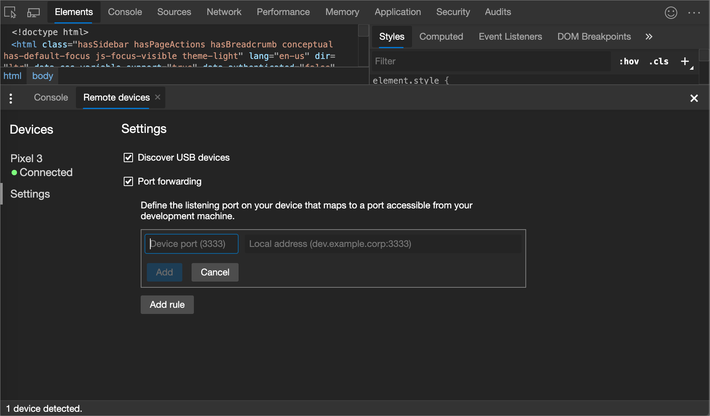
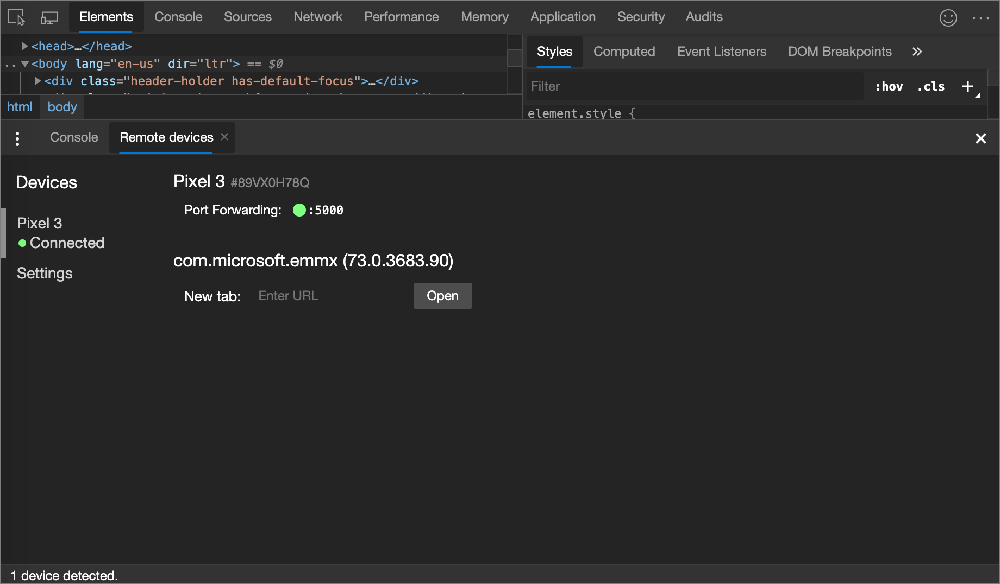

<!-- Copyright Kayce Basques

   Licensed under the Apache License, Version 2.0 (the "License");
   you may not use this file except in compliance with the License.
   You may obtain a copy of the License at

       https://www.apache.org/licenses/LICENSE-2.0

   Unless required by applicable law or agreed to in writing, software
   distributed under the License is distributed on an "AS IS" BASIS,
   WITHOUT WARRANTIES OR CONDITIONS OF ANY KIND, either express or implied.
   See the License for the specific language governing permissions and
   limitations under the License.  -->
# 访问本地服务器

在开发计算机 Web 服务器上托管站点，然后从 Android 设备访问内容。

使用 USB 电缆和 Microsoft Edge DevTools，从开发计算机运行站点，然后在 Android 设备上查看站点。

### 摘要

*  通过端口转发，可以查看在 Android 设备上的开发计算机中运行的 Web 服务器托管的内容。

*  如果 Web 服务器使用自定义域，请设置 Android 设备以使用自定义域映射访问该域中的内容。

<!-- ====================================================================== -->
## 设置端口转发

端口转发使 Android 设备能够访问在开发计算机中运行的 Web 服务器上托管的内容。  端口转发的工作原理是，在映射到开发计算机上的 TCP 端口的 Android 设备上创建侦听 TCP 端口。

端口之间的流量通过 Android 设备和开发计算机之间的 USB 连接传输，因此连接不依赖于网络配置。

若要启用端口转发，请执行以下操作：

1. 在开发计算机和 Android 设备之间设置 [远程调试](index.md) 。  完成后，Android 设备应显示在“ **检查设备** ”对话框的左侧菜单和 **连接** 状态指示器中。

1. 在 DevTools 中的 **“检查设备** ”对话框中，启用 **端口转发**。

1. 单击**添加规则**。

   

1. 在左侧的 **“设备端口** ”文本框中，输入 `localhost` 要从中访问 Android 设备上的站点的端口号。  例如，如果要从 `localhost:5000` Enter `5000`访问站点。

1. 在右侧的 **“本地地址** ”文本框中，输入站点托管在开发计算机中运行的 Web 服务器上的 IP 地址或主机名，后跟端口号。  例如，如果网站在 Enter `localhost:7331`上`localhost:7331`运行。

1. 单击**添加**。

端口转发现已设置。

可以在顶部以及设备名称旁边看到端口向前移动的状态指示器。  在“ **检查设备** ”对话框中，端口转发的指示器位于设备上的选项卡上。

若要查看内容，请在 Android 设备上打开 Microsoft Edge，然后转到 `localhost` 在 **设备端口** 字段中指定的端口。  例如，如果在字段中输入 `5000` ，请访问 `localhost:5000`。

<!-- ====================================================================== -->
## 映射到自定义本地域

通过自定义域映射，可以从正在使用自定义域的开发计算机上的 Web 服务器查看 Android 设备上的内容。

例如，假设网站使用仅适用于域 `microsoft-edge.devtools`的第三方 JavaScript 库。  因此，在开发计算机上的文件中 `hosts` 创建一个条目，将此域映射到 `localhost` (，例如) `127.0.0.1 microsoft-edge.devtools` 。  设置自定义域映射和端口转发后，请在 URL `microsoft-edge.devtools`上查看 Android 设备上的站点。

### 设置端口转发到代理服务器

若要映射自定义域，必须在开发计算机上运行代理服务器。  代理服务器的示例包括 [Charles](https://www.charlesproxy.com)、 [Squid](https://wiki.squid-cache.org) 和 [Fiddler](https://www.telerik.com/fiddler)。

若要设置端口转发到代理，请执行以下操作：

1. 运行代理服务器并记录正在使用的端口。

   > [!NOTE]
   > 代理服务器和 Web 服务器必须在不同的端口上运行。

1. 设置 [端口转发](#set-up-port-forwarding) 到 Android 设备。  对于 **本地地址** 字段，输入 `localhost:` 代理服务器正在运行的端口。  例如，如果它在端口 `8000`上运行，请转到 `localhost:8000`。  在 **设备端口** 字段中输入你希望 Android 设备侦听的数字，例如 `3333`。

### 在设备上配置代理设置

接下来，需要将 Android 设备配置为与代理服务器通信。

1. 在 Android 设备上 > ，导航到 **“设置****Wi-Fi**”。

1. 长时间按当前连接到的网络的名称。

    > [!NOTE]
    > 代理设置适用于每个网络。

1. 单击 **“修改网络**”。

1. 单击 **“高级”选项**。  代理设置显示。

1. 单击 **“代理”** 菜单，然后选择 **“手动**”。

1. 对于 **“代理主机名”** 字段，请输入 `localhost`。

1. 对于 **代理端口** 字段，请输入在上一部分中为 **设备端口** 输入的端口号。

1. 单击 **“保存”**。

使用这些设置，设备会将其所有请求转发到开发计算机上的代理。  代理代表设备发出请求，以便正确解析对自定义本地域的请求。

现在访问 Android 设备上的自定义域，就像在开发计算机上一样。

如果 Web 服务器正在从非标准端口中运行，请记得在从 Android 设备请求内容时指定端口。  例如，如果 Web 服务器在端口`7331`上使用自定义域`microsoft-edge.devtools`，则从 Android 设备查看站点时，应使用 URL`microsoft-edge.devtools:7331`。

> [!TIP]
> 若要恢复正常浏览，请记得在从开发计算机断开连接后还原 Android 设备上的代理设置。

<!-- ====================================================================== -->
> [!NOTE]
> 此页面的某些部分是根据 [Google 创建和共享的](https://developers.google.com/terms/site-policies)作品所做的修改，并根据[ Creative Commons Attribution 4.0 International License ](https://creativecommons.org/licenses/by/4.0)中描述的条款使用。
> 原始页面 [在这里](https://developer.chrome.com/docs/devtools/remote-debugging/local-server/) 找到，由 [凯斯·巴斯克斯](https://developers.google.com/web/resources/contributors#kayce-basques) (技术作家，Chrome DevTools \& Lighthouse) 和 [梅金·科尔尼](https://developers.google.com/web/resources/contributors#meggin-kearney) (技术作家) 创作。

本作品根据[ Creative Commons Attribution 4.0 International License ](https://creativecommons.org/licenses/by/4.0)获得许可。
