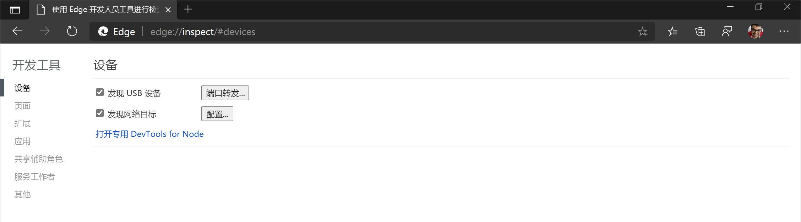
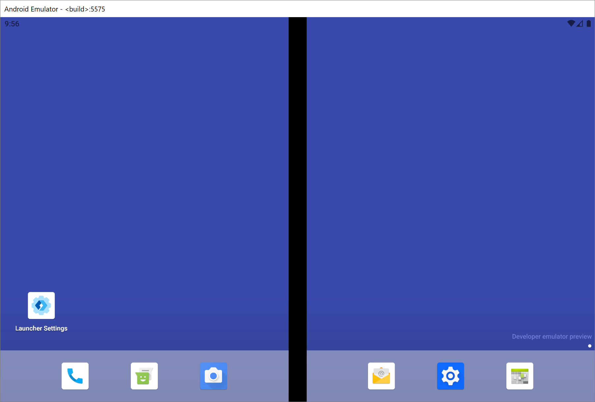

# 远程调试 Surface Duo 仿真程序

本文将介绍从 [Microsoft Edge](https://www.microsoft.com/edge) 的桌面版实例远程调试 [Surface Duo](https://www.microsoft.com/surface/devices/surface-duo) 仿真程序上 [Microsoft Edge 应用](https://play.google.com/store/apps/details?id=com.microsoft.emmx)的 web 内容。  有关在 Surface Duo 设备上进行调试的信息，请遵循[远程调试 Android 设备](index.md)的指南。

<!-- ====================================================================== -->
## 在开始之前

*  运行[Surface Duo 仿真程序](/dual-screen/android/use-emulator)前，先安装 [Surface Duo SDK](https://www.microsoft.com/download/details.aspx?id=100847)。  请参阅 [获取 Surface Duo SDK](/dual-screen/android/get-duo-sdk)。

<!-- ====================================================================== -->
## 步骤 1：转到 edge://inspect

*  打开桌面[桌面Microsoft Edge，](https://www.microsoft.com/edge)然后转到 `edge://inspect`：

> [!div class="mx-imgBorder"]
> 

如果页面 `edge://inspect` 无法识别 [Surface Duo 仿真器，](/dual-screen/android/use-emulator)请重新启动仿真器。

<!-- ====================================================================== -->
## 步骤 2：启动 Surface Duo 仿真程序

*  启动 [Surface Duo 仿真程序](/dual-screen/android/use-emulator)。  仿真器显示两个在仿真器上运行的不同屏幕：

<!-- ====================================================================== -->
## 步骤 3：在 Surface Duo 仿真程序上将 web 内容载入 Microsoft Edge 

1. 在任一屏幕上，将 [Surface Duo 仿真程序](/dual-screen/android/use-emulator)的“收藏夹托盘”上向上轻扫，以显示“应用抽屉”。

1. 单击 **"边缘**"启动[Microsoft Edge应用](https://play.google.com/store/apps/details?id=com.microsoft.emmx)：

   

1. 在Microsoft Edge应用中，转到要调试的网站或应用。

<!-- ====================================================================== -->
## 步骤 4：从 Surface Duo 仿真程序调试 Web 内容

1. 切换回 [Microsoft Edge](https://www.microsoft.com/edge) 的桌面实例。

   该`edge://inspect`页面现在显示 **SurfaceD一个 SurfaceD一个Emulator**，其中列出了[在 Surface Duo](/dual-screen/android/use-emulator) 仿真器上运行的已打开选项卡或 PWA：

   

1. 从模拟器上运行的打开的选项卡列表中，单击包含要**** 调试的 Web 内容的选项卡上的"检查"。  [DevTools](../index.md) 将在新窗口中打开。

1. 单击 **切换屏幕** () 在 DevTools 窗口中查看 [Surface Duo](/dual-screen/android/use-emulator) 模拟器中的 Web 内容。

你现在可以使用开发人员工具Microsoft Edge [Surface Duo 模拟器上调试你的 Web 内容](/dual-screen/android/use-emulator)：

### 疑难解答

如果 **SurfaceD一体**机`edge://inspect`未在页面上显示，请尝试打开或关闭 [Surface Duo](/dual-screen/android/use-emulator) Microsoft Edge应用中的选项卡Emulator。

有关其他疑难解答步骤，请参阅 [Android 设备的疑难解答部分](index.md#troubleshooting-devtools-isnt-detecting-the-android-device)。

### 网站对 Web 内容的布局的影响

如果 [Microsoft Edge 应用](https://play.google.com/store/apps/details?id=com.microsoft.emmx)在仿真程序中跨两个屏幕，截屏视频将反映应用程序的新尺寸，而不是铰链。

若要了解网站如何影响 Web 内容的布局，请使用 [Surface Duo 仿真程序](/dual-screen/android/use-emulator) ，而不是截屏视频。

<!-- ====================================================================== -->
## 其他资源

对于新的可折叠和双屏幕设备类，Web 是一个很好的平台，因为您可以编写 HTML、CSS 和 JavaScript 一次，并且可在单屏、双屏和可折叠设备上实现出色的外观。  请参阅以下其他资源，开始为这些新设备生成 Web 内容。

*  [Surface Duo 开发人员文档](/dual-screen/index) - 在双屏设备上创建应用的文档。

*  [可折叠设备的](https://github.com/MicrosoftEdge/MSEdgeExplainers/blob/master/Foldables/explainer.md)启发式体验的 Web 平台基元 - Microsoft Edge API 的 Web 平台解释器，在可折叠和双屏幕设备上生成 Web 体验。

*  [如何为网站和 Web 应用](https://youtu.be/DXrZWsqXPVc)生成双屏幕体验 - 录制开发人员Microsoft 365会议。
