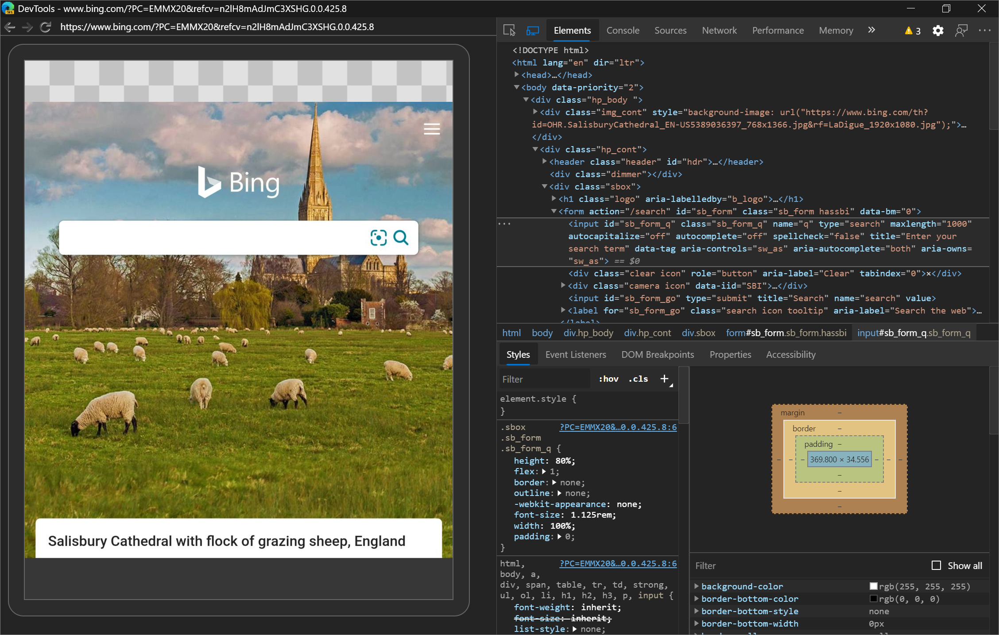

# 远程调试 Surface Duo 仿真程序

本文将介绍从 [Microsoft Edge](https://www.microsoft.com/edge) 的桌面版实例远程调试 [Surface Duo](https://www.microsoft.com/surface/devices/surface-duo) 仿真程序上 [Microsoft Edge 应用](https://play.google.com/store/apps/details?id=com.microsoft.emmx)的 web 内容。  有关在 Surface Duo 设备上进行调试的信息，请遵循[远程调试 Android 设备](index.md)的指南。

<!-- ====================================================================== -->
## 在开始之前

*  运行[Surface Duo 仿真程序](/dual-screen/android/use-emulator)前，先安装 [Surface Duo SDK](https://www.microsoft.com/download/details.aspx?id=100847)。  请参阅 [“获取 Surface Duo SDK](/dual-screen/android/get-duo-sdk)”。

<!-- ====================================================================== -->
## 步骤 1：转到 edge://inspect

*  打开[Microsoft Edge](https://www.microsoft.com/edge)的桌面实例，然后转到`edge://inspect`：

> [!div class="mx-imgBorder"]
> 

`edge://inspect`如果页面无法识别 [Surface Duo 仿真器](/dual-screen/android/use-emulator)，请重启模拟器。

<!-- ====================================================================== -->
## 步骤 2：启动 Surface Duo 仿真程序

*  启动 [Surface Duo 仿真程序](/dual-screen/android/use-emulator)。  模拟器显示模拟器上运行的两个不同的屏幕：

<!-- ====================================================================== -->
## 步骤 3：在 Surface Duo 仿真程序上将 web 内容载入 Microsoft Edge 

1. 在任一屏幕上，将 [Surface Duo 仿真程序](/dual-screen/android/use-emulator)的“收藏夹托盘”上向上轻扫，以显示“应用抽屉”。

1. 单击 **Edge** 以启动[Microsoft Edge应用](https://play.google.com/store/apps/details?id=com.microsoft.emmx)：

   

1. 在Microsoft Edge应用中，转到要调试的网站或应用。

<!-- ====================================================================== -->
## 步骤 4：从 Surface Duo 仿真程序调试 Web 内容

1. 切换回 [Microsoft Edge](https://www.microsoft.com/edge) 的桌面实例。

   该`edge://inspect`页现在显示 **SurfaceDuoEmulator**，其中包含在 [Surface Duo 模拟器](/dual-screen/android/use-emulator)上运行的打开选项卡或 [PVA](../../progressive-web-apps-chromium/index.md) 的列表：

   

1. 在模拟器上运行的打开选项卡列表中 **，单击** “检查要调试的 Web 内容”选项卡。  [DevTools](../index.md) 将在新窗口中打开。

1. 单击“ **切换屏幕广播** () 在 DevTools 窗口中从 [Surface Duo 模拟器](/dual-screen/android/use-emulator) 查看 Web 内容。

现在可以使用 Microsoft Edge DevTools 在 [Surface Duo 模拟器](/dual-screen/android/use-emulator)上调试 Web 内容：

### 疑难解答

如果 **SurfaceDuoEmulator** 未显示在页面上`edge://inspect`，请尝试在 [Surface Duo Emulator](/dual-screen/android/use-emulator)上的[Microsoft Edge应用](https://play.google.com/store/apps/details?id=com.microsoft.emmx)中打开或关闭选项卡。

有关其他故障排除步骤，请参阅[Android设备的故障排除部分](index.md#troubleshooting-devtools-isnt-detecting-the-android-device)。

### 铰链如何影响 Web 内容的布局

如果 [Microsoft Edge 应用](https://play.google.com/store/apps/details?id=com.microsoft.emmx)在仿真程序中跨两个屏幕，截屏视频将反映应用程序的新尺寸，而不是铰链。

若要了解网站如何影响 Web 内容的布局，请使用 [Surface Duo 仿真程序](/dual-screen/android/use-emulator) ，而不是截屏视频。

<!-- ====================================================================== -->
## 其他资源

Web 是一个很好的平台，适用于可折叠和双屏设备的新类，因为可以编写 HTML、CSS 和 JavaScript 一次，并且在单屏、双屏和可折叠设备上看起来非常出色。  请参阅以下其他资源，开始为这些新设备生成 Web 内容。

*  [Surface Duo 开发人员文档](/dual-screen/index) - 有关在双屏设备上创建应用的文档。

*  [可折叠设备上启蒙体验的 Web 平台基元](https://github.com/MicrosoftEdge/MSEdgeExplainers/blob/main/Foldables/explainer.md) - Microsoft Edge新 API 的 Web 平台说明器，以便在可折叠设备和双屏设备上生成 Web 体验。

*  [如何为网站和 Web 应用生成双屏体验](https://youtu.be/DXrZWsqXPVc) - 录制Microsoft 365开发人员日会话。
