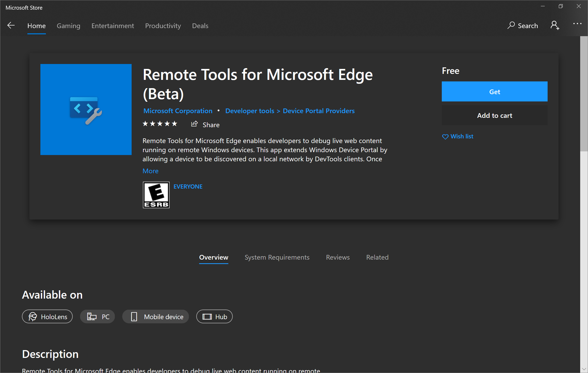
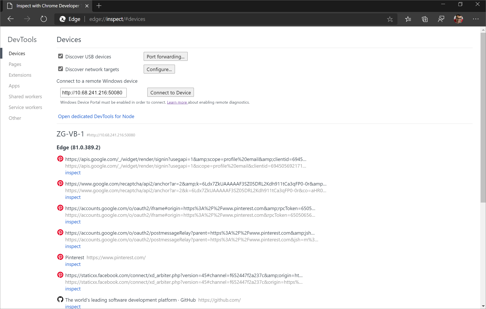

# 远程调试 Windows 设备

从Windows或macOS计算机远程调试Windows 10或更高版本设备上的实时内容。

本教程介绍以下任务：

*  设置Windows设备以进行远程调试，并从开发计算机连接到它。

*  从开发计算机检查和调试Windows设备上的实时内容。

*  从Windows设备到开发计算机上的 DevTools 实例的屏幕截图内容。

<!-- ====================================================================== -->
## 步骤 1：设置主机 (调试器计算机) 

主机或调试器计算机是要调试的Windows 10或更高版本设备。  它可能是一个远程设备，你很难进行物理访问，或者它可能没有键盘和鼠标外围设备，因此很难与该设备上的 Microsoft Edge DevTools 交互。

若要设置主机 (调试器) 计算机：

1. 安装和配置[Microsoft Edge](https://www.microsoft.com/edge)

1. 从[Microsoft Store安装适用于 Microsoft Edge (Beta) 的远程工具 ](https://www.microsoft.com/store/apps/9P6CMFV44ZLT) 

1. 激活 [开发人员模式](/windows/apps/get-started/enable-your-device-for-development) 并启用 [设备门户](/windows/uwp/debug-test-perf/device-portal)

### 安装和配置Microsoft Edge

1. 如果尚未在要调试的Windows 10或更高版本设备上安装此[页面](https://www.microsoft.com/edge)中的Microsoft Edge。

1. 如果在主机 (调试器) 计算机上使用预安装的Microsoft Edge版本，请验证是否已Microsoft Edge (Chromium) ，而不是Microsoft Edge (EdgeHTML) 。  检查的快速方法是在浏览器中加载 `edge://settings/help` 并确认版本号为 75 或更高版本。

1. 转到`edge://flags`Microsoft Edge。 

1. 在 **“搜索”标志**中，**键入“通过Windows设备门户启用远程调试**”。 将该标志设置为 **“已启用**”。 然后，单击 **“重启**”按钮以重启Microsoft Edge。

### 安装适用于 Microsoft Edge (Beta) 的远程工具

从[Microsoft Store安装适用于 Microsoft Edge (Beta) 的远程工具](https://www.microsoft.com/store/apps/9P6CMFV44ZLT)。

> [!NOTE]
> 如果使用的是 Windows 10 或更高版本 1809 或更低版本，则可能会禁用远程[工具Microsoft Edge (Beta ](https://www.microsoft.com/store/apps/9P6CMFV44ZLT)) 的 **“获取**”按钮。  若要设置主机 (调试器) 计算机，它必须运行Windows 10版本 1903 或更高版本。  更新主机 (调试器) 计算机以获取[远程工具Microsoft Edge (Beta) ](https://www.microsoft.com/store/apps/9P6CMFV44ZLT)。

启动[适用于 Microsoft Edge (Beta) 的远程工具](https://www.microsoft.com/store/apps/9P6CMFV44ZLT)，如果出现提示，请接受应用中的权限对话框。  现在可以关闭[远程工具以Microsoft Edge (Beta) ](https://www.microsoft.com/store/apps/9P6CMFV44ZLT)，并且无需为将来的远程调试会话打开它。

### 激活开发人员模式并启用设备门户

如果在 WiFi 网络上，请确保将网络标记为 **“域** ”或“ **专用**”。  可以通过打开**Windows 安全中心**应用、选择**防火墙&网络保护**以及检查网络是否列为**域**网络或**专用**网络来验证状态。

如果网络列为 **“公共**”，请转到 **设置** > **Network & Internet** > **Wi-Fi**，单击网络，然后将 **“网络配置文件**”按钮切换到 **“专用**”。

现在，打开**设置**应用。  在 **“查找设置”中**，输入 `Developer settings` 并选择它。  在 **开发人员模式**上切换。  现在，可以通过将**本地区域网络连接启用远程诊断**设置为 **“打开”** 来打开**设备门户**。  然后可以选择启用 **身份验证** ，以便客户端 (调试器) 设备必须提供正确的凭据才能连接到此设备。

> [!NOTE]
> 如果 **通过本地网络连接启用远程诊断。** 以前已打开，必须将其关闭并再次打开 **，设备门户**才能使用[远程工具Microsoft Edge (Beta) ](https://www.microsoft.com/store/apps/9P6CMFV44ZLT)。  如果“**面向开发人员**”部分未显示在**设置**中，则设备**门户**可能已打开，因此请尝试重新启动Windows 10或更高版本的设备。

请注意连接 **using：** 下显示的计算机 IP 地址和连接端口。  下图中的 IP 地址为 `192.168.86.78` ，连接端口为 `50080`：

[在下一部分](#step-2-set-up-the-client-debugger-machine)中输入客户端 (调试器) 设备上的信息。  在要从客户端 (调试器) 计算机调试的主机 (调试器) 计算机上打开Microsoft Edge和渐进式Web 应用 ([PVA ](../progressive-web-apps/index.md)) 选项卡。

<!-- ====================================================================== -->
## 步骤 2：设置客户端 (调试器计算机) 

客户端或调试器计算机是要从中调试的设备。  此设备可能是你的日常开发计算机，或者在家工作时可能只是你的电脑或 MacBook。

1. 若要设置客户端 (调试器) 计算机，请从[此页面](https://www.microsoft.com/edge)安装Microsoft Edge（如果尚未安装）。

1. 如果在主机 (调试器) 计算机上使用预安装的Microsoft Edge版本，请验证是否已Microsoft Edge (Chromium) ，而不是Microsoft Edge (EdgeHTML) 。  检查的快速方法是在浏览器中加载 `edge://settings/help` 并确认版本号为 75 或更高版本。

1. 转到`edge://inspect`Microsoft Edge中的页面。  默认情况下，应位于 **“设备”** 部分。

1. **在远程Windows设备的连接**下，按照以下模式在文本框中输入主机的 IP 地址和连接端口 (调试) 计算机：http://`IP address`：`connection port`。

1. 单击 **“连接到设备**”。

   

1. 如果为主机 (调试器) 计算机设置身份验证，系统会提示输入客户端 (调试器) 计算机的 **用户名** 和 **密码** 以成功连接。

### 使用 https 而不是 http

如果要连接到主机 (调试器) 计算机， `https` 而不是 `http`：

1. 转到`http://IP address:50080/config/rootcertificate`客户端 (调试器) 计算机上的Microsoft Edge。  这会自动下载名为 >a0 `rootcertificate.cer`>的安全证书。

1. 选择 `rootcertificate.cer`。  这将打开[Windows证书管理器工具](/dotnet/framework/wcf/feature-details/how-to-view-certificates-with-the-mmc-snap-in#view-certificates-with-the-certificate-manager-tool)。

1. 单击 **“安装证书...**”，确保 **当前用户** 已打开，然后单击 **“下一步**”。

1. 单击 **以下存储中的所有证书** ，然后单击 **“浏览...**”。

1. 选择 **受信任的根证书颁发机构** 存储，然后单击 **“确定**”。

1. 单击**下一步**，然后单击**完成**。

1. 如果出现提示，请确认要将此证书安装到 **受信任的根证书颁发机构** 存储。

1. 现在，在使用 `edge://inspect` 页面从客户端 (调试器) 计算机连接到主机 (调试器) 计算机时，必须使用其他 `connection port` 值。  默认情况下，对于桌面Windows，设备门户将用作`50080``connection port`其用途`http`。  因此 `https`，设备门户使用 `50043` 此模式：https://`IP address`：`50043` 在 `edge://inspect` 页面上。  [详细了解设备门户使用的默认端口](/windows/uwp/debug-test-perf/device-portal#setup)。

> [!NOTE]
> 默认端口是`50080``http`默认端口`https``50043`，但情况并非总是如此，因为桌面上的设备门户在临时范围内的声明端口 (\>50，000) ，以防止与设备上的现有端口声明发生冲突。  若要了解详细信息，请参阅Windows桌面上设备门户的[“端口](/windows/uwp/debug-test-perf/device-portal-desktop#registry-based-configuration-for-device-portal)设置”部分。

<!-- ====================================================================== -->
## 步骤 3：从客户端调试主机上的内容

如果客户端 (调试器) 计算机成功连接到主机 (调试器) 计算机`edge://inspect`，则客户端上的页面现在将显示Microsoft Edge中的选项卡列表以及主机上任何打开的 PVA。

确定要调试的内容，然后单击 **“检查**”。  Microsoft Edge DevTools 将在新选项卡中打开，并将主机 (调试器) 计算机中的内容屏幕广播到客户端 (调试器) 计算机。  现在，可以将客户端上Microsoft Edge DevTools 的全部功能用于主机上运行的内容。  在此处详细了解如何使用 Microsoft Edge DevTools[。](../index.md)

### 检查元素

例如，尝试检查元素。  转到客户端上的 DevTools 实例的 **Elements** 工具，并将鼠标悬停在某个元素上，以便在主机设备的视区中突出显示它。

还可以点击主机设备屏幕上的元素，在 **“元素** ”工具中选择它。  在客户端上的 DevTools 实例上 **选择“选择元素** ”，然后点击主机设备屏幕上的元素。

> [!NOTE]
> 选择**元素**在第一次触摸后已禁用，因此每次想要使用此功能时都需要再次打开它。

> [!IMPORTANT]
> **元素**工具中**的事件侦听器**窗格在 1903 Windows 10版本上为空。  这是一个已知问题，团队计划在服务更新中修复**事件侦听器**窗格，以Windows 10版本 1903。

<!-- ====================================================================== -->
## 步骤 4：将主机屏幕屏幕屏幕屏幕屏幕屏蔽到客户端设备

默认情况下，客户端上的 DevTools 实例已启用屏幕广播，这使你可以在客户端设备上的 DevTools 实例中查看主机设备上的内容。  单击 **“切换屏幕广播** ”打开或关闭此功能。

可以通过多种方式与屏幕广播进行交互：
*  单击将转换为点击，在设备上触发适当的触摸事件。
*  计算机上的击键会发送到设备。
*  若要模拟收缩手势，拖动时按住 `Shift`。
*  如果要滚动，请使用触控板或鼠标滚轮，或使用鼠标指针拖动。

有关屏幕广播的一些说明：
*  截屏视频仅显示页面内容。  屏幕广播的透明部分表示设备接口，例如Microsoft Edge地址栏、Windows 10或更高版本的任务栏，以及Windows 10或更高版本的键盘。
*  截屏视频会对帧速率产生负面影响。  在测量滚动或动画时禁用截屏视频，以更准确地了解页面性能。
*  如果主机设备屏幕锁定，则屏幕截图的内容将消失。  解锁主机设备屏幕以自动恢复屏幕广播。

<!-- ====================================================================== -->
## 已知问题

**元素**工具中**的事件侦听器**窗格在 1903 Windows 10版本上为空。  团队计划在服务更新中修复**事件侦听器**窗格，以Windows 10版本 1903。

应用程序**面板中的** **Cookie** 窗格在 1903 Windows 10版本上为空。  团队计划在服务更新中修复 **Cookie** 窗格，以Windows 10版本 1903。

“**审核**”工具、**3D 视图**工具、**设置**中的 **“模拟设备**”部分和 **“元素**”工具中的**辅助功能树**窗格当前未按预期工作。  团队计划在将来更新Microsoft Edge时修复列出的工具。

远程调试时，文件资源管理器不会从 **“源** ”工具中的 DevTools 或 **安全** 面板中启动。  团队计划在将来更新Microsoft Edge时修复这些工具。
