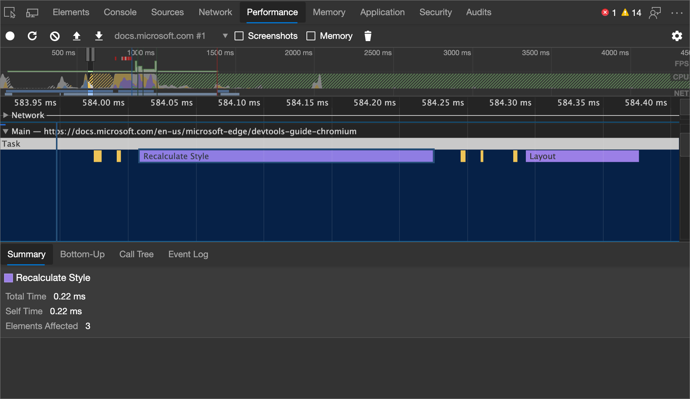
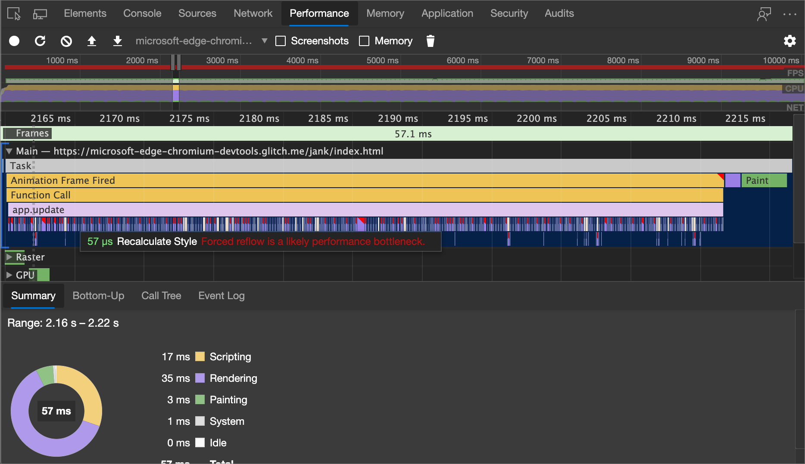

<!-- Copyright Kayce Basques and Meggin Kearney

   Licensed under the Apache License, Version 2.0 (the "License");
   you may not use this file except in compliance with the License.
   You may obtain a copy of the License at

       https://www.apache.org/licenses/LICENSE-2.0

   Unless required by applicable law or agreed to in writing, software
   distributed under the License is distributed on an "AS IS" BASIS,
   WITHOUT WARRANTIES OR CONDITIONS OF ANY KIND, either express or implied.
   See the License for the specific language governing permissions and
   limitations under the License.  -->
# 分析运行时性能

<!-- not able to find this article or its strings in other repo; the link redirects.  "todo" items might not be actionable -->

用户需要交互式和平滑页面。  像素管道中的每个阶段都表示有机会引入 jank (呈现) 中断。  了解用于识别和解决降低运行时性能的常见问题的工具和策略。

### 摘要

*  请勿编写强制浏览器重新计算布局的 JavaScript。  分离读取和写入函数，并首先执行读取。

*  不要使 CSS 过于复杂。  少使用 CSS，使 CSS 选择器保持简单。

*  尽量避免布局。  选择根本不触发布局的 CSS。

*  绘画花费的时间可能比任何其他呈现活动都多。  注意油漆瓶颈。

<!-- ====================================================================== -->
## JavaScript

JavaScript 计算（尤其是触发大量视觉更改的计算）可能会使应用程序性能停止。  不要让超时或长时间运行的 JavaScript 干扰用户交互。

### JavaScript：工具

在 **“性能** ”工具中进行录制，并查找可疑的长 `Evaluate Script` 事件。  <!--If you find any, you can enable the **JS Profiler** and re-do your recording to get more detailed information about exactly which JavaScript functions were used and how long each took.  -->

<!--todo: add Recording section when available  -->
<!--todo: add Profile JavaScript (JS Profiler) section when available  -->

如果注意到 JavaScript 中 (呈现) 中断，则可能需要将分析提升到一个新的级别并收集 JavaScript CPU 配置文件。  CPU 配置文件显示在页面的函数中使用运行时的位置。  了解如何在 [加速 JavaScript 运行时](js-runtime.md)中创建 CPU 配置文件。

### JavaScript：问题

下表介绍了一些常见的 JavaScript 问题和潜在解决方案。

| 问题 | 示例 | 解决方案 |
|:--- |:--- |:--- |
| 影响响应或动画的昂贵输入处理程序。  | 触摸，视差滚动。  | 让浏览器处理触摸和滚动，或尽可能晚地绑定侦听器。  请参阅 [Paul Lewis 运行时性能清单中的昂贵输入处理程序](https://calendar.perfplanet.com/2013/the-runtime-performance-checklist/)。  |
| 时间错误的 JavaScript 会影响响应、动画和负载。  | 用户在页面加载后直接滚动，setTimeout/setInterval。  | 优化 JavaScript 运行时：使用 `requestAnimationFrame`、将 DOM 操作分散到帧上、使用 [Web 辅助角色](https://developer.mozilla.org/docs/Web/API/Web_Workers_API/Using_web_workers)。  |
| 长时间运行的 JavaScript 会影响响应。  | [DOMContentLoaded 事件](https://developer.mozilla.org/docs/Web/API/Web_Workers_API/Using_web_workers)因 JS 工作被淹没而停止。  | 将纯计算工作移到 [Web 辅助角色](https://developer.mozilla.org/docs/Web/API/Web_Workers_API/Using_web_workers)。  如果需要 DOM 访问权限，请使用 `requestAnimationFrame`。  <!--See [Optimize JavaScript Execution](/web/fundamentals/performance/rendering/optimize-javascript-execution).  -->  |
| 影响响应或动画的垃圾 y 脚本。  | 垃圾回收可能发生在任何位置。  | 编写更少的垃圾 y 脚本。  请参阅 [Paul Lewis 运行时性能清单中的动画中的垃圾回收](https://calendar.perfplanet.com/2013/the-runtime-performance-checklist/)。  |

<!--todo: add "Optimize JavaScript runtime" section when available  -->

<!-- ====================================================================== -->
## 样式

样式更改成本高昂，尤其是在这些更改影响 DOM 中的多个元素时。  每当将样式应用到元素时，浏览器都会计算出对所有相关元素的影响、重新计算布局和重排。

<!--Related Guides:

* [Reduce the Scope and Complexity of Styles Calculations](/web/fundamentals/performance/rendering/reduce-the-scope-and-complexity-of-style-calculations)
-->

<!--todo: add Reduce the Scope and Complexity of Styles Calculations section when available -->

### 样式：工具

在 **“性能** ”工具中进行录制。  检查 (以紫色) 显示的大型 `Recalculate Style` 事件的录制。

<!--todo: add Recording section when available  -->

选择事件 `Recalculate Style` 可在“ **详细** 信息”窗格中查看有关该事件的详细信息。  如果样式更改需要很长时间，则会影响性能。  如果样式计算影响大量元素，则这是另一个有改进空间的区域。

若要减少事件的影响 `Recalculate Style` ，

*  使用 [CSS 触发器](https://csstriggers.com) 了解哪些 CSS 属性触发布局、绘制和复合。  这些属性对呈现性能的影响最为严重。
*  切换到影响较小的属性。  <!--For more guidance, See [Stick to compositor-only properties and manage layer count](/web/fundamentals/performance/rendering/stick-to-compositor-only-properties-and-manage-layer-count).  -->

<!--todo: add Stick to compositor-only properties and manage layer count section when available -->

### 样式：问题

下表介绍了一些常见的样式问题和潜在解决方案。

| 问题 | 示例 | 解决方案 |
|:--- |:--- |:--- |
| 影响响应或动画的昂贵样式计算。  | 任何更改元素几何图形的 CSS 属性，如宽度、高度或位置;浏览器检查所有其他元素并重新计算布局。  | 避免触发布局的 CSS |
| 影响响应或动画的复杂选择器。  | 嵌套选择器强制浏览器了解所有其他元素（包括家长和孩子）的一切信息。  | 仅使用类引用 CSS 中的元素。  |

<!--todo: add Avoid CSS that triggers layouts section when available -->
<!--todo: add Reduce the Scope and Complexity of Styles Calculations (Reference an element in your CSS with just a class) section when available -->

<!--Related Guides:

* [Reduce the Scope and Complexity of Styles Calculations](/web/fundamentals/performance/rendering/reduce-the-scope-and-complexity-of-style-calculations)  -->

<!--todo: add Reduce the Scope and Complexity of Styles Calculations section when available -->

<!-- ====================================================================== -->
## 布局

在 Firefox) 中，布局 (或重新流是浏览器计算页面上所有元素的位置和大小的过程。  Web 的布局模型意味着一个元素可能会影响其他元素;例如，元素的 `<body>` 宽度通常会影响任何子元素的宽度，等等，一直上下树。  浏览器可能涉及到此过程。

作为一般经验法则，如果在帧完成之前要求从 DOM 返回几何值，你会发现自己有“强制同步布局”，如果频繁重复或为大型 DOM 树执行，这可能是一个很大的性能瓶颈。

<!--Related Guides:

* [Avoid Layout Thrashing](/web/fundamentals/performance/rendering/avoid-large-complex-layouts-and-layout-thrashing)
* [Diagnose Forced Synchronous Layouts](rendering-tools/forced-synchronous-layouts.md)  -->

<!--todo: add Avoid CSS that triggers layouts (Avoid Layout Thrashing) section when available -->
<!--todo: add Diagnose Forced Synchronous Layouts section when available  -->

### 布局：工具

**“性能**”窗格标识页面何时导致强制同步布局。  这些 `Layout` 事件标记为红色条形图。

“布局打击”是强制同步布局条件的重复。  当 JavaScript 反复写入和读取 DOM 时，会发生这种情况，这会强制浏览器一遍又一遍地重新计算布局。  若要标识布局重排，请查找多个强制同步布局警告的模式。  查看上一个数字。

### 布局：问题

下表介绍了一些常见的布局问题和潜在解决方案。

| 问题 | 示例 | 解决方案 |
|:--- |:--- |:--- |
| 影响响应或动画的强制同步布局。  | 强制浏览器在像素管道中更早执行布局，从而导致呈现过程中的重复步骤。  | 先批处理样式读取，然后执行任何写入操作。  <!--See [Avoid large, complex layouts and layout thrashing](/web/fundamentals/performance/rendering/avoid-large-complex-layouts-and-layout-thrashing).  -->  |
| 影响响应或动画的布局缩放。  | 将浏览器置于读写-读写周期中的循环，迫使浏览器一遍又一遍地重新计算布局。  | 使用 [FastDom 库](https://github.com/wilsonpage/fastdom)自动批处理读写操作。  |

<!--todo: add Avoid CSS that triggers layouts (Avoid large, complex layouts and layout thrashing) section when available -->

<!-- ====================================================================== -->
## 画图和复合

画图是填充像素的过程。  它通常是呈现过程中成本最高的部分。  如果注意到页面未按任何方式按设计工作，则可能会出现油漆问题。

组合是将页面的绘图部分放在一起以在屏幕上显示的位置。  在大多数情况下，如果坚持仅限撰写器的属性并完全避免绘制，则应注意到性能有重大改进，但需要注意层计数过多。  <!--See [Stick to compositor-only properties and manage layer count](/web/fundamentals/performance/rendering/stick-to-compositor-only-properties-and-manage-layer-count).  -->

<!--todo: add Stick to compositor-only properties and manage layer count section when available  -->

### 画图和复合：工具

想知道绘画需要多长时间或画画的频率？  在 **“性能**”面板中检查[“启用高级油漆检测](../evaluate-performance/reference.md#turn-on-advanced-paint-instrumentation)”设置，然后进行录制。  如果大部分渲染时间都花在了绘画上，则会出现油漆问题。

<!--

-->

<!--
Check out the **Rendering** panel for further configurations that can help you diagnose paint problems.
todo: link Rendering panel in ../evaluate-performance/timeline-tool  sub-section when live.
The Timeline Tool page is deprecated.
-->

### 画图和复合：问题

下表介绍了一些常见的油漆和复合问题以及潜在的解决方案。

| 问题 | 示例 | 解决方案 |
|:--- |:--- |:--- |
| 画图影响响应或动画的风暴。  | 影响响应或动画的大油漆区域或昂贵的油漆。  | 避免绘制、提升移动到自身层的元素、使用转换和不透明度。  <!--See [Simplify paint complexity and reduce paint areas](/web/fundamentals/performance/rendering/simplify-paint-complexity-and-reduce-paint-areas).  -->  |
| 影响动画的层爆炸。  | 过度提升过多的元素会 `translateZ(0)` 极大地影响动画性能。  | 请谨慎地升级到层，并且仅当你知道它提供切实的改进时。  <!--See [Stick to composite-only properties and manage layer count](/web/fundamentals/performance/rendering/stick-to-compositor-only-properties-and-manage-layer-count).  -->  |

<!--todo: add Simplify paint complexity and reduce paint areas section when available  -->
<!--todo: add Stick to compositor-only properties and manage layer count section when available  -->

<!-- ====================================================================== -->
> [!NOTE]
> 此页面的某些部分是根据 [Google 创建和共享的](https://developers.google.com/terms/site-policies)作品所做的修改，并根据[ Creative Commons Attribution 4.0 International License ](https://creativecommons.org/licenses/by/4.0)中描述的条款使用。
> 原始页面 [在这里](https://developer.chrome.com/docs/devtools/evaluate-performance/) 找到，由 [凯斯·巴斯克斯](https://developers.google.com/web/resources/contributors#kayce-basques) (技术作家，Chrome DevTools \& Lighthouse) 和 [梅金·科尔尼](https://developers.google.com/web/resources/contributors#meggin-kearney) (技术作家) 创作。

本作品根据[ Creative Commons Attribution 4.0 International License ](https://creativecommons.org/licenses/by/4.0)获得许可。
