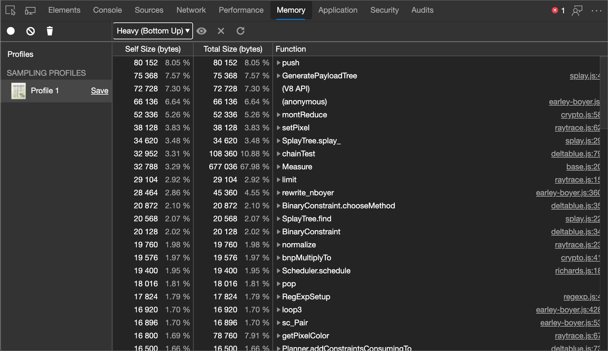
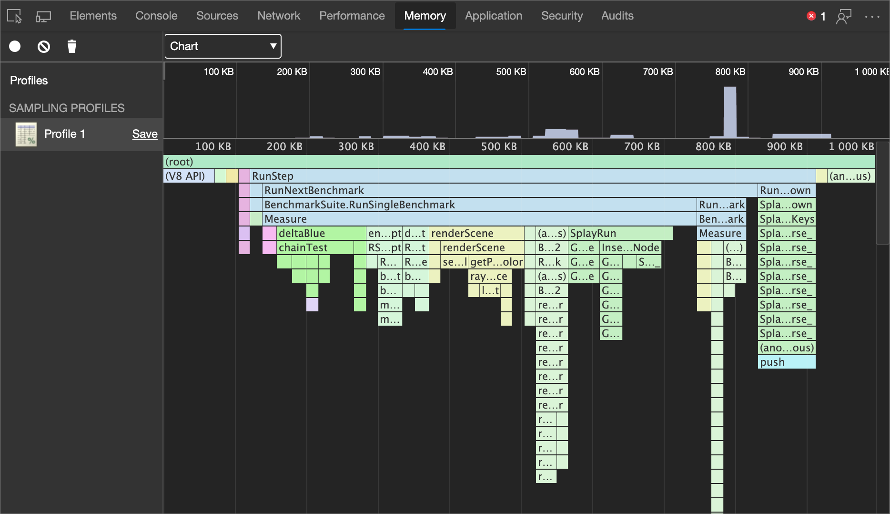
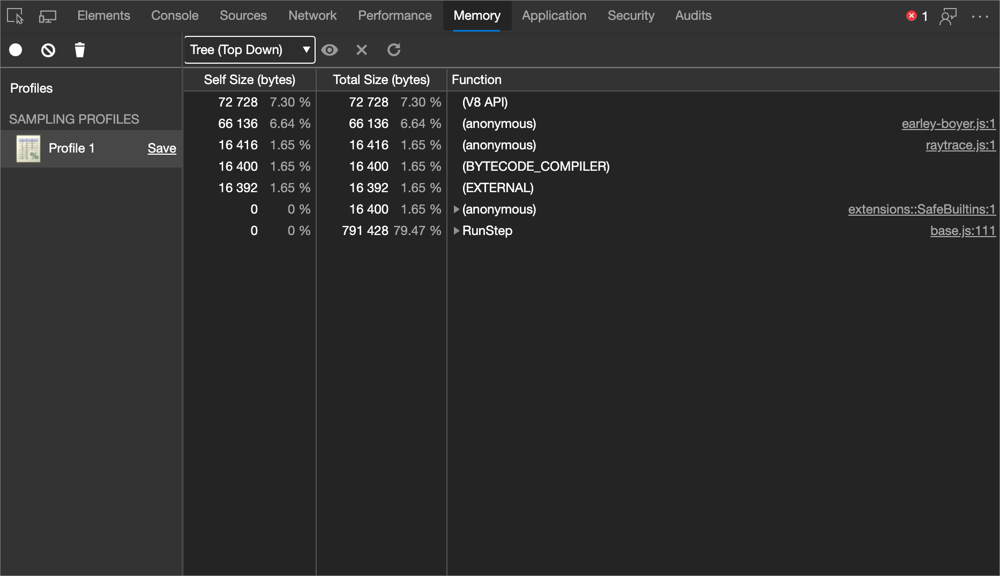
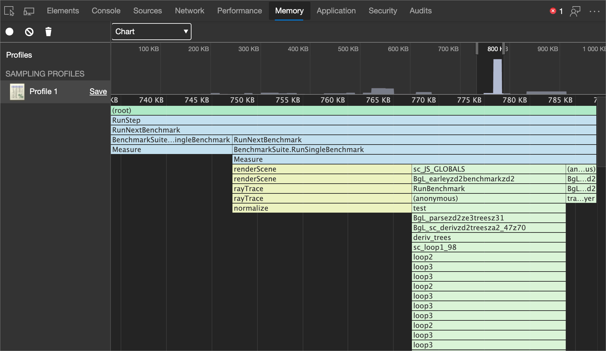

<!-- Copyright Kayce Basques and Meggin Kearney

   Licensed under the Apache License, Version 2.0 (the "License");
   you may not use this file except in compliance with the License.
   You may obtain a copy of the License at

       https://www.apache.org/licenses/LICENSE-2.0

   Unless required by applicable law or agreed to in writing, software
   distributed under the License is distributed on an "AS IS" BASIS,
   WITHOUT WARRANTIES OR CONDITIONS OF ANY KIND, either express or implied.
   See the License for the specific language governing permissions and
   limitations under the License. -->
# 加速 JavaScript 运行时

若要识别昂贵的函数，请使用 **内存** 工具。

### 摘要

*  使用**内存**工具中的分配采样准确记录调用了哪些函数以及每个函数所需的内存。

*  将配置文件可视化为火焰图。

<!-- ====================================================================== -->
## 记录采样配置文件

如果注意到 javaScript 中呈现)  (中断，请收集采样配置文件。  采样配置文件会显示页面中函数花费的运行时间。

1. 在 DevTools 中，转到 **内存** 工具。

1. 单击“ **分配采样** 单选”按钮。

1. 单击**开始**。

1. 根据尝试分析的内容，可以刷新页面、与页面交互，或者只让页面运行。

1. 完成后，单击“ **停止** ”按钮。

还可以使用 [控制台实用工具 API](../console/utilities.md) 从命令行记录和分组配置文件。

<!-- ====================================================================== -->
## 查看采样配置文件

记录完成后，DevTools 会使用记录的数据自动填充**采样配置文件**下的**内存**面板。

默认视图为 **“重 (自下而上) **。  使用该视图允可以查看哪些函数对性能影响最大，并检查每个函数的请求路径。

### 更改排序顺序

若要更改排序顺序，请选择 **焦点所选函** 数旁边的下拉菜单 () 图标，然后选择下列选项之一：

**图表**。  显示记录的时序图。

**重 (自下而上) **。  根据对性能的影响列出函数，并使你能够检查函数的调用路径。  这是默认视图。

**树 (自上而下) **。  显示调用结构的整体图片，从调用堆栈的顶部开始。

### 排除函数

若要从采样配置文件中排除函数，请选择它，然后单击 **排除所选函** 数 () 按钮。  请求函数 (已排除函数的父)  (子) 按分配给已排除函数 (子) 分配的内存计费。

单击 **还原所有函** 数 (还原 ) 按钮可将所有已排除的函数还原回录制中。

<!-- ====================================================================== -->
## 以图表模式查看采样配置文件

**图表**视图提供采样配置文件随时间推移的可视化表示形式。

[记录采样配置文件](#record-a-sampling-profile)后，将[排序顺序更改](#change-sort-order)为**图表**，以使用火焰图查看记录。

火焰图分为两部分：

| 索引 | 部分 | 描述 |
| --- |:--- |:--- |
| 1 | 概述 | 整个记录的鸟瞰图。  条形图的高度对应调用堆栈的深度。  因此，条形图越高，调用堆栈越深。  |
| 2 | 调用堆栈 | 这是在记录过程中调用的函数的深入视图。  水平轴为时间，垂直轴为调用堆栈。  堆栈是自上而下组织的。  因此，顶部的函数调用它下面的函数，以此类推。  |

函数颜色随机。  与其他面板中使用的颜色没有任何关联。  但是，函数在调用中的颜色始终相同，因此可以在每个运行时中观察模式。

高调用堆栈不一定重要;这可能只是意味着调用了许多函数。  但宽条意味着函数需要很长时间才能完成，因此这些是优化的候选项。

### 放大记录的特定部分

若要放大调用堆栈的特定部分，请在概述中左右单击并拖动。  放大后，调用堆栈自动显示所选记录的部分。

### 查看函数详细信息

单击某个函数，在 **“源** ”工具中查看该函数。

将鼠标悬停在函数上以显示名称和计时数据：

| 详情 | 描述 |
|:--- |:--- |
| **名称** | 函数的名称。  |
| **自身大小** | 函数当前调用的大小，只包括函数中的语句。  |
| **总大小** | 该函数当前调用及其调用过的任何函数的大小。  |
| **URL** | 函数定义的位置以 `base.js:261` 的形式表示，其中 `base.js` 是定义函数的文件的名称，而 `261` 是定义的行号。  |
<!--*  **Aggregated self time**.  Aggregate time for all invocations of the function across the recording, not including functions called by this function.  -->
<!--*  **Aggregated total time**.  Aggregate total time for all invocations of the function, including functions called by this function.  -->
<!--*  **Not optimized**.  If the profiler has detected a potential optimization for the function it lists it here.  -->

<!-- ====================================================================== -->
> [!NOTE]
> 此页面的某些部分是根据 [Google 创建和共享的](https://developers.google.com/terms/site-policies)作品所做的修改，并根据[ Creative Commons Attribution 4.0 International License ](https://creativecommons.org/licenses/by/4.0)中描述的条款使用。
> 原始页面 [在这里](https://developer.chrome.com/docs/devtools/evaluate-performance/) 找到，由 [凯斯·巴斯克斯](https://developers.google.com/web/resources/contributors#kayce-basques) (技术作家，Chrome DevTools \& Lighthouse) 和 [梅金·科尔尼](https://developers.google.com/web/resources/contributors#meggin-kearney) (技术作家) 创作。

本作品根据[ Creative Commons Attribution 4.0 International License ](https://creativecommons.org/licenses/by/4.0)获得许可。
