<!-- Copyright Kayce Basques

   Licensed under the Apache License, Version 2.0 (the "License");
   you may not use this file except in compliance with the License.
   You may obtain a copy of the License at

       https://www.apache.org/licenses/LICENSE-2.0

   Unless required by applicable law or agreed to in writing, software
   distributed under the License is distributed on an "AS IS" BASIS,
   WITHOUT WARRANTIES OR CONDITIONS OF ANY KIND, either express or implied.
   See the License for the specific language governing permissions and
   limitations under the License.  -->
# 查看页面资源

资源是页面为了正确显示而需要的文件。  资源示例包括：
*  CSS 文件。
*  JavaScript 文件。
*  HTML 文件。
*  图像文件。

可以从多个工具或面板中查看构成网页的资源。

本指南假定你熟悉 [Web 开发](https://developer.mozilla.org/docs/Learn)的基础知识，并[Microsoft Edge DevTools](../../devtools-guide-chromium/overview.md)。

<!-- ====================================================================== -->
## 从命令菜单打开资源

当知道要检查的资源的名称时， **命令菜单** 提供了快速打开资源的方法。

1. 按`Ctrl`+`P` (Windows、Linux) 或`Command`+`P` (macOS) 。  打开“ **打开文件”** 对话框。

   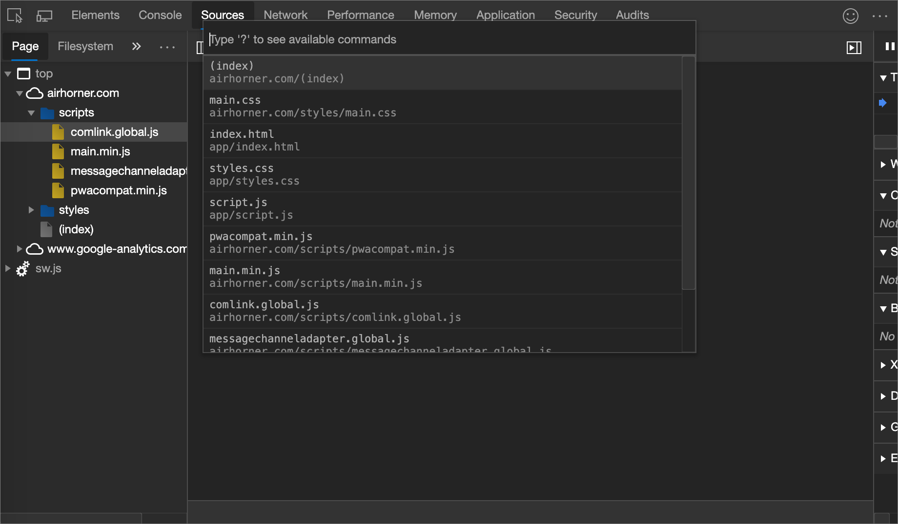

1. 从下拉列表中选择文件，或开始键入文件名，并在自动完成框中突出显示正确的文件后按 `Enter` 下。

   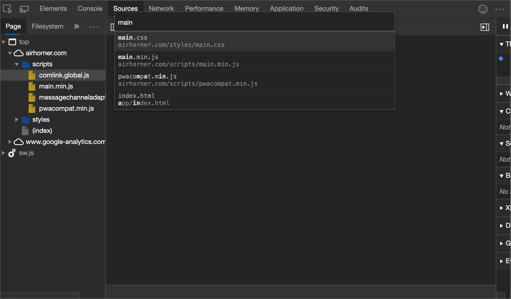

<!-- ====================================================================== -->
## 在网络工具中打开资源

请参阅“_检查网络活动_”中[资源的详细信息](../network/index.md#inspect-the-details-of-the-resource)。
<!--why?-->

<!-- need lead-in -->

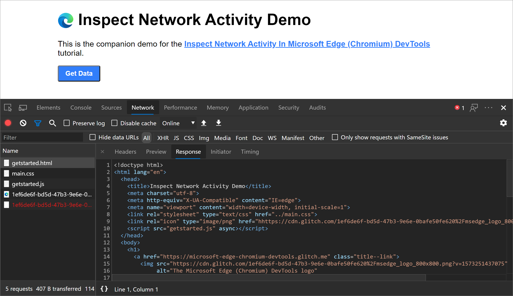

### 从其他面板显示网络工具中的资源

下一部分是“ [浏览网络”面板中的资源](#browse-resources-in-the-network-panel)，演示如何查看来自 DevTools UI 各个部分的资源。  若要检查 **网络** 工具中的资源，请右键单击资源， **然后选择“网络”面板中的“显示**”。

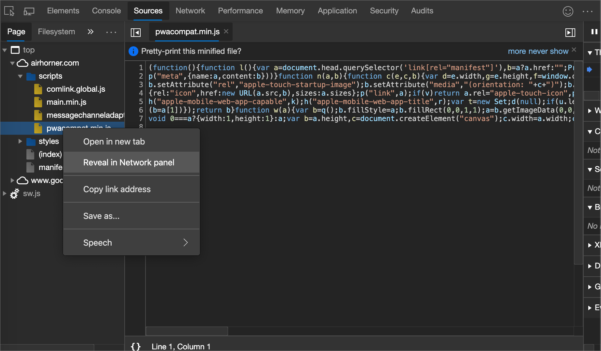

<!-- ====================================================================== -->
## 在“网络”面板中浏览资源

<!-- to do x, -->

1. 在新选项卡或窗口中_检查网络活动_) 一文中打开[日志网络活动](../network/index.md#log-network-activity) (。

<!-- 1. Do the steps in that section, and then continue below. -->

 <!-- open [link] in a new tab or window, and then continue below.. -->
<!--why?-->

<!-- need lead-in -->

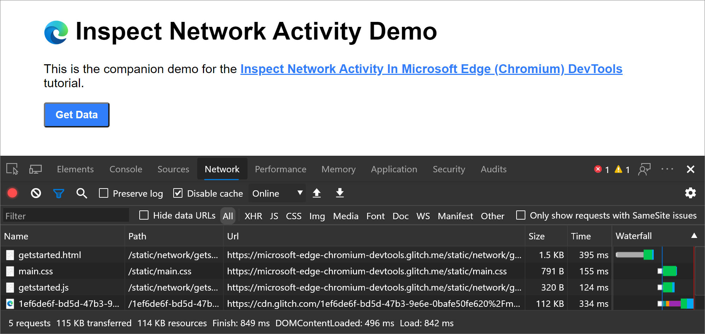

<!-- ====================================================================== -->
## 在“源”工具中按目录浏览资源

若要查看由目录组织的网页的资源，请执行以下操作：

1. 打开 DevTools。

1. 选择 **“源** ”工具，然后在左上角的 **“导航器** ”窗格中，选择 **“页面** ”选项卡。

1. 单击“**页面**”选项卡右侧的“**更多”选项** (...) 按钮，然后**按文件夹选择“分组**”。

   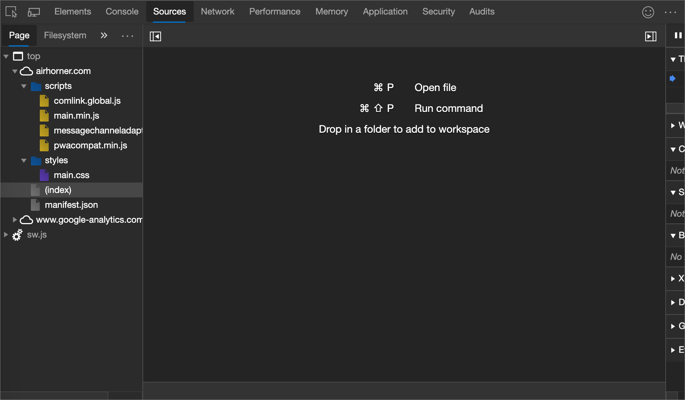

    下面是上图中非明显项的细目。

    | 页面项 | 描述 |
    |:--- |:--- |
    | `top` | 主文档 [浏览上下文](https://developer.mozilla.org/docs/Web/HTML/Element/iframe)。 |
    | `airhorner.com` | 域。  嵌套在该域下的所有资源都来自该域。  例如，文件的 `comlink.global.js` 完整 URL 可能是 `https://airhorner.com/scripts/comlink.global.js`。 |
    | `scripts` | 目录。 |
    | `(index)` | 主 HTML 文档。 |
    | `sw.js` | 服务辅助角色运行时上下文。 |

1. 选择要在 **编辑**器中查看的资源。

   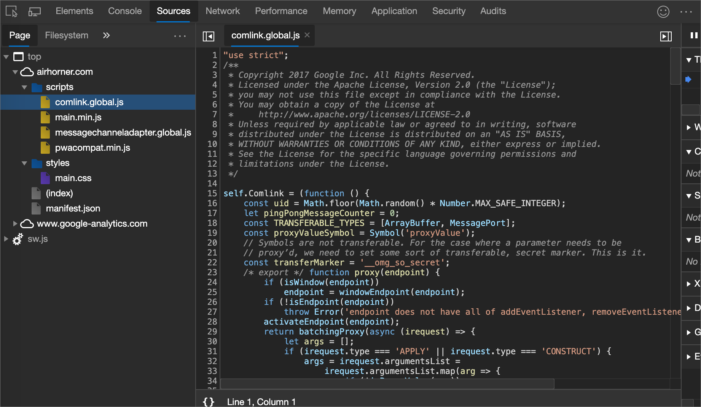

<!-- ====================================================================== -->
## 在“源”工具中按文件名浏览资源

默认情况下，“ **页面** ”选项卡按目录对资源进行分组。  若要将每个域的资源显示为平面列表，而不是按目录对它们进行分组：

1. 转到 **“源** ”工具。

1. 在左侧)  (导航 **器** 窗格中，选择 **“页面** ”选项卡。

1. 单击 **“更多”选项**`...`，然后清除 **“按文件夹分组**”复选框。

   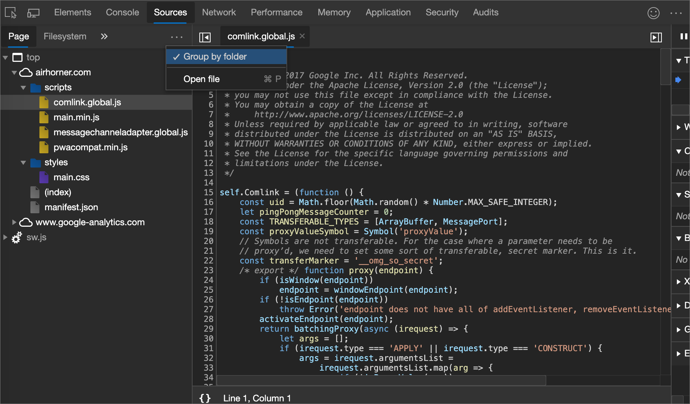

    资源按文件类型进行组织。  在每个文件类型中，资源按字母顺序组织。

   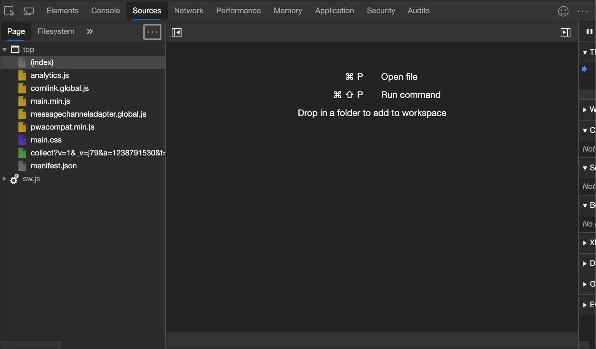

<!-- ====================================================================== -->
## 在 **应用程序工具中** 按文件类型浏览资源

根据资源的文件类型将资源组合在一起：

1. 选择“ **应用程序** ”选项卡。 **应用程序工具** 随即打开。  默认情况下，“ **清单** ”窗格通常先打开。

   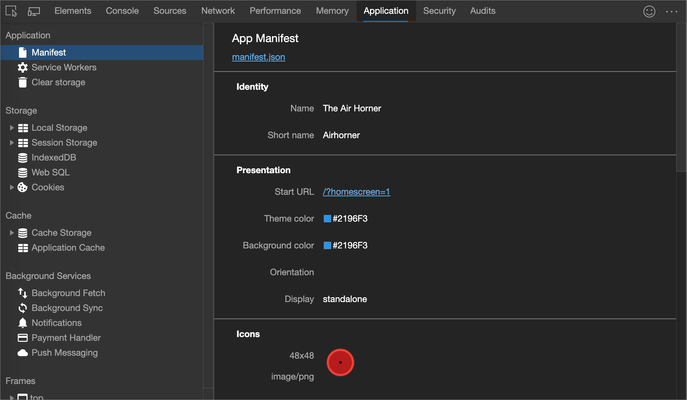

1. 向下滚动到 **“框架** ”窗格。

   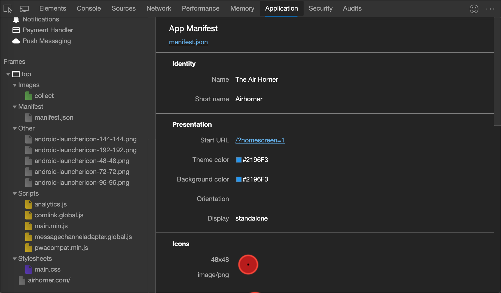

1. 展开感兴趣的部分。

1. 选择要查看的资源。

   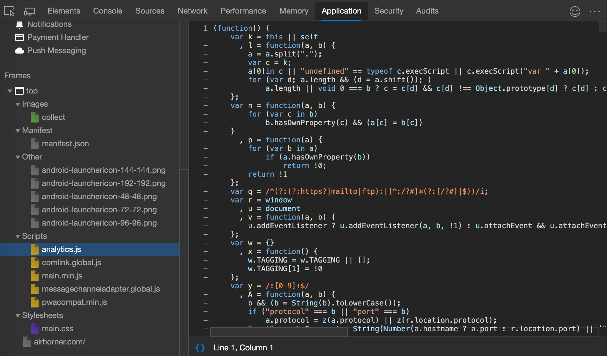

<!-- ====================================================================== -->
## 在“网络”面板中按类型浏览文件

请参阅 [按资源类型的筛选](../network/index.md#filter-by-resource-type)器。

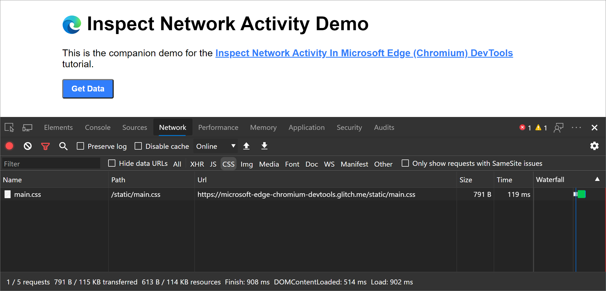

<!-- ====================================================================== -->
> [!NOTE]
> 此页面的某些部分是根据 [Google 创建和共享的](https://developers.google.com/terms/site-policies)作品所做的修改，并根据[ Creative Commons Attribution 4.0 International License ](https://creativecommons.org/licenses/by/4.0)中描述的条款使用。
> 原始页面位于[此处](https://developers.google.com/web/tools/chrome-devtools/resources/index)，由 [Kayce Basques](https://developers.google.com/web/resources/contributors#kayce-basques)\（Chrome DevTools 和 Lighthouse 的技术作家）撰写。

本作品根据[ Creative Commons Attribution 4.0 International License ](https://creativecommons.org/licenses/by/4.0)获得许可。
