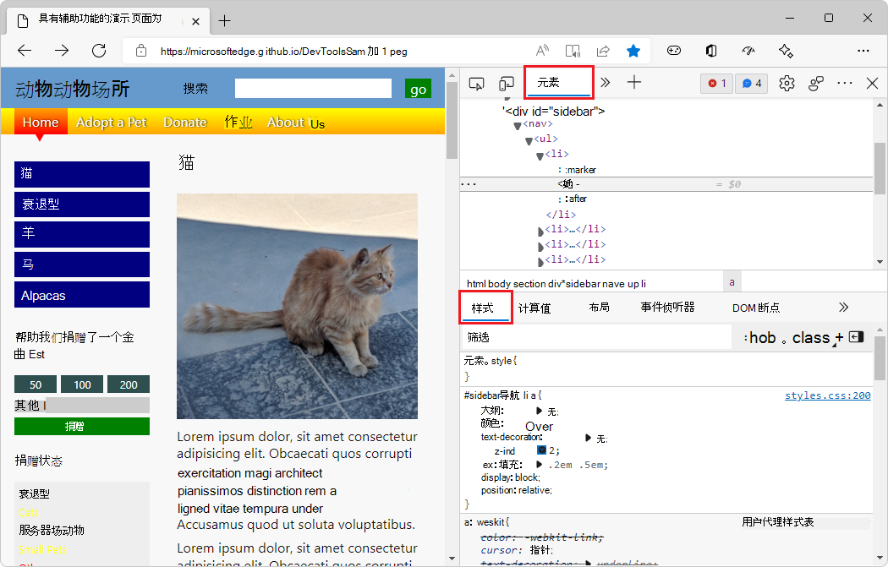
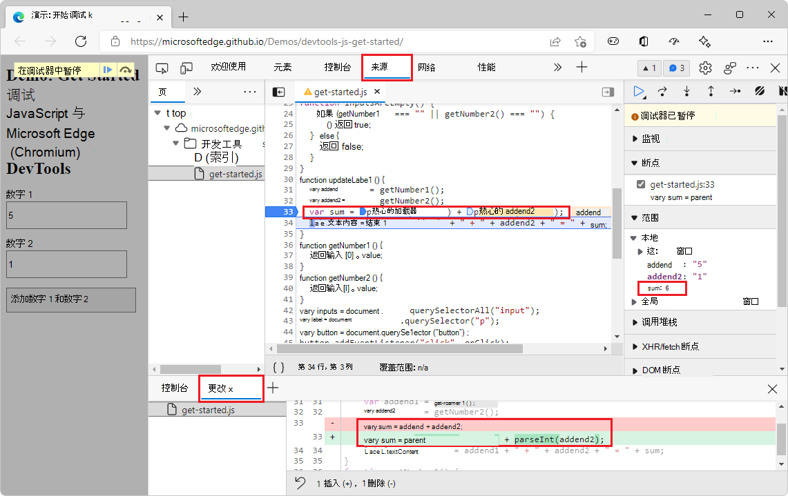

# DevTools 的示例代码

DevTools 文档使用的示例代码主要位于 GitHub 的 [MicrosoftEdge/Demos](https://github.com/MicrosoftEdge/Demos) 存储库。

<!-- A few demos are at other locations, such as Glitch. -->

<!-- ====================================================================== -->
## 演示包含辅助功能问题的网页

此演示网页可用于探索各种 DevTools 功能，如 **元素** 工具。

1. 打开新 [窗口或选项卡中](https://MicrosoftEdge.github.io/Demos/devtools-a11y-testing/) 具有辅助功能问题的演示网页。

1. 右键单击呈现的网页中的任意位置，然后选择"检查 **"**。  将在演示网页旁边打开 DevTools。

   <!-- Or, press `F12`, `Ctrl`+`Shift`+`I` (on Windows/Linux), or `Command`+`Option`+`I` (on macOS). -->

### 文章

以下文章将演示您使用此演示网页：

* [Overview of accessibility testing using DevTools](../accessibility/accessibility-testing-in-devtools.md) - Long article with sections that demonstrate using various DevTools features to do accessibility testing， by using the "Demo webpage with accessibility issues".

* [使用 Inspect 工具，通过将](../accessibility/test-inspect-tool.md) 鼠标悬停在网页上方来检测辅助功能问题 - 从以上文章中的部分派生的一些短文章之一。

* [辅助功能测试功能](../accessibility/reference.md) - DevTools 的辅助功能测试功能列表，包含指向使用"演示包含辅助功能问题的网页"的几个文章的链接。

### 源代码存储库

这是存储此演示网页文件的源代码存储库及其目录：

* [MicrosoftEdge/Demos > devtools-a11y-testing](https://github.com/MicrosoftEdge/Demos/tree/main/devtools-a11y-testing) - 包含以下文件：

   * `index.html` - 演示网页，包括向 JavaScript 文件发送数据的页面部分和输入 `buttons.js` 表单。  若要查看呈现的网页，请使用上面的演示网页链接。

   * `buttons.js` - 包含演示网页使用的 JavaScript 代码。

   * `styles.css`、 `light-theme.css`和 `dark-theme.css` - 控制演示网页演示文稿的 CSS 文件。

   * 演示网页中使用的图像文件。

<!-- ====================================================================== -->
## 演示网页：使用 DevTools 调试 JavaScript

此演示网页可用于探索 **源** 工具，尤其是 JavaScript 调试程序。

1. 打开演示网页 开始使用新窗口或 [选项卡中的 DevTools 调试 JavaScript](https://MicrosoftEdge.github.io/Demos/devtools-js-get-started/) 。

1. 右键单击呈现的网页中的任意位置，然后选择"检查 **"**。  将在演示网页旁边打开 DevTools。

   <!-- Or, press `F12`, `Ctrl`+`Shift`+`I` (on Windows/Linux), or `Command`+`Option`+`I` (on macOS). -->

### 文章

以下文章或文章部分将介绍使用此演示网页：

* [源工具概述中的使用](../sources/index.md#the-basic-approach-to-using-a-debugger)_调试器的基本方法_。  本文部分简要介绍了使用源工具中的 JavaScript 调试器在演示网页中查找 Bug 的步骤****。  若要修复 Bug，在添加输入字符串之前将其转换为数字。

* [JavaScript](../javascript/index.md) 调试入门 - 将演示网页与调试器一同使用、演示调试程序的各种功能以及设置不同类型的断点的更深入演练。

### 源代码存储库

这是存储此演示网页文件的源代码存储库及其目录：

* [microsoftEdge/Demos > devtools-js-get-started](https://github.com/MicrosoftEdge/Demos/tree/main/devtools-js-get-started) - 包含以下文件：

   *  `README.md` - 包含指向呈现的演示网页的链接，以及有关使用演示网页的深入教程文章。

   *  `index.html` - 包含输入表单的网页，该输入表单将数据发送到 JavaScript 文件，并显示 JavaScript 的结果。

   *  `get-started.js` - 演示网页中的表单使用的 JavaScript 文件。

<!-- ====================================================================== -->
## 呈现的演示网页和源代码的 URL 模式

若要在呈现的演示网页的 URL 与 GitHub 的源代码 URL 之间转换，模式如下所示。

### 模式

*  呈现的演示网页的 URL： `https://[org].github.io/[repo]/[path]`

*  网页源代码的 URL： `https://github.com/[org]/[repo]/tree/main/[path]`

不区分大小写。

### 示例

*  呈现的演示网页的 URL： `https://MicrosoftEdge.github.io/Demos/devtools-a11y-testing/`

*  网页源代码的 URL： `https://github.com/MicrosoftEdge/Demos/tree/main/devtools-a11y-testing/`

*  Org = `MicrosoftEdge`
*  Repo = `Demos`
*  Path = `/devtools-a11y-testing/`
