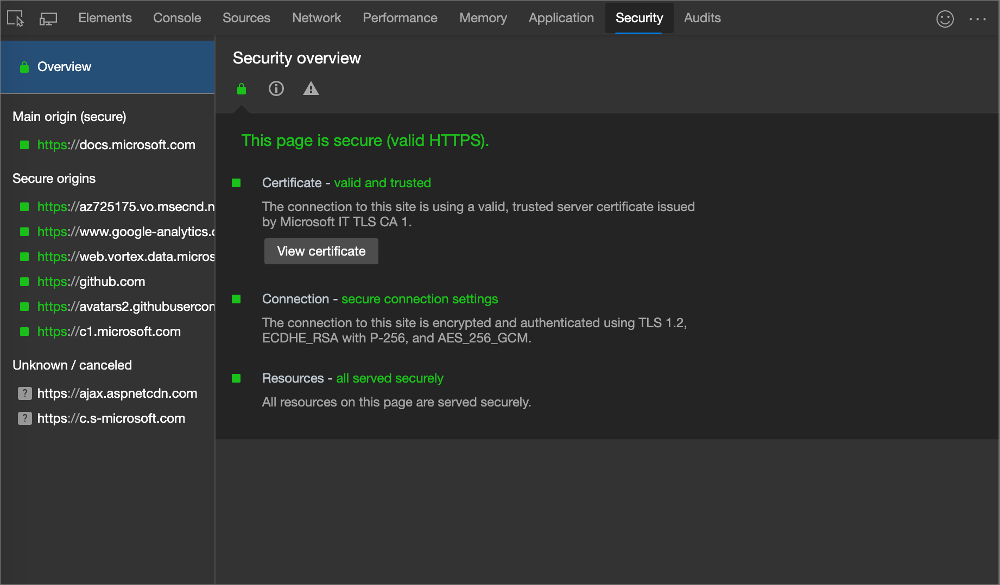
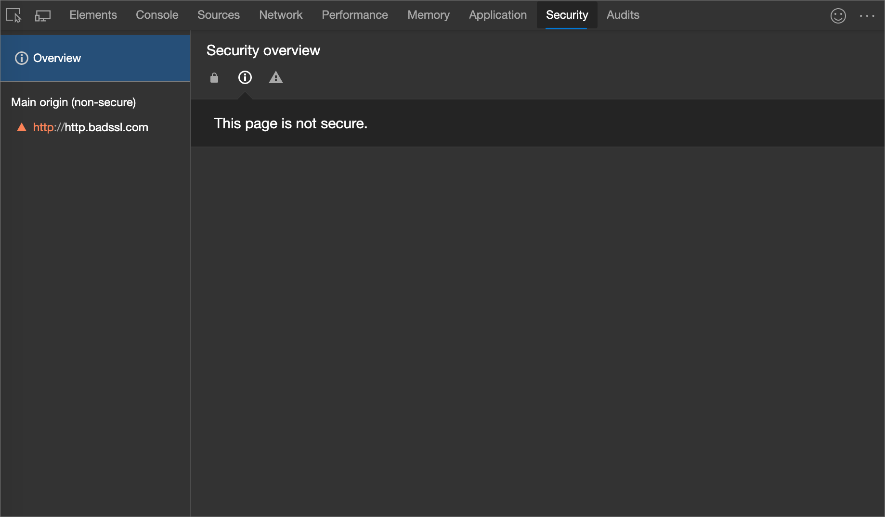
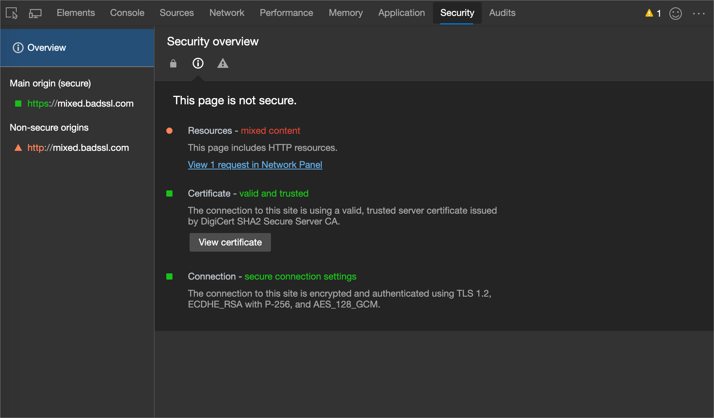
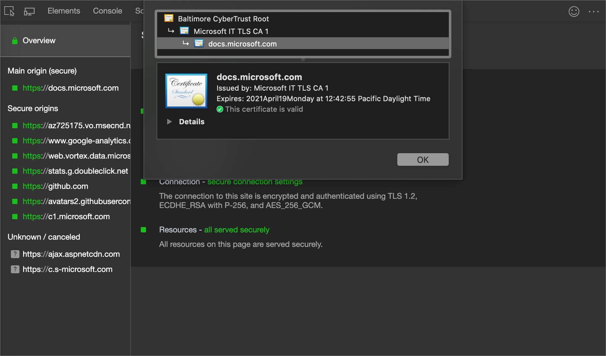
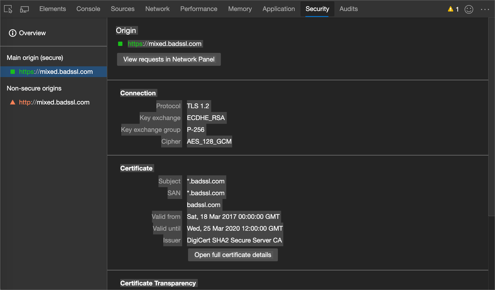

<!-- Copyright Kayce Basques

   Licensed under the Apache License, Version 2.0 (the "License");
   you may not use this file except in compliance with the License.
   You may obtain a copy of the License at

       https://www.apache.org/licenses/LICENSE-2.0

   Unless required by applicable law or agreed to in writing, software
   distributed under the License is distributed on an "AS IS" BASIS,
   WITHOUT WARRANTIES OR CONDITIONS OF ANY KIND, either express or implied.
   See the License for the specific language governing permissions and
   limitations under the License.  -->
# 使用安全工具了解安全问题

<!--Use the **Security** Panel in DevTools to make sure HTTPS is properly implemented on a page.  See **Why HTTPS Matters** to learn why every website should be protected with HTTPS, even sites that don't handle sensitive user data.  -->

<!--todo: add section when why-https is available -->

使用 **安全** 面板检查页面的安全性。

1. 若要打开 DevTools，请右键单击网页，然后选择 **“检查**”。  或者，按“`Ctrl`+`Shift`+`I`”(Windows、Linux)或“`Command`+`Option`+`I`”(macOS)。  DevTools 随即打开。

1. 在 DevTools 的主工具栏上，单击 **“安全”** 选项卡。 如果该选项卡不可见，请单击“ **更多”选项卡** () 按钮，或者“ **更多工具** () 按钮。

   **将打开安全**工具 (或_面板_) ：

<!-- ====================================================================== -->
## 常见问题

### 不安全的主源

当页面的主要来源不安全时， **安全概述** 会显示 **此页面不安全**。

当通过 HTTP 请求你访问的 URL 时，会出现此问题。  若要使其安全，需要通过 HTTPS 请求它。  例如，如果查看地址栏中的 URL，它可能类似于 `http://example.com`。  为了使其安全，URL 应该是 `https://example.com`.

如果已在服务器上设置 HTTPS，则要解决此问题，只需将服务器配置为将所有 HTTP 请求重定向到 HTTPS。

如果尚未在服务器上设置 HTTPS， [让我们加密](https://letsencrypt.org) 可以提供一种免费且相对简单的方法来启动该过程。  或者，可以考虑在CDN上托管网站。  默认情况下，HTTPS 上的大多数主要 CDN 主机站点现在。

> [!TIP]
> [Webhint](https://webhint.io) 中的[使用 HTTPS](https://webhint.io/docs/user-guide/hints/hint-https-only) 提示可以帮助自动完成确保所有 HTTP 请求都定向到 HTTPS 的过程。

### 混合内容

**混合内容**<!--[mixed content](/web/fundamentals/security/prevent-mixed-content/what-is-mixed-content)--> 表示页面的主要来源是安全的，但页面请求来自非安全源的资源。  混合内容页面仅受到部分保护，因为 HTTP 内容可供嗅探器访问，并且容易受到中间人攻击。

在上图 **中，在“网络”面板中选择“视图 1”请求** 以打开 **网络** 工具并应用 `mixed-content:displayed` 筛选器，以便 **网络日志** 仅显示不安全的资源。

<!-- ====================================================================== -->
## 查看详细信息

### 查看主源证书

在 **“安全概述**”中，单击 **“查看证书** ”以快速检查主源的证书。

### 查看源详细信息

单击左侧导航栏中的一个条目，查看源的详细信息。  可以在详细信息页中查看连接和证书信息。  证书透明度信息在可用时也会显示。

<!-- ====================================================================== -->
> [!NOTE]
> 此页面的某些部分是根据 [Google 创建和共享的](https://developers.google.com/terms/site-policies)作品所做的修改，并根据[ Creative Commons Attribution 4.0 International License ](https://creativecommons.org/licenses/by/4.0)中描述的条款使用。
> 原始页面位于[此处](https://developer.chrome.com/docs/devtools/security/)，由 [Kayce Basques](https://developers.google.com/web/resources/contributors#kayce-basques)\（Chrome DevTools 和 Lighthouse 的技术作家）撰写。

本作品根据[ Creative Commons Attribution 4.0 International License ](https://creativecommons.org/licenses/by/4.0)获得许可。
