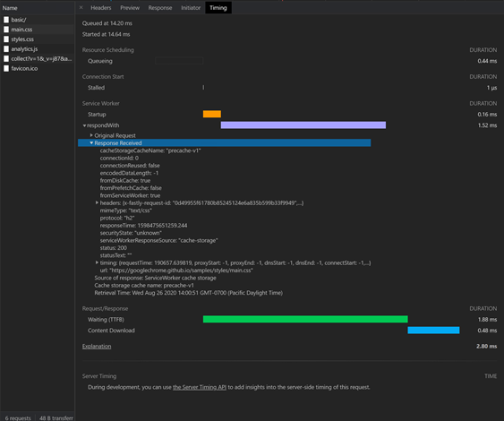
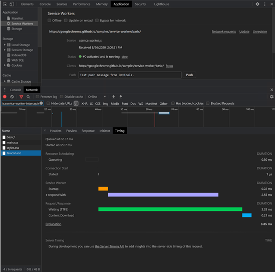

# 服务工作进程改进

本文介绍对开发人员工具的改进，这些工具用于与 [服务工作者](https://developer.mozilla.org/docs/Web/API/Service_Worker_API) 一起工作，以及通过每个服务工作者传递的网络请求。  **服务辅助角色改进**在**网络**、**应用程序**和**源**工具中。

对服务工作者的改进简化了以下任务：

*  基于服务辅助角色时间线进行调试。
    *  请求开示和启动持续时间。
    *  更新到服务辅助角色注册。
    *  使用 [提取事件](https://developer.mozilla.org/docs/Web/API/FetchEvent) 处理程序的请求的运行时。
    *  用于加载客户端的所有提取事件的运行时。
*  了解提取事件处理程序、安装事件处理程序和激活事件处理程序的运行时详细信息。
*  使用 [页面脚本信息](#sources)进一步提取事件处理程序。

改进的体验跨越三种不同的开发人员工具：

*  [网络](#network)工具。  选择通过服务辅助角色运行的网络请求，并访问 **计时** 工具中服务辅助角色的相应时间线。

*  [应用程序工具](#application)。  若要调试服务工作者，请转到 **“服务辅助角色** ”工具。

*  [源](#sources)工具。  单步执行提取事件处理程序时，访问页面脚本信息。

<!-- ====================================================================== -->
## 网络

可以通过以下任一方式访问 **网络** 工具中的服务辅助角色调试功能：

*  直接在 **网络** 工具中。
*  在 **应用程序工具** 中启动。

### 请求路由

为了使请求路由更易于可视化，时间线现在显示服务辅助角色启动和 `respondWith` 提取事件。  若要调试和可视化通过服务辅助角色传递的网络请求，请执行以下操作：

1. 选择通过服务辅助角色的网络请求。
1. 打开 **计时** 工具。

### 提取事件

若要 `respondWith` 详细了解提取事件，请单击左侧的 `respondWith`下拉箭头。  若要查找有关收到的 **原始请求** 和 **响应**的更多详细信息，请单击相应的下拉箭头。

<!-- ====================================================================== -->
## 应用程序

### 服务工作进程更新日程表

Microsoft Edge DevTools 团队在**应用程序工具中**添加了一个时间线，以反映服务辅助角色的更新生命周期。  此时间线显示安装和激活事件。  每个事件都有相应的下拉箭头，可提供更多详细信息。

### 请求路由和提取事件

现在，可以通过控制台抽屉中的 **网络** 工具访问服务辅助角色时间线。  此功能可提高性能，最大程度地减少 UI 重复，并创建更全面的调试体验。

1. 打开要调试的服务辅助角色。

1. 单击 **“网络** ”按钮打开 [请求路由体验](#network)。

1. 使用 **responseWith** 下拉箭头提取事件请求和响应信息。

**网络**工具显示通过要调试的服务辅助角色发出的网络请求。  自动筛选器是缩小探索范围的一种方式。

另请参阅 [应用程序工具来管理存储](../storage/application-tool.md)。

<!-- ====================================================================== -->
## 源

若要查找更多堆栈信息，请在提取处理程序中设置一个断点。  详细信息会导致在页面脚本中请求资源的位置。

当调试器在提取处理程序内暂停时，组合堆栈信息将显示在右侧的面板中。  之后，可以在堆栈帧中四处移动。

### 将来的工作

Microsoft Edge DevTools 团队计划进一步开发缓存详细信息，并正在研究更多方法来改进[渐进式 Web 应用程序 (PWA) ](https://developer.mozilla.org/docs/Web/Progressive_web_apps)开发人员的服务辅助角色调试体验。
