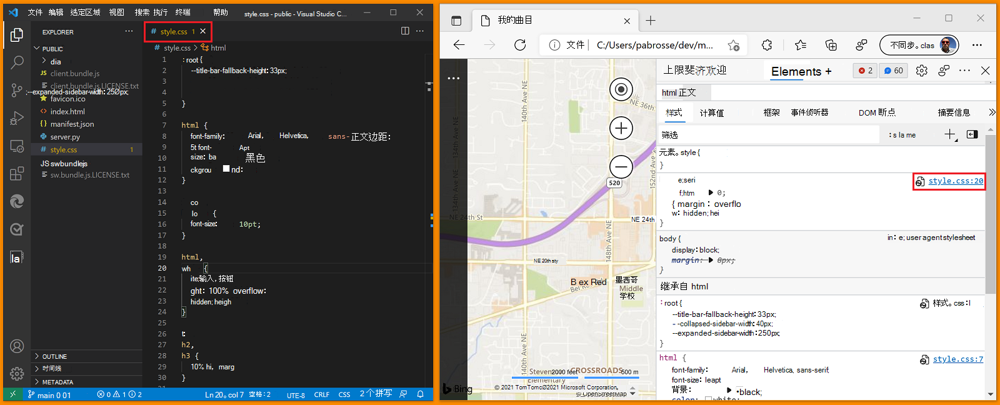

# 在Visual Studio Code中打开源文件

**Visual Studio Code试验中的开源文件**允许你使用 Microsoft Edge DevTools，但随后在 Visual Studio Code 而不是 DevTools **源**工具的代码编辑器中编辑文件。

使用此试验时，如果使用Visual Studio Code，并且使用 DevTools 更改 CSS 规则，则不再需要在 DevTools 的源工具中使用代码编辑器。  只需在Visual Studio Code中使用代码编辑器即可。  启用此试验时，本地文件将获得不同的处理方法。<!--TODO: be specific-->

<!-- ====================================================================== -->
## 在Visual Studio Code中设置编辑本地文件

首先，在 Visual Studio Code 中选择 DevTools **> 设置** > **ExperimentsOpen** >  **源文件**，然后重新启动 DevTools。

启用此试验后，假设在 Microsoft Edge 中转到本地服务器 (（例如`http://localhost`或`http://127.0.0.1`) ）或打开本地文件。

打开 DevTools 时，系统会提示你标识根文件夹。  可以通过选择 **“关闭** () `x` 或选择按钮来选择 `Don't show again` 退出。  可以通过选择 `Learn more` 链接来获取详细信息。

如果选择 **“设置根文件夹** ”按钮，操作系统会提示导航到该文件夹并选择它。

选择根文件夹后，需要授予 DevTools 对文件夹的完全访问权限。  在工具栏上方，带有 **“允许** ”或 **“拒绝** ”按钮的提示会询问是否向 DevTools 授予访问该文件夹的权限。

授予权限后，在“**源**”工具的“**文件系统**”选项卡中，选择的文件夹将添加为 DevTools 中的工作区。  这意味着在 DevTools 中编辑的任何文件现在都以Microsoft Visual Studio代码打开，而不是在“源”工具中打开。 作为指示器，我们将显示 `linked` 文件名旁边的图标。  在此示例中，我们将在 **Styles** 工具中选择`base.css`链接。

DevTools 将打开Visual Studio Code实例，并显示根文件夹中的所有文件。  DevTools 还会打开所选文件，并滚动到 CSS 选择器的正确行。

现在，对 DevTools 中的文件所做的任何更改都将同步到Visual Studio Code。  例如，如果向正文的样式添加`background: green`规则，则相同的 CSS 规则将自动添加到 `base.css` Visual Studio Code 代码编辑器中的文件中。

<!-- ====================================================================== -->
## 更改工作区设置

如果**通过选择设置** (齿轮图标或`Shift + ?`**) **转到 DevTools 设置页，则可以更改试验的行为。  在**设置**中选择 **“工作区**”页时，有一些选项。

**设置** > **Workspace** 页面列出了工作区以及配置选项。

*  若要设置是否开放源代码Visual Studio Code中的文件，请在Visual Studio Code复选框中选择**开源文件**。

*  若要自动将 DevTools 更改保存到磁盘，请选择对磁盘复选框的 **“保存 DevTools”更改** 。

*  若要自动从工作区文件夹中排除文件夹，请使用 **“文件夹排除模式** ”文本框。

*  若要从特定工作区中排除文件夹，请选择 **“已排除”文件夹**旁边的 **“添加** ”按钮。

*  若要添加其他工作区，请选择 **“添加文件夹** ”按钮。
