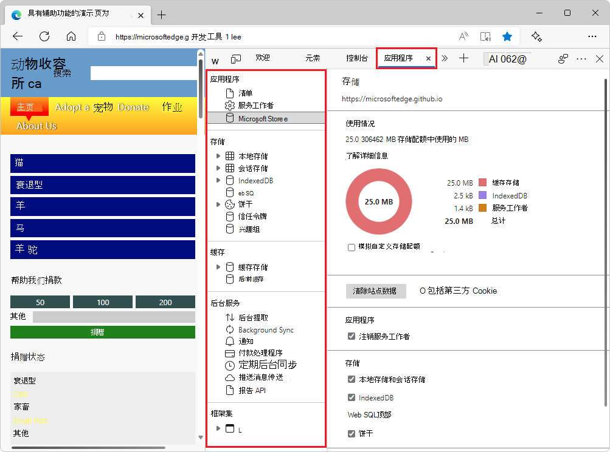

# 用于管理存储的应用程序工具

使用 **应用程序工具** 管理 Web 应用页面的存储，包括清单、服务工作者、本地存储、Cookie、缓存存储和后台服务。

应用程序工具具有以下页面：

*  应用程序
   *  Manifest
   *  服务工作者
   *  存储

*  存储
   *  本地存储
   *  IndexedDB
   *  Web SQL
   *  Cookie
   *  信任令牌
   *  兴趣组

*  高速缓存
   *  缓存存储
   *  后/前缓存

*  后台服务
   *  后台提取
   *  后台同步
   *  通知
   *  付款处理程序
   *  定期后台同步
   *  推送消息传送
   *  报告 API

*  框架 
