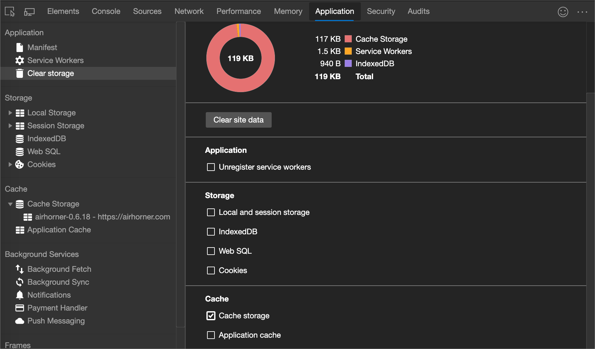

<!-- Copyright Kayce Basques

   Licensed under the Apache License, Version 2.0 (the "License");
   you may not use this file except in compliance with the License.
   You may obtain a copy of the License at

       https://www.apache.org/licenses/LICENSE-2.0

   Unless required by applicable law or agreed to in writing, software
   distributed under the License is distributed on an "AS IS" BASIS,
   WITHOUT WARRANTIES OR CONDITIONS OF ANY KIND, either express or implied.
   See the License for the specific language governing permissions and
   limitations under the License.  -->
# 查看缓存数据

本指南介绍如何使用 DevTools 检查 [缓存](https://developer.mozilla.org/docs/Web/API/Cache) 数据。

若要检查 [HTTP 缓存](https://developer.mozilla.org/docs/Web/HTTP/Caching)数据，请在**网络**工具中使用 **“网络日志**的**大小**”列。  请参阅 _“检查网络活动_”中的[日志网络](../network/index.md#log-network-activity)活动。

<!-- ====================================================================== -->
## 查看缓存数据

1. 选择“**应用程序**”选项卡以打开“**应用程序**”面板。  通常默认**清单**窗格打开。

   

1. 展开 **缓存存储** 部分以查看可用的缓存。

   

1. 单击缓存可查看内容。

   

1. 单击资源可查看表下部分中的 HTTP 标头。

   

1. 单击 **“预览** ”可查看资源的内容。

   

<!-- ====================================================================== -->
## 刷新资源

1. [查看缓存](#view-cache-data)。
1. 单击要刷新的资源。  DevTools 会突出显示它以表明已选中。

   

1. 单击 **“刷新** () 。

<!-- ====================================================================== -->
## 筛选资源

1. [查看缓存](#view-cache-data)。

1. 使用 **“按路径筛选”** 文本框筛选出与你提供的路径不匹配的任何资源。

   

<!-- ====================================================================== -->
## 删除资源

1. [查看缓存](#view-cache-data)。

1. 单击要删除的资源。  DevTools 会突出显示它以表明已选中。

   

1. 单击 **“删除选定** () 。

<!-- ====================================================================== -->
## 删除所有缓存数据

1. 打开 **应用程序** > **清除存储**。

1. 确保选中 **缓存存储** 复选框。

   

1. 单击 **“清除站点数据** ”按钮。

   

<!-- ====================================================================== -->
> [!NOTE]
> 此页面的某些部分是根据 [Google 创建和共享的](https://developers.google.com/terms/site-policies)作品所做的修改，并根据[ Creative Commons Attribution 4.0 International License ](https://creativecommons.org/licenses/by/4.0)中描述的条款使用。
> 原始页面位于[此处](https://developer.chrome.com/docs/devtools/storage/cache/)，由 [Kayce Basques](https://developers.google.com/web/resources/contributors#kayce-basques)\（Chrome DevTools 和 Lighthouse 的技术作家）撰写。

本作品根据[ Creative Commons Attribution 4.0 International License ](https://creativecommons.org/licenses/by/4.0)获得许可。
