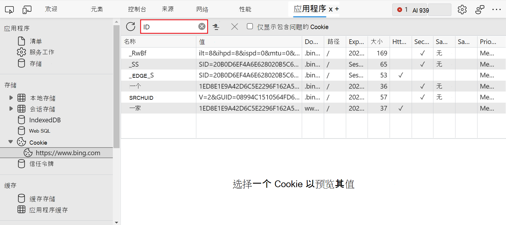

<!-- Copyright Kayce Basques

   Licensed under the Apache License, Version 2.0 (the "License");
   you may not use this file except in compliance with the License.
   You may obtain a copy of the License at

       https://www.apache.org/licenses/LICENSE-2.0

   Unless required by applicable law or agreed to in writing, software
   distributed under the License is distributed on an "AS IS" BASIS,
   WITHOUT WARRANTIES OR CONDITIONS OF ANY KIND, either express or implied.
   See the License for the specific language governing permissions and
   limitations under the License.  -->
# 查看、编辑和删除 Cookie

_HTTP Cookie_ 主要用于管理用户会话、存储用户个性化首选项和跟踪用户行为。  使用**应用程序**工具的 **Cookie** 窗格查看、编辑和删除网页的 HTTP cookie。

请参阅[使用 HTTP Cookie](https://developer.mozilla.org/docs/Web/HTTP/Cookies)。

<!-- ====================================================================== -->
## 打开“Cookie”窗格

1. [打开 DevTools](/microsoft-edge/devtools-guide-chromium/open)。

1. 选择“**应用程序**”选项卡以打开“**应用程序**”面板。  **Manifest**窗格随即打开：

   

1. 在“**存储**“下，展开 “**Cookie**”，然后选择一个源:

   

<!-- ====================================================================== -->
## 字段

**Cookies** 表包含以下字段:

*  **名称**。  Cookie 的名称。

*  **值**。  Cookie 的值。

*  **域**。  允许接收 Cookie 的主机。  请参阅[Cookie 的作用域](https://developer.mozilla.org/docs/Web/HTTP/Cookies#Scope_of_cookies)。

*  **路径**。  URL 必须存在于请求的 URL 中以发送 `Cookie` 标头。  请参阅[Cookie 的作用域](https://developer.mozilla.org/docs/Web/HTTP/Cookies#Scope_of_cookies)。

*  **到期日期/最长期限**.  Cookie 的到期日期或最长期限。  请参阅“[永久 Cookie](https://developer.mozilla.org/docs/Web/HTTP/Cookies#Permanent_cookies)。  对于[会话 Cookie](https://developer.mozilla.org/docs/Web/HTTP/Cookies#Session_cookies)，此值始终为 `Session`。

*  **大小**。  Cookie 的大小（以字节为单位）。

*  **HTTP**。  如果为 true，则此字段指示 Cookie 只应通过 HTTP 使用，不允许修改 JavaScript。  请参阅 [HttpOnly Cookie](https://developer.mozilla.org/docs/Web/HTTP/Cookies#Secure_and_HttpOnly_cookies)。

*  **安全**。  如果为 true，则此字段指示必须通过安全的 HTTPS 连接将 Cookie 发送到服务器。  请参阅[安全 Cookie](https://developer.mozilla.org/docs/Web/HTTP/Cookies#Secure_and_HttpOnly_cookies)。

*  **SameSite**。  包含 `strict`，当 Cookie 使用实验性 [Samesite](https://developer.mozilla.org/docs/Web/HTTP/Cookies#SameSite_cookies) 属性时包含 `lax`。

*  **优先级**。  包含 `low`、`medium` \(default\)，当 Cookie 使用已弃用的 [Cookie Priority](https://bugs.chromium.org/p/chromium/issues/detail?id=232693) 属性时包含 `high`。

<!-- ====================================================================== -->
## 筛选 Cookie

使用“**筛选器**”文本框按**名称**或**值**筛选 Cookie:

不支持按其他字段进行筛选。

<!-- ====================================================================== -->
## 编辑 Cookie

**名称**、**值**、**域**、**路径**和**过期日期/最长期限**字段是可编辑的。  双击字段进行编辑：

<!-- ====================================================================== -->
## 删除 Cookie

若要删除特定 Cookie，请单击 Cookie，然后单击" **删除已选中** "（）：

选择“**清除所有** (\)” 来删除所有 Cookie：

<!-- ====================================================================== -->
> [!NOTE]
> 此页面的某些部分是根据 [Google 创建和共享的](https://developers.google.com/terms/site-policies)作品所做的修改，并根据[ Creative Commons Attribution 4.0 International License ](https://creativecommons.org/licenses/by/4.0)中描述的条款使用。
> 原始页面位于[此处](https://developers.google.com/web/tools/chrome-devtools/storage/cookies)，由 [Kayce Basques](https://developers.google.com/web/resources/contributors#kayce-basques)\（Chrome DevTools 和 Lighthouse 的技术作家）撰写。

本作品根据[ Creative Commons Attribution 4.0 International License ](https://creativecommons.org/licenses/by/4.0)获得许可。
