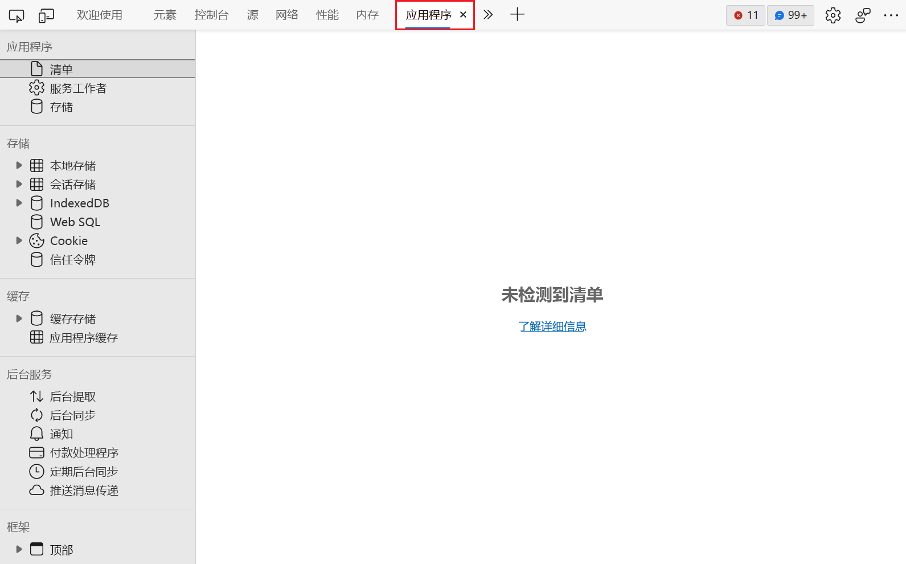
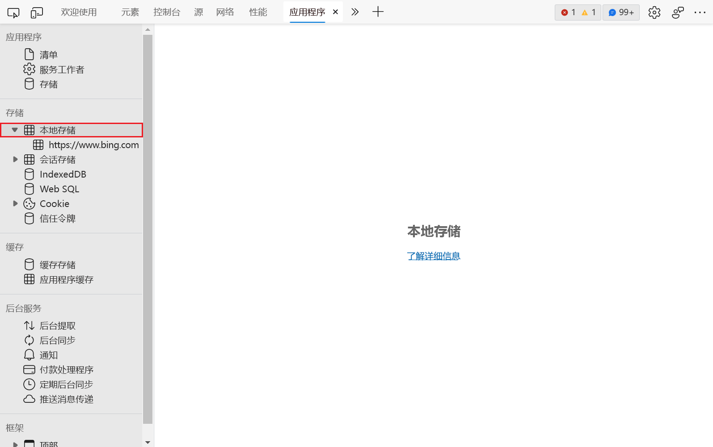
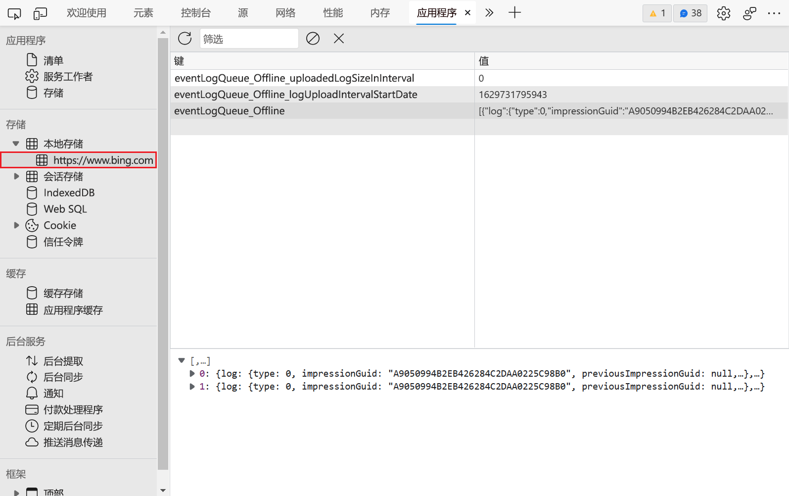
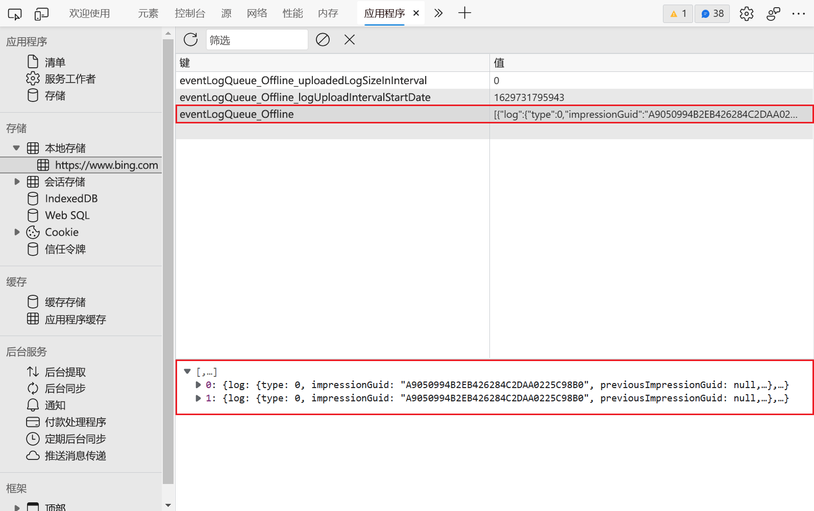
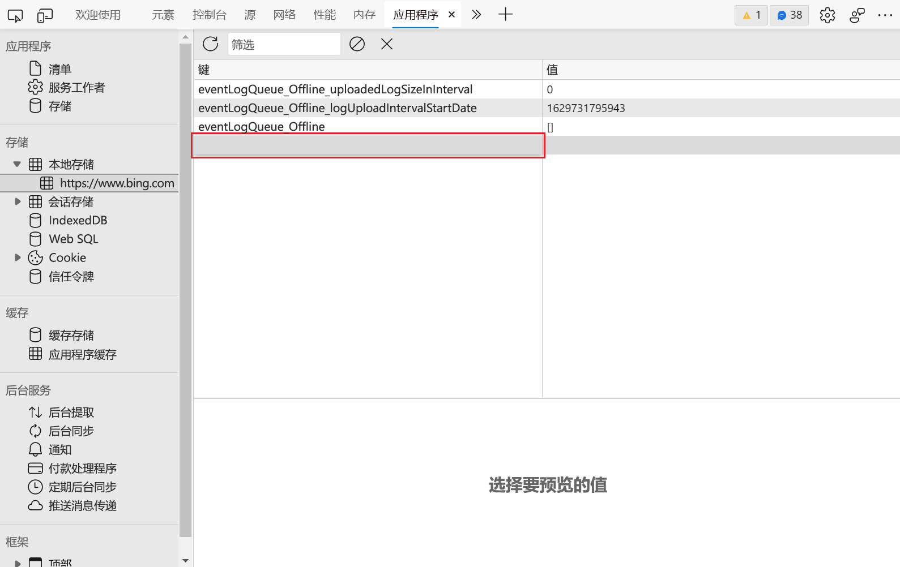
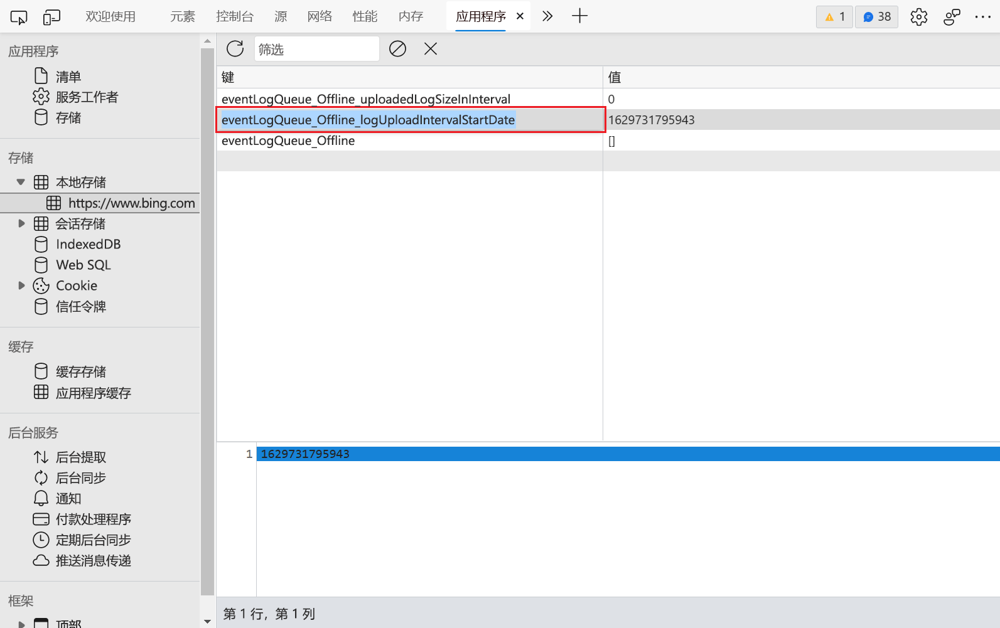
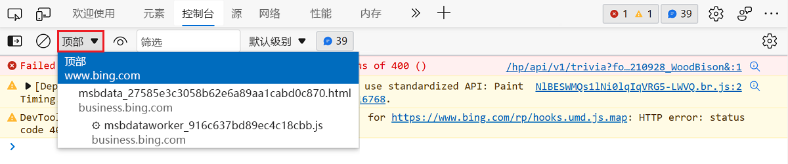
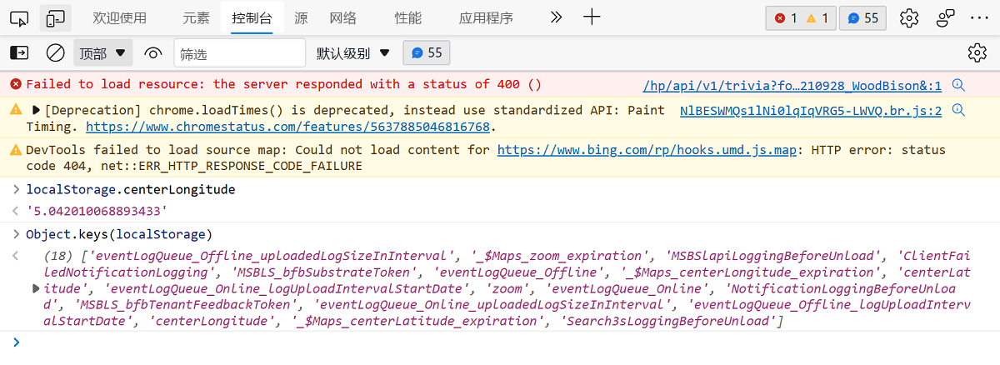

<!-- Copyright Kayce Basques

   Licensed under the Apache License, Version 2.0 (the "License");
   you may not use this file except in compliance with the License.
   You may obtain a copy of the License at

       https://www.apache.org/licenses/LICENSE-2.0

   Unless required by applicable law or agreed to in writing, software
   distributed under the License is distributed on an "AS IS" BASIS,
   WITHOUT WARRANTIES OR CONDITIONS OF ANY KIND, either express or implied.
   See the License for the specific language governing permissions and
   limitations under the License.  -->
# 查看和编辑本地存储

若要查看、编辑和删除 [localStorage](https://developer.mozilla.org/docs/Web/API/Window/localStorage) 键值对，请 **使用应用程序工具** 。

<!-- ====================================================================== -->
## 查看 localStorage 键和值

1. 单击“ **应用程序** ”选项卡打开“ **应用程序** ”工具。  “**清单**”窗格默认显示。

   

1. 展开“**本地存储**”菜单。

   

1. 单击域可查看键值对。

   

1. 单击表的一行可在表下方的查看器中查看值。

   

<!-- ====================================================================== -->
## 创建新的 localStorage 键值对

1. [查看域的 localStorage 键值对](#view-localstorage-keys-and-values)。

1. 双击表的空白部分。  DevTools 将新建行，并将光标停留在**键**列。

   

<!-- ====================================================================== -->
## 编辑 localStorage 键或值

1. [查看域的 localStorage 键值对](#view-localstorage-keys-and-values)。

1. 双击“**键**”或“**值**”列中的单元格以编辑该键或值。

   

<!-- ====================================================================== -->
## 删除 localStorage 键值对

1. [查看域的`localStorage`键值对](#view-localstorage-keys-and-values)。

1. 单击要删除的键值配对。  DevTools 会以蓝色将其突出显示以表示其已选中。

1. 按 `Delete`下，或单击“ **删除选定** () 。

<!-- ====================================================================== -->
## 删除域的所有`localStorage`键值对

1. [查看域的`localStorage`键值对](#view-localstorage-keys-and-values)。

1. 单击 **“全部清除** () 。

<!-- ====================================================================== -->
## 通过控制台与 localStorage 交互

由于可以在**控制台**中运行 JavaScript，并且**由于控制台**有权访问页面的 JavaScript 上下文，因此可以从**控制台**进行交`localStorage`互。

1. 如果要访问除了显示页面以外域的`localStorage`键值对，使用“**JavaScript 上下文**”菜单更改**控制台**的 JavaScript 上下文。

   

1. 在控制台中运行`localStorage`表达式，与在 JavaScript 中一样。

<!-- ====================================================================== -->
> [!NOTE]
> 此页面的某些部分是根据 [Google 创建和共享的](https://developers.google.com/terms/site-policies)作品所做的修改，并根据[ Creative Commons Attribution 4.0 International License ](https://creativecommons.org/licenses/by/4.0)中描述的条款使用。
> 原始页面位于[此处](https://developer.chrome.com/docs/devtools/storage/localstorage/)，由 [Kayce Basques](https://developers.google.com/web/resources/contributors#kayce-basques)\（Chrome DevTools 和 Lighthouse 的技术作家）撰写。

本作品根据[ Creative Commons Attribution 4.0 International License ](https://creativecommons.org/licenses/by/4.0)获得许可。
